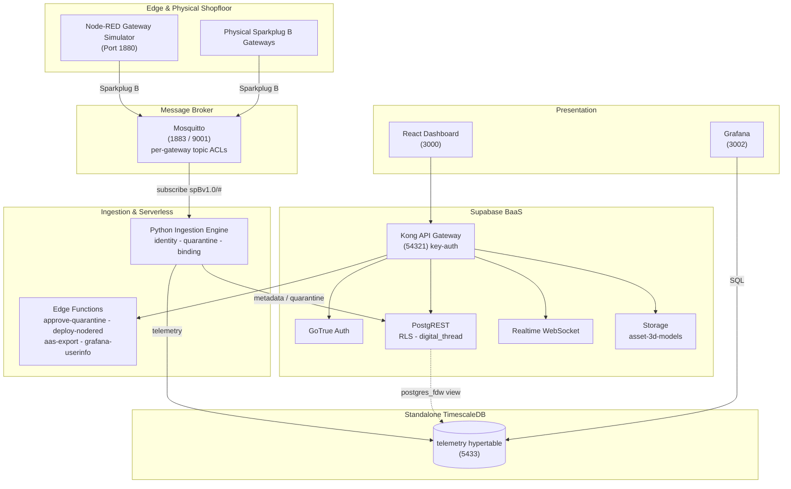

# Factory+ Asset Tracking Platform

[](https://github.com/Harri-Llewelyn/acs-cymru/actions/workflows/ci.yml)

An industrial, asset-centric manufacturing management platform built in alignment with the
**AMRC Connectivity Stack (ACS / Factory+)** framework.

Real-time telemetry streaming, shopfloor spatial mapping, zero-touch edge device onboarding,
fine-grained row-level security, continuous Digital Thread audit logging, AAS V3 export, and edge
flow management.

---

## Design Ethos

> **Utilise pre-existing components and standards to deliver the experience. Reduce the number of
> custom components — they are difficult to maintain.**

Where the upstream ACS ships bespoke microservices, this fork uses **Supabase** (Postgres, GoTrue,
PostgREST, Realtime, Storage, Edge Functions), **TimescaleDB**, **Grafana** and **Node-RED**. The
custom surface is deliberately small: one Python ingestion daemon, four edge functions, and a React
dashboard.

The same instinct shows up throughout the design: derived state is computed at read time rather
than stored, gateway staleness is a **view** rather than a cron writer, and AAS is an **adapter**
on the way out rather than an adopted metamodel.

---

## Architecture

**Supabase BaaS** is authoritative for asset metadata (`cells`, `gateways`, `devices`), auth, RLS,
audit triggers and edge functions. **Standalone TimescaleDB** stores the `telemetry` hypertable and
is reached from Supabase through a `postgres_fdw` view. A **Python daemon** consumes Sparkplug B
MQTT, gates unregistered devices into quarantine, and routes metadata and telemetry to their
respective stores. A **React 18 SPA** queries PostgREST directly and subscribes to a Realtime
change feed.

### Topology



### Data flow

1. Devices publish `DBIRTH` / `DDATA` to Mosquitto, confined by ACL to their own edge-node subtree.
2. The ingestion daemon resolves the topic's edge node and device to `sparkplug_id`, verifies the
   device is **bound to the publishing gateway**, and auto-quarantines anything unknown or
   contradictory.
3. Valid telemetry is written to the TimescaleDB hypertable, keyed by `sparkplug_id`.
4. Postgres triggers log every metadata change to the append-only `digital_thread`.
5. The dashboard queries PostgREST and subscribes to Realtime for change notifications.

---

## Quick Start

```bash
npm run setup                   # creates .env from .env.example (cross-platform, no POSIX shell)
docker compose up --build -d    # launches the whole stack
```

The schema baseline (`0001`), seed data (`0002`), audit hardening (`0003`) and demo accounts
(`supabase/seed.sql`) are applied by `supabase-db-init` on startup, and re-applied harmlessly on
every later start.

| Interface | URL |
| :--- | :--- |
| React Dashboard | http://localhost:3000 |
| Supabase Studio | http://127.0.0.1:54323 |
| Swagger UI | http://localhost:8088 |
| Node-RED | http://localhost:1880 |
| Grafana | http://localhost:3002 |

Node-RED and Grafana both sign in through Supabase Auth. **Sign in to the React dashboard first** —
the consent step needs your dashboard session, so going straight to either one shows a "sign in
required" prompt rather than a login form. In Node-RED, click **Sign in with Factory+**;
Administrator and Shopfloor_Manager can deploy, Operator and Auditor get a read-only editor.

### Demo accounts

Seeded by [`supabase/seed.sql`](supabase/seed.sql), password `factoryplus123`:

| Email | Role | Access |
| :--- | :--- | :--- |
| `admin@factoryplus.local` | `Administrator` | Full CRUD |
| `manager@factoryplus.local` | `Shopfloor_Manager` | Full CRUD |
| `operator@factoryplus.local` | `Operator` | Read-only + telemetry |
| `auditor@factoryplus.local` | `Auditor` | Digital Thread read-only |

Self-registered accounts get the read-only `Operator` role via the `handle_new_user` trigger; an
`Administrator` must promote them.

> **`.env.example` contains working development secrets** — the standard Supabase demo values.
> They are now also registered as Kong API keys, so **generate fresh secrets for any shared or
> hosted environment** ([issue #8](https://github.com/Harri-Llewelyn/ACS-Cymru/issues/8)).

### Teardown

```bash
docker compose down -v          # also drops volumes, invalidating every logged-in browser
```

---

## Documentation Map

| Directory | Covers |
| :--- | :--- |
| **[`frontend/`](frontend/README.md)** | React 18 architecture, Vite, Realtime integration, derived state, theming, tab conventions |
| **[`supabase/`](supabase/README.md)** | Migration baseline, RLS privilege matrix, triggers, audit immutability, edge functions, Kong |
| **[`ingestion/`](ingestion/README.md)** | Sparkplug B parsing, identity resolution, gateway binding, TimescaleDB mapping, `validate.py` |
| **[`simulators/`](simulators/README.md)** | Node-RED setup, flow provisioning, broker topics, device onboarding walkthrough |
| [`supabase/migrations/archive/`](supabase/migrations/archive) | The 38 pre-beta migrations, preserved for their reasoning. Never executed |
| [`docs/openapi.yaml`](docs/openapi.yaml) | REST API specification rendered by Swagger UI |
| [`grafana/`](grafana) | Datasource, dashboard and alerting provisioning |
| [`timescaledb/init/`](timescaledb/init) | Hypertable schema and retention policy |
| [`scripts/`](scripts) | Setup, Node-RED seeding, storage bucket, MQTT credentials, vocabulary generation |
| [`CLAUDE.md`](CLAUDE.md) | Detailed design rationale and invariants for contributors |

---

## Service Port Directory

| Service | Container | Image | Port |
| :--- | :--- | :--- | :--- |
| `supabase-db` | `factoryplus_supabase_db` | `supabase/postgres:15.6.1.143` | `54322:5432` |
| `supabase-db-roles-init` | `factoryplus_supabase_db_roles_init` | `supabase/postgres:15.6.1.143` | — |
| `supabase-db-init` | `factoryplus_supabase_db_init` | `supabase/postgres:15.6.1.143` | — |
| `supabase-auth` | `factoryplus_supabase_auth` | `supabase/gotrue:v2.189.0` | — |
| `supabase-rest` | `factoryplus_supabase_rest` | `postgrest/postgrest:v12.2.0` | — |
| `supabase-kong-init` | `factoryplus_supabase_kong_init` | `alpine:3.20` | — |
| `supabase-kong` | `factoryplus_supabase_kong` | `kong:2.8.1-alpine` | `54321:8000` |
| `supabase-functions` | `factoryplus_supabase_functions` | `supabase/edge-runtime:v1.74.2` | — |
| `supabase-realtime` | `factoryplus_supabase_realtime` | `supabase/realtime:v2.34.47` | — |
| `supabase-storage` | `factoryplus_supabase_storage` | `supabase/storage-api:v1.11.13` | — |
| `supabase-storage-init` | `factoryplus_supabase_storage_init` | `node:20-alpine` | — |
| `supabase-meta` | `factoryplus_supabase_meta` | `supabase/postgres-meta:v0.96.6` | — |
| `supabase-studio` | `factoryplus_supabase_studio` | `supabase/studio` | `54323:3000` |
| `timescaledb` | `factoryplus_timescaledb` | `timescale/timescaledb:latest-pg15` | `5433:5432` |
| `mosquitto-init` | `factoryplus_mosquitto_init` | `eclipse-mosquitto:latest` | — |
| `mosquitto` | `factoryplus_mosquitto` | `eclipse-mosquitto:latest` | `1883`, `9001` |
| `frontend` | `factoryplus_frontend` | `./frontend/Dockerfile` | `3000:3000` |
| `ingestion` | `factoryplus_ingestion` | `./Dockerfile` | — |
| `node-red-init` | `factoryplus_node_red_init` | `./node-red/Dockerfile` | — |
| `node-red` | `factoryplus_node_red` | `./node-red/Dockerfile` | `1880:1880` |
| `grafana` | `factoryplus_grafana` | `grafana/grafana:latest` | `3002:3000` |
| `swagger-ui` | `factoryplus_swagger_ui` | `swaggerapi/swagger-ui:v5.17.14` | `8088:8080` |

---

## Security Model

Fail-closed throughout: edge functions and RLS policies deny by default, and a missing or
unrecognised role produces `403`.

| Layer | Control |
| :--- | :--- |
| **Broker** | `allow_anonymous false`; [`mosquitto.acl`](mosquitto.acl) confines each gateway to `spBv1.0/+/+/<own-id>/#` |
| **Ingestion** | Gateway↔device binding; quarantine gating; append-only historian writes; no default credentials |
| **Gateway** | Kong `key-auth` on `/rest`, `/realtime`, `/storage`, `/functions` — with two documented exemptions |
| **API** | PostgREST JWT verification plus RLS on every table |
| **Database** | `has_role()` reads `user_roles` directly, so revocation is immediate; `digital_thread` is append-only against `service_role` too |
| **Edge functions** | Explicit router allow-list; per-function secret scoping; role resolved from the database, never from a stale JWT claim |
| **Edge automation** | Node-RED's editor, admin API and webhook receiver all authenticate — see below |

### Node-RED is not an open port

The editor and the `/flows` admin API sign in through **Supabase Auth** (OAuth2 + PKCE), and
`POST /hooks/quarantine` requires a signed token. Three separate things, because Node-RED serves
them on separate mounts and securing only the admin API leaves the webhook receiver open.

> **This matters more than it looks.** A Node-RED `function` node runs arbitrary JavaScript inside
> a container that holds the MQTT credential and can reach Mosquitto, Supabase and TimescaleDB.
> Anyone who could replace a flow had remote code execution on the edge host.

Machine callers never share a password. `deploy-nodered` forwards **the operator's own access
token**, which Node-RED re-checks against `user_roles` — so revoking a role takes effect on both
sides at once, without waiting for a token to expire. The quarantine webhook carries a **60-second
token signed per event** by the database, scoped to that one endpoint: a flow can read it out of
`msg.req.headers`, which is exactly why it is not the admin credential and expires in a minute.

`NODERED_ADMIN_TOKEN` remains as opt-in break-glass, empty by default — SSO being down is when you
most need the thing SSO protects.

### Storage is scoped to 3D asset models

`supabase-storage` serves exactly one bucket, `asset-3d-models`, holding the 3D model a device may
carry. That model becomes an AAS `File` element in a `VisualRepresentation` submodel on export,
which is the whole reason binary storage exists here — a shell naming a model it could not serve
would be a broken reference.

> **The bucket is public-read, and that follows from what it is for.** An exported AAS `File` URL
> must be dereferenceable by an arbitrary viewer holding no Factory+ session; a signed URL would
> expire and turn every shell already handed out into a time bomb. So anything in this bucket is
> readable by whoever learns its path, and must carry nothing beyond machine geometry.
>
> **Writes are gated on `device:manage`, not merely on `authenticated`** — an upload changes what a
> shell publishes *and* puts bytes at a public URL. `Operator` and `Auditor` are refused by RLS,
> not merely by a hidden button.

**Document management remains a link registry, not a file store.** The `documents` table holds a
`url TEXT` pointing at an external system. Widening storage to general document upload would be a
separate decision with a different threat model.

Known issues and accepted risks are tracked as
[GitHub issues](https://github.com/Harri-Llewelyn/ACS-Cymru/issues).

---

## Standards

| Standard | Role |
| :--- | :--- |
| **Sparkplug B** | The wire protocol. Identity is `sparkplug_id`, carried in the topic |
| **MTConnect** (2.x) | Machine-tool vocabulary — 249 data item types, 123 subtypes, 100 units, 126 component types |
| **OPC UA** (40001, 40010) | Machinery and robotics companion-specification data points |
| **ISO 22400** | Computed KPIs, which MTConnect and OPC UA deliberately exclude |
| **AAS / IEC 63278** | V3 export as JSON or AASX, validated against the official IDTA schema |

These are **three vocabularies, not three alternatives** — a mixed fleet needs all of them, which
is why the schema builder offers a choice rather than a migration path.

> Adopting the MTConnect vocabulary is not a compliance claim; that requires the Implementer
> License. Locally-minted semantic ids live under `https://factoryplus.local/semantics/…` — the
> namespace is the honesty mechanism, and an id under `mtconnect.org` would assert an
> interoperability that does not exist.

---

## Testing

```bash
# Frontend — 607 tests
cd frontend && npm test

# Python unit suites — no stack required
python ingestion/test_gateway_binding.py
python ingestion/test_declared_metrics.py
python ingestion/test_device_location.py
python supabase/functions/approve-quarantine/test_approve_quarantine.py
python supabase/functions/deploy-nodered/test_deploy_nodered.py
python supabase/functions/aas-export/test_aas_export.py

# Database suites — need Postgres
python supabase/migrations/test_user_roles_rls.py
python supabase/migrations/test_schema_versioning.py

# End-to-end — needs the running stack
set -a && . ./.env && set +a && unset MQTT_HOST DB_HOST DB_PORT
python ingestion/validate.py
```

CI ([`.github/workflows/ci.yml`](.github/workflows/ci.yml)) runs three jobs: **frontend-build**
(tests, drift guards, production bundle), **edge-function-auth-test** (auth ladders and RLS against
a real Postgres), and **e2e-validation** (full Docker stack, `validate.py`, live AAS export).

See [`ingestion/README.md`](ingestion/README.md#testing) for why `validate.py` needs
`SUPABASE_SERVICE_ROLE_KEY` but must **not** inherit the rest of `.env`.

---

## Expected Behaviour (not defects)

- **`docker compose down -v` invalidates every logged-in browser.** The `-v` flag drops
  `supabase_db_data`, and with it `auth.sessions`. The dashboard detects this on load, clears the
  stale tokens and returns to the login screen. Just sign in again.
- **Swagger UI's "Example Value" is documentation, not data.** Press **Execute** and read the
  **Response body** panel for real data.
- **Simulated devices appear quarantined on first start.** `Simulated_CNC_01` is auto-registered
  with `is_quarantined = true` by design; an `Administrator` must approve it before telemetry is
  stored.

---

## Contributing

Read [`CLAUDE.md`](CLAUDE.md) first — it records the invariants and the reasoning behind them,
including which pieces of JavaScript mirror SQL and must be kept in step.

Two rules worth stating up front:

- **`metric_catalog.name` is immutable.** Changing a metric is deprecate-and-supersede, never a
  rename — a device is configured against that exact string.
- **Add schema changes as a new numbered migration.** `0001`–`0003` are replayed on every boot and
  are guarded to be no-ops once applied; editing them reaches a fresh database only.

Before packaging a hand-off, tear down volumes and confirm a clean workspace:

```bash
docker compose down -v && git status
```
