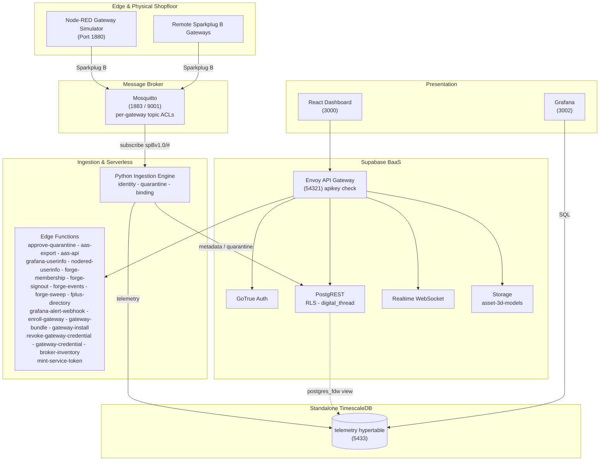

# Aber - the shopfloor data platform

[](https://github.com/Harri-Llewelyn/acs-cymru/actions/workflows/ci.yml)

Aber is Welsh for a river mouth, where many streams converge and leave as one. That is the
ingestion topology: telemetry from every gateway on the shopfloor converges on one broker and one
historian, and leaves through one API, one Unified Namespace and one digital thread.

An industrial, asset-centric platform: real-time telemetry streaming, shopfloor cell mapping,
zero-touch edge device onboarding, row-level security, continuous Digital Thread audit logging,
AAS V3 export, and edge flow management. It speaks Factory+ Sparkplug B on the wire and began as
a fork of the **AMRC Connectivity Stack (ACS)**.

> **Design ethos —** *use pre-existing components and standards; minimise custom code.*
> Where ACS ships bespoke microservices, Aber uses Supabase, TimescaleDB, Grafana and
> Node-RED. The custom surface is one Python ingestion service — a daemon and the modules beside it:
> the constraint engine, the metrics registry, capture and playback, the Directory and UNS publishers,
> cold archival — sixteen edge functions, an i3X server and a React dashboard.

---

## Architecture

**Supabase** is authoritative for asset metadata (`cells`, `gateways`, `devices`), auth, RLS, audit
triggers and edge functions. **Standalone TimescaleDB** holds the `telemetry` hypertable, reached
from Supabase through a `postgres_fdw` view. A **Python daemon** consumes Sparkplug B MQTT, gates
unregistered devices into quarantine, and routes metadata and telemetry to their respective stores.
A **React 18 SPA** queries PostgREST directly and subscribes to a Realtime change feed.

Derived state is computed at read time rather than stored: gateway staleness is a **view**, not a
cron writer, and AAS is an **adapter on the way out**, not an adopted metamodel.



**Data flow.** Devices publish `DBIRTH`/`DDATA` to Mosquitto, confined by ACL to their own edge-node
subtree → ingestion resolves topic to `sparkplug_id`, verifies the device is **bound to the
publishing gateway**, and quarantines anything unknown or contradictory → valid telemetry lands in
the hypertable → Postgres triggers log every metadata change to the append-only `digital_thread` →
the dashboard reads PostgREST and subscribes to Realtime.

---

## Deployment

**Kubernetes is the deployment target.** The Helm chart in
[`deploy/helm/aber`](deploy/helm/aber) deploys the whole platform onto k3s, or onto k3d
for development; the runbook is [`deploy/k8s/README.md`](deploy/k8s/README.md) and the design
record is [`docs/kubernetes-architecture.md`](docs/kubernetes-architecture.md). The one thing that
runs on Docker Compose is the gateway appliance: a Raspberry Pi runs the bundle the dashboard hands
it ([`forge/gateway-platform/appliance/`](forge/gateway-platform/appliance)).

---

## Quick start

Full runbook in [`deploy/k8s/README.md`](deploy/k8s/README.md). The short version:

> **One node with 4 vCPU, 8 GiB and 100 GiB of disk is the measured minimum**; 8 vCPU and 16 GiB is
> comfortable. Under it the stack does not run slowly, it fails to schedule — the chart reserves
> 1.6 vCPU and 3.7 GiB, and pods below that sit `Pending`. Sizing and what grows:
> [`deploy/k8s/README.md`](deploy/k8s/README.md), *Prerequisites → Hardware*.

```bash
# Everything below in one command, plus the waits and helm test: npm run dev:up
#   (deploy/k8s/README.md, "The development loop"). Step by step:
# Ten images are built from this repository. They are published to GHCR at the chart's
# appVersion, and the chart pulls them under exactly these names: a local build that is
# tagged any other way is ignored. deploy/k8s/README.md says what each one is for.
NS=ghcr.io/harri-llewelyn/aber
V=0.1.0                                       # appVersion in deploy/helm/aber/Chart.yaml
docker build -f supabase/functions/Dockerfile   -t $NS/edge-runtime:$V .
docker build -f ingestion/Dockerfile            -t $NS/ingestion:$V .
docker build -f node-red/Dockerfile             -t $NS/node-red:$V node-red
docker build -f frontend/Dockerfile --build-arg VITE_RUNTIME_CONFIG=true -t $NS/frontend:$V frontend
docker build -f i3x/Dockerfile                  -t $NS/i3x-service:$V .
docker build -f gateway-credential/Dockerfile   -t $NS/gateway-credential:$V gateway-credential
docker build -f backup-service/Dockerfile       -t $NS/backup-service:$V backup-service
docker build -f supabase/db-init/Dockerfile      -t $NS/db-init:$V supabase
docker build -f swagger-ui/Dockerfile           -t $NS/swagger-ui:$V .
docker build -f test-harness/Dockerfile --build-arg INGESTION_IMAGE=$NS/ingestion:$V -t $NS/test-runner:$V .

# A local cluster: k3d is k3s in Docker, with the Traefik, ServiceLB and local-path that
# production has. Port 80 is the Ingress; 1883 is the broker for gateways on the LAN.
k3d cluster create aber --agents 0 --port "80:80@loadbalancer" --port "1883:1883@loadbalancer" \
  --k3s-arg "--disable=metrics-server@server:0" --wait
k3d image import $(for i in edge-runtime ingestion node-red frontend i3x-service \
  gateway-credential backup-service db-init swagger-ui test-runner; do echo $NS/$i:$V; done) -c aber

node scripts/sync-helm-chart-files.mjs        # mirror repo config into the chart

kubectl create namespace aber
helm install aber deploy/helm/aber -n aber \
  -f deploy/helm/aber/values-dev.yaml --timeout 15m

# NOT `--wait` — it deadlocks the first install. See deploy/k8s/README.md.
for w in $(kubectl -n aber get statefulset,deploy -o name); do
  kubectl -n aber rollout status "$w" --timeout=10m
done

helm test aber -n aber          # the postgres_fdw gate
```

Serves nine subdomains on one Ingress (`app.`, `api.`, `nodered.`, `grafana.`, `studio.`, `docs.`,
`i3x.`, `git.`, `mqtt.`) plus a LoadBalancer for **raw MQTT on 1883** and a second for **git over SSH**,
neither of which is HTTP and so neither of which can ride an Ingress.

- **`values-dev.yaml` carries published demo credentials, and they are in git.** `npm run setup`
  writes `deploy/helm/aber/values-local.yaml` (gitignored) with credentials minted for this
  install; for anything another person can reach, start from `values-prod.yaml.example` and point
  `secrets.existingSecret` at an externally managed Secret.
- **`npm run dev:reset` is the way back to a blank stack**: it uninstalls, drops every claim and
  reinstalls on the same cluster and images. `digital_thread` is append-only to every application
  role, so dropping the volume is the only way to an empty audit trail.
- **The chart validates its own values and fails the render, not the pod** — a partial credential
  set, a wrong-length Realtime key, a renamed Realtime Service, TLS with `scheme: http`, or an HPA
  on a single-writer workload each otherwise produce a stack that reports healthy and refuses every
  request.

---

## The schema every install applies

Every file in `supabase/migrations/` is applied by the `db-init` Job on every install and upgrade, and re-applied
harmlessly each time: the schema baseline (`0001`), seed data (`0002`), then `0003` audit
immutability, `0004`, `0005`, `0006` Node-RED SSO, `0007` metric-name format, `0008` Sparkplug
group, `0009` withdraws residual `anon` function grants, `0010` telemetry rollups and latest-value
view, `0011` IDTA Digital Nameplate and per-device nameplate data, `0012` permitted values of a
discrete metric, `0013` ASHRAE 223P vocabulary, `0014` repoints locally-minted semantic
identifiers onto the `acs-cymru.local` namespace, `0015` moves the default Sparkplug group to
`ACS-Cymru`, `0016` drops the dashboard's own service-directory entry and renames the Node-RED
one to say it is the simulator, `0018` pre-registers the demonstrator's metric set with each
row's standard and published semantic id, `0019` adds the 223P supply-air-flow metric the
shopfloor simulator needed, `0020` retires the introductory single-device simulator and moves its
schema and IDTA nameplate onto the demonstration mill, `0021` gives each shopfloor cell an icon from
a closed set, `0023` adds the `platform_alerts` occurrence log Grafana alerting writes into and publishes it for
Realtime, `0024` adds an optional free-text `description` to devices and gateways, `0025` adds
Remote-gateway enrolment — a `gateway_enrollment_tokens` table reachable only by `service_role`,
the RPCs that issue and atomically redeem a single-use token, and the `PENDING_ENROLLMENT` /
`AWAITING_BIRTH` lifecycle states — `0026` stamps every audit row with the transaction that wrote
it (`digital_thread.causation_id`, from `txid_current()`) so the several rows one operator action
produces can be read back as one act, and adds `record_ingestion_rejection()` — the narrow
SECURITY DEFINER gate through which the ingestion daemon records a payload it judged
non-conforming, replacing `service_role`'s direct INSERT on the audit table — and `0027` maps the
historian's storage footprint over `postgres_fdw` and unions it with Supabase's own table sizes as
`public.storage_footprint`, read by Grafana's `supabase` datasource — `0028` generalises the alert
table from `device_alerts` to `platform_alerts`, whose subject is `(entity_type, entity_id)` rather
than a device, because the platform alert rules cover a gateway and the fleet and neither
fits a row that must name a machine — `0029` adds `public.platform_health`, the narrow view
those rules evaluate so the Grafana reader never needs the asset inventory, and `0074` adds its
`expected_publishers` count so that "ingestion has recorded nothing" only alerts when devices exist
that ought to be publishing — and `0030` gives that
alert table a **7-day retention window**, pruned nightly by `pg_cron`, whose predicate ages out
closed and superseded occurrences but never the newest firing row of a fingerprint — and `0031`
adds `public.system_settings`, the runtime configuration plane an `Administrator` edits from the
dashboard instead of a values file, whose **key set is closed**: RLS grants UPDATE and nothing
else, so a new setting arrives by migration beside the code that reads it — and `0032` gives that
table **numeric bounds** and moves the alert retention window into it as `alerts.retention_days`,
replacing `prune_platform_alerts()` with a version that reads the setting, so the answer to "how
long do we keep alerts" is on a page rather than in a migration — and `0033` adds
`relocate_devices()`, which applies a whole shopfloor rearrangement in **one transaction** so the
six machines an operator files in one gesture carry one `causation_id` instead of six, and so a
batch that fails partway leaves nothing behind — and `0034` seeds the **read-only principal the MCP
client authenticates as**, holding `Operator` so it reads the i3X address space, writes nothing and
cannot see the audit trail (`scripts/mint-mcp-token.mjs` signs its long-lived token) — and `0035`
gives `gateways` the columns an appliance **reports about itself** on the heartbeat it already
publishes, chiefly `cert_expires_at`: the internal CA is hand-distributed into every appliance's
trust store, so re-minting it takes the whole fleet offline at once with no other signal — and
`0036` adds `public.gateway_health`, the **third** narrow view the Grafana reader may select,
after `0027`'s and `0029`'s: it backs the gateway dashboard and the certificate alert while
leaving the asset inventory `0029` deliberately withheld exactly where it is — and `0038` makes
**archiving or deleting a gateway revoke its broker credential**, by disabling the account at the
broker, which drops its live session: nothing in the credential service can delete an account, so
a delete verb that could stop the whole fleet publishing is not one it carries — and `0037`
makes **archiving a gateway withdraw its outstanding enrolment bundle**, and enrolment refuse
an archived gateway at all: a bundle downloaded and never instantiated was still redeemable
after the gateway was archived, which issued a real broker credential and resurrected the row
to `ONLINE` — and `0039` adds `0041` gives a **host-run gateway a
"Generate broker credential" path that needs no shell**: `authorize_host_gateway_credential()`
gates by role and refuses a Remote or archived gateway, and
`record_gateway_credential_issued()` writes the `CREDENTIAL_ISSUED` audit row attributed to the
operator who asked — the two are separate so that a credential service that is down cannot produce
a record of a mint that never happened, and a mint that succeeds cannot go unrecorded — and `0042`
adds `list_service_principals()`, the **Administrator-only read behind the Service Identities
section**: `auth.users` is GoTrue's and is not served by PostgREST at all, and `user_roles` is
deliberately unreachable from a browser, so the alternative to a four-column function is a broad
grant on the two tables that decide who is who — and `0043` adds
`record_service_token_issued()`, which writes a **`TOKEN_MINTED`** row for a long-lived JWT and
refuses two things outright: a subject that can sign in, and any expiry beyond
`service_token_max_days()` — **90 days, because these tokens cannot be revoked** and the expiry is
the only bound that exists — and `0044` adds `create_service_principal()`, which creates a machine
identity the way `0034` does (`id` alone, so it has no email, no password and no identity provider)
and accepts **only a read-only role**, since a privileged machine identity becomes an unrevocable
write credential the moment a token is signed for it — and `0045` scopes `digital_thread_page()`'s
**deleted-asset filter to the three types that have a table behind them**: `0039` derived it as an
anti-join against cells, gateways and devices and deliberately did not narrow it by entity type, so
`service_principals` rows answered *"absent from all three"* and **the audit trail this feature
exists to produce was hidden as deleted** — and `0039`
adds `digital_thread_page()`, which applies the **deleted-asset
filter as a predicate rather than in the browser**, so the page's row budget is spent on rows
it will actually show: hiding them afterwards had the page list four assets on a stack of
twenty-six, and render an empty Gateways section on a fleet of four healthy gateways — and `0040`
**retires the demonstration shopfloor from the seed**, so a fresh install comes up with no assets
at all; it
is the one migration in the chain that must run **exactly once** rather than on every boot, because
the rows it removes are rows an operator may deliberately want back, and a delete replayed every
boot would silently undo every provisioning run — which is what `public.one_shot_migrations` is
for — plus demo accounts (`supabase/seed.sql`).

> **There is no `0017`.** It was drafted as an audit-trigger change guard and then not written,
> because `0005` already implements one; a second declaration of `log_digital_thread_event()`
> would win by filename order on every boot and would have regressed the `actor_source`
> attribution `0005` adds. The gap in the numbering is deliberate and the reasoning is in
> [`supabase/README.md`](supabase/README.md#audit-signal-and-attribution-0005).
>
> `0026` is that later declaration, written deliberately and on those terms: it reproduces `0005`'s
> body **in full** and adds two lines, rather than patching it. Its self-check asserts that both the
> heartbeat suppression guard and the causation stamp are present in the live definition, because
> `check-docs-drift.mjs` can verify a redeclaration was *intended* and cannot verify it was
> *complete*.

| Interface | URL |
| :--- | :--- |
| React Dashboard | http://localhost:3000 |
| Supabase Studio | http://127.0.0.1:54323 (sign in as an `Administrator`) |
| Swagger UI | http://localhost:8088 |
| Node-RED | http://localhost:1880 |
| Grafana | http://localhost:3002 |
| Prometheus | http://localhost:9090 (loopback only — SSH-tunnel from another host) |

**Sign in to the React dashboard first.** Node-RED and Grafana both federate to Supabase Auth, and
the consent step needs your dashboard session — going straight to either shows a "sign in required"
prompt rather than a login form. In Node-RED, click **Sign in with Aber**; Administrator can
deploy, every other role gets a read-only editor. Deploying a flow is `gitops:manage`, which
`0069` made Administrator-only. The editor used to be the *second* door onto that permission; since
the Directory page's Sync button and the `deploy-nodered` function were retired with the
demonstrator, it is the only one.

**Demo accounts** — seeded by [`supabase/seed.sql`](supabase/seed.sql), password `aber123`:

| Email | Role | Access |
| :--- | :--- | :--- |
| `admin@aber.local` | `Administrator` | Full CRUD |
| `manager@aber.local` | `Shopfloor_Manager` | Full CRUD |
| `operator@aber.local` | `Operator` | Read-only + telemetry |
| `auditor@aber.local` | `Auditor` | Digital Thread read-only |

Self-registered accounts get read-only `Operator` via the `handle_new_user` trigger; an
`Administrator` must promote them.

**Forgotten passwords** are reset from the sign-in card (*Forgot your password?*), which asks
GoTrue to email a link to `/reset-password`. The link is sent over SMTP, so set `SMTP_HOST`,
`SMTP_FROM` and the credentials (`supabaseAuth.smtp` and `secrets.smtpPassword` in values). With no relay configured the request fails and the card tells the user to ask an
administrator, who can set a password through the Auth API or Studio instead.

> **`values-dev.yaml` contains working development secrets** — the standard Supabase demo values, also
> the gateway's registered API keys. **`npm run setup` mints fresh ones for any shared or hosted environment.**

---

## Repository map

| Directory | Covers |
| :--- | :--- |
| **[`frontend/`](frontend/README.md)** | React 18 architecture, Vite, Realtime integration, derived state, theming |
| **[`supabase/`](supabase/README.md)** | Migrations, RLS privilege matrix, triggers, audit immutability, edge functions, the gateway |
| **[`ingestion/`](ingestion/README.md)** | Sparkplug B parsing, identity resolution, gateway binding, TimescaleDB mapping, `validate.py` |
| **[`tutorial/`](tutorial/README.md)** | The walkthrough for a blank install: one cell, one gateway, its broker credential, a device, a schema, and the Node-RED flow that publishes as it |
| **[`i3x/`](i3x/README.md)** | i3X 1.0 server: address-space mapping, subscriptions, connecting a client — including [an MCP host](i3x/README.md#mcp) |
| **[`deploy/k8s/README.md`](deploy/k8s/README.md)** | Kubernetes runbook: install, the development loop, upgrade, teardown, hardening, releases |
| [`deploy/helm/aber/`](deploy/helm/aber) | The Helm chart; `values.yaml` documents every setting |
| [`docs/kubernetes-architecture.md`](docs/kubernetes-architecture.md) | Why the Kubernetes target is built the way it is. Source comments cite it by section |
| [`docs/incidents.md`](docs/incidents.md) | Faults whose FIX LOOKS ARBITRARY without the story. Read before "tidying" a guard that seems redundant |
| [`docs/upgrades.md`](docs/upgrades.md) | What survives an upgrade and why nothing needs reconfiguring — plus the four places that is not the whole truth, and the floor it holds from |
| [`docs/releases.md`](docs/releases.md) | What a release promises: the supported window, what makes a version major, deprecation, and how a site learns a release matters to it |
| [`docs/openapi.yaml`](docs/openapi.yaml) · [`docs/i3x-openapi.yaml`](docs/i3x-openapi.yaml) | REST and i3X specifications, rendered by Swagger UI |
| [`supabase/migrations/archive/`](supabase/migrations/archive) | The 99 superseded migrations, preserved for their reasoning. Never executed |
| [`grafana/`](grafana) · [`timescaledb/`](timescaledb) | Provisioning; hypertable schema, retention and rollup reconciliation, the read-only BI role |
| [`scripts/`](scripts) | Setup, the dev loop, vocabulary generation, chart-file sync, drift guards, database backup/restore, gateway provisioning, AAS push |
| [`test-harness/`](test-harness) | Vendored IDTA AAS schema, conformance test-runner image |
| [`forge/`](forge) | Everything the platform publishes into the forge as a repository. `gateway-platform/` is the playbook every appliance converges to with `ansible-pull`, tagged at the platform's version; its `appliance/` is the compose project the appliance runs, which the installer lays down and the ZIP bundle ships |

---

## Components

**Every chart component appears here and every row names a real one**, asserted in both directions
by `scripts/check-docs-drift.mjs`, which also holds every image tag here to the chart's pin. The
chart's own images carry no tag: they are pulled at the chart's `appVersion`.

Hosts are `<name>.<domain>` on the one Ingress. On a laptop, `npm run dev:forward` publishes the
in-cluster ports on localhost: `5433` historian, `54322` Supabase Postgres, `54321` the API,
`1880` Node-RED, `3002` Grafana, `9090` Prometheus, `3100` Loki, `8090` i3X, `8088` docs.

| Component | Image | Reached at |
| :--- | :--- | :--- |
| `alloy` | `grafana/alloy:v1.11.2` | the one collector: logs, metrics and host metrics; `alloy:12345` |
| `backup` | `supabase/postgres:17.6.1.160` | the nightly CronJob, when the backup service is off |
| `backup-service` | `ghcr.io/harri-llewelyn/aber/backup-service` | the Backups page's worker (`backupService.enabled`) |
| `cold-archive` | `ghcr.io/harri-llewelyn/aber/ingestion` | CronJob: exports, verifies and drops cold chunks |
| `db-init` | `ghcr.io/harri-llewelyn/aber/db-init` | hook Job: the migration chain, on every install and upgrade |
| `db-roles-init` | `supabase/postgres:17.6.1.160` | hook Job: the Supabase roles and their passwords |
| `e2e-aas-export` | `ghcr.io/harri-llewelyn/aber/test-runner` | Job (`e2e.enabled`): the AAS conformance suite |
| `e2e-validate` | `ghcr.io/harri-llewelyn/aber/test-runner` | Job (`e2e.enabled`): `validate.py` in-cluster |
| `frontend` | `ghcr.io/harri-llewelyn/aber/frontend` | `app.<domain>` |
| `gitea` | `gitea/gitea:1.27.3` | `git.<domain>` through the gateway's forge listener; SSH on `gitea-external:22` (LoadBalancer) |
| `grafana` | `grafana/grafana:13.2.0` | `grafana.<domain>` |
| `i3x-service` | `ghcr.io/harri-llewelyn/aber/i3x-service` | `i3x.<domain>` |
| `ingestion` | `ghcr.io/harri-llewelyn/aber/ingestion` | no route; `ingestion-metrics:9108` is scraped |
| `loki` | `grafana/loki:3.5.7` | `loki:3100`, read by Grafana |
| `mosquitto` | `eclipse-mosquitto:2.0.22`, the `gateway-credential` sidecar, `sapcc/mosquitto-exporter:0.8.0` when metrics are on | `mosquitto-external:1883` (LoadBalancer), 8883 with TLS; `mqtt.<domain>` for WebSockets |
| `node-red` | `ghcr.io/harri-llewelyn/aber/node-red` | `nodered.<domain>` |
| `playback` | `ghcr.io/harri-llewelyn/aber/ingestion` | the broker playback worker (`playback.enabled`) |
| `prometheus` | `prom/prometheus:v3.14.0` | `prometheus:9090`, read by Grafana |
| `realtime` | `supabase/realtime:v2.102.3` | behind `api.<domain>/realtime/v1`; Service `realtime-dev:4000` |
| `storage-init` | `node:24-alpine` | hook Job: the storage buckets |
| `storage-policies` | `supabase/postgres:17.6.1.160` | hook Job: the storage RLS policies |
| `supabase-auth` | `supabase/gotrue:v2.189.0` | behind `api.<domain>/auth/v1` |
| `supabase-db` | `supabase/postgres:17.6.1.160`, `quay.io/prometheuscommunity/postgres-exporter:v0.20.1` as a sidecar | `supabase-db:5432`; `:9187` is scraped |
| `supabase-envoy` | `envoyproxy/envoy:v1.39.1` | the gateway: `api.<domain>` (Service `supabase-kong:8000`), Studio on 8001, the forge on 8002 |
| `supabase-functions` | `ghcr.io/harri-llewelyn/aber/edge-runtime` | behind `api.<domain>/functions/v1` |
| `supabase-meta` | `supabase/postgres-meta:v0.96.6` | in-cluster only, for Studio |
| `supabase-rest` | `postgrest/postgrest:v14.12` | behind `api.<domain>/rest/v1`; admin port 3001 is scraped |
| `supabase-storage` | `supabase/storage-api:v1.60.4` | behind `api.<domain>/storage/v1` |
| `supabase-studio` | `supabase/studio:2026.07.07-sha-a6a04f2` | `studio.<domain>`, off by default, behind the gateway's login |
| `swagger-ui` | `ghcr.io/harri-llewelyn/aber/swagger-ui` | `docs.<domain>`; the two specs are baked into the image |
| `test-db-tls` | `supabase/postgres:17.6.1.160` | `helm test` Pod (`postgresTls.enabled`): both databases refuse plaintext and every remote backend is on TLS |
| `test-fdw` | `supabase/postgres:17.6.1.160` | `helm test`: the postgres_fdw gate |
| `timescaledb` | `timescale/timescaledb:2.29.2-pg17`, `quay.io/prometheuscommunity/postgres-exporter:v0.20.1` as a sidecar | `timescaledb:5432`; `:9187` is scraped |
| `timescaledb-maintenance` | `timescale/timescaledb:2.29.2-pg17` | hook Job: extension, retention, rollups, roles |

---

## Security model

Fail-closed throughout: edge functions and RLS policies deny by default, and a missing or
unrecognised role produces `403`.

| Layer | Control |
| :--- | :--- |
| **Broker** | `allow_anonymous false`; the Dynamic Security plugin's roles ([`mosquitto/dynsec-roles.json`](mosquitto/dynsec-roles.json), [`mosquitto/README.md`](mosquitto/README.md)) confine each gateway to `spBv1.0/+/+/<own-id>/#`, and revocation drops a live session |
| **Ingestion** | Gateway↔device binding; quarantine gating; append-only historian writes — a **grant**, not a promise, once `INGEST_WRITER_PASSWORD` and `INGEST_DB_USER` are set: `ingest_writer` may INSERT and cannot UPDATE, DELETE or TRUNCATE. Unset, the daemon keeps the admin credential and the guarantee is the Python's again — see [Historian roles](#historian-roles) |
| **Gateway** | Envoy's `apikey` check on `/rest`, `/realtime`, `/storage`, `/functions` — with **four** documented exemptions ([`supabase/README.md`](supabase/README.md)) |
| **API** | PostgREST JWT verification plus RLS on every table |
| **Database** | `has_role()` reads `user_roles` directly, so revocation is immediate; `digital_thread` is append-only against `service_role` too |
| **Edge functions** | Explicit router allow-list; per-function secret scoping; role resolved from the database, never a stale JWT claim |
| **Edge automation** | Node-RED's editor, admin API and webhook receiver each authenticate separately |
| **Supabase Studio** | Behind the gateway's `studio` listener: an OAuth login against this stack's GoTrue and an `Administrator` check (`0081`). Off the Ingress by default on Kubernetes |
| **The forge** | Behind the gateway's `forge` listener: the same login, admitting `Administrator` and `Shopfloor_Manager` (`0094`). Gitea's own HTTP port is reachable only from the gateway and the edge runtime |

### Historian roles

The historian is a separate database, and a grant issued in a Supabase migration does not reach it.
Its roles live in [`timescaledb/roles.sql`](timescaledb/roles.sql), reconciled on **every boot** by
`timescaledb-maintenance` — the same replay-and-reconcile model the migration chain uses, and for
the same reason: `/docker-entrypoint-initdb.d` runs only on an empty data directory.

| Role | May | Used by |
| :--- | :--- | :--- |
| `ingest_writer` | INSERT + SELECT on `telemetry`; upsert `assets` | the ingestion daemon |
| `fdw_reader` | SELECT the six objects Supabase projects | Supabase's `postgres_fdw` PUBLIC mapping |
| `grafana_reader` | SELECT everything the dashboards query | Grafana |
| `powerbi_reader` | SELECT the three rollups only | external BI |

**`ingest_writer` and `fdw_reader` are required; the two readers are optional.** BI and Grafana are
consumers a stack can simply not have. The daemon and the FDW are not — each must authenticate as
*something* on every query, and the only alternative to these roles is the superuser they replaced.
So `npm run setup` mints both passwords, and the chart fails to render without them. A stack that comes up on the superuser saying nothing is the state this closes.

**The daemon checks its own credential at startup** and refuses to run as a superuser on the
historian, naming `ALLOW_HISTORIAN_SUPERUSER=true` as the deliberate way to say otherwise. Every
other guarantee here is enforced where it can be observed — the broker ACL by delivery, the write
gates by `is_ingestion_caller()`, the audit trail by a trigger. This one used to depend on nobody
having changed a variable, and it was wrong for months without anything noticing.

**An authentication failure is fatal; an unreachable historian is not.** The daemon is built to
survive a database that is down — it warns, drops what it cannot store, and resumes. A refused
credential never resolves by retrying, so it exits instead of running indefinitely discarding every
reading. Those two wore the same clothes until a wrong password was tried on purpose.

**`ingest_writer` needs SELECT, which is not obvious.** Both of the daemon's statements carry an
`ON CONFLICT` clause, and inferring the arbiter index reads the target. So the role is *append-only*
rather than write-only: it can add a row and cannot change or remove one, which is the distinction
the security model above depends on.

**Why `fdw_reader` exists at all.** `0001` maps every local Supabase role onto this database through
`postgres_fdw`. That mapping used the historian's superuser, so an FDW session opened for
`authenticated` ran here with full rights, contained only by the grant on the *other* database. No
application role could abuse it — the point is that nothing stopped the next widened grant or new
foreign table from inheriting that reach silently. The `postgres` mapping is deliberately unchanged:
it is what a human debugging the FDW connects through.

`timescaledb/test_historian_role_grants.py` asserts both halves for both roles — what they can do,
and what they must not.

**Supabase Studio is a database console with no login, roles or session of its own.** Whoever
reaches it holds the SQL editor, the table editor and the Vault UI **as the database owner** — for
whom RLS is not enforced — which is why it sits behind a door rather than a port.

**It has a door, and the gateway is it.** `supabase-envoy` holds a second listener
(`studio.<domain>`, off by default): an OAuth 2.1 authorization-code flow against this stack's own GoTrue,
a session cookie, and an `Administrator` check before anything reaches the console. The Studio
pod publishes nothing of its own.

Three things follow, and none of them is obvious:

- **The role is read from the token, not fetched.** `custom_access_token_hook` mirrors it into the
  access token and the gateway verifies that token itself, so Studio needs no `studio-userinfo`
  function of the kind Grafana and Node-RED have. `openid` is deliberately absent from the requested
  scope: GoTrue refuses to sign an ID token with HS256, which is what this whole stack signs with.
- **It closes the unauthenticated MCP server.** Studio's port also served `/api/mcp` — a Supabase
  MCP server exposing `execute_sql` and `apply_migration` as the owner, completing `initialize` with
  no credential at all. It is covered because it is not exempted, and an MCP client cannot complete
  a browser flow. The model-facing surface this stack intends is the i3X one, where RLS is in the
  path.
- **The credential fails closed.** `STUDIO_OAUTH_CLIENT_SECRET` and `STUDIO_PROXY_HMAC_SECRET` are
  generated by `node scripts/setup.mjs`. Without them the stack runs normally and Studio answers a
  login nobody can complete — including on an existing stack upgraded before the variables exist.

**On Kubernetes the same door can be published, and is not by default.** `ingress.routes.studio`
stays `false`, but the reason has changed: the route now points at the gateway's studio listener
rather than at Studio itself, so what is left is a decision about *exposure* rather than about
authentication — a console on a public hostname is reachable by anyone who can reach the ingress.
Turning it on requires `secrets.studioOAuthClientSecret` and `secrets.studioProxyHmacSecret`, and
the render fails naming them rather than publishing a login nobody can complete. Without the route,
reaching it is a port-forward:

```bash
kubectl -n <ns> port-forward svc/supabase-studio 54323:3000
```

Two consequences worth stating on the front page; both are detailed in
[`supabase/README.md`](supabase/README.md):

- **Node-RED is not an open port.** A `function` node runs arbitrary JavaScript in a container
  holding the MQTT credential, so anyone who could replace a flow had remote code execution on the
  edge host. The editor and `/flows` use OAuth2 + PKCE; `POST /hooks/quarantine` takes a 60-second
  per-event signed token, deliberately not the admin credential, because any flow author can read it
  from `msg.req.headers`.
- **The `asset-3d-models` bucket is public-read**, because an exported AAS `File` URL must resolve
  for a viewer holding no session and a signed URL would turn every shell already handed out into a
  time bomb. Anything in it must carry nothing beyond machine geometry. Writes are gated on
  `device:manage`, not merely `authenticated`.

### Machine identities

Five identities here are held by software rather than people, and each is narrow by construction:
`Service_Ingestor`, `Service_Playback` and the MCP reader hold `telemetry:read` **as a grant of their
own** rather than a person's role (`0080`), `factoryplus_i3x` reads the broker namespace and
publishes nothing, and `gateway-credential-service` can add one broker account and do nothing else.
The three database identities are `auth.users` rows with no email, no password and no identity
provider, so none can sign in — and a trigger on `user_roles` refuses any of them a role, so widening
`Operator` for the people who hold it cannot widen them by accident. An Administrator can create a
further one from the **Access Control** page (`0125`): a name, a purpose and a set of read-only
permissions from a fixed menu, then its first token shown once. Such an identity reaches the
database only, never the broker.

**The ingestion daemon does not hold `SUPABASE_SERVICE_ROLE_KEY`.** It used to, and that was the one
credential whose compromise no policy written anywhere else could contain, sitting in the process
most exposed to the plant network. It authenticates as `Service_Ingestor` — a principal that cannot
write a single row directly — and every write it makes goes through a `SECURITY DEFINER` gate that
checks the caller is that principal. Its `telemetry:read` grant being insufficient is the design, not
an oversight: it makes those gates the only route rather than the tidy one.

**Tokens are revocable at PostgREST** (`0074`–`0076`): `auth_pre_request` runs before every request
and refuses a JWT whose `jti` has been revoked, and a whole service principal can be put beyond use.
Expiry still bounds everything else — 90 days for any token naming a **principal**, ten years only
for the anon and service-role keys, which name nobody. Storage, Realtime, the edge runtime and Studio
verify the signature for themselves and are not reached by a revocation (see
[Accepted risks](#accepted-risks)). The **Access Control** tab states what is outstanding.

The mechanism and its limits are in
[`supabase/README.md`](supabase/README.md#the-access-control-page-states-what-is-outstanding).

**Known issues** — things that can be worked on — are tracked as
[GitHub issues](https://github.com/Harri-Llewelyn/ACS-Cymru/issues). **Accepted risks are not**, and
live below.

### Accepted risks

An accepted risk is a decision, not a task. Kept here rather than in the issue tracker because an
issue is a bulletin of work somebody could pick up, and one that will never be picked up teaches
readers to skim the list. It also decays differently: an open issue nobody acts on starts to look
like neglect, where a documented decision reads as what it is.

**Each says what would change the decision**, which is the part that stops an accepted risk becoming
a forgotten one. Nothing here is accepted permanently; each is accepted *for a stated deployment
model*, and the model is what to re-check.

#### Realtime leaks the timing of changes, though not their contents

An unauthenticated subscriber that can reach the Realtime WebSocket receives the change **envelope**
for every published table. Realtime redacts the payload to `{}` and attaches a 401, but the message
arrives — so the **fact and timing** of a change leak, even though its contents do not. `cells`,
`gateways` and `devices` are published because the dashboard needs them live, so an observer can
infer when an asset was created, edited, archived or changed state. In practice that is a timing
side-channel on shift patterns, commissioning activity and the rate of configuration change.

**It cannot be fixed here** — it is upstream `supabase/realtime` behaviour. The gateway's `apikey`
check does not mitigate it either: the publishable key is a registered key that is necessarily
shipped to every browser, so holding it proves nothing about the caller. What *was* done is narrowing the
publication: `digital_thread` was removed from it, being the most operationally sensitive stream and
one nothing subscribed to.

**Accepted because** the target environment is an isolated shopfloor network reached over VPN, with
services behind an internal CA. Reaching the socket at all means already being inside that boundary,
where an observer has considerably more direct means of learning the same facts — and the exposure
does not justify degrading the dashboard's live updates.

**Revisit if** the stack is exposed to a network where reaching the WebSocket is not already
evidence of access: a public or partner-facing deployment, a shared cluster, or any move to
multi-tenancy. At that point the choice is dropping the three tables from the publication and
polling instead, or waiting for upstream to authenticate before delivering the envelope.

#### Revocation reaches PostgREST and nothing else

`0074` made a token revocable at the one choke point PostgREST offers (`PGRST_DB_PRE_REQUEST`).
Storage, Realtime, the edge runtime and Studio verify the HS256 signature for themselves and consult
no table, so a revoked token still opens those doors until its own `exp` — at most 90 days for a
token naming a principal.

**Accepted because** every write that matters goes through PostgREST and RLS, the other surfaces
are read-side or gated by a separate login, and the ceiling bounds the exposure.

**Revisit if** tokens are issued to parties outside the operating organisation, or if a write path
that bypasses PostgREST is ever added.

#### The broker's internal CA has no revocation list

There is no CRL and no OCSP for the root `deploy/k8s/internal-ca.yaml` issues. A compromised root private key has no remedy
short of re-minting the root and re-walking the fleet. Broker *credentials* are revocable and
immediate (archiving a gateway disables its account and drops its session); the trust anchor is the one thing that is not.

**Accepted because** the key never leaves its Secret or volume, is never mounted into an application
pod, and never reaches an appliance, which receives `ca.crt` alone; for a fleet of this size a CRL
would add a reload-dependent mechanism nothing here consumes.

**Revisit if** the root is ever exported, or if client certificates replace password authentication
on the broker. The re-walk itself is no longer a visit: the sweep publishes the current root to
`trust/` on the platform repository and every appliance installs it at its next hourly convergence,
which is what the compromised-key case needs (`docs/remote-gateways.md` §8).

#### An appliance's deploy key can write its repository's wiki

Since `0104` an appliance's deploy key is writable on its own repository, so that it can report
what it is running on the `appliance` branch. Branch rules confine it there: `main` and every
other branch refuse it. The wiki is a second git repository beside the first, and Gitea has no
rule for it: measured against `gitea/gitea:1.27.3`, a clone of `<repo>.wiki.git` with the key and
a push to it succeed. A compromised appliance, or its key taken from a cabinet, could therefore
rewrite the notes people keep about that gateway. The flow is unaffected.

**Accepted because** the wiki is a git history, so a rewrite is recoverable and visible in it;
the key opens nothing beyond its own gateway's repository; the alternative homes for the notes
(a second repository per gateway, or a fork in a second organisation) double the furniture the
sweep reconciles for a page that holds where a box is and who to call; and `flows_cred.json`,
the only secret on the appliance, is on no list the pusher commits.

**Revisit if** the wiki comes to hold anything a person acts on without checking (a commissioning
sign-off, a safety note), or if Gitea gains a per-unit permission for deploy keys, at which point
the key loses the wiki unit and nothing else changes.

#### NetworkPolicy is opt-in

A default-deny NetworkPolicy (`networkPolicy.enabled`) says which pod may reach which. Off, any
pod in the namespace can reach any other pod's port, and Gitea signs in whoever the identity
header names from any peer.

**Accepted because** a single-node k3s box is one machine, every internal port is ClusterIP, and
the policy is one value away; the runbook says to enable it on any cluster where the forge holds
real flows.

**Revisit if** a second service ever relies on "only these pods can reach me" as a control, or if
the cluster is shared with anything else.

---

## Standards

| Standard | Role |
| :--- | :--- |
| **Sparkplug B** | The wire protocol. Identity is `sparkplug_id`, carried in the topic |
| **MTConnect** (2.x) | Machine-tool vocabulary — 249 data item types, 123 subtypes, 100 units, 126 component types |
| **OPC UA** (40001, 40001-4, 40010, 30050, 40501, 40540) | Companion-specification data points: machinery, energy, robotics, PackML, machine tools, additive. Generated from OPC Foundation NodeSets by [`scripts/generate-opcua-vocabulary.mjs`](scripts/generate-opcua-vocabulary.mjs) |
| **ISO 22400** | Computed KPIs, which MTConnect and OPC UA deliberately exclude |
| **ASHRAE 223P** | Building-system semantics — 640 concepts from the open223 ontology. ⚠ Still in public review |
| **AAS / IEC 63278** | V3 export as JSON or AASX, validated against the official IDTA schema |

These are **four vocabularies, not four alternatives** — a mixed fleet needs all of them, which is
why the schema builder offers a choice rather than a migration path. All are built, as is the IDTA
Digital Nameplate; what each one covers and how its identity was verified is in
[`docs/vocabularies.md`](docs/vocabularies.md), and the checklist for adding another is in
[`supabase/README.md`](supabase/README.md#adding-a-vocabulary).

> Adopting the MTConnect vocabulary is not a compliance claim; that requires the Implementer
> License. Locally-minted semantic ids live under `https://aber.local/semantics/…` — the
> namespace is the honesty mechanism, and an id under `mtconnect.org` would assert an
> interoperability that does not exist.

---

## Licence

**This repository is MIT licensed** — see [`LICENSE`](LICENSE). That covers everything here: the
Helm configuration, the SQL, the services, the flows, the dashboards and the docs.

It does not cover the third-party images this configuration deploys, which carry their own licences
and are pulled from their own registries at deploy time. Two are worth knowing about before you
commit to the stack:

- **TimescaleDB** runs under the **Timescale License**, not Apache 2.0. Compression, continuous
  aggregates, retention policies and `time_bucket_gapfill` are all Timescale-Licensed features and
  all four are load-bearing here, so an Apache-only build will not run this schema. The licence
  permits internal and commercial use and restricts offering the software as a hosted database
  service.
- **Grafana** is **AGPL-3.0** — the most restrictive licence in the stack, which surprises people
  who expect that to be TimescaleDB. Deploying it unmodified is fine; modifying Grafana itself and
  offering it over a network engages the AGPL.

Licences do not cross a process boundary: every component runs in its own container and is reached
over a network protocol, so none of this reaches into your use of the MIT-licensed work here.

**Read [`NOTICE.md`](NOTICE.md) before deploying commercially, and take your own advice before
offering this stack as a hosted service.**

---

## Testing

Every suite, what each one needs, the five CI jobs and the release workflow are in
**[`docs/testing.md`](docs/testing.md)**. The short version:

```bash
cd frontend && npm test                 # Frontend — 1,600+ tests
npm run test:py                         # Python unit lane — no services needed
npm run test:db                         # database lane, against a throwaway Postgres
npm run dev:test                        # validate.py and the stack lane, against the k3d cluster
```

**`validate.py` runs in-cluster as a Job (`e2e.enabled`) and from the host through the dev loop's
port-forwards**, and the two agreeing is the wiring check.

---

## Expected behaviour (not defects)

- **`npm run dev:reset`, or deleting the release's volumes, invalidates every logged-in browser.** It drops the database, and
  with it `auth.sessions`. The dashboard clears the stale tokens and returns to the login screen.
- **Swagger UI's "Example Value" is documentation, not data.** Press **Execute** and read the
  **Response body** panel.
- **A fresh install has no cells, no gateways, no devices and no schemas, and Node-RED opens on an
  empty editor.** It used to come up with a four-cell simulated shopfloor seeded by `0002` and a
  Node-RED publishing under four gateway identities, which meant every install began with assets
  nobody had asked for and a Digital Thread already describing them. All of it is gone rather than
  opt-in: the demonstration floor, the simulator flow, the provisioning script and the seeded
  schemas. [`tutorial/README.md`](tutorial/README.md) walks through building one machine by hand
  instead, which is the same knowledge without the plant. `0040` and `0073` retire the assets and
  the schemas from databases that already have them.
- **Node-RED's editor is empty, and that is the seeded state rather than a failed mount.** It
  declares no broker nodes, so nothing connects and nothing publishes; `node-red-init` writes a
  marker into `/data` recording that it seeded a blank flow, which is what tells the two cases
  apart. Before this, a default stack ran a simulator against gateways that did not exist and
  ingestion discarded every message as an *"unregistered edge node"* — correct behaviour, and an
  odd thing to be doing before anyone had asked for it.
- **An unrecognised device appears in the quarantine queue, not on the shopfloor map.** That is the
  zero-touch onboarding path working: a device that announces itself under an id nobody registered
  is held and its telemetry dropped until an `Administrator` approves it. With no seeded assets
  this is now the **first** thing a new user meets rather than a footnote — publish under any
  well-formed `dev`-prefixed id and it is waiting for you. A device you register in the dashboard
  first is bound to its gateway and bypasses the queue, which is the other half of the same path
  and the one the tutorial walks through.

---

## Roadmap & Future Extensions

**The roadmap is the [1.0 milestone](https://github.com/Harri-Llewelyn/ACS-Cymru/milestone/1)**, and none of
it is speculative: every issue on it names the code it would build on, so a reader can tell how far
away each is. A thing that is not built and that 1.0 does not need competes for
[2.0](https://github.com/Harri-Llewelyn/ACS-Cymru/milestone/2) rather than sitting in the release's critical
path.

**[`docs/roadmap.md`](docs/roadmap.md) is what the roadmap left behind:** every entry that has
retired and the documentation its substance moved into. Work does not stay on a list once it ships
— it becomes the component's own documentation, and that file says which.

**Defects and accepted risks are separate.** A known issue is a `bug` in
[GitHub issues](https://github.com/Harri-Llewelyn/ACS-Cymru/issues); **accepted risks** live under
[Accepted risks](#accepted-risks).

---

## Contributing

**The reasoning lives next to the thing it constrains**, not in one design document. A migration's
header says why its schema is shaped that way, `values.yaml` says why each setting is not simply a
default, and the component READMEs carry the rest. Read the file before you change it.

The working rules that follow from that — the logic mirrored across languages and the CI guards that
enforce it, why `metric_catalog.name` is immutable, and why every migration must be idempotent —
are in **[`CONTRIBUTING.md`](CONTRIBUTING.md)**.

> **Handing this to someone else?** `git status` clean is not the same as safe to hand over. The
> credentials this repository generates are untracked, including the Mosquitto CA **private key**,
> so a clean tree says nothing about them. [`docs/handover.md`](docs/handover.md) lists what to
> purge first.

| Document | Covers |
| :--- | :--- |
| [`CONTRIBUTING.md`](CONTRIBUTING.md) | Working rules, and what to run before opening a pull request |
| [`docs/testing.md`](docs/testing.md) | Every suite and what it needs, the six CI jobs, the release workflow |
| [`docs/handover.md`](docs/handover.md) | Packaging a hand-off — what to purge before transferring a tree |
| [`docs/releases.md`](docs/releases.md) | What a release promises — the supported window, the version policy and the deprecation path |
| [`SECURITY.md`](SECURITY.md) | Reporting a vulnerability privately, and the supported version window |
| [`CODE_OF_CONDUCT.md`](CODE_OF_CONDUCT.md) | Contributor Covenant 2.1 |
| [`NOTICE.md`](NOTICE.md) | Third-party licences, and what the MIT grant here does and does not cover |
