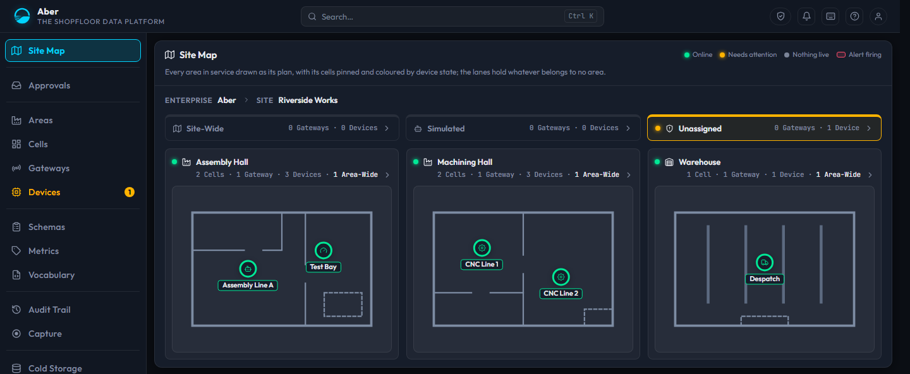
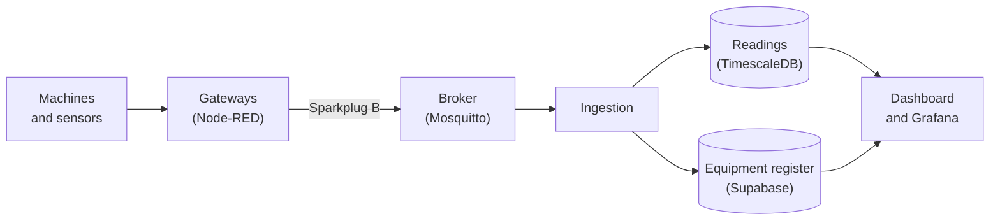

<picture>
  <source media="(prefers-color-scheme: dark)" srcset="docs/assets/aber-mark-dark.svg">
  
</picture>

# Aber - the shopfloor data platform

**Aber collects live data from the machines on a factory floor and keeps it in one place.** Small
gateway computers near the machines send their readings to Aber. Aber stores every reading, shows
them on dashboards, and records who changed what and when. It runs on your own network.

*Aber* is Welsh for a river mouth, where many streams meet and flow out as one.

## What it does

- **Collects live data.** Gateways send machine readings to Aber using
  [Sparkplug B](docs/glossary.md#sparkplug-b), an open industrial standard. Aber stores every
  reading and charts it in Grafana.
- **Keeps a register of your equipment.** Gateways and devices are placed in cells, and cells in
  areas of your site, so you can find any machine and its data.
- **Holds unknown devices for approval.** A device Aber has never seen waits in quarantine until an
  administrator approves it.
- **Records every change.** Who created, edited or archived what, and when, goes into an audit trail
  that can only ever be added to.
- **Manages gateways from one place.** Each gateway runs Node-RED. Its flow is kept in Aber's own
  git server, and a change is approved before it reaches the gateway.
- **Shares data in standard forms.** Export equipment as
  [Asset Administration Shells](docs/glossary.md#asset-administration-shell-aas), let other software
  read live data through the [i3X](docs/glossary.md#i3x) API, and optionally publish every reading
  to an ISA-95 [Unified Namespace](docs/glossary.md#unified-namespace-uns).

## Get started

Aber has two parts:

- **The server** runs on one Linux machine on your network, with at least 4 CPU cores, 8 GiB of
  memory and 100 GiB of disk.
- **Gateways** connect your machines to the server. A gateway is usually a small computer, such as
  a Raspberry Pi, beside the machines. You add gateways from the dashboard once the server is
  running.

| You want to | Start here |
| :--- | :--- |
| Install Aber on a site | [Installing Aber](docs/install.md#run-it-on-a-site) |
| Work on Aber's code on a laptop | [Develop on a laptop](docs/install.md#develop-on-a-laptop) |
| Connect your first machine | [The tutorial](tutorial/README.md) |

## How it fits together

Aber is built from existing projects rather than custom services: Supabase, TimescaleDB,
Mosquitto, Node-RED, Grafana and Gitea, running on Kubernetes (k3s).
[How Aber fits together](docs/architecture.md) describes every component.

## Documentation

| To | Read |
| :--- | :--- |
| Install Aber and sign in | [Installing Aber](docs/install.md) |
| Build your first machine | [The tutorial](tutorial/README.md) |
| Set up gateways on their own hardware | [Remote gateways](docs/remote-gateways.md) |
| Look up a term | [Glossary](docs/glossary.md) |
| See how it works | [How Aber fits together](docs/architecture.md) |
| See how it is secured | [Security model](docs/security-model.md) |
| Upgrade to a new release | [Upgrades](docs/upgrades.md) |
| Run it day to day | [The Kubernetes runbook](deploy/k8s/README.md) |
| See what is planned | The [2.0 milestone](https://github.com/Harri-Llewelyn/Aber/milestone/2), and [what has already shipped](docs/roadmap.md) |

## Relationship to ACS

Aber is an independent project inspired by the AMRC Connectivity Stack (ACS). It was built from the
ground up, contains no ACS code, and is not affiliated with or endorsed by the AMRC. It stays
compatible with Factory+ in [three ways](docs/architecture.md#relationship-to-acs).

## Contributing

Contributions are welcome. Start with [`CONTRIBUTING.md`](CONTRIBUTING.md). To report a security
problem, follow [`SECURITY.md`](SECURITY.md). Everyone taking part follows the
[Code of Conduct](CODE_OF_CONDUCT.md).

## Licence

Aber is MIT licensed ([`LICENSE`](LICENSE)). Some of the software it installs has its own licence,
notably TimescaleDB (the Timescale License) and Grafana (AGPL-3.0). Read [`NOTICE.md`](NOTICE.md)
before using Aber commercially.
