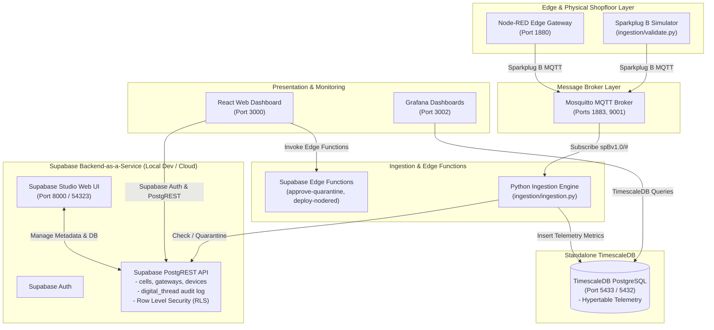

# Factory+ Asset Tracking Platform (Supabase BaaS + Standalone TimescaleDB)

[](https://github.com/Harri-Llewelyn/factoryplus-asset-tracking/actions/workflows/ci.yml)

An industrial, asset-centric manufacturing management platform built in alignment with the **AMRC Connectivity Stack (ACS / Factory+)** framework.

This application provides real-time telemetry streaming, shopfloor spatial mapping, automated Zero-Touch Edge device onboarding, fine-grained Row-Level Security (RLS), continuous Digital Thread audit logging, and Edge flow management.

---

## System Architecture & Design Principles

The platform uses a decoupled architecture combining **Supabase Backend-as-a-Service (BaaS)** with **Standalone TimescaleDB**:

* **Supabase BaaS**: Manages asset metadata (`cells`, `gateways`, `devices`), Supabase Auth, Row-Level Security (RLS) policies, PostgreSQL triggers for automated `digital_thread` audit logging, and TypeScript Supabase Edge Functions.
* **Standalone TimescaleDB**: High-performance time-series database running `timescale/timescaledb:latest-pg15` exposed on port `5433` for `telemetry` hypertable metric storage.
* **Python Ingestion Engine**: Consumes Sparkplug B industrial MQTT messages (`DBIRTH`, `DDATA`), verifying asset registration in Supabase (auto-quarantining unregistered devices) and streaming telemetry metrics directly to TimescaleDB.
* **React Web Dashboard**: React 18 SPA powered by Supabase JS SDK, utilizing direct PostgREST queries, real-time database change channels (`supabase.channel`), and Supabase Auth session management.

### System Topology Diagram



---

## Service Port Directory (Docker Compose Stack)

Running `docker compose up -d` starts 11 container services representing the current production runtime:

| Service | Container Name | Image / Build Target | Port | Description |
| :--- | :--- | :--- | :--- | :--- |
| **`timescaledb`** | `tsdb_postgres` | `timescale/timescaledb:latest-pg15` | `5433:5432` | Standalone TimescaleDB instance for `telemetry` hypertable |
| **`mosquitto`** | `mqtt_broker` | `eclipse-mosquitto:latest` | `1883:1883`, `9001:9001` | Eclipse Mosquitto MQTT broker for Sparkplug B traffic |
| **`frontend`** | `iot_frontend` | `./frontend/Dockerfile` | `3000:3000` | React Web Dashboard UI |
| **`postgres-meta`** | `postgres_meta` | `supabase/postgres-meta:v0.68.0` | — | Database metadata API for Supabase Studio |
| **`postgrest`** | `postgrest` | `postgrest/postgrest:v12.0.1` | — | PostgREST API engine |
| **`gotrue`** | `gotrue` | `supabase/gotrue:v2.132.3` | — | GoTrue Auth service |
| **`kong`** | `kong` | `kong:2.8.1` | `54321:8000` | Kong API Gateway |
| **`studio`** | `supabase_studio` | `supabase/studio:latest` | `8000:3000` | Supabase Studio database management Web UI |
| **`ingestion`** | `iot_ingestion` | `./Dockerfile` | — | Python daemon routing metadata to Supabase & telemetry to TimescaleDB |
| **`node-red-init`** | `iot_node_red_init` | `nodered/node-red:latest` | — | One-shot init container configuring Node-RED flows & credentials |
| **`node-red`** | `iot_node_red` | `nodered/node-red:latest` | `1880:1880` | Edge flow automation runtime |
| **`grafana`** | `iot_grafana` | `grafana/grafana:latest` | `3002:3000` | Analytics dashboards connected to TimescaleDB |

---

## Authentication & Role-Based Access Control (RBAC)

Supabase Auth is the authoritative identity provider for the application. User privileges are determined by role claims stored in `app_metadata.role` or `user_metadata.role`:

| Persona / Email | Role Claim | Access Scope |
| :--- | :--- | :--- |
| `admin@factoryplus.local` | `Administrator` | Full read/write access to cells, gateways, devices, and quarantine approvals. |
| `manager@factoryplus.local` | `Shopfloor_Manager` | Operations management, device quarantine approvals, and Node-RED deployments. |
| `operator@factoryplus.local` | `Operator` | Read-only view of shopfloor assets and telemetry. |
| `auditor@factoryplus.local` | `Auditor` | Digital Thread audit trace view. |

> [!IMPORTANT]
> Edge Functions and RLS policies enforce **fail-closed** authorization. Any token missing a valid role claim or containing an unprivileged role (e.g. `Operator`) will receive `403 Forbidden` on administrative mutations such as device quarantine approval.

---

## Database Migrations & Row Level Security (RLS)

All database migrations are stored in `supabase/migrations/`:
- **`20260101000000_init_assets_and_digital_thread.sql`**:
  - **Tables**: `cells`, `gateways`, `devices`, `digital_thread`.
  - **Triggers**: PL/pgSQL function `log_digital_thread_event()` automatically logs audit events on `cells`, `gateways`, and `devices` mutations.
  - **RLS Policies**: Enforces `SELECT` permissions for `authenticated` users, and `INSERT`/`UPDATE`/`DELETE` for `Administrator` and `Shopfloor_Manager` roles.
- **`20260101000002_add_documents_and_config.sql`**:
  - **Tables**: `documents`, `asset_config`, `schemas`, `directory_services`.
  - **RLS Policies**: Enforces RLS permissions for entity document links, asset parameter configurations, schema registry definitions, and directory services.
- **`20260101000003_add_rbac_permissions.sql`**:
  - **Tables**: `roles`, `permissions`, `role_permissions`, `user_roles`.
  - **Permissions System**: Seeds fine-grained RBAC permission UUIDs mapped to `Administrator`, `Shopfloor_Manager`, `Operator`, and `Auditor` personas.

---

## Supabase Edge Functions

Edge functions are located in `supabase/functions/`:
- **`approve-quarantine`** (`supabase/functions/approve-quarantine/index.ts`):
  - Validates session JWT & role claims (`Administrator` / `Shopfloor_Manager`).
  - Fails closed (`403 Forbidden`) if role claim is missing or unprivileged.
  - Sets `is_quarantined = false` and assigns `gateway_id` for approved devices via Supabase Service Role client.
- **`deploy-nodered`** (`supabase/functions/deploy-nodered/index.ts`):
  - Proxies flow deployment updates to Node-RED (`http://node-red:1880/flows`).

---

## Continuous Integration (CI Pipeline)

The GitHub Actions CI workflow ([`.github/workflows/ci.yml`](file:///.github/workflows/ci.yml)) executes automated testing and verification across three parallel jobs:

1. **`frontend-build` (Frontend Build & Test)**: Installs Node.js dependencies, runs the Vitest unit test suite (`npm test`), and builds the Vite production bundle (`npm run build`).
2. **`edge-function-auth-test` (Edge Function Authorization Unit Tests)**: Runs `python supabase/functions/approve-quarantine/test_approve_quarantine.py` to verify fail-closed role authorization for missing claims and non-privileged roles.
3. **`e2e-validation` (End-to-End Ingestion Validation)**: Installs the Supabase CLI, launches the local Supabase stack (`supabase start`), resets database migrations (`supabase db reset`), configures `.env`, launches the Docker Compose stack, polls service health (`timescaledb` & `mosquitto`), and executes `python ingestion/validate.py`.

---

## End-to-End Validation

To execute the end-to-end integration test suite:

```bash
python ingestion/validate.py
```

The validation script verifies:
1. **MQTT Payload Publishing**: Sends Sparkplug B `DBIRTH` and `DDATA` messages to Mosquitto.
2. **Supabase Device Quarantine**: Confirms unknown device `DBIRTH` announcements auto-insert into Supabase `devices` with `is_quarantined = true`.
3. **Digital Thread Audit Triggers**: Confirms PostgreSQL triggers automatically populate `digital_thread`.
4. **TimescaleDB Telemetry**: Confirms metric ingestion for registered devices into the TimescaleDB `telemetry` hypertable.
5. **Quarantine Telemetry Gating**: Confirms telemetry (`DDATA`) published by quarantined or unregistered devices is gated and dropped, ensuring zero records reach TimescaleDB until approved.

---

## Quick Start & Installation Guide

1. **Clone repository and set up environment**:
   ```bash
   cp .env.example .env
   ```

2. **Start Local Supabase (if running local BaaS)**:
   ```bash
   npx supabase start
   npx supabase db reset
   ```

3. **Start Docker Compose stack (11 services)**:
   ```bash
   docker compose up --build -d
   ```

4. **Access Web Interfaces**:
   - **React Dashboard**: `http://localhost:3000`
   - **Supabase Studio**: `http://localhost:8000` (or `http://localhost:54323` via `supabase status`)
   - **Node-RED Console**: `http://localhost:1880`
   - **Grafana Dashboards**: `http://localhost:3002`

5. **Authentication Credentials**:
   - **Default Sign In**: The login screen (`http://localhost:3000`) is pre-filled with:
     - **Email**: `admin@factoryplus.local`
     - **Password**: `factoryplus123`
   - **Self-Registration**: Click **"Need an account? Sign Up"** on the Portal to create a new user account instantly.

6. **Repository Hand-off & Packaging Best Practices**:
   Before packaging or committing clean hand-offs, tear down volumes and ensure no untracked build artifacts remain:
   ```bash
   docker compose down -v
   git status
   ```
   Confirm `git status` displays a clean workspace with no untracked `node_modules`, `.env`, `dist`, or `coverage` folders.
