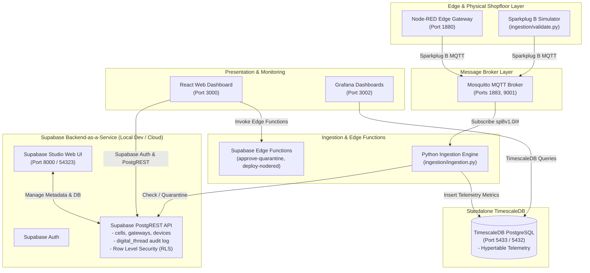

# Factory+ Asset Tracking Platform (Supabase BaaS + Standalone TimescaleDB)

[](https://github.com/Harri-Llewelyn/acs-cymru/actions/workflows/ci.yml)

An industrial, asset-centric manufacturing management platform built in alignment with the **AMRC Connectivity Stack (ACS / Factory+)** framework.

This application provides real-time telemetry streaming, shopfloor spatial mapping, automated Zero-Touch Edge device onboarding, fine-grained Row-Level Security (RLS), continuous Digital Thread audit logging, and Edge flow management.

---

## System Architecture & Design Principles

The platform uses a decoupled architecture combining **Supabase Backend-as-a-Service (BaaS)** with **Standalone TimescaleDB**:

* **Supabase BaaS**: Manages asset metadata (`cells`, `gateways`, `devices`), Supabase Auth, Row-Level Security (RLS) policies, PostgreSQL triggers for automated `digital_thread` audit logging, and TypeScript Supabase Edge Functions.
* **Standalone TimescaleDB**: High-performance time-series database running `timescale/timescaledb:latest-pg15` exposed on port `5433` for `telemetry` hypertable metric storage (schema auto-provisioned via `timescaledb/init/`).
* **Python Ingestion Engine**: Consumes Sparkplug B industrial MQTT messages (`DBIRTH`, `DDATA`), verifying asset registration in Supabase (auto-quarantining unregistered devices) and streaming telemetry metrics directly to TimescaleDB.
* **React Web Dashboard**: React 18 SPA powered by Supabase JS SDK, utilizing direct PostgREST queries, real-time database change channels (`supabase.channel`), and Supabase Auth session management.

### Design Decision: Supabase Storage is Deliberately Not Deployed

This platform stores **no binary objects**, so `supabase-storage` (storage-api) and `imgproxy` are
intentionally omitted from `docker-compose.yml`. This is a deliberate design decision, not a gap.

Document management is a **link registry, not a file store**. The `documents` table holds a
`url TEXT` column pointing at an external system (SharePoint, Google Drive, or any HTTP(S) URL) —
there is no upload path anywhere in the UI, and no bucket is ever created.

> [!NOTE]
> **Supabase Studio's Storage page will therefore report an error** (`API error happened while trying
> to communicate with the server`) in this stack. This is expected and can be ignored — no
> application feature depends on it. If binary object storage is ever required, add the official
> `storage-api` and `imgproxy` services plus a `/storage/v1/` route in `supabase/kong.yml`.

For the same reason, the `storage` entry in `PGRST_DB_SCHEMAS` is vestigial. It is harmless and left
in place so the setting matches upstream Supabase defaults.

### System Topology Diagram



---

### Service Port Directory

Running `docker compose up -d` launches the entire unified application stack:

| Service | Container Name | Image / Build Target | Port | Description |
| :--- | :--- | :--- | :--- | :--- |
| **`supabase-db`** | `factoryplus_supabase_db` | `supabase/postgres:15.6.1.143` | `54322:5432` | Authoritative Supabase PostgreSQL BaaS engine |
| **`supabase-db-init`** | `factoryplus_supabase_db_init` | `supabase/postgres:15.6.1.143` | — | One-shot init container applying migrations and seeding `seed.sql` |
| **`supabase-auth`** | `factoryplus_supabase_auth` | `supabase/gotrue:v2.189.0` | — | GoTrue Auth server (connects via least-privilege `supabase_auth_admin` role) |
| **`supabase-rest`** | `factoryplus_supabase_rest` | `postgrest/postgrest:v12.2.0` | — | PostgREST API engine (connects via least-privilege `authenticator` role) |
| **`supabase-kong`** | `factoryplus_supabase_kong` | `kong:2.8.1-alpine` | `54321:8000` | Kong API Gateway (`http://127.0.0.1:54321`) |
| **`supabase-functions`** | `factoryplus_supabase_functions` | `supabase/edge-runtime:v1.74.2` | — | Supabase Deno Edge Runtime executing serverless functions |
| **`supabase-meta`** | `factoryplus_supabase_meta` | `supabase/postgres-meta:v0.91.0` | — | Schema introspection API backing Supabase Studio's Database pages |
| **`supabase-studio`** | `factoryplus_supabase_studio` | `supabase/studio:latest` | `54323:3000` | Supabase Studio administrative Web UI (`http://127.0.0.1:54323`) |
| **`timescaledb`** | `factoryplus_timescaledb` | `timescale/timescaledb:latest-pg15` | `5433:5432` | Standalone TimescaleDB instance for `telemetry` hypertable (schema auto-provisioned via `timescaledb/init/`) |
| **`mosquitto-init`** | `factoryplus_mosquitto_init` | `eclipse-mosquitto:latest` | — | One-shot init container generating Mosquitto password file from environment variables |
| **`mosquitto`** | `factoryplus_mosquitto` | `eclipse-mosquitto:latest` | `1883:1883`, `9001:9001` | Eclipse Mosquitto MQTT broker for Sparkplug B traffic (credentials auto-generated via `mosquitto-init` from `.env`) |
| **`frontend`** | `factoryplus_frontend` | `./frontend/Dockerfile` | `3000:3000` | React Web Dashboard UI (served via NGINX static file server) |
| **`ingestion`** | `factoryplus_ingestion` | `./Dockerfile` | — | Python daemon routing metadata to Supabase & telemetry to TimescaleDB |
| **`node-red-init`** | `factoryplus_node_red_init` | `nodered/node-red:latest` | — | One-shot init container configuring Node-RED flows & credentials |
| **`node-red`** | `factoryplus_node_red` | `nodered/node-red:latest` | `1880:1880` | Edge flow automation runtime |
| **`grafana`** | `factoryplus_grafana` | `grafana/grafana:latest` | `3002:3000` | Analytics dashboards connected to TimescaleDB |

---

## Authentication & Role-Based Access Control (RBAC)

Supabase Auth is the authoritative identity provider for the application. User privileges are determined strictly by server-side role claims stored in `app_metadata.role`:

| Persona / Email | Role Claim | Access Scope |
| :--- | :--- | :--- |
| `admin@factoryplus.local` | `Administrator` | Full read/write access to cells, gateways, devices, and quarantine approvals. |
| `manager@factoryplus.local` | `Shopfloor_Manager` | Operations management, device quarantine approvals, and Node-RED deployments. |
| `operator@factoryplus.local` | `Operator` | Read-only view of shopfloor assets and telemetry. |
| `auditor@factoryplus.local` | `Auditor` | Digital Thread audit trace view. |

> [!IMPORTANT]
> Edge Functions and RLS policies enforce **fail-closed** authorization. Any token missing a valid role claim or containing an unprivileged role (e.g. `Operator`) will receive `403 Forbidden` on administrative mutations such as device quarantine approval.

---

## Database Migrations & Row Level Security (RLS)

All database migrations are stored in `supabase/migrations/`:
- **`20260101000000_init_assets_and_digital_thread.sql`**:
  - **Tables**: `cells`, `gateways`, `devices`, `digital_thread`.
  - **Triggers**: PL/pgSQL function `log_digital_thread_event()` automatically logs audit events on `cells`, `gateways`, and `devices` mutations.
  - **RLS Policies**: Enforces `SELECT` permissions for `authenticated` users, and `INSERT`/`UPDATE`/`DELETE` for `Administrator` and `Shopfloor_Manager` roles.
- **`20260101000002_add_documents_and_config.sql`**:
  - **Tables**: `documents`, `asset_config`, `schemas`, `directory_services`.
  - **RLS Policies**: Enforces RLS permissions for entity document links, asset parameter configurations, schema registry definitions, and directory services.
- **`20260101000003_add_rbac_permissions.sql`**:
  - **Tables**: `roles`, `permissions`, `role_permissions`, `user_roles`.
  - **Permissions System**: Defines role definitions and fine-grained permission UUIDs (including `digital_thread:read`). Drives frontend UI permission gating (`usePermissions.js`), with distinct permission assignments for `Operator` (`telemetry:read`, `quarantine:view`) and `Auditor` (`digital_thread:read`).
- **`20260101000004_fix_user_roles_rls.sql`**:
  - **RLS Policy Fix**: Replaces overly-broad `user_roles` SELECT policy with `user_roles_select_own_or_privileged`, restricting visibility of `user_roles` records strictly to the record owner (`auth.uid()`) or administrative roles (`Administrator` / `Shopfloor_Manager`).
- **`20260101000005_restrict_digital_thread_access.sql`**:
  - **RLS Policy Restriction**: Replaces permissive `digital_thread_select_authenticated` policy with `digital_thread_select_privileged_or_auditor`, restricting `digital_thread` SELECT access strictly to `Administrator`, `Shopfloor_Manager`, and `Auditor` roles.
- **`20260101000006_immutable_digital_thread.sql`**:
  - **Append-Only Audit Log**: Revokes `INSERT`/`UPDATE`/`DELETE` on `digital_thread` from `authenticated`, so audit rows can only ever be written by the `SECURITY DEFINER` trigger.
- **`20260101000007_rls_has_role_function.sql`**:
  - **Centralised Role Checks**: Introduces `public.has_role(text[])`, backed by `user_roles` rather than raw JWT claims, and rewrites every privileged RLS policy to use it.
  - **JWT Claim Sync**: Adds `public.custom_access_token_hook()` so `app_metadata.role` is refreshed from the database on every token issue/refresh.
- **`20260101000008_handle_new_user.sql`**:
  - **Default Role for Self-Registration**: `AFTER INSERT` trigger on `auth.users` granting new sign-ups the read-only `Operator` role (both a `user_roles` row and `raw_app_meta_data.role`). Seeded personas are left untouched.

> [!NOTE]
> All migrations are idempotent and are re-applied by `supabase-db-init` on every stack start. `supabase-db-init` runs with `set -e` and `psql -v ON_ERROR_STOP=1`, so a failing migration aborts startup loudly instead of being silently skipped.

---

## Supabase Edge Functions

Edge functions are located in `supabase/functions/`. Requests arrive at Kong on `/functions/v1/<name>`
and are dispatched by the **main service router** (`supabase/functions/main/index.ts`), which spawns
each function as an isolated user worker via `EdgeRuntime.userWorkers.create()`.

> [!IMPORTANT]
> Because every function runs in its own isolate, each one **must** keep its own `serve(handler)`
> entry point — that is required by the runtime, not redundant. Functions are *not* loaded by
> in-process `import()`; attempting to do so fails and yields an opaque
> `Edge Function returned a non-2xx status code` in the browser.

- **`approve-quarantine`** (`supabase/functions/approve-quarantine/index.ts`):
  - Validates session JWT & role claims (`Administrator` / `Shopfloor_Manager`).
  - Fails closed (`403 Forbidden`) if role claim is missing or unprivileged.
  - Sets `is_quarantined = false` and assigns `gateway_id` for approved devices via Supabase Service Role client.
- **`deploy-nodered`** (`supabase/functions/deploy-nodered/index.ts`):
  - Validates session JWT & role claims (`Administrator` / `Shopfloor_Manager`).
  - Fails closed (`401 Unauthorized` / `403 Forbidden`) if Authorization header or role claim is missing or unprivileged.
  - Deploys flows to Node-RED (`http://node-red:1880/flows`) and returns `{ status: "DEPLOYED", nodes_deployed, source }`.
  - **GitOps contract**: the repository is the source of truth. A request body of `{ "commit_message": "..." }` (what the Directory tab sends) deploys the canonical `node_red_flow.json` committed to this repo. Passing a Node-RED flow **array** instead deploys that payload verbatim.
  - The flow reaches the function via the `NODERED_FLOW_JSON` environment variable, populated from `node_red_flow.json` by the `supabase-functions` entrypoint. An edge-runtime **user worker has no filesystem access to the mounted volumes**, and module-relative paths resolve into an ephemeral compile directory rather than the mount — so the flow is passed through the environment, which `main/index.ts` forwards to every worker it spawns.
  - `NODERED_ADMIN_TOKEN` is optional: an `Authorization` header is sent only when it is set, so deployment works against a Node-RED instance without `adminAuth`.

---

## Continuous Integration (CI Pipeline)

The GitHub Actions CI workflow ([`.github/workflows/ci.yml`](file:///.github/workflows/ci.yml)) executes automated testing and verification across three parallel jobs:

1. **`frontend-build` (Frontend Build & Test)**: Installs Node.js dependencies, runs the Vitest unit test suite (`npm test`), and builds the Vite production bundle (`npm run build`).
2. **`edge-function-auth-test` (Edge Function Authorization Unit Tests)**: Runs unit tests (`test_approve_quarantine.py`, `test_deploy_nodered.py`, `test_user_roles_rls.py`) to verify fail-closed role authorization for missing claims and non-privileged roles.
3. **`e2e-validation` (End-to-End Ingestion Validation)**: Installs Python dependencies, installs `protobuf-compiler`, compiles `sparkplug_b.proto` via `protoc --python_out=. sparkplug_b.proto`, launches the unified Docker Compose stack (`docker compose up -d`), polls service health, and executes `python ingestion/validate.py`.

---

## End-to-End Validation

Running `ingestion/validate.py` outside of Docker requires `protobuf-compiler` (`protoc`) installed on your host system to compile the Sparkplug B protobuf definition:

```bash
# 1. Compile Sparkplug B Protobuf module (prerequisite outside Docker)
protoc --python_out=. sparkplug_b.proto
cp sparkplug_b_pb2.py ingestion/

# 2. Execute the end-to-end integration test suite
python ingestion/validate.py
```

> [!NOTE]
> When running the stack in Docker (`docker compose up --build -d`), `sparkplug_b_pb2.py` is compiled automatically inside the container build step.

The validation script verifies:
1. **MQTT Payload Publishing**: Sends Sparkplug B `DBIRTH` and `DDATA` messages to Mosquitto.
2. **Supabase Device Quarantine**: Confirms unknown device `DBIRTH` announcements auto-insert into Supabase `devices` with `is_quarantined = true`.
3. **Digital Thread Audit Triggers**: Confirms PostgreSQL triggers automatically populate `digital_thread`.
4. **TimescaleDB Telemetry**: Confirms metric ingestion for registered devices into the TimescaleDB `telemetry` hypertable.
5. **Quarantine Telemetry Gating**: Confirms telemetry (`DDATA`) published by quarantined or unregistered devices is gated and dropped, ensuring zero records reach TimescaleDB until approved.

---

## Known Issues

Open issues identified during development but **not** yet fixed. Recorded here so they are not
lost. Each entry names the offending code so it can be picked up directly.

### Functional gaps

| # | Issue | Location | Impact |
| :-- | :--- | :--- | :--- |
| 1 | **Real-time subscriptions never fire.** The dashboard subscribes to `postgres_changes`, but no `realtime` service is deployed and `kong.yml` has no `/realtime/v1/` route. | [`frontend/src/App.jsx:175`](frontend/src/App.jsx#L175) | The UI silently falls back to `usePolling`; live DB changes do not push. |
| 2 | **GitOps status is hardcoded stub data.** `gitops_status`, `active_commit_sha` and `repository_url` are literals, not real values. | [`frontend/src/api.js:168-174`](frontend/src/api.js#L168) | The Directory tab banner always shows `SYNCED` / commit `a8f3e4b` regardless of actual state. |
| 3 | **Permission UUIDs are never read from the database.** The PostgREST embed `role_permissions(...)` has no foreign-key path from `user_roles` (both relate to `roles`, not to each other), so the query errors and the hook silently falls back to the hardcoded `DEFAULT_ROLE_PERMISSIONS_MAP`. | [`frontend/src/hooks/usePermissions.js:48`](frontend/src/hooks/usePermissions.js#L48) | Editing `role_permissions` in the DB has no effect on the UI. RBAC still works, but only via the hardcoded map. |
| 4 | **Node-RED editor changes are discarded on restart.** `node-red-init` copies `node_red_flow.json` over `/data/flows.json` on every `docker compose up`. | [`docker-compose.yml`](docker-compose.yml) (`node-red-init`) | Flows edited at `localhost:1880` are lost on the next stack restart. Edit `node_red_flow.json` in the repo instead — it is the source of truth (see `deploy-nodered`). |

### Security / hardening

| # | Issue | Location | Impact |
| :-- | :--- | :--- | :--- |
| 5 | **Kong does not validate the `apikey` header.** There is no `key-auth` plugin and no consumers, unlike the stock Supabase gateway config. | [`supabase/kong.yml`](supabase/kong.yml) | Authorisation is enforced only downstream by PostgREST JWT verification and RLS. Acceptable for local dev; **must be addressed before any non-local deployment.** |
| 6 | **`.env.example` contains working development secrets** (`SUPABASE_JWT_SECRET`, the demo anon/service-role JWTs, `MQTT_PASSWORD`) and is committed to the repository. | [`.env.example`](.env.example) | These are the standard Supabase demo values and are safe for local use only. **Generate fresh secrets for any shared or hosted environment.** |
| 7 | **Node-RED admin API is unauthenticated.** The generated `settings.js` sets only `credentialSecret`; no `adminAuth` is configured, so `http://localhost:1880` and its `/flows` API are open. | `scripts/node-red-init.mjs` | Anyone with network access to port 1880 can read or replace edge flows. `deploy-nodered` sends an `Authorization` header only when `NODERED_ADMIN_TOKEN` is set, so enabling `adminAuth` is a config-only change. |

### Expected behaviour (not defects)

- **Supabase Studio's Storage page reports an error.** Storage is deliberately not deployed — see
  [Design Decision: Supabase Storage is Deliberately Not Deployed](#design-decision-supabase-storage-is-deliberately-not-deployed).
- **`PGRST_DB_SCHEMAS` still lists `storage`.** Vestigial while no storage-api runs; kept to match
  upstream Supabase defaults.
- **Simulated devices appear quarantined on first start.** `Simulated_CNC_01` is auto-registered with
  `is_quarantined = true` by design; an `Administrator` must approve it before telemetry is stored.

---

## Quick Start & Installation Guide

1. **Environment Setup (Cross-Platform)**:
   ```bash
   npm run setup
   ```
   > [!NOTE]
   > `npm run setup` initializes `.env` from `.env.example` using plain Node.js (`scripts/setup.mjs`). This operates identically across Windows (PowerShell/CMD), macOS, and Linux without requiring POSIX shell commands (`eval` / `sed`).

2. **Start Full Unified Application Stack (Docker Compose)**:
   ```bash
   docker compose up --build -d
   ```
   > [!NOTE]
   > All services — including the Supabase BaaS stack, TimescaleDB, MQTT broker, and web UI — launch automatically. Database migrations (`supabase/migrations/`) and seeds (`supabase/seed.sql`) are applied on initial container startup by `supabase-db-init`.

3. **Access Web Interfaces**:
   - **React Dashboard**: `http://localhost:3000`
   - **Supabase Studio**: `http://127.0.0.1:54323`
   - **Node-RED Console**: `http://localhost:1880`
   - **Grafana Dashboards**: `http://localhost:3002`

4. **Authentication Credentials**:
   - **Default Sign In**: The login screen (`http://localhost:3000`) is pre-filled with the local admin seed persona:
     - **Email**: `admin@factoryplus.local`
     - **Password**: `factoryplus123`
   - **Local Dev Seed Accounts**: Demo accounts (`admin@factoryplus.local`, `manager@factoryplus.local`, `operator@factoryplus.local`, `auditor@factoryplus.local` with password `factoryplus123`) are populated automatically during database initialization via `supabase/seed.sql` for local development.
   - **Self-Registration**: Click **"Need an account? Sign Up"** on the Portal to create a new user account instantly. Self-registered accounts are assigned the read-only **`Operator`** role by default (via the `handle_new_user` trigger in `supabase/migrations/20260101000008_handle_new_user.sql`); an `Administrator` must promote them to a privileged role.

7. **Repository Hand-off & Packaging Best Practices**:
   Before packaging or committing clean hand-offs, tear down volumes and ensure no untracked build artifacts remain:
   ```bash
   docker compose down -v
   git status
   ```
   Confirm `git status` displays a clean workspace with no untracked `node_modules`, `.env`, `dist`, or `coverage` folders.
