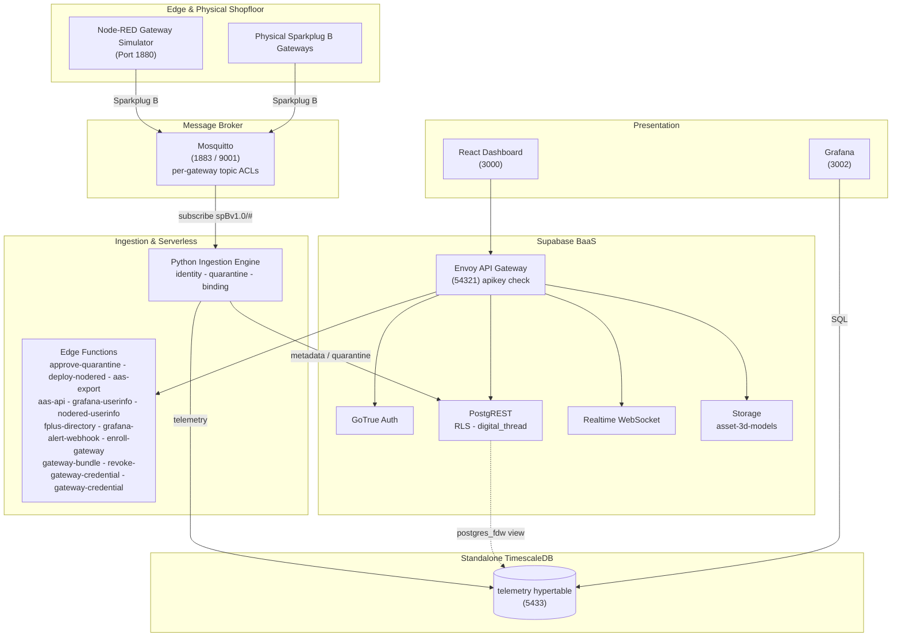

# AMRC Connectivity Stack - Cymru

[](https://github.com/Harri-Llewelyn/acs-cymru/actions/workflows/ci.yml)

An industrial, asset-centric manufacturing management platform aligned with the
**AMRC Connectivity Stack (ACS / Factory+)** framework.

Real-time telemetry streaming, shopfloor cell mapping, zero-touch edge device onboarding,
row-level security, continuous Digital Thread audit logging, AAS V3 export, and edge flow
management.

> **Design ethos —** *use pre-existing components and standards; minimise custom code.*
> Where upstream ACS ships bespoke microservices, this fork uses Supabase, TimescaleDB, Grafana and
> Node-RED. The custom surface is one Python ingestion daemon, twelve edge functions, an i3X server and
> a React dashboard.

---

## Architecture

**Supabase** is authoritative for asset metadata (`cells`, `gateways`, `devices`), auth, RLS, audit
triggers and edge functions. **Standalone TimescaleDB** holds the `telemetry` hypertable, reached
from Supabase through a `postgres_fdw` view. A **Python daemon** consumes Sparkplug B MQTT, gates
unregistered devices into quarantine, and routes metadata and telemetry to their respective stores.
A **React 18 SPA** queries PostgREST directly and subscribes to a Realtime change feed.

Derived state is computed at read time rather than stored: gateway staleness is a **view**, not a
cron writer, and AAS is an **adapter on the way out**, not an adopted metamodel.



**Data flow.** Devices publish `DBIRTH`/`DDATA` to Mosquitto, confined by ACL to their own edge-node
subtree → ingestion resolves topic to `sparkplug_id`, verifies the device is **bound to the
publishing gateway**, and quarantines anything unknown or contradictory → valid telemetry lands in
the hypertable → Postgres triggers log every metadata change to the append-only `digital_thread` →
the dashboard reads PostgREST and subscribes to Realtime.

---

## Deployment targets

**Kubernetes (k3s) is the primary target; Docker Compose is the local development path.** Both are
maintained, both are exercised in CI, neither is deprecated.

| | Docker Compose | Kubernetes (Helm) |
| :--- | :--- | :--- |
| Purpose | Local development, debugging | Deployment |
| Entry point | `docker compose up -d` | `helm install` — [`deploy/k8s/README.md`](deploy/k8s/README.md) |
| Reachability | Published ports on `localhost` | `*.<publicBaseDomain>` via one Ingress |
| TLS | none | cert-manager, internal CA ([`deploy/k8s/internal-ca.yaml`](deploy/k8s/internal-ca.yaml)) |
| MQTT | 1883 plaintext + 9001 WebSockets | the same, plus optional MQTTS on 8883 |
| Conformance | `ingestion/validate.py` from the host | the same suite, as an in-cluster Job |

Container images, SQL migrations and init scripts are **shared substrate** — only the *wiring* is
expressed twice. Intentional differences are enumerated in the divergence table in the Kubernetes
runbook; anything not in that table is drift. Design rationale is in
[`docs/kubernetes-architecture.md`](docs/kubernetes-architecture.md).

---

## Quick start — Docker Compose

```bash
npm run setup                   # writes .env with 24 freshly generated credentials
docker compose up --build -d    # launches the whole stack
```

Every file in `supabase/migrations/` is applied by `supabase-db-init` on startup and re-applied
harmlessly on every later start: the schema baseline (`0001`), seed data (`0002`), then `0003` audit
immutability, `0004`, `0005`, `0006` Node-RED SSO, `0007` metric-name format, `0008` Sparkplug
group, `0009` withdraws residual `anon` function grants, `0010` telemetry rollups and latest-value
view, `0011` IDTA Digital Nameplate and per-device nameplate data, `0012` permitted values of a
discrete metric, `0013` ASHRAE 223P vocabulary, `0014` repoints locally-minted semantic
identifiers onto the `acs-cymru.local` namespace, `0015` moves the default Sparkplug group to
`ACS-Cymru`, `0016` drops the dashboard's own service-directory entry and renames the Node-RED
one to say it is the simulator, `0018` pre-registers the demonstrator's metric set with each
row's standard and published semantic id, `0019` adds the 223P supply-air-flow metric the
shopfloor simulator needed, `0020` retires the introductory single-device simulator and moves its
schema and IDTA nameplate onto `Sim_CNC_Mill_01`, `0021` gives each shopfloor cell an icon from a
closed set, `0022` adds one schema per machine class and attaches it to every simulated device,
`0023` adds the `platform_alerts` occurrence log Grafana alerting writes into and publishes it for
Realtime, `0024` adds an optional free-text `description` to devices and gateways, `0025` adds
physical-gateway enrolment — a `gateway_enrollment_tokens` table reachable only by `service_role`,
the RPCs that issue and atomically redeem a single-use token, and the `PENDING_ENROLLMENT` /
`AWAITING_BIRTH` lifecycle states — `0026` stamps every audit row with the transaction that wrote
it (`digital_thread.causation_id`, from `txid_current()`) so the several rows one operator action
produces can be read back as one act, and adds `record_ingestion_rejection()` — the narrow
SECURITY DEFINER gate through which the ingestion daemon records a payload it judged
non-conforming, replacing `service_role`'s direct INSERT on the audit table — and `0027` maps the
historian's storage footprint over `postgres_fdw` and unions it with Supabase's own table sizes as
`public.storage_footprint`, read by Grafana's `supabase` datasource — `0028` generalises the alert
table from `device_alerts` to `platform_alerts`, whose subject is `(entity_type, entity_id)` rather
than a device, because the platform alert rules cover a gateway and the fleet and neither
fits a row that must name a machine — `0029` adds `public.platform_health`, the narrow view
those rules evaluate so the Grafana reader never needs the asset inventory — and `0030` gives that
alert table a **7-day retention window**, pruned nightly by `pg_cron`, whose predicate ages out
closed and superseded occurrences but never the newest firing row of a fingerprint — and `0031`
adds `public.system_settings`, the runtime configuration plane an `Administrator` edits from the
dashboard instead of a host `.env`, whose **key set is closed**: RLS grants UPDATE and nothing
else, so a new setting arrives by migration beside the code that reads it — and `0032` gives that
table **numeric bounds** and moves the alert retention window into it as `alerts.retention_days`,
replacing `prune_platform_alerts()` with a version that reads the setting, so the answer to "how
long do we keep alerts" is on a page rather than in a migration — and `0033` adds
`relocate_devices()`, which applies a whole shopfloor rearrangement in **one transaction** so the
six machines an operator files in one gesture carry one `causation_id` instead of six, and so a
batch that fails partway leaves nothing behind — and `0034` seeds the **read-only principal the MCP
client authenticates as**, holding `Operator` so it reads the i3X address space, writes nothing and
cannot see the audit trail (`scripts/mint-mcp-token.mjs` signs its long-lived token) — and `0035`
gives `gateways` the columns an appliance **reports about itself** on the heartbeat it already
publishes, chiefly `cert_expires_at`: the internal CA is hand-distributed into every appliance's
trust store, so re-minting it takes the whole fleet offline at once with no other signal — and
`0036` adds `public.gateway_health`, the **third** narrow view the Grafana reader may select,
after `0027`'s and `0029`'s: it backs the gateway dashboard and the certificate alert while
leaving the asset inventory `0029` deliberately withheld exactly where it is — and `0038` makes
**archiving or deleting a gateway revoke its broker credential**, by rotating the account to a
password nobody records: the credential service is add-only by design, so a delete verb there
would turn "can mint one confined account" into "can stop the whole fleet publishing" — and `0037`
makes **archiving a gateway withdraw its outstanding enrolment bundle**, and enrolment refuse
an archived gateway at all: a bundle downloaded and never instantiated was still redeemable
after the gateway was archived, which issued a real broker credential and resurrected the row
to `ONLINE` — and `0039` adds `0041` gives a **virtual gateway a
"Generate broker credential" path that needs no shell**: `authorize_virtual_gateway_credential()`
gates by role and refuses a physical or archived gateway, and
`record_gateway_credential_issued()` writes the `CREDENTIAL_ISSUED` audit row attributed to the
operator who asked — the two are separate so that a credential service that is down cannot produce
a record of a mint that never happened, and a mint that succeeds cannot go unrecorded — and `0042`
adds `list_service_principals()`, the **Administrator-only read behind the Service Identities
section**: `auth.users` is GoTrue's and is not served by PostgREST at all, and `user_roles` is
deliberately unreachable from a browser, so the alternative to a four-column function is a broad
grant on the two tables that decide who is who — and `0043` adds
`record_service_token_issued()`, which writes a **`TOKEN_MINTED`** row for a long-lived JWT and
refuses two things outright: a subject that can sign in, and any expiry beyond
`service_token_max_days()` — **90 days, because these tokens cannot be revoked** and the expiry is
the only bound that exists — and `0044` adds `create_service_principal()`, which creates a machine
identity the way `0034` does (`id` alone, so it has no email, no password and no identity provider)
and accepts **only a read-only role**, since a privileged machine identity becomes an unrevocable
write credential the moment a token is signed for it — and `0045` scopes `digital_thread_page()`'s
**deleted-asset filter to the three types that have a table behind them**: `0039` derived it as an
anti-join against cells, gateways and devices and deliberately did not narrow it by entity type, so
`service_principals` rows answered *"absent from all three"* and **the audit trail this feature
exists to produce was hidden as deleted** — and `0039`
adds `digital_thread_page()`, which applies the **deleted-asset
filter as a predicate rather than in the browser**, so the page's row budget is spent on rows
it will actually show: hiding them afterwards had the page list four assets on a stack of
twenty-six, and render an empty Gateways section on a fleet of four healthy gateways — and `0040`
**retires the demonstration shopfloor from the seed**, so a fresh install comes up with no assets
at all and the four-cell floor is something a reader asks for with `npm run provision:gateways`; it
is the one migration in the chain that must run **exactly once** rather than on every boot, because
the rows it removes are rows an operator may deliberately want back, and a delete replayed every
boot would silently undo every provisioning run — which is what `public.one_shot_migrations` is
for — plus demo accounts (`supabase/seed.sql`).

> **There is no `0017`.** It was drafted as an audit-trigger change guard and then not written,
> because `0005` already implements one; a second declaration of `log_digital_thread_event()`
> would win by filename order on every boot and would have regressed the `actor_source`
> attribution `0005` adds. The gap in the numbering is deliberate and the reasoning is in
> [`supabase/README.md`](supabase/README.md#audit-signal-and-attribution-0005).
>
> `0026` is that later declaration, written deliberately and on those terms: it reproduces `0005`'s
> body **in full** and adds two lines, rather than patching it. Its self-check asserts that both the
> heartbeat suppression guard and the causation stamp are present in the live definition, because
> `check-docs-drift.mjs` can verify a redeclaration was *intended* and cannot verify it was
> *complete*.

| Interface | URL |
| :--- | :--- |
| React Dashboard | http://localhost:3000 |
| Supabase Studio | http://127.0.0.1:54323 |
| Swagger UI | http://localhost:8088 |
| Node-RED | http://localhost:1880 |
| Grafana | http://localhost:3002 |
| Prometheus | http://localhost:9090 (loopback only — SSH-tunnel from another host) |

**Sign in to the React dashboard first.** Node-RED and Grafana both federate to Supabase Auth, and
the consent step needs your dashboard session — going straight to either shows a "sign in required"
prompt rather than a login form. In Node-RED, click **Sign in with ACS-Cymru**; Administrator and
Shopfloor_Manager can deploy, Operator and Auditor get a read-only editor.

**Demo accounts** — seeded by [`supabase/seed.sql`](supabase/seed.sql), password `acscymru123`:

| Email | Role | Access |
| :--- | :--- | :--- |
| `admin@acs-cymru.local` | `Administrator` | Full CRUD |
| `manager@acs-cymru.local` | `Shopfloor_Manager` | Full CRUD |
| `operator@acs-cymru.local` | `Operator` | Read-only + telemetry |
| `auditor@acs-cymru.local` | `Auditor` | Digital Thread read-only |

Self-registered accounts get read-only `Operator` via the `handle_new_user` trigger; an
`Administrator` must promote them.

> **`.env.example` contains working development secrets** — the standard Supabase demo values, also
> registered as Kong API keys. **Generate fresh secrets for any shared or hosted environment.**

Teardown: `docker compose down -v` (also drops volumes, invalidating every logged-in browser).

### Windows: `bind: An attempt was made to access a socket in a way forbidden by its access permissions`

```
Error response from daemon: ports are not available: exposing port TCP 0.0.0.0:54322 -> 127.0.0.1:0:
listen tcp 0.0.0.0:54322: bind: An attempt was made to access a socket in a way forbidden by its
access permissions.
```

**Nothing is wrong with the stack.** Hyper-V/WSL2 reserves blocks of high ports for NAT on boot,
and those blocks routinely swallow the `543xx` range this stack publishes Supabase on. The port is
not in use by another process — Windows has withdrawn it.

**Docker names only the first port it fails on, and that is the misleading part.** Three ports are
in that range, and the one that matters is not the one in the message:

| Port | Service | Consequence if lost |
| :--- | :--- | :--- |
| `54321` | Envoy | **the browser has no API** — the dashboard loads and every request fails |
| `54322` | supabase-db | no `psql` from the host; the stack itself is unaffected |
| `54323` | Supabase Studio | Studio unreachable |

So fixing the port in the error changes nothing: `supabase-db` fails, every service that depends on
it never starts, and what you see is a dashboard that loads and then reports **`Failed to fetch`**.
`docker compose ps` shows the shape of it — `frontend`, `swagger-ui` and `timescaledb` up, because
they are the only three that do not depend on `supabase-db`.

Confirm it is this and not a real conflict:

```powershell
netsh interface ipv4 show excludedportrange protocol=tcp
```

A range covering `54321`–`54323` and **no `*`** beside it is a dynamic Hyper-V reservation. (`*`
marks an administered exclusion — one somebody added deliberately.)

**The fix**, in an **Administrator** PowerShell:

```powershell
net stop winnat
netsh int ipv4 add excludedportrange protocol=tcp startport=54320 numberofports=8 store=persistent
net start winnat
```

Then `docker compose up -d`.

The middle line is the part that lasts. It claims `54320`–`54327` as an *administered* exclusion,
so WinNAT cannot take the range again — `store=persistent` carries that across reboots. Restarting
`winnat` on its own releases the current reservation but simply re-rolls it, so the same failure
returns on the next boot or Docker Desktop restart.

**If you cannot get an Administrator prompt**, the ports are configurable — `KONG_HTTP_PORT`,
`SUPABASE_DB_PORT` and `STUDIO_PORT` in `.env`. Moving Kong is not a one-line change, though:
`SUPABASE_URL`, `AAS_MODEL_PUBLIC_BASE` and `AAS_HISTORIAN_ENDPOINT` all carry the port, the
Node-RED and Grafana OAuth URLs are derived from `SUPABASE_URL`, and `VITE_SUPABASE_URL` is a
**build arg** — so the frontend needs `--build`, not just a restart. Change `.env` only and leave
`.env.example` alone, or the divergence follows you into every other environment.

### Resetting to a clean slate

```bash
npm run stack:reset -- --yes
```

Tears the stack down **with its volumes**, brings it back, waits for the schema to exist rather
than for ports to answer, and re-provisions the four cell gateways — printing their credentials
and writing them to `.env.gateways`, because `mosquitto_passwd` stores only a hash and they cannot
be read back afterwards.

Node, not a shell script, so it runs the same on Windows, macOS and Linux
([#106](https://github.com/Harri-Llewelyn/ACS-Cymru/issues/106)). **It checks that Docker answers
before it tears anything down** — the shell version discovered an unreachable Docker at the moment
it was already dropping volumes, which left a half-destroyed stack on the one path nobody exercises
until something has already gone wrong.

**`--yes` is required and there is no interactive prompt.** A prompt is something people learn to
dismiss without reading, and this is most dangerous once it is familiar. It also refuses outright
when `NODE_ENV=production`, and when `COMPOSE_PROJECT_NAME` names a stack this repository does not
own — so a shell in the wrong directory cannot take down someone else's.

The one thing it exists for that nothing else can do: **`digital_thread` is append-only to every
application role**, so dropping the volume is the only way back to an empty audit trail.

---

## Quick start — Kubernetes

Full runbook in [`deploy/k8s/README.md`](deploy/k8s/README.md). The short version:

```bash
# Five images are built from this repository and are on no registry.
docker build -f supabase/functions/Dockerfile -t acs-cymru/edge-runtime:0.1.0 .   # context: repo root
docker build -f Dockerfile                    -t acs-cymru/ingestion:0.1.0 .      # context: repo root
docker build -f node-red/Dockerfile           -t acs-cymru/node-red:0.1.0 node-red
docker build -f frontend/Dockerfile --build-arg VITE_RUNTIME_CONFIG=true \
                                              -t acs-cymru/frontend:0.1.0 frontend
docker build -f tests/Dockerfile              -t acs-cymru/test-runner:0.1.0 .    # conformance suites

node scripts/sync-helm-chart-files.mjs        # mirror repo config into the chart

kubectl create namespace acs-cymru
helm install acs-cymru deploy/helm/acs-cymru -n acs-cymru \
  -f deploy/helm/acs-cymru/values-dev.yaml --timeout 15m

# NOT `--wait` — it deadlocks the first install. See deploy/k8s/README.md.
for w in $(kubectl -n acs-cymru get statefulset,deploy -o name); do
  kubectl -n acs-cymru rollout status "$w" --timeout=10m
done

helm test acs-cymru -n acs-cymru          # the postgres_fdw gate
```

Serves seven subdomains on one Ingress (`app.`, `api.`, `nodered.`, `grafana.`, `studio.`, `docs.`,
`mqtt.`) plus a LoadBalancer for **raw MQTT on 1883**, which is TCP and cannot ride an HTTP Ingress.

- **`values-dev.yaml` carries the published demo credentials from `.env.example`, and they are in
  git.** For anything another person can reach, start from `values-prod.yaml.example` and point
  `secrets.existingSecret` at an externally managed Secret.
- **The chart validates its own values and fails the render, not the pod** — a partial credential
  set, a wrong-length Realtime key, a renamed Realtime Service, TLS with `scheme: http`, or an HPA
  on a single-writer workload each otherwise produce a stack that reports healthy and refuses every
  request.

---

## Repository map

| Directory | Covers |
| :--- | :--- |
| **[`frontend/`](frontend/README.md)** | React 18 architecture, Vite, Realtime integration, derived state, theming |
| **[`supabase/`](supabase/README.md)** | Migrations, RLS privilege matrix, triggers, audit immutability, edge functions, Kong |
| **[`ingestion/`](ingestion/README.md)** | Sparkplug B parsing, identity resolution, gateway binding, TimescaleDB mapping, `validate.py` |
| **[`simulation/`](simulation/README.md)** | Everything simulated, and none of it automatic: the Node-RED flow, the shopfloor dashboard, the machine alert rules, and how to turn each on |
| **[`i3x/`](i3x/README.md)** | i3X 1.0 server: address-space mapping, subscriptions, connecting a client — including [an MCP host](i3x/README.md#mcp) |
| **[`deploy/k8s/README.md`](deploy/k8s/README.md)** | Kubernetes runbook: install, upgrade, teardown, hardening, divergence table, releases |
| [`deploy/helm/acs-cymru/`](deploy/helm/acs-cymru) | The Helm chart; `values.yaml` documents every setting |
| [`docs/kubernetes-architecture.md`](docs/kubernetes-architecture.md) | Why the Kubernetes target is built the way it is. Source comments cite it by section |
| [`docs/incidents.md`](docs/incidents.md) | Faults whose FIX LOOKS ARBITRARY without the story. Read before "tidying" a guard that seems redundant |
| [`docs/upgrades.md`](docs/upgrades.md) | What survives an upgrade and why nothing needs reconfiguring — plus the three places that is not the whole truth |
| [`docs/openapi.yaml`](docs/openapi.yaml) · [`docs/i3x-openapi.yaml`](docs/i3x-openapi.yaml) | REST and i3X specifications, rendered by Swagger UI |
| [`supabase/migrations/archive/`](supabase/migrations/archive) | The 38 pre-beta migrations, preserved for their reasoning. Never executed |
| [`grafana/`](grafana) · [`timescaledb/`](timescaledb) | Provisioning; hypertable schema, retention and rollup reconciliation, the read-only BI role |
| [`scripts/`](scripts) | Setup, seeding, vocabulary generation, chart-file sync, drift guards, database backup/restore, gateway provisioning, stack reset, AAS push |
| [`tests/`](tests) | Vendored IDTA AAS schema, conformance test-runner image |

---

## Service port directory

**Every Compose service appears here and every row names a real one**, asserted in both directions
by `scripts/check-docs-drift.mjs`. It used to be checked one way and only for image tags, which is
how a row for `supabase-kong-init` — a service retired with Kong on Compose — survived while five
live services went unlisted: the tag it named (`alpine:3.24`) still existed, so the check passed.

| Service | Container | Image | Port |
| :--- | :--- | :--- | :--- |
| `supabase-db` | `acs-cymru_supabase_db` | `supabase/postgres:17.6.1.160` | `54322:5432` |
| `supabase-db-roles-init` | `acs-cymru_supabase_db_roles_init` | `supabase/postgres:17.6.1.160` | — |
| `supabase-db-init` | `acs-cymru_supabase_db_init` | `supabase/postgres:17.6.1.160` | — |
| `supabase-auth` | `acs-cymru_supabase_auth` | `supabase/gotrue:v2.189.0` | — |
| `supabase-rest` | `acs-cymru_supabase_rest` | `postgrest/postgrest:v14.12` | — |
| `supabase-envoy-init` | `acs-cymru_supabase_envoy_init` | `alpine:3.24` | — |
| `supabase-envoy` | `acs-cymru_supabase_envoy` | `envoyproxy/envoy:v1.31.5` | `54321:8000` |
| `supabase-functions` | `acs-cymru_supabase_functions` | `supabase/edge-runtime:v1.74.2` | — |
| `supabase-realtime` | `acs-cymru_supabase_realtime` | `supabase/realtime:v2.102.3` | — |
| `supabase-storage` | `acs-cymru_supabase_storage` | `supabase/storage-api:v1.60.4` | — |
| `supabase-storage-init` | `acs-cymru_supabase_storage_init` | `node:24-alpine` | — |
| `supabase-storage-policies` | `acs-cymru_supabase_storage_policies` | `supabase/postgres:17.6.1.160` | — |
| `supabase-meta` | `acs-cymru_supabase_meta` | `supabase/postgres-meta:v0.96.6` | — |
| `supabase-studio` | `acs-cymru_supabase_studio` | `supabase/studio:2026.07.07-sha-a6a04f2` | `127.0.0.1:54323:3000` (loopback only — see below) |
| `timescaledb` | `acs-cymru_timescaledb` | `timescale/timescaledb:2.29.2-pg17` | `5433:5432` |
| `timescaledb-maintenance` | `acs-cymru_timescaledb_maintenance` | `timescale/timescaledb:2.29.2-pg17` | — |
| `mosquitto-tls-init` | `acs-cymru_mosquitto_tls_init` | `./mosquitto-tls-init/Dockerfile` | — |
| `mosquitto-init` | `acs-cymru_mosquitto_init` | `eclipse-mosquitto:2.0.22` | — |
| `mosquitto` | `acs-cymru_mosquitto` | `eclipse-mosquitto:2.0.22` | `1883`, `9001` |
| `frontend` | `acs-cymru_frontend` | `./frontend/Dockerfile` | `3000:3000` |
| `ingestion` | `acs-cymru_ingestion` | `./Dockerfile` | `9108:9108` |
| `playback` | `acs-cymru_playback` | `./Dockerfile` (same image as `ingestion`, different command) | — |
| `i3x-service` | `acs-cymru_i3x` | `./i3x/Dockerfile` | `8090:8090` |
| `gateway-credential` | `acs-cymru_gateway_credential` | `./gateway-credential/Dockerfile` | — |
| `node-red-init` | `acs-cymru_node_red_init` | `./node-red/Dockerfile` | — |
| `node-red` | `acs-cymru_node_red` | `./node-red/Dockerfile` | `1880:1880` |
| `grafana` | `acs-cymru_grafana` | `grafana/grafana:13.2.0` | `3002:3000` |
| `swagger-ui` | `acs-cymru_swagger_ui` | `swaggerapi/swagger-ui:v5.32.14` | `8088:8080` |
| `prometheus` | `acs-cymru_prometheus` | `prom/prometheus:v3.14.0` | `127.0.0.1:9090:9090` |
| `node-exporter` | `acs-cymru_node_exporter` | `prom/node-exporter:v1.12.1` | — |

---

## Security model

Fail-closed throughout: edge functions and RLS policies deny by default, and a missing or
unrecognised role produces `403`.

| Layer | Control |
| :--- | :--- |
| **Broker** | `allow_anonymous false`; [`mosquitto.acl`](mosquitto.acl) confines each gateway to `spBv1.0/+/+/<own-id>/#` |
| **Ingestion** | Gateway↔device binding; quarantine gating; append-only historian writes — a **grant**, not a promise, once `INGEST_WRITER_PASSWORD` and `INGEST_DB_USER` are set: `ingest_writer` may INSERT and cannot UPDATE, DELETE or TRUNCATE. Unset, the daemon keeps the admin credential and the guarantee is the Python's again — see [Historian roles](#historian-roles) |
| **Gateway** | Envoy's `apikey` check on `/rest`, `/realtime`, `/storage`, `/functions` — with **four** documented exemptions ([`supabase/README.md`](supabase/README.md)) |
| **API** | PostgREST JWT verification plus RLS on every table |
| **Database** | `has_role()` reads `user_roles` directly, so revocation is immediate; `digital_thread` is append-only against `service_role` too |
| **Edge functions** | Explicit router allow-list; per-function secret scoping; role resolved from the database, never a stale JWT claim |
| **Edge automation** | Node-RED's editor, admin API and webhook receiver each authenticate separately |
| **Supabase Studio** | **No authentication of its own — reachable only from the host.** Bound to `127.0.0.1` on Compose and off the Ingress by default on Kubernetes |

### Historian roles

The historian is a separate database, and a grant issued in a Supabase migration does not reach it.
Its roles live in [`timescaledb/roles.sql`](timescaledb/roles.sql), reconciled on **every boot** by
`timescaledb-maintenance` — the same replay-and-reconcile model the migration chain uses, and for
the same reason: `/docker-entrypoint-initdb.d` runs only on an empty data directory.

| Role | May | Used by |
| :--- | :--- | :--- |
| `ingest_writer` | INSERT + SELECT on `telemetry`; upsert `assets` | the ingestion daemon |
| `fdw_reader` | SELECT the six objects Supabase projects | Supabase's `postgres_fdw` PUBLIC mapping |
| `grafana_reader` | SELECT everything the dashboards query | Grafana |
| `powerbi_reader` | SELECT the three rollups only | external BI |

**`ingest_writer` and `fdw_reader` are required; the two readers are optional.** BI and Grafana are
consumers a stack can simply not have. The daemon and the FDW are not — each must authenticate as
*something* on every query, and the only alternative to these roles is the superuser they replaced.
So `npm run setup` mints both passwords, Compose refuses to start without them, and the chart fails
to render. A stack that comes up on the superuser saying nothing is the state this closes.

**The daemon checks its own credential at startup** and refuses to run as a superuser on the
historian, naming `ALLOW_HISTORIAN_SUPERUSER=true` as the deliberate way to say otherwise. Every
other guarantee here is enforced where it can be observed — the broker ACL by delivery, the write
gates by `is_ingestion_caller()`, the audit trail by a trigger. This one used to depend on nobody
having changed a variable, and it was wrong for months without anything noticing.

**An authentication failure is fatal; an unreachable historian is not.** The daemon is built to
survive a database that is down — it warns, drops what it cannot store, and resumes. A refused
credential never resolves by retrying, so it exits instead of running indefinitely discarding every
reading. Those two wore the same clothes until a wrong password was tried on purpose.

**`ingest_writer` needs SELECT, which is not obvious.** Both of the daemon's statements carry an
`ON CONFLICT` clause, and inferring the arbiter index reads the target. So the role is *append-only*
rather than write-only: it can add a row and cannot change or remove one, which is the distinction
the security model above depends on.

**Why `fdw_reader` exists at all.** `0001` maps every local Supabase role onto this database through
`postgres_fdw`. That mapping used the historian's superuser, so an FDW session opened for
`authenticated` ran here with full rights, contained only by the grant on the *other* database. No
application role could abuse it — the point is that nothing stopped the next widened grant or new
foreign table from inheriting that reach silently. The `postgres` mapping is deliberately unchanged:
it is what a human debugging the FDW connects through.

`timescaledb/test_historian_role_grants.py` asserts both halves for both roles — what they can do,
and what they must not.

**Supabase Studio is a database console, not a dashboard with admin features**, and it is the one
component here with no login, no roles and no session. The official Supabase stack fronts it with a
basic-auth pair on Kong; this stack does not run that, so whatever can reach it holds the SQL
editor, the table editor and the Vault UI **as the database owner** — for whom RLS is not enforced.
Every control in the table above is downstream of that.

So it is reachable from the host and nowhere else. `127.0.0.1:54323` on Compose; on Kubernetes
`ingress.routes.studio` defaults to `false`, and reaching it is a port-forward:

```bash
kubectl -n <ns> port-forward svc/<release>-acs-cymru-supabase-studio 54323:3000
```

Turning that route on publishes an unauthenticated database console at `studio.<publicBaseDomain>`
and should be paired with an authenticating proxy in front of it.

Two consequences worth stating on the front page; both are detailed in
[`supabase/README.md`](supabase/README.md):

- **Node-RED is not an open port.** A `function` node runs arbitrary JavaScript in a container
  holding the MQTT credential, so anyone who could replace a flow had remote code execution on the
  edge host. The editor and `/flows` use OAuth2 + PKCE; `POST /hooks/quarantine` takes a 60-second
  per-event signed token, deliberately not the admin credential, because any flow author can read it
  from `msg.req.headers`.
- **The `asset-3d-models` bucket is public-read**, because an exported AAS `File` URL must resolve
  for a viewer holding no session and a signed URL would turn every shell already handed out into a
  time bomb. Anything in it must carry nothing beyond machine geometry. Writes are gated on
  `device:manage`, not merely `authenticated`.

### Machine identities

Four identities here are held by software rather than people, and each is narrow by construction:
`Service_Ingestor` and the MCP reader hold `Operator`, `factoryplus_i3x` reads the broker namespace
and publishes nothing, and `gateway-credential-service` can add one broker account and do nothing
else. All four are `auth.users` rows with no email, no password and no identity provider, so none
can sign in.

**The ingestion daemon does not hold `SUPABASE_SERVICE_ROLE_KEY`.** It used to, and that was the one
credential whose compromise no policy written anywhere else could contain, sitting in the process
most exposed to the plant network. It authenticates as `Service_Ingestor` — an `Operator` principal
that cannot write a single row directly — and every write it makes goes through a `SECURITY DEFINER`
gate that checks the caller is that principal. `Operator` being insufficient is the design, not an
oversight: it makes those gates the only route rather than the tidy one.

**Tokens cannot be revoked.** PostgREST checks the signature, not a session table, so revoking means
rotating `SUPABASE_JWT_SECRET` and invalidating every key in the stack. Expiry is therefore the only
bound that exists — 90 days maximum for any token naming a **principal**, whether a person pasted it
into a laptop config or a container reads it from `.env`, and ten years only for the anon and
service-role keys, which name nobody and are the stack's API keys. The **Access Control** tab exists
to say what is outstanding, because with no revocation an accurate inventory *is* the safety story.

The full argument, including the three revocation designs that were checked and rejected, is in
[`supabase/README.md`](supabase/README.md#machine-identities).

**Known issues** — things that can be worked on — are tracked as
[GitHub issues](https://github.com/Harri-Llewelyn/ACS-Cymru/issues). **Accepted risks are not**, and
live below.

### Accepted risks

An accepted risk is a decision, not a task. Kept here rather than in the issue tracker because an
issue is a bulletin of work somebody could pick up, and one that will never be picked up teaches
readers to skim the list. It also decays differently: an open issue nobody acts on starts to look
like neglect, where a documented decision reads as what it is.

**Each says what would change the decision**, which is the part that stops an accepted risk becoming
a forgotten one. Nothing here is accepted permanently; each is accepted *for a stated deployment
model*, and the model is what to re-check.

#### Realtime leaks the timing of changes, though not their contents

An unauthenticated subscriber that can reach the Realtime WebSocket receives the change **envelope**
for every published table. Realtime redacts the payload to `{}` and attaches a 401, but the message
arrives — so the **fact and timing** of a change leak, even though its contents do not. `cells`,
`gateways` and `devices` are published because the dashboard needs them live, so an observer can
infer when an asset was created, edited, archived or changed state. In practice that is a timing
side-channel on shift patterns, commissioning activity and the rate of configuration change.

**It cannot be fixed here** — it is upstream `supabase/realtime` behaviour. The gateway's `apikey`
check does not mitigate it either: the anon key is a registered key that is necessarily shipped to
every browser, so holding it proves nothing about the caller. What *was* done is narrowing the
publication: `digital_thread` was removed from it, being the most operationally sensitive stream and
one nothing subscribed to.

**Accepted because** the target environment is an isolated shopfloor network reached over VPN, with
services behind an internal CA. Reaching the socket at all means already being inside that boundary,
where an observer has considerably more direct means of learning the same facts — and the exposure
does not justify degrading the dashboard's live updates.

**Revisit if** the stack is exposed to a network where reaching the WebSocket is not already
evidence of access: a public or partner-facing deployment, a shared cluster, or any move to
multi-tenancy. At that point the choice is dropping the three tables from the publication and
polling instead, or waiting for upstream to authenticate before delivering the envelope.

#### There is no credential revocation; expiry is the only bound

Described in full under [Machine identities](#machine-identities) — a token cannot be withdrawn without rotating
`SUPABASE_JWT_SECRET` and invalidating every key in the stack, so expiry is the only bound that
exists: 90 days for any token naming a principal — the ingestion and playback keys included, which
`npm run keys:rotate` re-signs — and ten years only for the anon and service-role keys, which name
nobody.

**Accepted because** the three revocation designs that would fix it were checked and rejected for
reasons recorded in [`supabase/README.md`](supabase/README.md#machine-identities), and because an
accurate inventory is the compensating control — which is what the **Access Control** tab exists to
provide.

**Revisit if** tokens are ever issued to parties outside the operating organisation, or if the
ten-year infrastructure keys outlive the deployment that minted them.

---

## Standards

| Standard | Role |
| :--- | :--- |
| **Sparkplug B** | The wire protocol. Identity is `sparkplug_id`, carried in the topic |
| **MTConnect** (2.x) | Machine-tool vocabulary — 249 data item types, 123 subtypes, 100 units, 126 component types |
| **OPC UA** (40001, 40001-4, 40010, 30050, 40501, 40540) | Companion-specification data points: machinery, energy, robotics, PackML, machine tools, additive. Generated from OPC Foundation NodeSets by [`scripts/generate-opcua-vocabulary.mjs`](scripts/generate-opcua-vocabulary.mjs) |
| **ISO 22400** | Computed KPIs, which MTConnect and OPC UA deliberately exclude |
| **ASHRAE 223P** | Building-system semantics — 640 concepts from the open223 ontology. ⚠ Still in public review |
| **AAS / IEC 63278** | V3 export as JSON or AASX, validated against the official IDTA schema |

These are **four vocabularies, not four alternatives** — a mixed fleet needs all of them, which is
why the schema builder offers a choice rather than a migration path. All are built, as is the IDTA
Digital Nameplate; what each one covers and how its identity was verified is in
[`docs/vocabularies.md`](docs/vocabularies.md), and the checklist for adding another is in
[`supabase/README.md`](supabase/README.md#adding-a-vocabulary).

> Adopting the MTConnect vocabulary is not a compliance claim; that requires the Implementer
> License. Locally-minted semantic ids live under `https://acs-cymru.local/semantics/…` — the
> namespace is the honesty mechanism, and an id under `mtconnect.org` would assert an
> interoperability that does not exist.

---

## Licence

**This repository is MIT licensed** — see [`LICENSE`](LICENSE). That covers everything here: the
Compose and Helm configuration, the SQL, the services, the flows, the dashboards and the docs.

It does not cover the third-party images this configuration deploys, which carry their own licences
and are pulled from their own registries at deploy time. Two are worth knowing about before you
commit to the stack:

- **TimescaleDB** runs under the **Timescale License**, not Apache 2.0. Compression, continuous
  aggregates, retention policies and `time_bucket_gapfill` are all Timescale-Licensed features and
  all four are load-bearing here, so an Apache-only build will not run this schema. The licence
  permits internal and commercial use and restricts offering the software as a hosted database
  service.
- **Grafana** is **AGPL-3.0** — the most restrictive licence in the stack, which surprises people
  who expect that to be TimescaleDB. Deploying it unmodified is fine; modifying Grafana itself and
  offering it over a network engages the AGPL.

Licences do not cross a process boundary: every component runs in its own container and is reached
over a network protocol, so none of this reaches into your use of the MIT-licensed work here.

**Read [`NOTICE.md`](NOTICE.md) before deploying commercially, and take your own advice before
offering this stack as a hosted service.**

---

## Testing

Every suite, what each one needs, the five CI jobs and the release workflow are in
**[`docs/testing.md`](docs/testing.md)**. The short version:

```bash
cd frontend && npm test                 # Frontend — 1,600+ tests
node scripts/check-env-drift.mjs        # Configuration drift — no services needed

# End-to-end — needs the running stack
set -a && . ./.env && set +a && unset MQTT_HOST DB_HOST DB_PORT
export MQTT_USER="$MQTT_VALIDATOR_USER" MQTT_PASSWORD="$MQTT_VALIDATOR_PASSWORD"
python ingestion/validate.py
```

**`validate.py` is topology-agnostic and runs against both deployment targets** — Compose and
Kubernetes — which is what makes it the real drift control between them.

---

## Expected behaviour (not defects)

- **`docker compose down -v` invalidates every logged-in browser.** It drops `supabase_db_data`, and
  with it `auth.sessions`. The dashboard clears the stale tokens and returns to the login screen.
- **Swagger UI's "Example Value" is documentation, not data.** Press **Execute** and read the
  **Response body** panel.
- **A fresh install has no cells, no gateways and no devices, and Node-RED opens on a blank
  canvas.** It used to come up with a four-cell simulated shopfloor seeded by `0002` and a Node-RED
  publishing under four gateway identities, which meant every install began with assets nobody had
  asked for and a Digital Thread already describing them. Both halves are now opt-in:
  `npm run provision:gateways` creates the floor, `NODE_RED_SEED_SIMULATOR=true` seeds the flow, and
  `npm run stack:reset` does the whole sequence in one command.
  [`simulation/README.md`](simulation/README.md) is the tutorial. `0040` retires the seed from
  databases that already have it, once.
- **Node-RED's editor shows one "Start here" tab and nothing else.** That is the starter flow, not a
  failed mount — it declares no broker nodes, so nothing connects and nothing publishes. The tab's
  info panel carries the three steps. Before this, a default stack ran the simulator against
  gateways that did not exist and ingestion discarded every message as an *"unregistered edge
  node"* — correct behaviour, and an odd thing to be doing before anyone had asked for it.
- **An unrecognised device appears in the quarantine queue, not on the shopfloor map.** That is the
  zero-touch onboarding path working: a device that announces itself under an id nobody registered
  is held and its telemetry dropped until an `Administrator` approves it. With no seeded assets
  this is now the **first** thing a new user meets rather than a footnote — publish under any
  well-formed `dev`-prefixed id and it is waiting for you. The demonstrator's own `Sim_` devices
  are pre-registered by provisioning and so bypass it, which is what makes introducing one
  unregistered device on purpose a demonstration rather than the default state.

---

## Roadmap & Future Extensions

Fourteen extensions, none of them speculative: every one names the code it would build on, because
the value of writing them down is that a reader can tell how far away each is — and several turned
out to be much closer than the request for them assumed, which is stated here rather than left to be
discovered later.

**This section lists only what is NOT built.** An item that ships is removed from here and its
substance moves into the documentation, so the presence of a number is the answer to "is this
done?" — no entry here says `Built`, because a checklist that contains finished work is not a
checklist. Items 6, 13 and 16 left this way and are now documented under
[Machine identities](#machine-identities) and in
[`supabase/README.md`](supabase/README.md#machine-identities); item 7 is documented under
[Schema Conformance](ingestion/README.md#schema-conformance); item 11 under
[Broker Capture and Playback](ingestion/README.md#broker-capture-and-playback), where item 17's
orchestration now sits beside the CLI it wraps, under
[Recording from the dashboard](ingestion/README.md#recording-from-the-dashboard),
[Playback from the dashboard](ingestion/README.md#playback-from-the-dashboard) and
[The Playback gateway, and its shadow devices](ingestion/README.md#the-playback-gateway-and-its-shadow-devices);
item 15 under
[`deployment`, and the word it is replacing](supabase/README.md#deployment-and-the-word-it-is-replacing-0064);
item 18 under [Historian roles](#historian-roles); and item 9's subject was retired the same way
when `aas-api` shipped.

**Retired numbers are not reused, and the list is therefore not contiguous.** The gaps at 6, 7, 11,
13, 15, 16, 17 and 18 are deliberate. Renumbering on retirement was the earlier practice and it does not survive
contact with this repository: the remaining entries are named by **dozens of comments** in migrations,
scripts and components, all explaining why that code is the way it is, and shifting every number
below a removal would silently redirect all of them without erroring. A number cited from code is an
identifier, not a position. Where code refers to work that has since shipped, the citation names the
documentation rather than a roadmap number.

**Items 1-5 are this repository's own**, ordered by how much of each already exists, as are 20-22 —
20 first because both 21 and 22 depend on the role split it makes: 21 has nowhere to put an
Administrator-only control without it, and 22 would hide a lane from a role that could still grant
itself the ability to see it. **Items 8-14
arrive from feature requests** — 8, 9 and 10 from GitHub issues
[#64](https://github.com/Harri-Llewelyn/ACS-Cymru/issues/64),
[#63](https://github.com/Harri-Llewelyn/ACS-Cymru/issues/63) and
[#66](https://github.com/Harri-Llewelyn/ACS-Cymru/issues/66), in that same order of how much already
exists; 12 was not filed. 19 arrives from
[#39](https://github.com/Harri-Llewelyn/ACS-Cymru/issues/39).
[#58](https://github.com/Harri-Llewelyn/ACS-Cymru/issues/58) was item 11 and is now built. Where an entry's heading differs from the issue's title, it is
because the work that remains is narrower than the title claims.

**None of these are open defects.** Feature requests live here once they have been checked against
the code; **known issues** stay in
[GitHub issues](https://github.com/Harri-Llewelyn/ACS-Cymru/issues), and **accepted risks** live
under [Accepted risks](#accepted-risks) — a decision nobody will action is not a bulletin item, and
leaving it in the tracker teaches people to skim it.

### 1 · Horizontal ingestion scaling

**Builds on:** the single-writer note in `get_timescaledb_connection()` ·
`acs_ingestion_write_seconds` · `_alias_map` / `_last_seq`

#### The ceiling has now been measured, and it is not close

This item used to open by quoting the ceiling out of a docstring — *"one connection, not a pool.
Every write happens on the paho callback thread, so there is exactly one writer"* — which is an
assertion, not a measurement. `acs_ingestion_write_seconds` now ships, so there is a number:

| | |
|---|---|
| mean write | **≈ 4.1 ms** (0.0744 s over 18 writes, measured 2026-08-21) |
| p90 | **12.6 ms**, via `histogram_quantile` |
| implied single-thread ceiling | **≈ 240 msg/s**, and this is an *upper* bound |
| current fleet rate | **≈ 0.95 msg/s** |

An upper bound because the histogram starts when the write path is entered: device resolution and
protobuf decode occupy the same thread beforehand and are outside it. Even so, the headroom is
**two orders of magnitude**. This item is real but it is not urgent, and that is now a
measurement rather than an opinion — which is the whole reason the instrument was fitted before
anything moved rather than after.

#### `$share` does not do what this entry used to claim

The previous text called an MQTT 5 shared subscription "the honest path" and said the daemon was
"already shaped for it", needing only per-worker connection ownership and a rebirth path. **Tested
against the live broker, that is wrong.** Two subscribers in one share group, 20 seconds of fleet
traffic:

```
worker A: 11 msgs    worker B: 11 msgs
seen by BOTH: DDATA/gwy12…/dev22…  DDATA/gwy12…/dev23…
              DDATA/gwy12…/dev27…  DDATA/gwy13…/dev24…
only A: NDATA/gwy13…, NDATA/gwy15…
only B: NDATA/gwy12…, NDATA/gwy14…, DDATA/gwy15…/dev26…
```

Round-robin **per message, with no edge-node affinity** — and Sparkplug state is per edge node.
Two in-memory tables are keyed `(group_id, edge_node_id)`:

- **`_alias_map`.** A birth certificate is *one message*, so it reaches *one worker*. Above,
  `gwy12…`'s NDATA went only to B while its devices' DDATA went to both — so worker A would resolve
  alias-only metrics against an empty table. The failure mode is already documented at the
  declaration: *"ingests nothing at all from an alias-optimised gateway, and reports no error while
  doing it."*
- **`_last_seq`.** Each worker sees a fraction of the sequence numbers, so gap detection fires
  permanently. `request_node_rebirth()` does not rescue it: the rebirth is also one message, and
  lands on one worker.

So the blocker is **the data path, not the rebirth path**. What would actually be required is
either shared state for those two tables — a round trip on the hottest path, which is what this item
exists to make faster — or partitioning the topic space by edge node, which is not what `$share`
does and fights dynamic enrolment, since gateways arrive with single-use tokens and a static
partition cannot know them.

**One prerequisite that turned out not to exist:** the daemon speaks MQTT 3.1.1 (`mqtt.Client()`
with paho 1.6.1's v1 callbacks), and `$share` is an MQTT 5 feature — but Mosquitto 2.0.22 honours
shared subscriptions for 3.1.1 clients regardless, verified above. **No protocol upgrade and no
callback migration is needed.** That was expected to be the hard part and it is not the problem.

---

### 2 · Ingress → Gateway API

**Builds on:** [`templates/ingress.yaml`](deploy/helm/acs-cymru/templates/ingress.yaml) ·
`acs-cymru.corsOrigins`

**Both of this item's original arguments have now been answered by something else, and what is left
is smaller than it was.** It first opened by blaming Kong 2.8 for the substitution templates; the
3.9.3 bump removed that. It then rested on CORS — and §4 has since moved the gateway to Envoy, which
restates origin policy in its own filter.

**So the placeholder this was going to retire is still there, and the reason has changed.**
`__CORS_ORIGINS__` is now substituted into `envoy.yaml` rather than `kong.yml`, by
`supabase-envoy-init` on Compose and by an initContainer on Kubernetes. Gateway API's `HTTPRoute`
filters would still express route-level CORS declaratively and still retire it — **on Kubernetes
only**, where Envoy would keep its own filter for Compose. That is the same one-target-of-two
outcome this entry always described; §4 did not change it, it only changed which file the `sed`
runs against.

**§4 answered the sequencing question this entry used to pose.** The old text said whichever of §2
and §4 landed first should decide where origin policy lives. §4 landed. It lives in the gateway
config, substituted from `KONG_CORS_ORIGINS` — a variable that deliberately kept its name, because
renaming it would silently ignore whatever operators had already set and an unset origin list
presents as a dashboard that logs in and then shows empty tables. Taking §2 now means expressing
origin policy a **second** way on one target, which is exactly the cost the sequencing note was
written to avoid, and is the strongest argument for leaving this alone.

**What still recommends it** is unchanged and worth keeping: the origin list is the stack's *only*
statement of origin policy — the edge functions deliberately declare none — so it is load bearing
with no second layer to fall back on. It has already failed once in exactly the way a single
unenforced statement fails: four literal localhost origins that were correct on Compose and silently
wrong on Kubernetes, presenting as a dashboard that logged in and then showed empty tables while the
gateway reported 200 for every request. A declarative route-level policy is harder to get wrong than
a substituted JSON array.

**Do not start this before §4's Kubernetes half.** The chart still deploys Kong; changing how
Kubernetes expresses CORS while the gateway underneath it is still being replaced means two moving
parts in the layer that has no fallback.

---

### 3 · Cold Telemetry Archival & Query-in-Place

**Builds on:** TimescaleDB retention policies · `telemetry` hypertable · Edge Functions · Apache
Parquet · `public.system_settings` (`0031`, `0032`)

**Written in the conditional throughout, deliberately.** None of the machinery below exists, and
this entry previously described it in the present tense — which reads, in a section whose whole
premise is that it lists only what is NOT built, as though the feature had shipped.

**The name is already taken.** `ArchivesTab.jsx` ships today and means *entity* archives — archived
cells, gateways and devices — which has nothing to do with cold telemetry. Whatever this item's page
is called, it is not "Archives", and the collision should be settled before the page is built rather
than by whoever gets there second.

**Its configuration has somewhere to live, and the split is already decided.** The settings plane
shipped, so the S3 **endpoint**, bucket and tiering threshold are declared here by this item's own
migration, beside the code that reads them — that is what the closed key set means. The S3
**credential** is not: every authenticated user can read `system_settings`, so it goes in Supabase
Vault and is managed through **Supabase Studio**, which already ships that UI on both deployment
targets. No secrets interface is to be built for it. See
[`supabase/README.md`](supabase/README.md#runtime-configuration-system_settings), including the note
that Studio sits on a different trust boundary from an `Administrator` in the dashboard.

Tiering high-volume time-series telemetry out of the operational database into vendor-neutral
Apache Parquet files on S3-compatible or Azure Blob storage once the hot hypertable retention
window expires (e.g., >90 days).

**Preserves long-horizon traceability without re-bloating the operational database.** A scheduled
maintenance task **would** export date-partitioned chunks to compressed `.parquet` files, verify
storage, record a manifest row in `telemetry_archive_manifest`, and only then drop the raw chunk. A
catalog view **would** render it and let operators query historical months in place via short-lived
presigned URLs and DuckDB — rendering historical charts on demand without rehydrating
gigabytes of raw points back into TimescaleDB.

---

### 4 · Kong → Envoy: done on Compose, drafted for Kubernetes

**Builds on:** [`supabase/envoy.yaml`](supabase/envoy.yaml) · `supabase-envoy-init` ·
[`templates/supabase/envoy.yaml`](deploy/helm/acs-cymru/templates/supabase/envoy.yaml) ·
[`scripts/check-gateway-surface.mjs`](scripts/check-gateway-surface.mjs) ·
[`docs/gateway-migration.md`](docs/gateway-migration.md)

**Compose is migrated. Kubernetes is not, and the gap is deliberate.** `supabase-envoy` publishes
54321 and answers to `supabase-kong` through a network alias; Kong, `supabase-kong-init` and the
`kong_config` volume are gone from `docker-compose.yml`. The chart still deploys Kong by default,
because its Envoy templates are **verified in part, not in full** — which is also why
`supabase/kong.yml` is still in the repository. It is read by nothing on Compose and by the chart on
Kubernetes, and the template-hygiene check asserts exactly that pair rather than the tempting
one-liner "kong.yml is gone".

**Why it happened now rather than later.** This entry used to close with "not urgent — a
divergence-from-upstream question, not a security one". That was true and is no longer the whole
story: the `sb_publishable_*` / `sb_secret_*` keys §5 has a deadline for are a **gateway feature**.
They are not JWTs, and nothing downstream ever sees one — the gateway matches the key as a string
and synthesises the `Authorization: Bearer <JWT>` the upstreams require. Upstream ships that
translation in Envoy only. So §5 ran through here, and the deadline came with it.

**The negative assertions came first, as this entry always said they must.**
`check-gateway-surface.mjs` already asserted the declared surface — but by *parsing kong.yml*, which
would have been rewritten alongside the thing it was guarding. It grew a `--runtime` mode that
probes a live gateway and asserts only what is observable: a gated route is refused before its
upstream sees it, an open one gets through. It names no gateway concept, so the same command reads
against Kong and Envoy, and identical output across both was the migration's steering signal.

**One pass was not enough, and finding that out is the part worth recording.** The unauthenticated
probe was green on Envoy the whole time `hide_credentials` was stripping the apikey from the header
and not from the query string — a form Kong accepts and then removes. PostgREST read the leftover as
a **column filter** and answered `PGRST100` where Kong answered `200`. No probe that sends no
credential can see that, so `--authenticated` now presents a valid key by header and by query, and
an unregistered one, and asserts that **on a route which hides credentials the two forms are
indistinguishable upstream**. Both passes run in CI.

**Four translation traps, each of which produces a stack that looks fine**, are recorded in
`envoy.yaml` beside the routes they affect: route order is semantic in Envoy and is not in Kong;
`key_in_query` is load bearing for Realtime, which cannot set a header on a browser handshake;
Realtime reads its tenant from the Host *label*, so `host_rewrite_literal` is doing real work; and
the Directory routes must arrive as `/fplus-directory/…` because the runtime picks its worker from
the first path segment.

**Already done, and recorded here because this list previously said otherwise:** the chart's
NetworkPolicy and ServiceMonitor both select through `acs-cymru.gatewayComponent`, so the pod-label
problem — a ServiceMonitor carried over unchanged scrapes 404 *while reporting the target up* — is
closed rather than pending. The entry led with it for weeks, which is the failure this section's own
preamble exists to prevent: a reader planning this item's completion would have re-done finished work
while the genuine remainder sat underneath it.

**What remains, and none of it is Compose:**

- **Finishing the proof.** It has now been installed into a real cluster, and the load-bearing part
  holds: the `supabase-kong` Service selects `component=supabase-envoy`, and the unauthenticated
  probe passes in-cluster with the same 3 gated / 6 open / 4 exemptions Compose reports. Credential
  handling is right in both directions — a valid key opens the gate, an unregistered one is refused
  401. What is NOT proven is everything needing the stack's own images: `db-init` and
  `gateway-credential` are unpublished GHCR tags, so no migrations ran, no edge functions were
  deployed, and Realtime waits forever on a schema nothing creates. That also leaves the Realtime
  handshake, the ServiceMonitor scrape (no Prometheus Operator CRDs) and the Ingress itself (no
  ingress controller) untested. All of it is downstream of CI, not of the chart.
- **`helm lint` is not verification, and this migration produced the proof**: deleting `kong.yml`
  left the chart's default render failing on a missing file, and lint stayed green through it.
  Rendering caught worse — the API's Ingress route was gated on `supabaseKong.enabled`, so
  promoting removed it entirely and every call would have 404'd at the controller.
- **The fifth exemption**, below.

**A fifth exemption is still an open question, and it should be answered rather than drift in.**
`aas-api` serves the IDTA REST surface to exactly the class of client that has no Supabase apikey
and no way to acquire one — an ERP, a PLM, an AAS browser — which is the argument that already
exempted the Factory+ Directory and both userinfo endpoints. It was deliberately not taken as part
of a translation: `/functions/v1/aas-api/description` falls under the gated catch-all and stays
gated, with the route to open it written out in a comment in `envoy.yaml`. Taking it fails the probe
until the inventory gains a row, which is the intended order — the inventory is the review, and the
gateway follows it. Note the asymmetry if it is taken: only `/description` belongs outside the gate;
every other `aas-api` route authenticates the caller itself and fails closed.

---

### 5 · Supabase's legacy API keys

**Builds on:** [`scripts/setup.mjs`](scripts/setup.mjs) · the gateway's `apikey` check in
[`supabase/envoy.yaml`](supabase/envoy.yaml) · `custom_access_token_hook` (`0001`) ·
the edge-function registry

The `anon` and `service_role` JWTs this stack mints in `setup.mjs` are the key format Supabase has
since superseded with **publishable and secret keys**. This is a real upstream deprecation with a
real end date, and it is the only item on this list whose timing is set by somebody else.

**Scoped against the pinned versions, as this entry used to say it must be — and the answer changed
the plan.** The new keys are **not JWTs**, and no component downstream ever sees one. Given a
non-JWT bearer, `postgrest v14.12` answers
`PGRST301 "Expected 3 parts in JWT; got 1"` — measured here, not read. They work because the
**gateway** matches the key as a string and synthesises the `Authorization: Bearer <JWT>` the
upstreams require. That makes this a gateway feature, not a component-version upgrade, and it is why
this item ran through §4: upstream ships the translation in Envoy and Kong has no equivalent.

**The rehearsal path this entry called "the first thing to build" now exists**, and it did not have
to be built. Upstream's Envoy configuration accepts legacy and new keys **simultaneously**, so
consumers migrate one at a time instead of on a flag day. Translation activates only when all four
of `SUPABASE_PUBLISHABLE_KEY`, `SUPABASE_SECRET_KEY`, `ANON_KEY_ASYMMETRIC` and
`SERVICE_ROLE_KEY_ASYMMETRIC` are set; short of that it runs legacy-only, which is what the stack
does today.

**The surface is 67 files, not the twelve this entry used to claim** — but the count matters less
than the split, which decides the work:

- **Most consumers send the key as `apikey` ONLY**, and are format-agnostic. The i3X service and all
  eight edge functions pass the *caller's* token as the bearer and use the anon key purely as the
  gateway credential. Those migrate for free.
- **`service_role` is always both**, and that is the hard half. Its whole purpose is the `role`
  claim PostgREST switches on, so it depends on the gateway's synthesis. `0026`'s premise — that a
  holder of it must not be able to forge an audit row — has to survive whatever mints it.
- **The unauthenticated browser is the other one.** `supabase-js` sends the anon key as the bearer
  when there is no session, so it needs the same translation.
- **`anon` is public by construction**, readable in any built bundle, which is why the chart renders
  it outside a Secret deliberately. Replacing it changes what the gateway accepts as a registered
  key, not a secret rotation.
- **`custom_access_token_hook` shapes the claims** the rest of the stack reads. PostgREST resolves
  RLS from them, and `grafana-userinfo` maps a role out of `public.user_roles` beside them.

**Unblocked on Compose; blocked on Kubernetes by §4's remaining half.** The chart still deploys
Kong, which cannot translate an opaque key, so the two targets would accept different key formats
until the Envoy templates land. Doing this before then means shipping a stack whose authentication
differs by deployment target — which is the class of divergence the shared gateway template exists
to prevent.

**Sources**, since the upstream guidance for the hosted platform and for self-hosting differ and
this entry was written against the wrong one once already:
[migrating to new API keys](https://supabase.com/docs/guides/getting-started/migrating-to-new-api-keys) ·
[self-hosted auth keys](https://supabase.com/docs/guides/self-hosting/self-hosted-auth-keys) ·
[Envoy API gateway](https://supabase.com/docs/guides/self-hosting/self-hosted-envoy)

---

### 8 · The Directory's MQTT half, and the one lookup it still lacks

**Builds on:** [`supabase/functions/fplus-directory/index.ts`](supabase/functions/fplus-directory/index.ts) ·
`directory_services` (`0001`) · `gateways.sparkplug_group` (`0008`) · `relocate_devices()` (`0033`) ·
[issue #64](https://github.com/Harri-Llewelyn/ACS-Cymru/issues/64)

**The issue calls `fplus-directory` "a stubbed Edge Function", and it is not.** It serves six routes
— `/ping`, `/v1/device`, `/v1/device/{uuid}`, `/v1/address/{group}/{node}`, `/v1/schema` and
`/v1/service` — including two of the three the issue proposes to add. It reads as the **caller**
rather than the service role, deliberately and with no `SUPABASE_SERVICE_ROLE_KEY` in its registry
entry, because a Directory is a live read across the whole address space and the service key would
hand every authenticated user a view their RLS policies do not grant. That property is the thing any
expansion must not quietly drop.

**What is genuinely missing is smaller, and worth naming exactly.** `GET /v1/schema` lists the schema
UUIDs in use, but there is **no `/v1/schema/{uuid}`** — the reverse lookup, *which devices implement
this schema*, is the one route in the issue that does not exist. UUID-to-topic resolution already
works, and already survives relocation, because the address is composed from
`(sparkplug_group, sparkplug_id)` at read time rather than stored: `relocate_devices()` moves a device
between cells without touching either, so continuity is a property of the schema rather than something
the Directory has to maintain.

**The MQTT interface is the real new surface, and the file already argues with itself about it.** Its
header states what this deliberately is not: *"It does not consume Sparkplug births to build its own
registry, it has no change-notify metrics, and it does not register itself with a Configuration Store,
because there is no ConfigDB here to register with."* The issue's first implementation step — have the
ingestion daemon write dynamic topic bindings on NBIRTH/DBIRTH — is precisely that registry, and it
would move the Directory from *deriving* addresses out of the enrolment record to *accumulating* them
from what devices claim about themselves. Given the rule that a self-declared marker is not evidence
-- see [Schema Conformance](ingestion/README.md#schema-conformance) -- that is a trust decision, not
a plumbing one.

**And the local-namespace caveats are load bearing.** Both `/v1/schema` and `/v1/service` return
`namespace: "local"` with a note that these are not registered Factory+ UUIDs. Publishing the same
values to a well-known MQTT topic strips that note off them — a headless subscriber receives bare
UUIDs with no way to know they were locally minted. Whatever the topic payload looks like, it has to
carry the qualification, or the interoperability claim becomes false the moment it leaves HTTP.

---

---

### 9 · GitOps edge sync: the pull half

**Builds on:** [`supabase/functions/deploy-nodered/index.ts`](supabase/functions/deploy-nodered/index.ts) ·
[`simulation/node_red_flow.json`](simulation/node_red_flow.json) · the `gateway-backups` bucket in
[`scripts/storage-init.mjs`](scripts/storage-init.mjs) · `digital_thread` (`0005`, `0026`) ·
[issue #63](https://github.com/Harri-Llewelyn/ACS-Cymru/issues/63)

**Half of what the issue proposes to establish is already the contract, and the code says so.**
`deploy-nodered` deploys **only** `node_red_flow.json` as committed to the repository; an inline flow
array in the request body is refused with a 400 and a stated reason, because a Node-RED `function`
node is arbitrary JavaScript inside a container that holds the MQTT credential. The comment above that
check reads: *"That is the GitOps contract: git is the source of truth and this endpoint syncs
Node-RED to it."* So git is already authoritative and an un-tracked local edit is already
un-promotable — it is simply not yet *detected*.

**The storage claim needs correcting before anything is planned against it.** The issue describes
"manual zip backups inside Supabase Storage". The `gateway-backups` bucket holds `flows.json` — JSON,
5 MiB cap, private, keyed `<sparkplug_id>/` — and it is a backup taken **from** an appliance, not the
channel a deployment travels down. Nothing about it sits on the deploy path, so replacing it is not
where this item starts. Its privacy setting is the one thing to preserve if it is touched at all: a
`flows.json` describes the plant's edge topology, broker addresses and device ids, and a public bucket
bypasses `storage-policies.sql` entirely.

**What is actually missing is the pull half, and it is the half carrying the security argument.**
Today the flow is pushed inbound to `:1880`, which means something must be able to reach the edge
node's admin API, and reconciliation happens only when a human presses deploy. A sidecar that polls
`git pull` and calls Node-RED's local reload API inverts both: outbound-only from the edge, and
self-healing on a timer rather than on attention. Drift detection is the same mechanism read backwards
— compare the running flow against the committed revision.

**Two details the issue does not settle.** Node-RED holds MQTT credentials in its *credential store*,
encrypted separately and deliberately not in `node_red_flow.json`; a puller that overwrites flows
without accounting for that disconnects the gateway it has just reconciled. And logging the revision
hash into `digital_thread` needs an actor — rows from the daemon and the edge functions are attributed
through the `request.headers` GUC, and the trigger accepts only `ingestion` / `service` / `migration`,
never `user`. A sidecar reconciling on its own timer is a fourth kind of actor and should say so
rather than borrow `service`.

---

### 10 · An ISA-95 Unified Namespace bridge

**Builds on:** the DDATA path in [`ingestion/ingestion.py`](ingestion/ingestion.py) ·
`public.device_locations` (`0001`) · `cells` (`0001`, `0021`) · `devices.location_scope` ·
[`mosquitto.acl`](mosquitto.acl) ·
[issue #66](https://github.com/Harri-Llewelyn/ACS-Cymru/issues/66)

**None of this exists yet — no `uns/` topic appears anywhere in the repository** — and the argument
for it is sound: a BI tool or SCADA client that wants one spindle speed should not have to link a
protobuf decoder and learn Sparkplug's alias rules to get one number.

**The obstacle is that the hierarchy the issue names is not in the schema.** ISA-95 has six levels —
Enterprise / Site / Area / Line / Cell / Asset. This stack has **two**: `cells`, which carries a `name`
and nothing above it, and `devices`. The example path in the issue,
`ACS-Cymru/Factory2050/Cell01/Sim_CNC_Mill_01/SpindleSpeed`, therefore has two segments with no source
— `ACS-Cymru` is the default Sparkplug group id, and `Factory2050` does not exist as data at all. So
the first question is whether the missing levels become configuration (`system_settings`, which is
where §3 already decided this class of value lives) or columns on `cells`. Configuration is right for
a single-site deployment and wrong the moment there are two.

**`device_locations` is the view to build on, and reading `devices.cell_id` directly is the mistake to
avoid** — that column is an override, and `NULL` means *inherit from the gateway*, which is why its
comment says to resolve through the view. The other case the view already answers is the one a strict
tree cannot: `location_scope = 'site_wide'` marks a device asserted to have **no** single cell — a BMS
sensor, an AGV — and it is a legitimate state, not missing data. A UNS path builder has to give those
somewhere real to live rather than file them under a cell they are not in.

**Two smaller things follow from where the translation would sit.** Doing it inside the ingestion
daemon puts a second publish on the same callback thread whose single-writer ceiling §1 measured —
worth instrumenting the same way rather than assuming the headroom absorbs it. And `mosquitto.acl`
grants topic access per role: a `uns/#` tree any gateway credential could subscribe to would let one
machine's credential read the whole plant's telemetry, which the Sparkplug tree's per-node ACLs
currently prevent.

---

### 12 · Retiring the flow-backup bucket, and pointing at repositories instead

**Builds on:** [`frontend/src/components/common/FlowBackupUploader.jsx`](frontend/src/components/common/FlowBackupUploader.jsx) ·
the `gateway-backups` bucket in [`scripts/storage-init.mjs`](scripts/storage-init.mjs) ·
[`supabase/storage-policies.sql`](supabase/storage-policies.sql) ·
[`EntityLinksModal.jsx`](frontend/src/components/modals/EntityLinksModal.jsx) and its tag vocabulary ·
`digital_thread` (`0005`) · **not yet filed as an issue**

**The other end of §9, and it should be sequenced against it rather than planned beside it.** §9
adds the pull; this removes what the push made necessary. Doing the removal first would leave a
physical gateway with no copy of its flow anywhere, which is the exact loss `FlowBackupUploader`
exists to prevent — its header states the case plainly: the appliance is the only copy, and a failed
SD card takes the plant's edge logic with it, after the enrolment token is already spent. **The bucket
is not dead weight until the pull half replaces what it does.**

**Two premises need correcting before the security argument is scoped.** The bucket takes
**`flows.json`, not zips**: JSON only, 5 MiB, private, MIME-restricted, keyed `<sparkplug_id>/`, and
the uploader already **refuses `flows_cred.json`** — the credential file is the thing that must not
be stored, and it already is not. So "arbitrary zip/script uploads into Supabase Storage" overstates
today's surface. What is true and worth keeping as the argument: a stored flow is *unreviewed* — no
pull request, no revision history, no diff — and that is a governance gap rather than an execution
vector, because nothing in this stack ever executes an object out of that bucket.

**The repository pointer should almost certainly be a tag, not two columns**, and the reason is
already written down. Issue #62 asked for exactly this shape — a URL column on gateways and devices —
and it was deliberately built as a tag on the generic links store instead, because *"a column means a
migration per link type and a second place asset URLs live."* `document_tag` carries no CHECK
constraint, so **adding a `source_repository` tag costs nothing and needs no migration at all**;
`EntityLinksModal` already renders per-entity links with role gating and already writes through
`/api/v1/documents`, whose writes are already audited. A "Manage Source & Docs" modal is largely that
modal with one more tag in `TAG_LABELS`.

**`target_branch` is the part that genuinely does not fit**, and it is worth separating rather than
bundling. A branch is not a URL and has no home in a labelled-link table — so either it rides inside
the URL as a `/tree/<branch>` path, which is lossy but free, or it earns a column of its own. That is
one small decision, not the four-step migration the proposal implies. **Note that the rename this used to collide with has already
landed:** `documents` → `links` shipped in `0049`, so adding a tag to that vocabulary is now a
change to one column on a table that already carries the right name, rather than two migrations
against the same column.

*Cited by the proposal as further reading:*
[Managing Distributed Node-RED Deployments on the Edge](https://www.youtube.com/watch?v=FWeHG6_wTIo).

---

### 14 · An opt-in simulator, and a fresh install with no simulated assets

**Builds on:** `0040_retire_demonstration_seed.sql` ·
[`simulation/`](simulation/README.md) · [`scripts/provision-gateways.mjs`](scripts/provision-gateways.mjs) ·
`0033_relocate_devices.sql` · [`supabase/seed.sql`](supabase/seed.sql)

**What remains is the one-machine walkthrough, and only that.** The seed and the opt-in simulator
shipped; the broker-credential half was the other outstanding piece and it shipped with the Access
Control tab, which can now mint a virtual gateway's credential from the dashboard — see
[Machine identities](#machine-identities).

**The request came out of the demonstration and was specific**: a participant asked whether the
simulated devices appear on every start, felt they polluted the Digital Thread, and wanted running
them to be a choice. A fresh install now comes up with **no cells, no gateways and no devices**, and
the four-cell floor is `npm run provision:gateways`.

**What shipped.** `0002_seed_data.sql` no longer seeds any asset, `0040` retires what it seeded from
databases that already have it, and everything simulated moved into
[`simulation/`](simulation/README.md) — the Node-RED flow, the Shopfloor Operations dashboard and the
three machine alert rules, each independently opt-in because each fails independently. Provisioning
gained the schema attachments, so a device is complete the moment it is created rather than at the
next boot. The two conformance suites had already been moved onto their own fixture in the commit
before, which is what made the seed removable at all.

**And the flow itself, which was the last thing still generating.** An empty database was not yet a
blank canvas: `node-red-init` seeded the simulator on every start, so a fresh stack came up
publishing under four gateway identities that did not exist. Nothing was created by it — ingestion
never auto-creates a gateway, so every message was logged as an *"unregistered edge node"* and
discarded — but a stack running a simulator against nothing, before anyone had asked it for
anything, is not what "installs blank" means. Node-RED now seeds a one-node **Start here** flow, and
`NODE_RED_SEED_SIMULATOR` chooses the demonstrator's instead.

**That change removed a deadlock rather than working around one, which is why it is small.**
`npm run setup` used to mint four gateway passwords eagerly, and `setup.mjs` explained why at
length: `node-red-init` fails closed when a broker node declares a credential pair it cannot find,
and it runs during the very `docker compose up` that would bring up the stack provisioning needs.
The forcing function was the FLOW being unconditional — four broker nodes, four mandatory
credentials. With the flow opt-in there are no broker nodes by default, so nothing requires a
credential, `setup` mints none, and `mosquitto-init` creates no accounts for gateways that do not
exist. One change, three things stopped happening.

**The one-shot problem was the substance of it, and is worth recording because it recurs.** Every
migration here is replayed on every boot with no applied-migrations ledger, so the house rule is
that a second run must match no rows. `0020` satisfied that trivially — it deleted assets that were
dead. **This delete is different in kind**: the rows it removes are rows an operator may deliberately
want back, which is the entire point. Replayed every boot it would make provisioning *useless* —
provision the floor, restart, gone, with the migration reporting success both times. "Idempotent"
satisfied, feature destroyed. Two ways of inferring it from state were tried and both are wrong, for
reasons `0040`'s header records; the answer is an explicit `public.one_shot_migrations` ledger where
**the claim is what branches**, inside the same transaction as the work it guards.

**Two things broke that only break on the path this created**, and neither was visible in the diff.
`0033`'s self-check bounded "the rows this batch just wrote" with a one-minute time window — and the
documented way to get a floor is now *provision, then restart*, so db-init reached that check seconds
after six devices were created, counted four causation ids and failed with *"relocate_devices() is no
longer one transaction"* on a stack where it is. It is bounded on the audit table's sequence now.
And `seed.sql`'s causation demonstration RAISEd when no group existed, which is a failed db-init; on
a fresh install that is not a broken demonstration, it is an empty shopfloor working as intended. It
distinguishes the two cases rather than relaxing the assertion, because both look like an empty
drawer from outside and only one is a bug.

**`0022`'s self-check was a latent landmine and is disarmed.** It scanned every device named
`Sim\_%`, which was equivalent while the only such devices were seeded. `Sim_` is a convention
readers follow now, so the first person to create `Sim_MyMachine` in the UI would have failed
db-init on the next boot, blamed by a migration with nothing to do with their device.

**One promise that could not be kept, stated rather than quietly dropped.** Retiring the seed does
**not** make an existing Digital Thread quieter. `0020` retired a simulator seed once already and
recorded the outcome: the deletes *append*, because the table is immutable by design and
`trg_devices_digital_thread` fires on DELETE — *"the purge is itself recorded"*. So this is a
fresh-install improvement, and on a stack that has already run it makes the log slightly longer
before it makes it shorter.

**Collapsing to one cell, one gateway, one device would have cost more than it looks**, which is why
it was not done. The four gateways are not four of the same thing: they carry MTConnect, OPC
40010/40001-4 Robotics and Energy, ISO 22400 KPIs and ASHRAE 223P respectively, and
`Sim_Gateway_Site_BMS` is the only working demonstration of `location_scope = 'site_wide'`. A single
device exercises none of that, nor cell filtering, nor `relocate_devices()` (`0033`). So the existing
topology was kept whole and made non-automatic, which is the cheaper half of the two-artefact split.

---

**What is left is the other half: a walkthrough for building ONE machine by hand** — creating a cell,
a gateway, a device and a schema through the UI, then importing a flow and pointing its nodes at what
was made. [`simulation/README.md`](simulation/README.md) currently documents the four-cell floor and
the flow it ships with; it does not yet walk a reader through making their own.

**And that walkthrough has a missing step, which is the interesting one: the broker credential.** A
gateway created in the UI gets a random UUID, so its `sparkplug_id` is not known in advance — which
is exactly the property `mosquitto.acl` relies on for the seeded credentials: *"pin the UUID and the
wire identity is known in advance."* No ACL edit is needed, because `pattern readwrite
spBv1.0/+/+/%u/#` already confines any username to its own edge-node subtree. But a **broker password
has to be minted after the row exists**, and `.env.gateways` will not have one.

**The enrolment bundle is not that path, and cannot be made into it.** A simulator gateway is
`is_virtual = true`, and both `gateway-bundle` and `issue_gateway_enrollment_token()` (`0025`) refuse
a virtual gateway outright, for the reason the RPC states: *"a bundle for one would produce a broker
credential nothing could ever present."* That refusal is correct — there is no appliance to install
anything on. So the walkthrough cannot route a reader through enrolment without first telling them to
untick **Mark as Virtual Gateway**, which would be a false statement about what the row is.

**What is left is the workflow `0025` was written to eliminate, still in place for virtual
gateways.** Its header describes the pre-enrolment world exactly: *"create a row in the UI, then have
an operator with shell access run a script and hand the password over by some other means."* For a
virtual gateway that is still the process — read the `sparkplug_id` off the row, run
`scripts/mosquitto-provision-gateway.mjs` on the host, which prints the password exactly once because
`mosquitto_passwd` stores only a hash, then set it as the `_USER` / `_PASSWORD` pair the broker node
names in its `acsCredentialsEnv` and restart Node-RED so `node-red-init.mjs` writes it into
`flows_cred.json`. Five steps, one of them a shell, for a gateway that runs on the machine already
running the stack.

**Closing that is a small build, because the hard part exists.** `gateway-credential-service.mjs` is
already a one-endpoint, one-verb service that adds a broker account and can do nothing else — it
cannot read a password back, cannot delete accounts, cannot reach the database, and is not published
outside the container network. `enroll-gateway` authorises its call with a **single-use token**
because the caller is an appliance holding no session. A virtual gateway has no appliance and its
operator *does* hold a session, so the same call wants authorising **by role** instead — which is
what `gateway-bundle` already does, checking `has_role()` inside a `SECURITY DEFINER` RPC and holding
no service-role key of its own. That is a second caller of an existing verb, and deliberately not a
second verb: the service's own header warns that *"it is not a general credential API and must not
become one."*

**That step is built** — the Access Control tab carries a "Generate broker credential" action for
a virtual gateway, minted through the credential service and revealed once, with no token, no bundle
and nothing downloaded. For the co-located case it could go further and never reach a human at all, since
`node-red-init.mjs` already reconciles broker credentials out of env pairs named per node. The caveat
worth stating: that reconciliation runs at **init** and deliberately exits early rather than
overwriting credentials it must not touch, so writing into a *running* Node-RED is a different
mechanism from seeding one at boot, and needs its own path or a restart.

**With that step built, the tour is the argument for the whole item**: Cells, Gateways, credential
minting, Devices, Schemas and Access Control, which is most of the product.

---

### 19 · Contextual help, and where the documentation actually lives

**Builds on:** [`frontend/src/App.jsx`](frontend/src/App.jsx)'s top bar and `navDensity()` ·
[`README.md`](README.md) and the six subsystem READMEs ·
[issue #39](https://github.com/Harri-Llewelyn/ACS-Cymru/issues/39)

**The request, and it is a fair one:** *"There's a lot to unpack with this application and going to
the GitHub to read the documentation takes a lot of time."* A help control in the top bar that opens
a panel for the page you are on — Gateways explains gateways — rather than a link that drops you at
the top of a long file.

#### The hard part is not the button

It is that **the documentation this would surface does not exist in a form a panel can use.** What
exists is excellent and is written for a different reader: `README.md` and the subsystem READMEs
argue *why* the stack is built as it is, at length, for somebody changing it. A help panel needs the
other half — what this page is for, what the controls do, what the states mean — in a few hundred
words per page.

So the work is mostly writing, and the button is the small end of it. An item that shipped the
control first would produce a help system whose honest content is a link to the README, which is
what the request already finds too slow.

#### A GitHub wiki is the wrong store, and this is the decision to make first

The issue proposes one. Against it: **a wiki is not in the repository**, so it cannot be reviewed in
a pull request, cannot be checked by `scripts/check-docs-drift.mjs`, and drifts from the code with
nothing to catch it. This repository has spent real effort making documentation checkable — the
service directory, the migration mentions, the roadmap numbering, the Prometheus job map — and a
wiki opts out of all of it.

**Markdown in `docs/help/<page>.md`, bundled into the frontend**, keeps every one of those
properties: reviewed with the change that motivated it, greppable, and checkable by a guard that
asserts every navigable page has a help file and every help file names a real page. That is the
same bidirectional shape the service-directory check already uses.

The cost is that help ships with the image rather than being editable in a browser. For a stack
whose dashboard is versioned and deployed as one artefact, that is the right side of the trade.

#### What the top bar can absorb

`navDensity()` already bands the header at 10 and 12 tabs, and the bar currently carries eleven. A
help control is a **button beside the session controls, not a twelfth tab** — it belongs with the
things that act rather than the things that navigate, and putting it there costs the brand no width
at any band.

**Not a page.** A page called Help that lists everything is the README again with more clicks; the
request is specifically for *contextual* help, which means the panel opens knowing which tab is
active.

#### Worth deciding early

- **Whether it is also the empty state.** A page with nothing on it and a page whose help explains
  what to put there are the same moment, and "no gateways yet" is where a reader is most receptive.
- **Whether it survives translation.** Nothing here is localised today, and a help corpus is the
  first thing that would make that expensive.

### 20 · Microsoft Entra ID sign-in, and a role model worth mapping onto

**Builds on:** `custom_access_token_hook()` and `handle_new_user()` in
[`supabase/migrations/0001_baseline_schema.sql`](supabase/migrations/0001_baseline_schema.sql) ·
`has_role()` and its 58 call sites · `GOTRUE_DISABLE_SIGNUP` in [`.env.example`](.env.example) ·
`acs-cymru.validateSecrets` in
[`_helpers.tpl`](deploy/helm/acs-cymru/templates/_helpers.tpl)

Sign in with a Microsoft work account, with an organisation's Entra groups deciding which role the
account lands in, and documentation an IT administrator can follow without reading this repository.
**Entra only.** Google and GitHub are deliberately out of scope, for a reason given below that is
not "we ran out of time".

#### Two roles hold identical grants, and five policies already disagree

`Administrator` and `Shopfloor_Manager` are seeded in
[`0002_seed_data.sql`](supabase/migrations/0002_seed_data.sql) with **the same thirteen
permissions**. The distinction between them is presentational, and it is worse than cosmetic: a
Shopfloor_Manager holds `authz:manage`, so a Shopfloor_Manager can promote themselves to
Administrator through the Access Control tab.

Meanwhile the database has already started separating the two by hand. **Five** policies check
`has_role(ARRAY['Administrator'])` alone — `system_settings` for read and for write,
`list_service_principals()`, `create_service_principal()` — against **58** sites that check the
pair. The divergence exists in the policies; the permission table does not know about it.

Mapping an Entra group onto `Shopfloor_Manager` is not worth doing until that name means something,
which is why this is the first half of the item rather than a footnote to it. The split that matches
the five policies already written: **Manager operates the shopfloor, Administrator operates the
platform.** Manager keeps devices, cells, gateways, links, quarantine approval, telemetry and
archive. Manager loses `authz:manage`, `schema:manage` and `gitops:manage` — who has access, what
contract ingestion validates against, and what gets deployed to the edge.

Two costs, both real. It is a **breaking change** for any deployment that has a Shopfloor_Manager
doing schema or GitOps work. And `DEFAULT_ROLE_PERMISSIONS_MAP` in
[`frontend/src/hooks/usePermissions.js`](frontend/src/hooks/usePermissions.js) hard-codes both roles
as `Object.values(PERMISSION_UUIDS)` — a static fallback that would go on rendering controls the
database then refuses. The seed and the map move together, and no mirror-drift check covers that
pair today.

#### The tenant URL is the boundary, and it fails open

GoTrue's Azure provider takes an authority URL. Point it at a tenant —
`https://login.microsoftonline.com/<tenant-id>/v2.0` — and only that organisation's directory can
produce a session. Leave it unset **with the provider enabled** and GoTrue falls back to its own
default, which is `common`: every Microsoft account in existence, including personal ones.

So the guard cannot be "ignore a bad value", because the fallback from ignoring it is the worst
value. It has to refuse to enable the provider at all. Three details that a first attempt gets
wrong:

- **`common` is not the only bad value.** `organizations` and `consumers` are equally multi-tenant,
  and `consumers` is personal accounts exclusively. The reject-list is those three plus empty.
- **The operator should type a tenant GUID, not a URL.** One variable, `ENTRA_TENANT_ID`, empty by
  default, with compose building the authority around it. A URL field invites a hand-edited
  authority; a GUID field does not.
- **A flag cannot be the only check.** `.env` is editable after `npm run setup` has run. The
  enforcement that holds is a `tid` claim check on the provisioning path, refusing to create a user
  whose identity does not carry the expected tenant — held in `system_settings`, which is already
  Administrator-only. That is the same argument as everywhere else here: the control belongs in
  Postgres, not in a flag.

On the Kubernetes path the flag half is a `acs-cymru.validateEntra` alongside `validateSecrets` and
`validateRealtime`, failing at template time. On Compose there is no equivalent hook, so it goes in
[`scripts/setup.mjs`](scripts/setup.mjs), which already hard-fails on a missing assignment.

**The tenant boundary answers "which company", not "which person".** Every employee of that
directory can obtain a session. `handle_new_user()` handing them `Operator` — read-only, already —
is the other half of that control and not a separate decision.

#### Closed signup is the collision, and the fix is not to open it

`.env.example` already lists "an upstream identity provider" as one of the three ways an account may
arrive. That sentence is aspirational: `GOTRUE_DISABLE_SIGNUP=true` is expected to refuse
first-time external-provider logins too, in which case Entra creates nobody. **Confirming that is
the cheapest thing in this item and it decides the shape of the rest**, so it happens first.

If it holds, do not flip the variable. Flipping it reopens `POST /auth/v1/signup` for every caller
who can reach Kong — precisely the regression the block comment in `.env.example` exists to prevent,
and precisely how `VITE_ALLOW_SIGNUP` failed before it. **Deny the signup route at the edge and
leave the OAuth callback open.** Route-level deny is a control this stack already uses.

#### The IdP authenticates; `user_roles` still authorises

The obvious design — an administrator stamps a role onto the user in Entra, the application reads it
— is weaker than what already exists, and one version of it is an escalation path. GoTrue lands
external-provider profile data in `raw_user_meta_data`, and **that column is writable by the user**
through `supabase.auth.updateUser({ data })`. Any hook reading a role out of user metadata hands out
self-service promotion.

`has_role()` reads `public.user_roles` keyed on `auth.uid()`. The JWT claim that
`custom_access_token_hook()` stamps is decoration; the table is the authority, and every RLS policy
re-reads it per query. Keep that. A group claim becomes a **provisioning input** — a
`sso_role_mappings(provider, claim_key, claim_value, role_id)` consulted at sign-in, which *writes*
`user_roles` — and nothing downstream changes: `has_role()`, all 58 policies, `usePermissions`, the
Access Control tab.

Whether Entra group or app-role claims survive into `identity_data` at all in `gotrue:v2.189.0` is
unverified, and the fallbacks differ enough to matter: SAML has attribute mapping, and
domain-verified auto-provisioning with in-app promotion needs no claims at all. Spike it before
designing the table.

#### Why Entra alone, and what the documentation has to say

The three providers are not equivalent, and a document implying they are would be wrong. Entra
expresses groups and app roles. **GitHub org and team membership is not in the OIDC token at all.**
Google Workspace groups need the Cloud Identity API. So Entra and SAML can map by group; Google and
GitHub can realistically only map by verified email domain. Supporting one provider properly beats
three with a footnote.

The document is for an IT administrator who has never seen this repository: the app registration,
the redirect URI through Kong, the tenant-scoped authority and why `common` is refused, the optional
claims to enable, and the group-object-ID to role table. It lives in `docs/`, where
[`scripts/check-docs-drift.mjs`](scripts/check-docs-drift.mjs) can be taught to reach it.

#### Worth deciding early

- **Whether the login screen offers both paths or one.** A stack with Entra configured may still
  want the seeded password accounts for break-glass, and a login screen with two buttons is a
  different design from one with a form and a divider.
- **What happens when a user leaves the group.** Nothing revokes on its own: a mapping consulted
  only at sign-in leaves the role in `user_roles` until someone removes it. Re-evaluating on every
  login is the cheap answer and it still leaves a live session valid until `GOTRUE_JWT_EXP`.

### 21 · Multi-factor authentication, and what happens when the phone is lost

**Builds on:** GoTrue v2.189.0's factor API · `has_role()` and the `aal` claim ·
[`AccessControlTab.jsx`](frontend/src/components/tabs/AccessControlTab.jsx) · the immutable audit in
[`0003_audit_immutability_and_quarantine_rpc.sql`](supabase/migrations/0003_audit_immutability_and_quarantine_rpc.sql)

TOTP second factors, required of the roles that can change the platform and optional for everyone
else. Any authenticator that implements TOTP works — Microsoft Authenticator, Google Authenticator,
Bitwarden, 1Password — which is a documentation fact, not an integration.

**This item depends on item 20's role divergence**, and not incidentally. The reset control below is
gated on `authz:manage`, which is Administrator-only *only once Manager has given it up*. Shipping
this first would build an MFA boundary that a Shopfloor_Manager could dissolve.

#### `aal2` is not a switch, and the enforcement belongs in the policies

GoTrue will happily mint an `aal1` token for a user who has a factor enrolled. There is no
server-side "require MFA" setting to turn on. Sending the browser to a challenge screen when
`getAuthenticatorAssuranceLevel()` reports `currentLevel: 'aal1', nextLevel: 'aal2'` is necessary
and it is **not** enforcement — the same JWT still reaches PostgREST directly, and the browser is
the one component an attacker does not have to use.

Enforcement is `(auth.jwt()->>'aal') = 'aal2'` in the policies, beside `has_role()`. For a platform
that already puts every real control in RLS, that is the only placement consistent with the rest of
it. It is also the expensive part: 58 policy sites exist, and deciding which of them are
privilege-changing enough to demand `aal2` is a judgement per policy, not a find-and-replace.

#### Never prompt a federated user twice

If a user arrived through Entra, Conditional Access has already applied whatever second factor the
organisation mandates. Prompting them for an application TOTP code afterwards is the clearest single
tell of enterprise authentication bolted on from outside, and it teaches people to resent the
control.

So the requirement is conditional on how the session was obtained, which `amr` carries: **federated
users inherit assurance from the IdP; password users enrol a factor here.** Password users do not go
away when item 20 ships — the seeded personas, break-glass accounts, and any air-gapped shopfloor
install with no Entra to reach are all password paths, which is why this cannot simply be delegated
upward and forgotten.

#### There are no recovery codes, and that is survivable

**GoTrue ships no user-facing recovery codes.** This is worth stating plainly because every
consumer-grade MFA flow has them and their absence is discovered at the worst moment.

What exists instead is the administrative path, which is how enterprise identity actually works: the
service role can delete a user's enrolled factor — `supabase.auth.admin.mfa.deleteFactor()` — and
the user re-enrols at next sign-in. Somebody's phone is lost, an administrator clears the factor,
they set it up again. That is not a workaround; it is the same flow every corporate helpdesk runs.

So the deliverable is a **Reset MFA control in the Access Control tab, gated on `authz:manage`**,
written through the digital thread so that clearing a second factor lands in an audit log that
cannot be edited afterwards. An MFA reset nobody can quietly perform is a property an enterprise
buyer asks for by name, which turns the missing feature into a present one.

The residual case is a deployment with exactly one Administrator, locked out, and nobody left to
press the button. Then it is the service-role key from `.env` and a documented one-liner. **For
self-hosted software that is a legitimate answer** in a way it never would be for a hosted service:
whoever runs this stack owns the database by definition. Document it as break-glass rather than
pretending it cannot happen, and recommend two Administrators in the same breath.

Two smaller mitigations belong in the documentation rather than the code. GoTrue permits **more than
one TOTP factor per user**, so an admin can enrol twice. And a synced vault — Bitwarden, 1Password —
makes a lost handset an inconvenience, where a single-device authenticator makes it an incident.

#### What this must not touch

Machine identities have no phone.
[`0048_machine_principals_are_not_users.sql`](supabase/migrations/0048_machine_principals_are_not_users.sql)
already draws that line, and every `aal2` predicate has to respect it: the ingestion writer, the MCP
read-only principal, gateway credentials and the Grafana and Node-RED userinfo paths authenticate
without a browser and cannot answer a challenge. A policy that demands `aal2` on a table a service
principal writes is an outage, not a hardening.

#### Worth deciding early

- **Whether enrolment can be deferred.** Requiring a factor before an Administrator can act at all
  is the strong position and it means the first login on a fresh stack is an enrolment screen, which
  the seeded demo personas would also hit.
- **Whether home-grown recovery codes are ever worth it.** They are buildable in
  `supabase/functions/` — hashed single-use codes, redemption triggering a service-role factor
  delete — but a code can only ever *drop* MFA and force re-enrolment, because nothing but GoTrue
  can mint an `aal2` session. That is a smaller prize than it first looks.

### 22 · An audit trail that covers privileged acts, and one lane an engineer cannot read

**Builds on:** `log_digital_thread_event()` and its three triggers ·
`digital_thread_select_privileged_or_auditor` · `classifyEvent()` in
[`DigitalThreadTab.jsx`](frontend/src/components/tabs/DigitalThreadTab.jsx) ·
`record_gateway_credential_issued()` ([0041](supabase/migrations/0041_virtual_gateway_credential.sql))
and `record_service_token_issued()` ([0043](supabase/migrations/0043_record_service_token_issued.sql))

The digital thread is asset provenance and it is good at that. This item asks it to also answer
*who was granted what, by whom, and when* — which it currently cannot — without letting the answer
be read by everyone who can read the asset history.

#### Three tables are audited, and `user_roles` is not one of them

`log_digital_thread_event()` is attached to `cells`, `devices` and `gateways`. That is the entire
trigger coverage. **Nothing records a role grant.** An account becoming an Administrator leaves no
row anywhere, and neither does a change to `system_settings`, a service principal being created, or
a schema being published.

This is the first question any external assessment asks, and it is the gap where the expensive half
is already built: an append-only table whose immutability is enforced in
[`0003`](supabase/migrations/0003_audit_immutability_and_quarantine_rpc.sql), a causation model, a
page that renders it, and an export. What is missing is the triggers and the RPC-side writes, not
the machinery.

#### One table, because `causation_id` cannot cross two

The tempting shape is a second table — a security log beside the asset log, with its own policies.
Rejected, for a reason that is specific rather than aesthetic: **`causation_id` links the rows
written by a single act, and it can only do that within one table.** A privileged act and its asset
consequences are routinely the same act — a schema rebound, a quarantined device approved, a gateway
archived. Splitting the store breaks every chain that crosses the boundary, and buys a second copy
of 0003's immutability triggers, the retention policy and the purge tests to keep in step.

#### And it cannot be done by hiding a section

The other tempting shape is to leave the rows where they are and not render them for an engineer.
This repository has already made that mistake once and written down what it cost: *"THIS REPLACES
`VITE_ALLOW_SIGNUP`, which was a frontend flag and therefore never an access control."* A hidden
lane is the same object. The rows stay readable through PostgREST with the same token, and
`listServiceTokens()` in [`api.js`](frontend/src/api.js) is a three-line query anyone can reproduce
against the endpoint directly.

#### The classification already exists, in the one place it cannot enforce anything

`classifyEvent()` sorts events into `governance`, `critical`, `creation` and `operational`, and it
sorts them well — `TOKEN_MINTED` is already governance, with a comment explaining that *"who may do
what is precisely what governance means."* It runs in the browser, so it can colour a row and
nothing more.

The work is to promote that judgement into the row: an `audit_domain` written at insert time,
`asset` or `security`, and then a policy per domain rather than one policy over the table. Today
`digital_thread_select_privileged_or_auditor` grants Administrator, Shopfloor_Manager **and** Auditor
read over every row, so a Shopfloor_Manager can already read every `CREDENTIAL_ISSUED` and
`TOKEN_MINTED` row. The concern this item exists to answer is present-tense, not anticipated.

- `asset` → Administrator, Shopfloor_Manager, Auditor, unchanged
- `security` → Administrator and Auditor

**Auditor stops being a synonym at this point.** The role holds one permission, `digital_thread:read`,
and today does nothing a read-only Administrator could not. Reviewing privileged acts without being
able to perform them is separation of duties, which is the thing the role was named for. The UI lanes
then reflect what RLS enforces rather than standing in for it, and a Manager's empty Security lane is
honest, because the rows are genuinely not in their result set.

**Sequenced after item 20.** Once Shopfloor_Manager gives up `authz:manage`, "who may perform a
privileged act" and "who may read that it happened" become the same set, with Auditor as the
deliberate read-only exception. Done in the other order, the security lane would be hidden from a
role that could still grant itself the ability to see it.

#### The credential inventory is empty, and that is the worst state it could be in

Both writers require a human session. `record_gateway_credential_issued()` checks `has_role()`, and
`record_service_token_issued()` is reachable by `service_role` alone and called only by
`mint-mcp-token.mjs`, which somebody runs by hand. So every credential minted by
`provision-gateways.mjs` is recorded nowhere — 0043's own header says so: *"the same wall
`provision-gateways.mjs` hits, and the same one that makes a demonstration floor's credentials
unrecorded."*

0031 sets the bar at *"a half-legible audit entry is worse than an absent one, because it looks like
the feature works."* An empty inventory is worse than either, because it does not look like a
missing feature — **it reads as an assertion that no credentials are outstanding**, which on a
provisioned stack is false. That half is a defect rather than an extension and is filed as
[#91](https://github.com/Harri-Llewelyn/ACS-Cymru/issues/91); it is named here because this item is
where the general fix lands, and because an item about audit coverage that did not mention the one
panel actively misinforming would be a strange document.

#### Worth deciding early

- **Whether retention diverges.** `digital_thread` is append-only and nothing prunes it. Security
  events are normally kept longer than operational ones, and a domain column is what would
  eventually let the two differ — but a retention policy over an immutable table is its own design.
- **What a service-role write may claim.** 0043 settled this once, storing the host and OS user
  under a `claimed` key precisely because the database can verify neither. Every new write path
  reached without `auth.uid()` inherits that question, and the answer should be the same one rather
  than a fresh invention per call site.
- **Whether an export is part of it.** A security lane nobody can ship to a SIEM is a lane that gets
  read once a quarter. That is a larger question than this item, and worth knowing the answer before
  the schema is fixed.

---

## Contributing

**The reasoning lives next to the thing it constrains**, not in one design document. A migration's
header says why its schema is shaped that way, `values.yaml` says why each setting is not simply a
default, and the component READMEs carry the rest. Read the file before you change it.

The working rules that follow from that — the logic mirrored across languages and the CI guards that
enforce it, why `metric_catalog.name` is immutable, and why every migration must be idempotent —
are in **[`CONTRIBUTING.md`](CONTRIBUTING.md)**.

> **Handing this to someone else?** `git status` clean is not the same as safe to hand over. The
> credentials this repository generates are untracked, including the Mosquitto CA **private key**,
> so a clean tree says nothing about them. [`docs/handover.md`](docs/handover.md) lists what to
> purge first.

| Document | Covers |
| :--- | :--- |
| [`CONTRIBUTING.md`](CONTRIBUTING.md) | Working rules, and what to run before opening a pull request |
| [`docs/testing.md`](docs/testing.md) | Every suite and what it needs, the five CI jobs, the release workflow |
| [`docs/handover.md`](docs/handover.md) | Packaging a hand-off — what to purge before transferring a tree |
| [`SECURITY.md`](SECURITY.md) | Reporting a vulnerability privately |
| [`CODE_OF_CONDUCT.md`](CODE_OF_CONDUCT.md) | Contributor Covenant 2.1 |
| [`NOTICE.md`](NOTICE.md) | Third-party licences, and what the MIT grant here does and does not cover |
