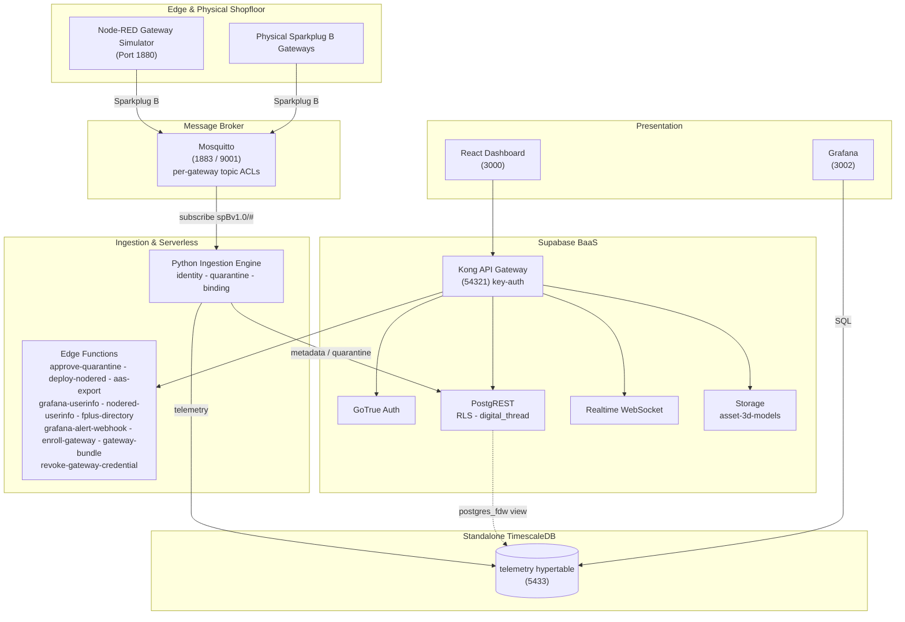

# AMRC Connectivity Stack - Cymru

[](https://github.com/Harri-Llewelyn/acs-cymru/actions/workflows/ci.yml)

An industrial, asset-centric manufacturing management platform aligned with the
**AMRC Connectivity Stack (ACS / Factory+)** framework.

Real-time telemetry streaming, shopfloor cell mapping, zero-touch edge device onboarding,
row-level security, continuous Digital Thread audit logging, AAS V3 export, and edge flow
management.

> **Design ethos —** *use pre-existing components and standards; minimise custom code.*
> Where upstream ACS ships bespoke microservices, this fork uses Supabase, TimescaleDB, Grafana and
> Node-RED. The custom surface is one Python ingestion daemon, ten edge functions, an i3X server and
> a React dashboard.

---

## Architecture

**Supabase** is authoritative for asset metadata (`cells`, `gateways`, `devices`), auth, RLS, audit
triggers and edge functions. **Standalone TimescaleDB** holds the `telemetry` hypertable, reached
from Supabase through a `postgres_fdw` view. A **Python daemon** consumes Sparkplug B MQTT, gates
unregistered devices into quarantine, and routes metadata and telemetry to their respective stores.
A **React 18 SPA** queries PostgREST directly and subscribes to a Realtime change feed.

Derived state is computed at read time rather than stored: gateway staleness is a **view**, not a
cron writer, and AAS is an **adapter on the way out**, not an adopted metamodel.



**Data flow.** Devices publish `DBIRTH`/`DDATA` to Mosquitto, confined by ACL to their own edge-node
subtree → ingestion resolves topic to `sparkplug_id`, verifies the device is **bound to the
publishing gateway**, and quarantines anything unknown or contradictory → valid telemetry lands in
the hypertable → Postgres triggers log every metadata change to the append-only `digital_thread` →
the dashboard reads PostgREST and subscribes to Realtime.

---

## Deployment targets

**Kubernetes (k3s) is the primary target; Docker Compose is the local development path.** Both are
maintained, both are exercised in CI, neither is deprecated.

| | Docker Compose | Kubernetes (Helm) |
| :--- | :--- | :--- |
| Purpose | Local development, debugging | Deployment |
| Entry point | `docker compose up -d` | `helm install` — [`deploy/k8s/README.md`](deploy/k8s/README.md) |
| Reachability | Published ports on `localhost` | `*.<publicBaseDomain>` via one Ingress |
| TLS | none | cert-manager, internal CA ([`deploy/k8s/internal-ca.yaml`](deploy/k8s/internal-ca.yaml)) |
| MQTT | 1883 plaintext + 9001 WebSockets | the same, plus optional MQTTS on 8883 |
| Conformance | `ingestion/validate.py` from the host | the same suite, as an in-cluster Job |

Container images, SQL migrations and init scripts are **shared substrate** — only the *wiring* is
expressed twice. Intentional differences are enumerated in the divergence table in the Kubernetes
runbook; anything not in that table is drift. Design rationale is in
[`docs/kubernetes-architecture.md`](docs/kubernetes-architecture.md).

---

## Quick start — Docker Compose

```bash
npm run setup                   # writes .env with 24 freshly generated credentials
docker compose up --build -d    # launches the whole stack
```

Every file in `supabase/migrations/` is applied by `supabase-db-init` on startup and re-applied
harmlessly on every later start: the schema baseline (`0001`), seed data (`0002`), then `0003` audit
immutability, `0004`, `0005`, `0006` Node-RED SSO, `0007` metric-name format, `0008` Sparkplug
group, `0009` withdraws residual `anon` function grants, `0010` telemetry rollups and latest-value
view, `0011` IDTA Digital Nameplate and per-device nameplate data, `0012` permitted values of a
discrete metric, `0013` ASHRAE 223P vocabulary, `0014` repoints locally-minted semantic
identifiers onto the `acs-cymru.local` namespace, `0015` moves the default Sparkplug group to
`ACS-Cymru`, `0016` drops the dashboard's own service-directory entry and renames the Node-RED
one to say it is the simulator, `0018` pre-registers the demonstrator's metric set with each
row's standard and published semantic id, `0019` adds the 223P supply-air-flow metric the
shopfloor simulator needed, `0020` retires the introductory single-device simulator and moves its
schema and IDTA nameplate onto `Sim_CNC_Mill_01`, `0021` gives each shopfloor cell an icon from a
closed set, `0022` adds one schema per machine class and attaches it to every simulated device,
`0023` adds the `platform_alerts` occurrence log Grafana alerting writes into and publishes it for
Realtime, `0024` adds an optional free-text `description` to devices and gateways, `0025` adds
physical-gateway enrolment — a `gateway_enrollment_tokens` table reachable only by `service_role`,
the RPCs that issue and atomically redeem a single-use token, and the `PENDING_ENROLLMENT` /
`AWAITING_BIRTH` lifecycle states — `0026` stamps every audit row with the transaction that wrote
it (`digital_thread.causation_id`, from `txid_current()`) so the several rows one operator action
produces can be read back as one act, and adds `record_ingestion_rejection()` — the narrow
SECURITY DEFINER gate through which the ingestion daemon records a payload it judged
non-conforming, replacing `service_role`'s direct INSERT on the audit table — and `0027` maps the
historian's storage footprint over `postgres_fdw` and unions it with Supabase's own table sizes as
`public.storage_footprint`, read by Grafana's `supabase` datasource — `0028` generalises the alert
table from `device_alerts` to `platform_alerts`, whose subject is `(entity_type, entity_id)` rather
than a device, because the platform alert rules cover a gateway and the fleet and neither
fits a row that must name a machine — `0029` adds `public.platform_health`, the narrow view
those rules evaluate so the Grafana reader never needs the asset inventory — and `0030` gives that
alert table a **7-day retention window**, pruned nightly by `pg_cron`, whose predicate ages out
closed and superseded occurrences but never the newest firing row of a fingerprint — and `0031`
adds `public.system_settings`, the runtime configuration plane an `Administrator` edits from the
dashboard instead of a host `.env`, whose **key set is closed**: RLS grants UPDATE and nothing
else, so a new setting arrives by migration beside the code that reads it — and `0032` gives that
table **numeric bounds** and moves the alert retention window into it as `alerts.retention_days`,
replacing `prune_platform_alerts()` with a version that reads the setting, so the answer to "how
long do we keep alerts" is on a page rather than in a migration — and `0033` adds
`relocate_devices()`, which applies a whole shopfloor rearrangement in **one transaction** so the
six machines an operator files in one gesture carry one `causation_id` instead of six, and so a
batch that fails partway leaves nothing behind — and `0034` seeds the **read-only principal the MCP
client authenticates as**, holding `Operator` so it reads the i3X address space, writes nothing and
cannot see the audit trail (`scripts/mint-mcp-token.mjs` signs its long-lived token) — and `0035`
gives `gateways` the columns an appliance **reports about itself** on the heartbeat it already
publishes, chiefly `cert_expires_at`: the internal CA is hand-distributed into every appliance's
trust store, so re-minting it takes the whole fleet offline at once with no other signal — and
`0036` adds `public.gateway_health`, the **third** narrow view the Grafana reader may select,
after `0027`'s and `0029`'s: it backs the gateway dashboard and the certificate alert while
leaving the asset inventory `0029` deliberately withheld exactly where it is — and `0038` makes
**archiving or deleting a gateway revoke its broker credential**, by rotating the account to a
password nobody records: the credential service is add-only by design, so a delete verb there
would turn "can mint one confined account" into "can stop the whole fleet publishing" — and `0037`
makes **archiving a gateway withdraw its outstanding enrolment bundle**, and enrolment refuse
an archived gateway at all: a bundle downloaded and never instantiated was still redeemable
after the gateway was archived, which issued a real broker credential and resurrected the row
to `ONLINE` — and `0039` adds `digital_thread_page()`, which applies the **deleted-asset
filter as a predicate rather than in the browser**, so the page's row budget is spent on rows
it will actually show: hiding them afterwards had the page list four assets on a stack of
twenty-six, and render an empty Gateways section on a fleet of four healthy gateways — plus
demo accounts (`supabase/seed.sql`).

> **There is no `0017`.** It was drafted as an audit-trigger change guard and then not written,
> because `0005` already implements one; a second declaration of `log_digital_thread_event()`
> would win by filename order on every boot and would have regressed the `actor_source`
> attribution `0005` adds. The gap in the numbering is deliberate and the reasoning is in
> [`supabase/README.md`](supabase/README.md#audit-signal-and-attribution-0005).
>
> `0026` is that later declaration, written deliberately and on those terms: it reproduces `0005`'s
> body **in full** and adds two lines, rather than patching it. Its self-check asserts that both the
> heartbeat suppression guard and the causation stamp are present in the live definition, because
> `check-docs-drift.mjs` can verify a redeclaration was *intended* and cannot verify it was
> *complete*.

| Interface | URL |
| :--- | :--- |
| React Dashboard | http://localhost:3000 |
| Supabase Studio | http://127.0.0.1:54323 |
| Swagger UI | http://localhost:8088 |
| Node-RED | http://localhost:1880 |
| Grafana | http://localhost:3002 |
| Prometheus | http://localhost:9090 (loopback only — SSH-tunnel from another host) |

**Sign in to the React dashboard first.** Node-RED and Grafana both federate to Supabase Auth, and
the consent step needs your dashboard session — going straight to either shows a "sign in required"
prompt rather than a login form. In Node-RED, click **Sign in with ACS-Cymru**; Administrator and
Shopfloor_Manager can deploy, Operator and Auditor get a read-only editor.

**Demo accounts** — seeded by [`supabase/seed.sql`](supabase/seed.sql), password `acscymru123`:

| Email | Role | Access |
| :--- | :--- | :--- |
| `admin@acs-cymru.local` | `Administrator` | Full CRUD |
| `manager@acs-cymru.local` | `Shopfloor_Manager` | Full CRUD |
| `operator@acs-cymru.local` | `Operator` | Read-only + telemetry |
| `auditor@acs-cymru.local` | `Auditor` | Digital Thread read-only |

Self-registered accounts get read-only `Operator` via the `handle_new_user` trigger; an
`Administrator` must promote them.

> **`.env.example` contains working development secrets** — the standard Supabase demo values, also
> registered as Kong API keys. **Generate fresh secrets for any shared or hosted environment.**

Teardown: `docker compose down -v` (also drops volumes, invalidating every logged-in browser).

### Windows: `bind: An attempt was made to access a socket in a way forbidden by its access permissions`

```
Error response from daemon: ports are not available: exposing port TCP 0.0.0.0:54322 -> 127.0.0.1:0:
listen tcp 0.0.0.0:54322: bind: An attempt was made to access a socket in a way forbidden by its
access permissions.
```

**Nothing is wrong with the stack.** Hyper-V/WSL2 reserves blocks of high ports for NAT on boot,
and those blocks routinely swallow the `543xx` range this stack publishes Supabase on. The port is
not in use by another process — Windows has withdrawn it.

**Docker names only the first port it fails on, and that is the misleading part.** Three ports are
in that range, and the one that matters is not the one in the message:

| Port | Service | Consequence if lost |
| :--- | :--- | :--- |
| `54321` | Kong | **the browser has no API** — the dashboard loads and every request fails |
| `54322` | supabase-db | no `psql` from the host; the stack itself is unaffected |
| `54323` | Supabase Studio | Studio unreachable |

So fixing the port in the error changes nothing: `supabase-db` fails, every service that depends on
it never starts, and what you see is a dashboard that loads and then reports **`Failed to fetch`**.
`docker compose ps` shows the shape of it — `frontend`, `swagger-ui` and `timescaledb` up, because
they are the only three that do not depend on `supabase-db`.

Confirm it is this and not a real conflict:

```powershell
netsh interface ipv4 show excludedportrange protocol=tcp
```

A range covering `54321`–`54323` and **no `*`** beside it is a dynamic Hyper-V reservation. (`*`
marks an administered exclusion — one somebody added deliberately.)

**The fix**, in an **Administrator** PowerShell:

```powershell
net stop winnat
netsh int ipv4 add excludedportrange protocol=tcp startport=54320 numberofports=8 store=persistent
net start winnat
```

Then `docker compose up -d`.

The middle line is the part that lasts. It claims `54320`–`54327` as an *administered* exclusion,
so WinNAT cannot take the range again — `store=persistent` carries that across reboots. Restarting
`winnat` on its own releases the current reservation but simply re-rolls it, so the same failure
returns on the next boot or Docker Desktop restart.

**If you cannot get an Administrator prompt**, the ports are configurable — `KONG_HTTP_PORT`,
`SUPABASE_DB_PORT` and `STUDIO_PORT` in `.env`. Moving Kong is not a one-line change, though:
`SUPABASE_URL`, `AAS_MODEL_PUBLIC_BASE` and `AAS_HISTORIAN_ENDPOINT` all carry the port, the
Node-RED and Grafana OAuth URLs are derived from `SUPABASE_URL`, and `VITE_SUPABASE_URL` is a
**build arg** — so the frontend needs `--build`, not just a restart. Change `.env` only and leave
`.env.example` alone, or the divergence follows you into every other environment.

### Resetting to a clean slate

```bash
npm run stack:reset -- --yes
```

Tears the stack down **with its volumes**, brings it back, waits for the schema to exist rather
than for ports to answer, and re-provisions the four cell gateways — printing their credentials
and writing them to `.env.gateways`, because `mosquitto_passwd` stores only a hash and they cannot
be read back afterwards.

**`--yes` is required and there is no interactive prompt.** A prompt is something people learn to
dismiss without reading, and this is most dangerous once it is familiar. It also refuses outright
when `NODE_ENV=production`, and when `COMPOSE_PROJECT_NAME` names a stack this repository does not
own — so a shell in the wrong directory cannot take down someone else's.

The one thing it exists for that nothing else can do: **`digital_thread` is append-only to every
application role**, so dropping the volume is the only way back to an empty audit trail.

---

## Quick start — Kubernetes

Full runbook in [`deploy/k8s/README.md`](deploy/k8s/README.md). The short version:

```bash
# Five images are built from this repository and are on no registry.
docker build -f supabase/functions/Dockerfile -t acs-cymru/edge-runtime:0.1.0 .   # context: repo root
docker build -f Dockerfile                    -t acs-cymru/ingestion:0.1.0 .      # context: repo root
docker build -f node-red/Dockerfile           -t acs-cymru/node-red:0.1.0 node-red
docker build -f frontend/Dockerfile --build-arg VITE_RUNTIME_CONFIG=true \
                                              -t acs-cymru/frontend:0.1.0 frontend
docker build -f tests/Dockerfile              -t acs-cymru/test-runner:0.1.0 .    # conformance suites

node scripts/sync-helm-chart-files.mjs        # mirror repo config into the chart

kubectl create namespace acs-cymru
helm install acs-cymru deploy/helm/acs-cymru -n acs-cymru \
  -f deploy/helm/acs-cymru/values-dev.yaml --timeout 15m

# NOT `--wait` — it deadlocks the first install. See deploy/k8s/README.md.
for w in $(kubectl -n acs-cymru get statefulset,deploy -o name); do
  kubectl -n acs-cymru rollout status "$w" --timeout=10m
done

helm test acs-cymru -n acs-cymru          # the postgres_fdw gate
```

Serves seven subdomains on one Ingress (`app.`, `api.`, `nodered.`, `grafana.`, `studio.`, `docs.`,
`mqtt.`) plus a LoadBalancer for **raw MQTT on 1883**, which is TCP and cannot ride an HTTP Ingress.

- **`values-dev.yaml` carries the published demo credentials from `.env.example`, and they are in
  git.** For anything another person can reach, start from `values-prod.yaml.example` and point
  `secrets.existingSecret` at an externally managed Secret.
- **The chart validates its own values and fails the render, not the pod** — a partial credential
  set, a wrong-length Realtime key, a renamed Realtime Service, TLS with `scheme: http`, or an HPA
  on a single-writer workload each otherwise produce a stack that reports healthy and refuses every
  request.

---

## Repository map

| Directory | Covers |
| :--- | :--- |
| **[`frontend/`](frontend/README.md)** | React 18 architecture, Vite, Realtime integration, derived state, theming |
| **[`supabase/`](supabase/README.md)** | Migrations, RLS privilege matrix, triggers, audit immutability, edge functions, Kong |
| **[`ingestion/`](ingestion/README.md)** | Sparkplug B parsing, identity resolution, gateway binding, TimescaleDB mapping, `validate.py` |
| **[`simulators/`](simulators/README.md)** | Node-RED setup, flow provisioning, broker topics, onboarding walkthrough |
| **[`i3x/`](i3x/README.md)** | i3X 1.0 server: address-space mapping, subscriptions, connecting a client — including [an MCP host](i3x/README.md#mcp) |
| **[`deploy/k8s/README.md`](deploy/k8s/README.md)** | Kubernetes runbook: install, upgrade, teardown, hardening, divergence table, releases |
| [`deploy/helm/acs-cymru/`](deploy/helm/acs-cymru) | The Helm chart; `values.yaml` documents every setting |
| [`docs/kubernetes-architecture.md`](docs/kubernetes-architecture.md) | Why the Kubernetes target is built the way it is. Source comments cite it by section |
| [`docs/incidents.md`](docs/incidents.md) | Faults whose FIX LOOKS ARBITRARY without the story. Read before "tidying" a guard that seems redundant |
| [`docs/upgrades.md`](docs/upgrades.md) | What survives an upgrade and why nothing needs reconfiguring — plus the three places that is not the whole truth |
| [`docs/openapi.yaml`](docs/openapi.yaml) · [`docs/i3x-openapi.yaml`](docs/i3x-openapi.yaml) | REST and i3X specifications, rendered by Swagger UI |
| [`supabase/migrations/archive/`](supabase/migrations/archive) | The 38 pre-beta migrations, preserved for their reasoning. Never executed |
| [`grafana/`](grafana) · [`timescaledb/`](timescaledb) | Provisioning; hypertable schema, retention and rollup reconciliation, the read-only BI role |
| [`scripts/`](scripts) | Setup, seeding, vocabulary generation, chart-file sync, drift guards, database backup/restore, gateway provisioning, stack reset, AAS push |
| [`tests/`](tests) | Vendored IDTA AAS schema, conformance test-runner image |

---

## Service port directory

| Service | Container | Image | Port |
| :--- | :--- | :--- | :--- |
| `supabase-db` | `acs-cymru_supabase_db` | `supabase/postgres:17.6.1.160` | `54322:5432` |
| `supabase-db-roles-init` | `acs-cymru_supabase_db_roles_init` | `supabase/postgres:17.6.1.160` | — |
| `supabase-db-init` | `acs-cymru_supabase_db_init` | `supabase/postgres:17.6.1.160` | — |
| `supabase-auth` | `acs-cymru_supabase_auth` | `supabase/gotrue:v2.189.0` | — |
| `supabase-rest` | `acs-cymru_supabase_rest` | `postgrest/postgrest:v14.12` | — |
| `supabase-kong-init` | `acs-cymru_supabase_kong_init` | `alpine:3.24` | — |
| `supabase-kong` | `acs-cymru_supabase_kong` | `kong:3.9.3` | `54321:8000` |
| `supabase-functions` | `acs-cymru_supabase_functions` | `supabase/edge-runtime:v1.74.2` | — |
| `supabase-realtime` | `acs-cymru_supabase_realtime` | `supabase/realtime:v2.34.47` | — |
| `supabase-storage` | `acs-cymru_supabase_storage` | `supabase/storage-api:v1.11.13` | — |
| `supabase-storage-init` | `acs-cymru_supabase_storage_init` | `node:24-alpine` | — |
| `supabase-meta` | `acs-cymru_supabase_meta` | `supabase/postgres-meta:v0.96.6` | — |
| `supabase-studio` | `acs-cymru_supabase_studio` | `supabase/studio:2026.07.07-sha-a6a04f2` | `127.0.0.1:54323:3000` (loopback only — see below) |
| `timescaledb` | `acs-cymru_timescaledb` | `timescale/timescaledb:2.29.2-pg17` | `5433:5432` |
| `mosquitto-init` | `acs-cymru_mosquitto_init` | `eclipse-mosquitto:2.0.22` | — |
| `mosquitto` | `acs-cymru_mosquitto` | `eclipse-mosquitto:2.0.22` | `1883`, `9001` |
| `frontend` | `acs-cymru_frontend` | `./frontend/Dockerfile` | `3000:3000` |
| `ingestion` | `acs-cymru_ingestion` | `./Dockerfile` | `9108:9108` |
| `node-red-init` | `acs-cymru_node_red_init` | `./node-red/Dockerfile` | — |
| `node-red` | `acs-cymru_node_red` | `./node-red/Dockerfile` | `1880:1880` |
| `grafana` | `acs-cymru_grafana` | `grafana/grafana:13.2.0` | `3002:3000` |
| `swagger-ui` | `acs-cymru_swagger_ui` | `swaggerapi/swagger-ui:v5.32.14` | `8088:8080` |
| `prometheus` | `acs-cymru_prometheus` | `prom/prometheus:v3.14.0` | `127.0.0.1:9090:9090` |
| `node-exporter` | `acs-cymru_node_exporter` | `prom/node-exporter:v1.12.1` | — |

---

## Security model

Fail-closed throughout: edge functions and RLS policies deny by default, and a missing or
unrecognised role produces `403`.

| Layer | Control |
| :--- | :--- |
| **Broker** | `allow_anonymous false`; [`mosquitto.acl`](mosquitto.acl) confines each gateway to `spBv1.0/+/+/<own-id>/#` |
| **Ingestion** | Gateway↔device binding; quarantine gating; append-only historian writes |
| **Gateway** | Kong `key-auth` on `/rest`, `/realtime`, `/storage`, `/functions` — with **four** documented exemptions ([`supabase/README.md`](supabase/README.md)) |
| **API** | PostgREST JWT verification plus RLS on every table |
| **Database** | `has_role()` reads `user_roles` directly, so revocation is immediate; `digital_thread` is append-only against `service_role` too |
| **Edge functions** | Explicit router allow-list; per-function secret scoping; role resolved from the database, never a stale JWT claim |
| **Edge automation** | Node-RED's editor, admin API and webhook receiver each authenticate separately |
| **Supabase Studio** | **No authentication of its own — reachable only from the host.** Bound to `127.0.0.1` on Compose and off the Ingress by default on Kubernetes |

**Supabase Studio is a database console, not a dashboard with admin features**, and it is the one
component here with no login, no roles and no session. The official Supabase stack fronts it with a
basic-auth pair on Kong; this stack does not run that, so whatever can reach it holds the SQL
editor, the table editor and the Vault UI **as the database owner** — for whom RLS is not enforced.
Every control in the table above is downstream of that.

So it is reachable from the host and nowhere else. `127.0.0.1:54323` on Compose; on Kubernetes
`ingress.routes.studio` defaults to `false`, and reaching it is a port-forward:

```bash
kubectl -n <ns> port-forward svc/<release>-acs-cymru-supabase-studio 54323:3000
```

Turning that route on publishes an unauthenticated database console at `studio.<publicBaseDomain>`
and should be paired with an authenticating proxy in front of it.

Two consequences worth stating on the front page; both are detailed in
[`supabase/README.md`](supabase/README.md):

- **Node-RED is not an open port.** A `function` node runs arbitrary JavaScript in a container
  holding the MQTT credential, so anyone who could replace a flow had remote code execution on the
  edge host. The editor and `/flows` use OAuth2 + PKCE; `POST /hooks/quarantine` takes a 60-second
  per-event signed token, deliberately not the admin credential, because any flow author can read it
  from `msg.req.headers`.
- **The `asset-3d-models` bucket is public-read**, because an exported AAS `File` URL must resolve
  for a viewer holding no session and a signed URL would turn every shell already handed out into a
  time bomb. Anything in it must carry nothing beyond machine geometry. Writes are gated on
  `device:manage`, not merely `authenticated`.

Known issues and accepted risks are tracked as
[GitHub issues](https://github.com/Harri-Llewelyn/ACS-Cymru/issues).

---

## Standards

| Standard | Role |
| :--- | :--- |
| **Sparkplug B** | The wire protocol. Identity is `sparkplug_id`, carried in the topic |
| **MTConnect** (2.x) | Machine-tool vocabulary — 249 data item types, 123 subtypes, 100 units, 126 component types |
| **OPC UA** (40001, 40001-4, 40010, 30050, 40501, 40540) | Companion-specification data points: machinery, energy, robotics, PackML, machine tools, additive. Generated from OPC Foundation NodeSets by [`scripts/generate-opcua-vocabulary.mjs`](scripts/generate-opcua-vocabulary.mjs) |
| **ISO 22400** | Computed KPIs, which MTConnect and OPC UA deliberately exclude |
| **ASHRAE 223P** | Building-system semantics — 640 concepts from the open223 ontology. ⚠ Still in public review |
| **AAS / IEC 63278** | V3 export as JSON or AASX, validated against the official IDTA schema |

These are **four vocabularies, not four alternatives** — a mixed fleet needs all of them, which is
why the schema builder offers a choice rather than a migration path. All are built, as is the IDTA
Digital Nameplate; what each one covers and how its identity was verified is in
[`docs/vocabularies.md`](docs/vocabularies.md), and the checklist for adding another is in
[`supabase/README.md`](supabase/README.md#adding-a-vocabulary).

> Adopting the MTConnect vocabulary is not a compliance claim; that requires the Implementer
> License. Locally-minted semantic ids live under `https://acs-cymru.local/semantics/…` — the
> namespace is the honesty mechanism, and an id under `mtconnect.org` would assert an
> interoperability that does not exist.

---

## Testing

```bash
# Frontend — 1417 tests
cd frontend && npm test

# Python unit suites — no stack required
python ingestion/test_gateway_binding.py
python ingestion/test_gateway_health_metrics.py
python ingestion/test_archived_gateway.py
python ingestion/test_declared_metrics.py
python ingestion/test_modelled_metrics_contract.py
python ingestion/test_device_location.py
python ingestion/test_health_heartbeat.py
python ingestion/test_rbe_telemetry.py
python ingestion/test_mqtt_tls.py
python ingestion/test_audit_write_dedup.py
python ingestion/test_payload_conformance.py
# The Prometheus endpoint and the Sparkplug seq gap counters -- no stack, no broker
python ingestion/test_metrics_endpoint.py
python ingestion/test_entity_cache.py
python ingestion/test_telemetry_batching.py
python i3x/test_i3x_service.py
python supabase/functions/approve-quarantine/test_approve_quarantine.py
python supabase/functions/deploy-nodered/test_deploy_nodered.py
python supabase/functions/nodered-userinfo/test_nodered_userinfo.py
python supabase/functions/aas-export/test_aas_export.py
python supabase/functions/grafana-alert-webhook/test_grafana_alert_webhook.py

# Physical gateway enrolment — signs in as Administrator to mint tokens (issuing is a USER's act,
# gated on has_role, so the service key cannot do it), then redeems them the way an appliance does:
# the anon key and no user JWT. Stops the credential service to exercise the 503 rollback path.
SUPABASE_ANON_KEY=... SUPABASE_SERVICE_ROLE_KEY=... \
  python supabase/functions/enroll-gateway/test_enroll_gateway.py

# The downloadable bundle — role gating (Operator and Auditor get 403 and no token is minted), ZIP
# integrity, and that the embedded token is the one the database will accept.
SUPABASE_ANON_KEY=... SUPABASE_SERVICE_ROLE_KEY=... \
  python supabase/functions/gateway-bundle/test_gateway_bundle.py

# Broker credential issuance — needs the stack up and the service's own bearer token
MQTT_CREDENTIAL_SERVICE_TOKEN=... python gateway-credential/test_gateway_credential.py

# The credential merge, in isolation — the one piece of it whose failure is silent
npm run test:lib

# Configuration drift — no services needed, and the ONE check here that reads your own .env.
# Compares docker-compose.yml against .env.example (enforced in CI) and, when a .env exists,
# your working file against the template in BOTH directions: keys the template gained and you
# never copied, keys retired from the template still sitting in your file, and keys Compose
# reads that the template forgot. All three fail silently otherwise -- Compose substitutes its
# own default and the stack comes up looking correct on a value nobody chose.
node scripts/check-env-drift.mjs

# Database suites — need Postgres
python supabase/migrations/test_user_roles_rls.py
python supabase/migrations/test_schema_versioning.py
python supabase/migrations/test_digital_thread_guard.py
python supabase/migrations/test_ingestion_rejection_rpc.py
python supabase/migrations/test_platform_alerts_retention.py
python supabase/migrations/test_system_settings_rls.py
python supabase/migrations/test_relocate_devices.py
python supabase/migrations/test_metric_catalog_seed.py
python supabase/migrations/test_gateway_enrollment.py
# Needs the TimescaleDB historian (port 5433), not Supabase — the rollups live there
python timescaledb/test_bi_reader_grants.py

# End-to-end — needs the running stack
set -a && . ./.env && set +a && unset MQTT_HOST DB_HOST DB_PORT
export MQTT_USER="$MQTT_VALIDATOR_USER" MQTT_PASSWORD="$MQTT_VALIDATOR_PASSWORD"
python ingestion/validate.py
```

Three suites have a second half elsewhere, and both halves must move together:
`test_modelled_metrics_contract.py` and `test_rbe_telemetry.py` each pair with a JavaScript suite in
the frontend run, and `test_i3x_service.py` covers the sync-acknowledgement and queue-overflow MUSTs
the CESMII conformance suite skips. See [`ingestion/README.md`](ingestion/README.md#testing) and
[`i3x/README.md`](i3x/README.md).

CI ([`.github/workflows/ci.yml`](.github/workflows/ci.yml)) runs five jobs:

| Job | Covers |
| :--- | :--- |
| **frontend-build** | Vitest, the mirrored-logic drift guards, production bundle |
| **helm-chart** | `helm lint`, render, API-schema validation, chart guard rails |
| **edge-function-auth-test** | Auth ladders and RLS against a real Postgres |
| **e2e-validation** | Full Docker Compose stack, `validate.py`, live AAS export |
| **k8s-validation** | k3d cluster, `helm test`, the same suites in-cluster, ingress assertions |

**The last two are the real drift control between deployment targets.** `validate.py` is
topology-agnostic and runs against both; if both pass, the wiring agrees where it matters.

### Keeping the pinned versions current

Two scheduled workflows, and they answer different questions. Neither runs on a pull request:
version drift and published advisories move on the world's schedule, not on this repository's.

| Workflow | Job | Asks |
| :--- | :--- | :--- |
| [`renovate.yml`](.github/workflows/renovate.yml) | **renovate** | *Is there a newer version?* — routine PRs monthly, security PRs immediately |
| [`image-scan.yml`](.github/workflows/image-scan.yml) | **scan** | *Does what we run have a known, **fixed** vulnerability?* — monthly |

**The dependency dashboard is the deliverable**, more than the pull requests are: one issue listing
every available update, including the ones deliberately held back.

**Routine updates open on the first of the month**, because a weekly batch of pull requests is a
standing tax on whoever reads them and the drift being defended against moves over months. **The
`renovate.yml` cron is daily anyway, and that is not a contradiction**: Renovate can only act while
it is running, so a monthly cron would silently make the security carve-out monthly too. Daily
invocation against a monthly window is what keeps `vulnerabilityAlerts` meaning what it says —
routine noise once a month, an advisory picked up within a day.

The CVE scan is monthly with no such carve-out, which is a weaker guarantee and deliberately so: a
CVE published inside a third-party image on the 2nd is not noticed until the 1st. `workflow_dispatch`
is the answer when something specific needs checking sooner.

**[`renovate.json`](renovate.json) exists mostly to stop good automation doing the wrong thing
here.** The Supabase components are a coordinated set that upstream tests together — measured
against Docker Hub, `gotrue` and `postgres-meta` look outdated when they are in fact the exact
versions upstream pins, so an "upgrade" would move this stack *off* the tested combination. They
are grouped into one pull request held for approval, as are all major bumps. Kong 3.0 is why:
it silently switched off every per-service Prometheus metric while leaving the scrape target green.

**Renovate is self-hosted because this repository is private**, and needs a `RENOVATE_TOKEN` secret
(a PAT with `repo`, or fine-grained with Contents, Pull requests and Issues read/write). Without it
the workflow fails on its first step by design — a scheduled job that silently does nothing leaves
the repository looking as though drift is watched when it is not. `GITHUB_TOKEN` cannot be used:
pull requests it opens trigger no workflow runs, so every bump would arrive with no CI result.

**The scan reports only *fixable* HIGH and CRITICAL findings.** An unfixed CVE in a base image is
not something this repository can act on, and failing on it would train everyone to ignore the job.
Its image list is parsed out of `docker-compose.yml` rather than written in the workflow, and it
refuses to run if it finds fewer than ten — "found nothing to scan" must not look like "found
nothing wrong".

### Releases

[`.github/workflows/release.yml`](.github/workflows/release.yml) runs on a **`v*` tag only** — never
on a branch:

| Job | Covers |
| :--- | :--- |
| **prepare-release** | Derives the version from the tag, refuses a non-SemVer one, re-runs the static checks a published artefact must not violate |
| **build-images** | The three independent images, in parallel, pushed to GHCR |
| **build-ingestion-chain** | `ingestion`, then `test-runner` **on the same runner** — the latter is built `FROM` the former, so the base must be in the local image store |
| **publish-chart** | Lint, render, package at the tag's version, push over OCI, pull it back |

The tag is the single place the version is written — it stamps the five image tags, the chart
`version` and `appVersion` in one run. **Images publish before the chart**, because a chart naming
images that do not exist yet does not fail: `helm install` succeeds and six workloads sit in
`ImagePullBackOff` while everything else comes up healthy. Installation, the one-time GHCR
visibility step, and what a release deliberately does *not* do (no `latest`, no arm64, no signing)
are in [`deploy/k8s/README.md`](deploy/k8s/README.md#publishing-a-release).

---

## Expected behaviour (not defects)

- **`docker compose down -v` invalidates every logged-in browser.** It drops `supabase_db_data`, and
  with it `auth.sessions`. The dashboard clears the stale tokens and returns to the login screen.
- **Swagger UI's "Example Value" is documentation, not data.** Press **Execute** and read the
  **Response body** panel.
- **An unrecognised device appears in the quarantine queue, not on the shopfloor map.** That is the
  zero-touch onboarding path working: a device that announces itself under an id nobody registered
  is held and its telemetry dropped until an `Administrator` approves it. The demonstrator's own
  `Sim_` devices are pre-registered and so bypass it — publish under any other well-formed
  `dev`-prefixed id to see it.

---

## Roadmap & Future Extensions

Sixteen extensions, none of them speculative: every one names the code it would build on, because
the value of writing them down is that a reader can tell how far away each is — and several turned
out to be much closer than the request for them assumed, which is stated here rather than left to be
discovered later.

**Items 1-6 are this repository's own**, ordered by how much of each already exists. **Items 7-14
arrive from feature requests** — 7-12 from GitHub issues
[#67](https://github.com/Harri-Llewelyn/ACS-Cymru/issues/67),
[#64](https://github.com/Harri-Llewelyn/ACS-Cymru/issues/64),
[#65](https://github.com/Harri-Llewelyn/ACS-Cymru/issues/65),
[#63](https://github.com/Harri-Llewelyn/ACS-Cymru/issues/63),
[#66](https://github.com/Harri-Llewelyn/ACS-Cymru/issues/66) and
[#58](https://github.com/Harri-Llewelyn/ACS-Cymru/issues/58), in that same order of how much already
exists; 13-16 are not yet filed. Where an entry's heading differs from the issue's title, it is
because the work that remains is narrower than the title claims.

**None of these are open defects.** Feature requests live here once they have been checked against
the code; known issues and accepted risks stay in
[GitHub issues](https://github.com/Harri-Llewelyn/ACS-Cymru/issues).

### 1 · Horizontal ingestion scaling

**Builds on:** the single-writer note in `get_timescaledb_connection()` ·
`acs_ingestion_write_seconds` · `_alias_map` / `_last_seq`

#### The ceiling has now been measured, and it is not close

This item used to open by quoting the ceiling out of a docstring — *"one connection, not a pool.
Every write happens on the paho callback thread, so there is exactly one writer"* — which is an
assertion, not a measurement. `acs_ingestion_write_seconds` now ships, so there is a number:

| | |
|---|---|
| mean write | **≈ 4.1 ms** (0.0744 s over 18 writes) |
| p90 | **12.6 ms**, via `histogram_quantile` |
| implied single-thread ceiling | **≈ 240 msg/s**, and this is an *upper* bound |
| current fleet rate | **≈ 0.95 msg/s** |

An upper bound because the histogram starts when the write path is entered: device resolution and
protobuf decode occupy the same thread beforehand and are outside it. Even so, the headroom is
**two orders of magnitude**. This item is real but it is not urgent, and that is now a
measurement rather than an opinion — which is the whole reason the instrument was fitted before
anything moved rather than after.

#### `$share` does not do what this entry used to claim

The previous text called an MQTT 5 shared subscription "the honest path" and said the daemon was
"already shaped for it", needing only per-worker connection ownership and a rebirth path. **Tested
against the live broker, that is wrong.** Two subscribers in one share group, 20 seconds of fleet
traffic:

```
worker A: 11 msgs    worker B: 11 msgs
seen by BOTH: DDATA/gwy12…/dev22…  DDATA/gwy12…/dev23…
              DDATA/gwy12…/dev27…  DDATA/gwy13…/dev24…
only A: NDATA/gwy13…, NDATA/gwy15…
only B: NDATA/gwy12…, NDATA/gwy14…, DDATA/gwy15…/dev26…
```

Round-robin **per message, with no edge-node affinity** — and Sparkplug state is per edge node.
Two in-memory tables are keyed `(group_id, edge_node_id)`:

- **`_alias_map`.** A birth certificate is *one message*, so it reaches *one worker*. Above,
  `gwy12…`'s NDATA went only to B while its devices' DDATA went to both — so worker A would resolve
  alias-only metrics against an empty table. The failure mode is already documented at the
  declaration: *"ingests nothing at all from an alias-optimised gateway, and reports no error while
  doing it."*
- **`_last_seq`.** Each worker sees a fraction of the sequence numbers, so gap detection fires
  permanently. `request_node_rebirth()` does not rescue it: the rebirth is also one message, and
  lands on one worker.

So the blocker is **the data path, not the rebirth path**. What would actually be required is
either shared state for those two tables — a round trip on the hottest path, which is what this item
exists to make faster — or partitioning the topic space by edge node, which is not what `$share`
does and fights dynamic enrolment, since gateways arrive with single-use tokens and a static
partition cannot know them.

**One prerequisite that turned out not to exist:** the daemon speaks MQTT 3.1.1 (`mqtt.Client()`
with paho 1.6.1's v1 callbacks), and `$share` is an MQTT 5 feature — but Mosquitto 2.0.22 honours
shared subscriptions for 3.1.1 clients regardless, verified above. **No protocol upgrade and no
callback migration is needed.** That was expected to be the hard part and it is not the problem.

---

### 2 · Ingress → Gateway API

**Builds on:** [`templates/ingress.yaml`](deploy/helm/acs-cymru/templates/ingress.yaml) ·
`acs-cymru.corsOrigins`

**This item used to open by blaming Kong 2.8, and that reason is gone**: the gateway is on
`kong:3.9.3`, which interpolates `${{env.VAR}}` in declarative config. The two substituters stayed
anyway, and deliberately — interpolation would move the service-role key into Kong's environment,
whereas Compose writes it to an internal volume and Helm renders it into a Secret that never
appears in a rendered manifest. So `kong.yml` is still a placeholder template substituted twice,
but now because that is the narrower exposure rather than because Kong cannot do otherwise.

**What remains is the CORS half, and it is the half that was always the real argument.** Gateway
API's `HTTPRoute` filters express **route-level CORS declaratively**, which would retire the
`__CORS_ORIGINS__` placeholder specifically. That matters because the origin list is the stack's
*only* statement of origin policy — the edge functions deliberately declare none — so it is load
bearing on its own, with no second layer to fall back on. It has already failed once in exactly the
way a single unenforced statement fails: four literal localhost origins that were correct on
Compose and silently wrong on Kubernetes, presenting as a dashboard that logged in and then showed
empty tables while the gateway reported 200 for every request.

**Kubernetes-only, and worth saying so.** `HTTPRoute` does nothing for the Compose target, which
keeps `kong.yml` and its `sed` either way — so this retires one placeholder on one target rather
than the templating approach as a whole.

---

### 3 · Cold Telemetry Archival & Query-in-Place

**Builds on:** TimescaleDB retention policies · `telemetry` hypertable · Edge Functions · Apache
Parquet · `public.system_settings` (`0031`, `0032`)

**Its configuration has somewhere to live, and the split is already decided.** The settings plane
shipped, so the S3 **endpoint**, bucket and tiering threshold are declared here by this item's own
migration, beside the code that reads them — that is what the closed key set means. The S3
**credential** is not: every authenticated user can read `system_settings`, so it goes in Supabase
Vault and is managed through **Supabase Studio**, which already ships that UI on both deployment
targets. No secrets interface is to be built for it. See
[`supabase/README.md`](supabase/README.md#runtime-configuration-system_settings), including the note
that Studio sits on a different trust boundary from an `Administrator` in the dashboard.

Tiering high-volume time-series telemetry out of the operational database into vendor-neutral
Apache Parquet files on S3-compatible or Azure Blob storage once the hot hypertable retention
window expires (e.g., >90 days).

**Preserves long-horizon traceability without re-bloating the operational database.** A scheduled
maintenance task exports date-partitioned chunks to compressed `.parquet` files, verifies storage,
records a manifest row in `telemetry_archive_manifest`, and safely drops the raw chunk. The React
Archives view renders the catalog and allows operators to query historical months in place via
short-lived presigned URLs and DuckDB—rendering historical charts on demand without rehydrating
gigabytes of raw points back into TimescaleDB.

---

### 4 · Kong → Envoy, following upstream Supabase

**Builds on:** [`supabase/kong.yml`](supabase/kong.yml) · `supabase-kong-init` ·
[`templates/supabase/kong.yaml`](deploy/helm/acs-cymru/templates/supabase/kong.yaml)

**Upstream Supabase has dropped Kong.** Their self-hosted `docker-compose.yml` now fronts the stack
with `envoyproxy/envoy`, so this fork's gateway is on a path upstream no longer maintains
configuration for. Nothing is broken by that today — the gateway is on `kong:3.9.3` and does exactly
four things — but every future Supabase change to routing, key handling or CORS will be expressed in
Envoy config that has to be translated rather than copied.

**What actually has to move** is small, and worth writing down because it is smaller than "replace
the API gateway" sounds. `kong.yml` declares nine services, the `key-auth` plugin on four of them,
four deliberate exemptions, one global CORS policy and one Prometheus plugin. That is the whole
surface. Envoy expresses all of it, but none of it the same way: `key-auth` has no direct
equivalent, and the closest arrangement is a Lua or ext_authz filter — which turns a declarative
plugin into code the stack would then own.

**The exemptions are the part to be careful with**, and they are the reason this is not a mechanical
translation. Four routes are open by design — `/auth/v1/`, the two userinfo endpoints,
`/storage/v1/object/public/`, and the Factory+ Directory's `/ping` and `/v1/`. Each is open for a
stated reason and each is load bearing; a translation that quietly widened one would not fail any
test that exists today, because `validate.py` asserts the 401s that SHOULD happen and cannot assert
the absence of a route nobody wrote. Any migration needs the negative assertions first.

**It interacts with §2 and should be sequenced against it.** Gateway API's `HTTPRoute` would retire
the `__CORS_ORIGINS__` placeholder on Kubernetes; Envoy would restate CORS in its own filter on both
targets. Doing both independently means expressing origin policy a third way before deleting the
first — so whichever lands first should decide where that policy lives.

**Not urgent, and deliberately not bundled with the 2.8 → 3.9.3 bump** that closed the unmaintained-
image question. This is a divergence-from-upstream question, not a security one.

---

### 5 · Supabase's legacy API keys

**Builds on:** [`scripts/setup.mjs`](scripts/setup.mjs) · `kong.yml`'s `key-auth` consumers ·
`custom_access_token_hook` (`0001`) · the edge-function registry

The `anon` and `service_role` JWTs this stack mints in `setup.mjs` are the key format Supabase has
since superseded with **publishable and secret keys**. This is a real upstream deprecation with a
real end date, and it is the only item on this list whose timing is set by somebody else.

**It was split out of the configuration audit deliberately.** It arrived there as a bullet under a
cleanup entry, and it is not a cleanup — it is a migration through the authentication path, which is
the wrong thing to leave filed under "tidying" where its deadline is invisible. Nothing about it is
started.

**The surface is wider than "rotate two keys".** `SUPABASE_ANON_KEY` alone is consumed by twelve
files — Kong's `key-auth`, the Grafana alert contact point, the frontend bundle, the i3X service and
both e2e Jobs — and the two keys are structurally different things rather than two of the same
thing:

- **`anon` is public by construction.** It is the `anon` role, readable in any built bundle, which
  is why the chart renders it outside a Secret deliberately. Replacing it is a change to what Kong
  accepts as a registered key, not a secret rotation.
- **`service_role` is not.** It is held by the ingestion daemon and every edge function, and
  `0026`'s whole premise is that a holder of it must not be able to forge an audit row. Anything
  that changes how it is minted has to leave that property intact.
- **`custom_access_token_hook` shapes the claims** the rest of the stack reads. PostgREST resolves
  RLS from them, and `grafana-userinfo` maps a role out of `public.user_roles` beside them.

**Scope it against the pinned versions before planning it, not against the current documentation.**
This stack runs specific `supabase/gotrue` and `kong` tags; whether the new format is supported, and
what it changes about `key-auth` consumer registration, is a question about those tags. The upstream
guidance describes a hosted platform whose components move independently of a self-hosted compose
file — the same reasoning that makes "latest on Docker Hub" the wrong upgrade yardstick for this
repository.

**The migration has no rehearsal path today**, which is the first thing to build: there is no way to
run the stack with both key formats accepted and confirm every consumer still works before the old
ones are withdrawn. Without it this is a flag day across twelve files, an ingestion daemon and nine
edge functions.

### 6 · `documents` → `links`, in the schema

**Builds on:** `public.documents` (`0001`) · its four RLS policies and `idx_documents_entity` ·
`/api/v1/documents` in [`frontend/src/api.js`](frontend/src/api.js) · the `document:manage`
permission row (`0002`)

**The UI has already made this move; the storage has not.** Issue #62 generalised the feature from
document links to links of any kind — an asset register in EZOfficeInventory, a file repository
where measurement data belongs, anything with a URL — and the user-facing vocabulary was renamed to
match. The table underneath is still called `documents`, its tag column is still `document_tag`, the
endpoint is still `/api/v1/documents`, and the permission is still `document:manage`.

**Nothing about the model was ever document-specific**, which is why the rename is a rename and not
a redesign: the table is `(entity_type, entity_id, display_name, url, document_tag)` — an arbitrary
labelled URL against an arbitrary entity. That is what makes the divergence safe to hold for now,
and also what makes it worth closing: a table called `documents` holding a link to a SharePoint
folder nobody will ever open a document in is a name that misleads the next reader about what the
feature is for.

**Deliberately not done in the same change as the UI rename.** A table rename is a migration —
table, index, four policies, the grants PostgREST resolves through, `api.js`, and the permission
row's name string — and it is justified entirely by clarity rather than by behaviour. Landing it
inside a UI commit would have buried a schema change where nobody reviews schema changes.

**The permission's UUID must not move.** `role_permissions` references it by id (`0002` grants it to
roles 1 and 2), and `PERMISSION_UUIDS.DOCUMENT_MANAGE` in the frontend is that same literal. Only the
`name` string changes; renaming the constant is a frontend edit, not an authorisation change.

**One thing that makes it cheaper than it looks:** `document_tag` carries no CHECK constraint. The
tag vocabulary lives only in the frontend, so no enum has to migrate with the column — the stored
values (`health_and_safety`, `asset_register`, …) are already the values the renamed column would
hold.

---

### 7 · Enforcing the schema, not just recording the breach

**Builds on:** `payload_violations()` · `modelled_types()` / `device_modelled_types()` ·
`record_ingestion_rejection()` (`0026`) · `schemas.schema_definition` ·
[`ingestion/test_payload_conformance.py`](ingestion/test_payload_conformance.py) ·
[issue #67](https://github.com/Harri-Llewelyn/ACS-Cymru/issues/67)

**The issue opens by saying non-conforming payloads "pass through the ingestion layer", and the
first half of the work it proposes is already running.** The daemon reads each device's attached
schemas through `device_submodels`, caches them for `SCHEMA_CACHE_TTL_SECONDS`, evaluates every
DDATA metric against them in `payload_violations()`, and writes the findings to `digital_thread`
via `record_ingestion_rejection()` — deduplicated by `_violation_signature()`, so a device with one
persistent fault records one finding rather than one per message. `schemas.schema_definition` is
already a JSON Schema document: `properties`, `required`, `type`.

**The real gap is that nothing is rejected**, and the code says so in as many words. The docstring
on `SCHEMA_CACHE_TTL_SECONDS` justifies a five-minute staleness window by observing that it *"cannot
cause a wrong DROP, because nothing is dropped for non-conformance"*. So `record_ingestion_rejection()`
records an observation, and its name is aspirational. The second gap is depth: `modelled_types()`
extracts a metric-name → JSON-type map and nothing else, so `enum`, `minimum`, `pattern` and
`additionalProperties` in a stored schema are read past in silence. A real validator closes that half
cheaply — the documents are already there and already Draft-shaped.

**Two decisions have to be made first, and neither is in the issue.** The issue names **DBIRTH**;
the code judges **DDATA**, and they are different jobs — DBIRTH declares the metric *set*
(`extract_declared_metrics()`), while DDATA carries the values a `type` or `enum` constraint is about.
And "validate against their declared `schema_uuid`" would mean resolving a schema *from the payload*:
`Schema_UUID` is in `IDENTITY_METRICS`, which the daemon receives and deliberately discards under the
stated rule that **the topic identifies the asset and a self-declared marker is not evidence**.
Validating against the *bound* schema keeps that rule; validating against the declared one reverses it.

**Enforcement is a policy change, not a library change**, and that is the part to be careful with.
The moment a violation drops a metric, editing a schema can silence a live machine — and it does so
through a cache with a five-minute TTL, so the effect arrives after the edit rather than with it.
`AUDIT_PAYLOAD_REJECTIONS` exists because writing to an append-only table needed an off switch;
dropping telemetry needs one too, and needs it per device rather than per daemon.

---

### 8 · The Directory's MQTT half, and the one lookup it still lacks

**Builds on:** [`supabase/functions/fplus-directory/index.ts`](supabase/functions/fplus-directory/index.ts) ·
`directory_services` (`0001`) · `gateways.sparkplug_group` (`0008`) · `relocate_devices()` (`0033`) ·
[issue #64](https://github.com/Harri-Llewelyn/ACS-Cymru/issues/64)

**The issue calls `fplus-directory` "a stubbed Edge Function", and it is not.** It serves six routes
— `/ping`, `/v1/device`, `/v1/device/{uuid}`, `/v1/address/{group}/{node}`, `/v1/schema` and
`/v1/service` — including two of the three the issue proposes to add. It reads as the **caller**
rather than the service role, deliberately and with no `SUPABASE_SERVICE_ROLE_KEY` in its registry
entry, because a Directory is a live read across the whole address space and the service key would
hand every authenticated user a view their RLS policies do not grant. That property is the thing any
expansion must not quietly drop.

**What is genuinely missing is smaller, and worth naming exactly.** `GET /v1/schema` lists the schema
UUIDs in use, but there is **no `/v1/schema/{uuid}`** — the reverse lookup, *which devices implement
this schema*, is the one route in the issue that does not exist. UUID-to-topic resolution already
works, and already survives relocation, because the address is composed from
`(sparkplug_group, sparkplug_id)` at read time rather than stored: `relocate_devices()` moves a device
between cells without touching either, so continuity is a property of the schema rather than something
the Directory has to maintain.

**The MQTT interface is the real new surface, and the file already argues with itself about it.** Its
header states what this deliberately is not: *"It does not consume Sparkplug births to build its own
registry, it has no change-notify metrics, and it does not register itself with a Configuration Store,
because there is no ConfigDB here to register with."* The issue's first implementation step — have the
ingestion daemon write dynamic topic bindings on NBIRTH/DBIRTH — is precisely that registry, and it
would move the Directory from *deriving* addresses out of the enrolment record to *accumulating* them
from what devices claim about themselves. Given §7's rule on self-declared markers, that is a trust
decision, not a plumbing one.

**And the local-namespace caveats are load bearing.** Both `/v1/schema` and `/v1/service` return
`namespace: "local"` with a note that these are not registered Factory+ UUIDs. Publishing the same
values to a well-known MQTT topic strips that note off them — a headless subscriber receives bare
UUIDs with no way to know they were locally minted. Whatever the topic payload looks like, it has to
carry the qualification, or the interoperability claim becomes false the moment it leaves HTTP.

---

### 9 · Live IDTA REST endpoints beside the export

**Builds on:** [`supabase/functions/aas-export/index.ts`](supabase/functions/aas-export/index.ts) ·
`idta_submodel_templates` (`0011`) · `telemetry_latest` (`0010`) ·
[`tests/schemas/AAS_V3_0_JSON_Schema.json`](tests/schemas/AAS_V3_0_JSON_Schema.json) ·
[`scripts/aas-push-basyx.mjs`](scripts/aas-push-basyx.mjs) ·
[issue #65](https://github.com/Harri-Llewelyn/ACS-Cymru/issues/65)

**The item with the most existing code behind it and the least new thinking required.** `aas-export`
already builds a complete AAS V3 Environment — nameplate elements resolved against
`idta_submodel_templates`, one Submodel per schema attached through `device_submodels`, `File`
elements for 3D models and documents, and an `.aasx` OPC container assembled by hand. Conformance is
already asserted against the vendored IDTA schema in `tests/`. What this asks for is the same object
graph behind a different route table.

**One decision in the exporter is exactly right for this and should not be revisited.** Telemetry
values are *never* inlined: the Time Series submodel carries a `LinkedSegment` pointing at the
historian, which is what IDTA 02008 defines that element for. A live REST API makes the temptation
worse rather than better — `GET /submodel-elements/…` on a time-series submodel looks like it ought
to return points. It should still return the link, with `telemetry_latest` (`0010`) supplying current
values only where the submodel models a current value.

**The split to settle is whether `aas-api` is a second function or a route on the first.** They share
the whole mapping layer, and duplicating it is how the two drift — the `.aasx` a customer holds and
the live endpoint their ERP queries would eventually disagree about the same asset, which is a worse
failure than either being absent. Sharing it means the export becomes a serialisation of the API's own
response rather than a parallel construction of the same thing.

**The route surface is where the cost actually is.** IDTA 02001/02002 specifies base64url-encoded
identifiers in paths, an `idShort` path syntax for nested elements, and pagination on every list —
none of which the export needs, all of which conformance turns on. `aas-push-basyx.mjs` already proves
this stack's shells load into a real AAS server, so there is a reference implementation to diff route
behaviour against rather than only a specification to read.

---

### 10 · GitOps edge sync: the pull half

**Builds on:** [`supabase/functions/deploy-nodered/index.ts`](supabase/functions/deploy-nodered/index.ts) ·
[`node_red_flow.json`](node_red_flow.json) · the `gateway-backups` bucket in
[`scripts/storage-init.mjs`](scripts/storage-init.mjs) · `digital_thread` (`0005`, `0026`) ·
[issue #63](https://github.com/Harri-Llewelyn/ACS-Cymru/issues/63)

**Half of what the issue proposes to establish is already the contract, and the code says so.**
`deploy-nodered` deploys **only** `node_red_flow.json` as committed to the repository; an inline flow
array in the request body is refused with a 400 and a stated reason, because a Node-RED `function`
node is arbitrary JavaScript inside a container that holds the MQTT credential. The comment above that
check reads: *"That is the GitOps contract: git is the source of truth and this endpoint syncs
Node-RED to it."* So git is already authoritative and an un-tracked local edit is already
un-promotable — it is simply not yet *detected*.

**The storage claim needs correcting before anything is planned against it.** The issue describes
"manual zip backups inside Supabase Storage". The `gateway-backups` bucket holds `flows.json` — JSON,
5 MiB cap, private, keyed `<sparkplug_id>/` — and it is a backup taken **from** an appliance, not the
channel a deployment travels down. Nothing about it sits on the deploy path, so replacing it is not
where this item starts. Its privacy setting is the one thing to preserve if it is touched at all: a
`flows.json` describes the plant's edge topology, broker addresses and device ids, and a public bucket
bypasses `storage-policies.sql` entirely.

**What is actually missing is the pull half, and it is the half carrying the security argument.**
Today the flow is pushed inbound to `:1880`, which means something must be able to reach the edge
node's admin API, and reconciliation happens only when a human presses deploy. A sidecar that polls
`git pull` and calls Node-RED's local reload API inverts both: outbound-only from the edge, and
self-healing on a timer rather than on attention. Drift detection is the same mechanism read backwards
— compare the running flow against the committed revision.

**Two details the issue does not settle.** Node-RED holds MQTT credentials in its *credential store*,
encrypted separately and deliberately not in `node_red_flow.json`; a puller that overwrites flows
without accounting for that disconnects the gateway it has just reconciled. And logging the revision
hash into `digital_thread` needs an actor — rows from the daemon and the edge functions are attributed
through the `request.headers` GUC, and the trigger accepts only `ingestion` / `service` / `migration`,
never `user`. A sidecar reconciling on its own timer is a fourth kind of actor and should say so
rather than borrow `service`.

---

### 11 · An ISA-95 Unified Namespace bridge

**Builds on:** the DDATA path in [`ingestion/ingestion.py`](ingestion/ingestion.py) ·
`public.device_locations` (`0001`) · `cells` (`0001`, `0021`) · `devices.location_scope` ·
[`mosquitto.acl`](mosquitto.acl) ·
[issue #66](https://github.com/Harri-Llewelyn/ACS-Cymru/issues/66)

**None of this exists yet — no `uns/` topic appears anywhere in the repository** — and the argument
for it is sound: a BI tool or SCADA client that wants one spindle speed should not have to link a
protobuf decoder and learn Sparkplug's alias rules to get one number.

**The obstacle is that the hierarchy the issue names is not in the schema.** ISA-95 has six levels —
Enterprise / Site / Area / Line / Cell / Asset. This stack has **two**: `cells`, which carries a `name`
and nothing above it, and `devices`. The example path in the issue,
`ACS-Cymru/Factory2050/Cell01/Sim_CNC_Mill_01/SpindleSpeed`, therefore has two segments with no source
— `ACS-Cymru` is the default Sparkplug group id, and `Factory2050` does not exist as data at all. So
the first question is whether the missing levels become configuration (`system_settings`, which is
where §3 already decided this class of value lives) or columns on `cells`. Configuration is right for
a single-site deployment and wrong the moment there are two.

**`device_locations` is the view to build on, and reading `devices.cell_id` directly is the mistake to
avoid** — that column is an override, and `NULL` means *inherit from the gateway*, which is why its
comment says to resolve through the view. The other case the view already answers is the one a strict
tree cannot: `location_scope = 'site_wide'` marks a device asserted to have **no** single cell — a BMS
sensor, an AGV — and it is a legitimate state, not missing data. A UNS path builder has to give those
somewhere real to live rather than file them under a cell they are not in.

**Two smaller things follow from where the translation would sit.** Doing it inside the ingestion
daemon puts a second publish on the same callback thread whose single-writer ceiling §1 measured —
worth instrumenting the same way rather than assuming the headroom absorbs it. And `mosquitto.acl`
grants topic access per role: a `uns/#` tree any gateway credential could subscribe to would let one
machine's credential read the whole plant's telemetry, which the Sparkplug tree's per-node ACLs
currently prevent.

---

### 12 · Cassette: recording and replaying the broker

**Builds on:** the JSON fallback parser in [`ingestion/ingestion.py`](ingestion/ingestion.py) ·
`_timestamp_is_sane()` · the `telemetry` hypertable's primary key ·
[`scripts/storage-init.mjs`](scripts/storage-init.mjs) ·
[`supabase/storage-policies.sql`](supabase/storage-policies.sql) ·
[issue #58](https://github.com/Harri-Llewelyn/ACS-Cymru/issues/58)

**The most speculative item here, and the most useful if it lands.** Recording live MQTT to a JSON
file and streaming it back answers three things this stack currently cannot: dashboards verified
against a machine that was only available for two hours, a fault condition reproduced by editing a
value by hand, and load testing at a chosen multiple of real time — against a fleet whose measured
rate is **0.95 msg/s** and whose ingestion ceiling is **≈240 msg/s**, per §1.

**One piece is already in place, and it is the piece that makes hand-editing work.** The daemon's
payload parser falls back to JSON when protobuf parsing fails, reconstructing `timestamp`, `seq`,
`uuid` and metrics into the same payload shape the protobuf path produces. A cassette can therefore be
a readable JSON array that replays through the ordinary ingestion path with no special mode — which is
exactly what makes a spoofed error indistinguishable from a real one downstream, and is the whole
point of the feature.

**Timestamps are the hard constraint, and they decide the design rather than decorate it.**
`_timestamp_is_sane()` rejects any metric more than **24 hours** behind now or 5 minutes ahead, because
such a row *"lands outside the retention policy, or inside an already-compressed chunk that rejects the
write"*. A cassette replayed at its original timestamps is therefore useless the day after it was
recorded: replay must **rebase** onto now, preserving inter-message deltas. That is the same operation
as the issue's speed multiplier, so there is one mechanism here and not two. Rebasing also sidesteps
the collision the alternative causes — `telemetry`'s primary key is `(time, asset_id, metric_name)`,
so replaying a capture verbatim writes rows that already exist.

**Storage has a precedent to copy rather than a decision to make.** `gateway-backups` is already a
private, size-capped, MIME-restricted bucket holding JSON under `<sparkplug_id>/`, with its RLS in
`storage-policies.sql`; a cassette bucket is that shape with a different cap. What has no precedent is
the issue's own open question — **how replayed telemetry should be marked**. A column on the hypertable
is the obvious answer and the expensive one: it touches the `postgres_fdw` projection, the rollups in
`0010` and every Grafana query. The cheaper framing is that a cassette replays *as a device*, so an
ordinary device flagged synthetic carries the marking in `devices`, where retention and dashboards can
filter on a join they already make. That also answers "how do we test rollups" without needing a second
answer: synthetic devices roll up exactly like real ones, which is the behaviour under test.

**And replay meets quarantine first.** A cassette recorded from a device this deployment never enrolled
publishes under an id nobody registered — which is the zero-touch onboarding path working as designed:
the telemetry is held and dropped until an `Administrator` approves it. That is correct and should stay
correct. It just means "import a cassette" has an approval step inside it, and the UI has to say so
rather than let the import look like it failed.

---

### 13 · Retiring the flow-backup bucket, and pointing at repositories instead

**Builds on:** [`frontend/src/components/common/FlowBackupUploader.jsx`](frontend/src/components/common/FlowBackupUploader.jsx) ·
the `gateway-backups` bucket in [`scripts/storage-init.mjs`](scripts/storage-init.mjs) ·
[`supabase/storage-policies.sql`](supabase/storage-policies.sql) ·
[`EntityLinksModal.jsx`](frontend/src/components/modals/EntityLinksModal.jsx) and its tag vocabulary ·
`digital_thread` (`0005`) · **not yet filed as an issue**

**The other end of §10, and it should be sequenced against it rather than planned beside it.** §10
adds the pull; this removes what the push made necessary. Doing the removal first would leave a
physical gateway with no copy of its flow anywhere, which is the exact loss `FlowBackupUploader`
exists to prevent — its header states the case plainly: the appliance is the only copy, and a failed
SD card takes the plant's edge logic with it, after the enrolment token is already spent. **The bucket
is not dead weight until the pull half replaces what it does.**

**Two premises need correcting before the security argument is scoped.** The bucket takes
**`flows.json`, not zips**: JSON only, 5 MiB, private, MIME-restricted, keyed `<sparkplug_id>/`, and
the uploader already **refuses `flows_cred.json`** — the credential file is the thing that must not
be stored, and it already is not. So "arbitrary zip/script uploads into Supabase Storage" overstates
today's surface. What is true and worth keeping as the argument: a stored flow is *unreviewed* — no
pull request, no revision history, no diff — and that is a governance gap rather than an execution
vector, because nothing in this stack ever executes an object out of that bucket.

**The repository pointer should almost certainly be a tag, not two columns**, and the reason is
already written down. Issue #62 asked for exactly this shape — a URL column on gateways and devices —
and it was deliberately built as a tag on the generic links store instead, because *"a column means a
migration per link type and a second place asset URLs live."* `document_tag` carries no CHECK
constraint, so **adding a `source_repository` tag costs nothing and needs no migration at all**;
`EntityLinksModal` already renders per-entity links with role gating and already writes through
`/api/v1/documents`, whose writes are already audited. A "Manage Source & Docs" modal is largely that
modal with one more tag in `TAG_LABELS`.

**`target_branch` is the part that genuinely does not fit**, and it is worth separating rather than
bundling. A branch is not a URL and has no home in a labelled-link table — so either it rides inside
the URL as a `/tree/<branch>` path, which is lossy but free, or it earns a column of its own. That is
one small decision, not the four-step migration the proposal implies. **Note also that the bucket
hardening step and §6 collide:** renaming `documents` → `links` and adding a tag to the same
vocabulary should not be two separate migrations against the same column.

*Cited by the proposal as further reading:*
[Managing Distributed Node-RED Deployments on the Edge](https://www.youtube.com/watch?v=FWeHG6_wTIo).

---

### 14 · An Access Control page

**Builds on:** `issue_gateway_enrollment_token()` / `consume_…` / `release_…` (`0025`) ·
`revoke_gateway_credential()` and its sweep (`0038`) ·
[`GatewayBundleModal.jsx`](frontend/src/components/modals/GatewayBundleModal.jsx) ·
`has_role()` (`0001`) · the MCP read-only principal (`0034`) · [`mosquitto.acl`](mosquitto.acl) ·
**not yet filed as an issue**

**Every RPC this needs already exists; what is missing is the page.** `0025` mints, consumes and
releases single-use enrolment tokens, `0038` revokes a credential and sweeps revocations, and
`has_role()` has gated privileged writes since the baseline. The gap the proposal identifies is real
and is the right one: the only way to see what credentials exist today is to read `.env` and
`.env.gateways` on the machine that generated them, which is a file, not a view — and a file that the
hand-off checklist under **Contributing** explicitly tells you to delete.

**The "reveal-once" pattern is already implemented once, and the second implementation should be the
same one.** `gateway-bundle` mints a token **as the caller** through a `SECURITY DEFINER` RPC that
checks `has_role()` itself, holds no service-role key, and cannot read the token table it just wrote
to — its own header states that its ceiling is what the caller could already do through PostgREST.
That is the property to preserve. A page that mints service JWTs must not become the one place in the
stack that holds a service-role key in order to do it.

**Two of the three identity profiles have precedents to copy rather than invent.** `0034` created a
read-only principal for the MCP client and argued the choice at length — not `service_role`, because
the point is that a model's query returns exactly what the asker is entitled to see; not a demo
persona, because a machine credential borrowing a human account conflates two lifecycles. That is
`Service_Reader` already reasoned through. On the broker, `factoryplus_i3x` is already
`topic read spBv1.0/#` and `factoryplus_monitor` is already publish-nothing, so the read-only ACL
template exists as a live account rather than as a design. `Service_Ingestor` is the genuinely new
one — and note it does not describe the current daemon, which holds the service-role key and writes
telemetry directly.

**§15 adds a subject this page should cover from the start.** A virtual gateway cannot be enrolled
— `0025` and `gateway-bundle` both refuse one — so its broker credential is still minted by a shell
script and carried to Node-RED by hand. Minting it through the same reveal-once component, authorised
by role rather than by a single-use token, retires the last workflow that requires shell access to
put a gateway on the broker.

**Two structural notes.** This UI is **tab-based, not routed** — `frontend/src/pages/` holds one file
and the shell is `components/tabs/` — so `/access-control` is a tab beside Settings, and building it
as a route would introduce a second navigation model for one page. And the audit half needs care for
the reason `0026` exists: `digital_thread` is append-only and its trigger will not accept a `user`
actor asserted by a client. Attributing a minting to the calling administrator has to happen where
the database already knows who they are — inside the `SECURITY DEFINER` RPC — rather than in a
payload the page sends.

**Worth stating what this deliberately is not**, since the proposal already draws the line and it is
the right line: this is not a fine-grained access control engine. The role set is fixed at four, the
policies name them literally throughout the schema, and `0002` grants permissions to roles by id.
Profiles are chosen from a list; nothing here builds a permission graph.

---

### 15 · An opt-in simulator, and a fresh install with no simulated assets

**Builds on:** `0002_seed_data.sql` · `0020_cleanup_legacy_simulator_seed.sql` ·
[`scripts/provision-gateways.mjs`](scripts/provision-gateways.mjs) ·
[`ingestion/validate.py`](ingestion/validate.py) · [`node_red_flow.json`](node_red_flow.json) ·
[`simulators/README.md`](simulators/README.md) · **not yet filed as an issue**

**The request came out of the demonstration and is specific**: a participant asked whether the
simulated devices appear on every start, felt they polluted the Digital Thread, and wanted running
them to be a choice. The proposal is a `simulation/` directory holding a README, a Node-RED flow and
the Grafana dashboard and alert rules, so a fresh install starts empty and a reader who wants a live
machine follows the README — creating a cell, a gateway, a device and a schema through the UI, then
importing the flow and pointing its nodes at what they made.

**One correction that changes what can be promised.** Retiring the seed does **not** make an existing
Digital Thread quieter. `0020` retired a simulator seed once already and states the outcome: the
deletes *append* to `digital_thread`, because the table is immutable by design and
`trg_devices_digital_thread` fires on DELETE — *"the purge is itself recorded"*. So this is a
fresh-install improvement, and on a stack that has already run it makes the log slightly longer
before it makes it shorter. That is still exactly what the participant asked for; it just cannot be
sold as cleaning up after the fact.

**`0020` is also the playbook, and it should be followed rather than rediscovered.** It records why
this is a migration and not an edit to `0002` — that file is `ON CONFLICT … DO NOTHING` throughout,
so deleting rows from it builds a fresh database correctly and leaves every existing one untouched,
with nothing in the repository explaining where the leftovers came from. It records the dependency
order (attach before delete, device before gateway on the foreign key) and the trap at the end:
`asset_config` is keyed by the TEXT `sparkplug_id` and not by a foreign key, so birth parameters do
not cascade and outlive the device invisibly.

**The blocker is the AAS conformance suite, and it must be re-pointed first.** `Sim_CNC_Mill_01` is
targeted by name from three places — `test_aas_export.py`, the chart's `e2e-aas-export` Job, and the
CI step whose comment states the dependency outright: *"0002 registers Sim_CNC_Mill_01
unquarantined, 0020 attaches its schema and its nameplate"*. `check-docs-drift.mjs` asserts that
coupling in three separate checks, so those rewrite rather than delete. **The pattern to copy is
already in the repository**: `validate.py` seeds its own gateway at a pinned UUID and creates its own
`VALIDATE_*` devices at runtime, which is why CI can say the AAS suite *"has no data dependency on
validate.py at all"*. A conformance suite that provisions its own subject is a solved problem here —
the AAS one simply has not been moved onto it yet. And `0020` exists precisely because this coupling
bit once before: a device the suite still targeted by name had quietly stopped receiving a DBIRTH.

**The plan has one missing step, and it is the interesting one: the broker credential.** A gateway
created in the UI gets a random UUID, so its `sparkplug_id` is not known in advance — which is
exactly the property `mosquitto.acl` relies on for the seeded credentials: *"pin the UUID and the
wire identity is known in advance."* No ACL edit is needed, because `pattern readwrite
spBv1.0/+/+/%u/#` already confines any username to its own edge-node subtree. But a **broker password
has to be minted after the row exists**, and `.env.gateways` will not have one.

**The enrolment bundle is not that path, and cannot be made into it.** A simulator gateway is
`is_virtual = true`, and both `gateway-bundle` and `issue_gateway_enrollment_token()` (`0025`) refuse
a virtual gateway outright, for the reason the RPC states: *"a bundle for one would produce a broker
credential nothing could ever present."* That refusal is correct — there is no appliance to install
anything on, and the bundle exists to travel to hardware. So the simulator README cannot walk a
reader through enrolment without first telling them to untick **Mark as Virtual Gateway**, which
would be a false statement about what the row is.

**What is left is the workflow `0025` was written to eliminate, still in place for virtual
gateways.** Its header describes the pre-enrolment world exactly: *"create a row in the UI, then have
an operator with shell access run a script and hand the password over by some other means."* For a
virtual gateway that is still the process — read the `sparkplug_id` off the row, run
`scripts/mosquitto-provision-gateway.mjs` on the host, which prints the password exactly once because
`mosquitto_passwd` stores only a hash, then set it as the `_USER` / `_PASSWORD` pair the broker node
names in its `acsCredentialsEnv` and restart Node-RED so `node-red-init.mjs` writes it into
`flows_cred.json`. Five steps, one of them a shell, for a gateway that runs on the machine already
running the stack.

**Closing that is a small build, because the hard part exists.** `gateway-credential-service.mjs` is
already a one-endpoint, one-verb service that adds a broker account and can do nothing else — it
cannot read a password back, cannot delete accounts, cannot reach the database, and is not published
outside the container network. `enroll-gateway` authorises its call with a **single-use token**
because the caller is an appliance holding no session. A virtual gateway has no appliance and its
operator *does* hold a session, so the same call wants authorising **by role** instead — which is
what `gateway-bundle` already does, checking `has_role()` inside a `SECURITY DEFINER` RPC and holding
no service-role key of its own. That is a second caller of an existing verb, and deliberately not a
second verb: the service's own header warns that *"it is not a general credential API and must not
become one."*

**So this belongs with §14** — a "Generate broker credential" action on a virtual gateway, minted
through the credential service and revealed once, with no token, no bundle and nothing downloaded.
For the co-located case it could go further and never reach a human at all, since `node-red-init.mjs`
already reconciles broker credentials out of env pairs named per node. The caveat worth stating: that
reconciliation runs at **init** and deliberately exits early rather than overwriting credentials it
must not touch, so writing into a *running* Node-RED is a different mechanism from seeding one at
boot, and needs its own path or a restart.

**With that step built, the tour is the argument for the whole item**: Cells, Gateways, credential
minting, Devices, Schemas and — with §14 — Access Control, which is most of the product.

**Collapsing to one cell, one gateway, one device costs more than it looks**, and the cost is worth
separating from the decision. The four seeded gateways are not four of the same thing: they carry
MTConnect, OPC 40010/40001-4 Robotics and Energy, ISO 22400 KPIs and ASHRAE 223P respectively, and
`Sim_Gateway_Site_BMS` is the only working demonstration of `location_scope = 'site_wide'`. A single
device exercises none of that, nor cell filtering, nor `relocate_devices()` (`0033`). **So this is
probably two artefacts and not one** — a minimal opt-in simulator whose job is onboarding, and the
existing four-cell topology retained as an opt-in demonstration fixture whose job is showing the
vocabularies. Only the first needs to be simple; the second already exists and merely needs to stop
being automatic.

**Two smaller consequences to handle rather than discover.** The **Expected behaviour** section above
tells the reader that the `Sim_` devices are pre-registered and so bypass the quarantine queue, and
to publish under another id to see it work — with no seed, quarantine becomes the *first* thing a new
user meets instead of a footnote, which is better teaching but needs that paragraph rewritten rather
than deleted. And `manufacturing-cells.json` hardcodes `Sim_CNC_Mill_01`, so the dashboards genuinely
do belong in the new directory alongside the flow, exactly as proposed.

---

### 16 · Three kinds of gateway, and a Simulated lane

**Builds on:** `gateways.is_virtual` (`0001`) · `location_scope` and its two CHECK constraints ·
`public.device_locations` · [`frontend/src/utils/cellResolution.js`](frontend/src/utils/cellResolution.js) ·
`gateway_holds_a_credential()` (`0038`) · `verify_gateway_binding()` ·
`gateway_health_rows()` (`0036`) · **not yet filed as an issue**

**`is_virtual` carries three incompatible definitions today, and they are not reconcilable by
choosing a better word for the same thing.** `0025` and `provision-gateways.mjs` define it as *"no
physical edge appliance behind this row"* — a claim about whether hardware exists. `GatewaysTab.jsx`
defines it as *"a deployment fact (this connector runs on the app host)"* — a claim about where it
runs. The checkbox label says *"(Cloud / Server-Simulated)"* and the badge tooltip says *"ACS-Cymru
Cloud Virtual Gateway"* — a claim about who hosts it, and one that directly contradicts the second,
since a cloud connector is the one thing definitively not on the app host.

**Every behaviour that branches on the flag is about remoteness, and none is about virtuality.** The
bundle is refused because there is no machine to carry it to; there is nothing to revoke because
enrolment never happened; flow backups are hidden because *"a virtual gateway has no appliance and
therefore no flow of its own to lose"*; and the bundle modal opens on create because a physical
gateway *"needs a bundle, on a machine, before it can publish at all"*. So the axis the code actually
uses is **host vs remote**, and the column is named for a different one.

**Two columns, not a three-way enum.** `deployment` (`'host'` | `'remote'`) and `is_simulated`
(boolean) express the three varieties this stack wants — a host connector to real devices, a remote
appliance, and a host-run simulator — while leaving the fourth combination *sayable* rather than
unrepresentable. Folding them into one enum welds two independent facts together and makes a
simulator on a separate load-generation box inexpressible. The idiom is already here: `location_scope`
is an enum with a CHECK, **plus** a cross-column CHECK, and forbidding remote simulators is exactly
that second kind of constraint —

```sql
CHECK (NOT is_simulated OR deployment = 'host')
```

— which states the rule where a reader will find it, and relaxes in one line if a remote simulator
ever turns out to be wanted.

**Devices should inherit, not carry their own flag**, and the reason is mechanical rather than
stylistic. `devices.cell_id` is already an override whose `NULL` means *inherit from the gateway*,
resolved through a view its own comment says to use *"never by reading this column alone"*. The same
shape applies here — and it makes two of the four containment rules disappear rather than need
enforcing. *"No simulated device on a real gateway"* and *"no real device on a simulated gateway"* are
one rule stated twice, and a derived value cannot disagree with its source. `verify_gateway_binding()`
already guarantees the physical half: a device's data reaches storage only from the gateway it is
bound to.

**Stored, that same rule is expensive, and it is worth knowing why before choosing.** A CHECK
constraint cannot reference another table — `devices_site_wide_has_no_cell` works only because both
columns sit on one row. A device-level `is_simulated` that must agree with its gateway's needs
**triggers on both sides**: one on `devices` for insert and re-parenting, and one on `gateways` for
the update that flips the flag under devices that already exist. Two triggers that must agree, to
maintain an invariant that inheritance gives for nothing.

**The Simulated lane is a derived lane, not a cell row and not a flag on `cells`.** `device_locations`
already computes `location_source` as `site_wide` / `explicit` / `inherited` / `unassigned`, and
**`unassigned` is never stored** — it is the `ELSE` arm, which is precisely the precedent. `simulated`
joins it as a fifth label taking precedence over the rest. Nothing is inserted into `cells`, so there
is no "Simulated cell" that could be renamed, archived or filled with real devices by accident, and no
question about what a real device inside a simulated cell would mean.

**That reduces the two cell rules to one same-row constraint**, mirroring the one beside it:

```sql
CHECK (NOT is_simulated OR cell_id IS NULL)     -- on gateways, as gateways_site_wide_has_no_cell
```

**One mirrored obligation, which the tooling will enforce.** `device_locations` mirrors
`cellResolution.js`, and `check-mirror-drift.mjs` pins the label list literally —
`location_source labels = "explicit,inherited,site_wide,unassigned"`. Adding a lane is therefore a
deliberate two-file change with a check that fails until both sides agree, which is the intended
behaviour rather than an obstacle.

**How strictly to enforce is a real choice, and the repository already has a house style for it.** A
device explicitly placed in a different cell from its gateway is not refused — `device_locations`
computes `cell_mismatch` and the UI surfaces it. So *report* is an established answer alongside
*refuse*. The recommendation here is split: **refuse** the gateway-to-cell rule, because it is a
same-row CHECK costing nothing, and **derive** the device rule, because a derived value has nothing to
refuse.

**Simulated telemetry is treated exactly like real telemetry, and that is a decision rather than an
omission.** §12 depends on it: a cassette replays *as a device*, and its whole argument is that
synthetic devices must roll up exactly like real ones, *"which is the behaviour under test"*. Shorter
retention for simulated data would break the one feature that needs synthetic data to behave normally
— and could not be built cheaply anyway, since retention is one policy on one hypertable dropping
whole chunks rather than rows. **The flag records provenance; each consumer decides.** The Digital
Thread page hides simulated assets by default, which is one more predicate in `0039`'s RPC and
answers the demonstration feedback where it was actually aimed — at what a reader sees, not at what
is stored. `digital_thread` itself keeps receiving the rows, because someone standing up a simulator
on a production stack is a governance event.

**It sequences after §15, and the reason is a genuine cost rather than a technicality.** The seeded
`Sim_` gateways are deliberately assigned to real-looking cells — "Cell 1 — Precision Machining" and
the rest — so that the shopfloor map looks like a shopfloor. `CHECK (NOT is_simulated OR cell_id IS
NULL)` forbids exactly that, so it cannot land while the seed exists. And it prices the two artefacts
§15 separates differently: **an onboarding simulator gains** from being visibly not-real, which is
what the demonstration feedback asked for, while **a demonstration fixture loses**, because a
shopfloor map showing an empty plant beside one Simulated bucket demonstrates less than four
populated cells did. Whichever way that resolves, it should be decided per artefact rather than
inherited from a constraint written for the other one.

**The rename's blast radius is 68 references across 28 files**, most of them frontend tests. The
load-bearing few are worth listing because they are not textual: `gateway_holds_a_credential()`
(`0038`) is `IMMUTABLE` and called from triggers, `gateway_health_rows()` (`0036`) names the column in
its `RETURNS TABLE` signature, and `0025_physical_gateway_enrollment.sql` keeps its filename whatever
the vocabulary becomes — the chain is immutable, so the old word survives there and the header
explains why. Above all, `check-docs-drift.mjs` enforces that **every migration adding a `gateways`
column rebuilds `gateway_status`**, because Postgres freezes `SELECT g.*` at creation time; that rule
exists for precisely this kind of change and this change must satisfy it twice.

---

## Contributing

**The reasoning lives next to the thing it constrains**, not in one design document. A migration's
header says why its schema is shaped that way, `values.yaml` says why each setting is not simply a
default, and the component READMEs carry the rest. Read the file before you change it.

Some logic is **mirrored across languages** and must be kept in step: `frontend/src/utils/` mirrors
generated columns and views in `supabase/migrations/0001_baseline_schema.sql`, and the edge
functions duplicate two mappers the browser bundle cannot share. CI enforces the pairs it can
compare — `scripts/check-mirror-drift.mjs`, `scripts/check-docs-drift.mjs`, `tests/test_aas_export.py`.

Two rules worth stating up front:

- **`metric_catalog.name` is immutable.** Changing a metric is deprecate-and-supersede, never a
  rename — a device is configured against that exact string.
- **Add schema changes as a new numbered migration.** Every migration is replayed on every boot —
  there is no applied-migrations ledger — so a new one must be idempotent. The baseline pair is
  additionally guarded to be a no-op once applied; editing it reaches a fresh database only.

### Packaging a hand-off

```bash
docker compose down -v && git status    # drop the volumes, confirm the tree is clean
```

**`git status` clean is not the same as safe to hand over**, and the gap is the point of this
section. Everything below is deliberately untracked — it is generated, per-machine, or secret —
so a clean tree says nothing about it, and a hand-off packaged as an archive or a copied
directory carries all of it.

| Purge | Holds |
| :--- | :--- |
| `backups/` | Full logical dumps from `scripts/backup-databases.sh` — `auth.users` bcrypt hashes, OAuth client secret hashes, every audit row |
| `.env` | All 24 generated credentials, including `SUPABASE_SERVICE_ROLE_KEY` and `SUPABASE_JWT_SECRET` |
| `.env.gateways` | Per-gateway broker passwords written by `npm run provision:gateways` |
| `mosquitto_certs` volume | The internal CA **private key**. Distributed to every physical gateway's trust store — re-minting it takes the fleet offline silently |
| `frontend/dist/` | A built bundle carrying whichever `VITE_*` values were baked at build time |

```bash
rm -rf backups/ .env .env.gateways frontend/dist/
npm run setup                           # regenerate .env for the recipient
```

The recipient runs `npm run setup` themselves — that is what makes the credentials theirs rather
than a copy of yours. `.env.example` carries working development secrets so the stack still starts
without it, which is a convenience and **not** a supported state for anything another person can
reach.