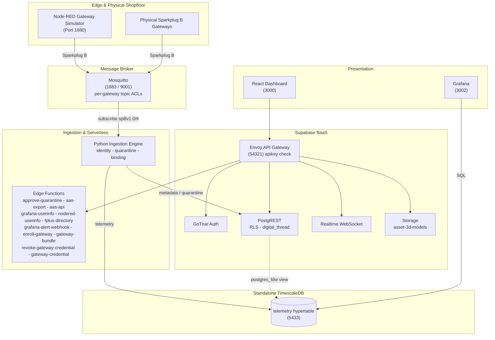

# AMRC Connectivity Stack - Cymru

[](https://github.com/Harri-Llewelyn/acs-cymru/actions/workflows/ci.yml)

An industrial, asset-centric manufacturing management platform aligned with the
**AMRC Connectivity Stack (ACS / Factory+)** framework.

Real-time telemetry streaming, shopfloor cell mapping, zero-touch edge device onboarding,
row-level security, continuous Digital Thread audit logging, AAS V3 export, and edge flow
management.

> **Design ethos —** *use pre-existing components and standards; minimise custom code.*
> Where upstream ACS ships bespoke microservices, this fork uses Supabase, TimescaleDB, Grafana and
> Node-RED. The custom surface is one Python ingestion daemon, eleven edge functions, an i3X server and
> a React dashboard.

---

## Architecture

**Supabase** is authoritative for asset metadata (`cells`, `gateways`, `devices`), auth, RLS, audit
triggers and edge functions. **Standalone TimescaleDB** holds the `telemetry` hypertable, reached
from Supabase through a `postgres_fdw` view. A **Python daemon** consumes Sparkplug B MQTT, gates
unregistered devices into quarantine, and routes metadata and telemetry to their respective stores.
A **React 18 SPA** queries PostgREST directly and subscribes to a Realtime change feed.

Derived state is computed at read time rather than stored: gateway staleness is a **view**, not a
cron writer, and AAS is an **adapter on the way out**, not an adopted metamodel.



**Data flow.** Devices publish `DBIRTH`/`DDATA` to Mosquitto, confined by ACL to their own edge-node
subtree → ingestion resolves topic to `sparkplug_id`, verifies the device is **bound to the
publishing gateway**, and quarantines anything unknown or contradictory → valid telemetry lands in
the hypertable → Postgres triggers log every metadata change to the append-only `digital_thread` →
the dashboard reads PostgREST and subscribes to Realtime.

---

## Deployment targets

**Kubernetes (k3s) is the primary target; Docker Compose is the local development path.** Both are
maintained, both are exercised in CI, neither is deprecated.

| | Docker Compose | Kubernetes (Helm) |
| :--- | :--- | :--- |
| Purpose | Local development, debugging | Deployment |
| Entry point | `docker compose up -d` | `helm install` — [`deploy/k8s/README.md`](deploy/k8s/README.md) |
| Reachability | Published ports on `localhost` | `*.<publicBaseDomain>` via one Ingress |
| TLS | none | cert-manager, internal CA ([`deploy/k8s/internal-ca.yaml`](deploy/k8s/internal-ca.yaml)) |
| MQTT | 1883 plaintext + 9001 WebSockets | the same, plus optional MQTTS on 8883 |
| Conformance | `ingestion/validate.py` from the host | the same suite, as an in-cluster Job |

Container images, SQL migrations and init scripts are **shared substrate** — only the *wiring* is
expressed twice. Intentional differences are enumerated in the divergence table in the Kubernetes
runbook; anything not in that table is drift. Design rationale is in
[`docs/kubernetes-architecture.md`](docs/kubernetes-architecture.md).

---

## Quick start — Docker Compose

```bash
npm run setup                   # writes .env with 24 freshly generated credentials
docker compose up --build -d    # launches the whole stack
```

Every file in `supabase/migrations/` is applied by `supabase-db-init` on startup and re-applied
harmlessly on every later start: the schema baseline (`0001`), seed data (`0002`), then `0003` audit
immutability, `0004`, `0005`, `0006` Node-RED SSO, `0007` metric-name format, `0008` Sparkplug
group, `0009` withdraws residual `anon` function grants, `0010` telemetry rollups and latest-value
view, `0011` IDTA Digital Nameplate and per-device nameplate data, `0012` permitted values of a
discrete metric, `0013` ASHRAE 223P vocabulary, `0014` repoints locally-minted semantic
identifiers onto the `acs-cymru.local` namespace, `0015` moves the default Sparkplug group to
`ACS-Cymru`, `0016` drops the dashboard's own service-directory entry and renames the Node-RED
one to say it is the simulator, `0018` pre-registers the demonstrator's metric set with each
row's standard and published semantic id, `0019` adds the 223P supply-air-flow metric the
shopfloor simulator needed, `0020` retires the introductory single-device simulator and moves its
schema and IDTA nameplate onto the demonstration mill, `0021` gives each shopfloor cell an icon from
a closed set, `0023` adds the `platform_alerts` occurrence log Grafana alerting writes into and publishes it for
Realtime, `0024` adds an optional free-text `description` to devices and gateways, `0025` adds
physical-gateway enrolment — a `gateway_enrollment_tokens` table reachable only by `service_role`,
the RPCs that issue and atomically redeem a single-use token, and the `PENDING_ENROLLMENT` /
`AWAITING_BIRTH` lifecycle states — `0026` stamps every audit row with the transaction that wrote
it (`digital_thread.causation_id`, from `txid_current()`) so the several rows one operator action
produces can be read back as one act, and adds `record_ingestion_rejection()` — the narrow
SECURITY DEFINER gate through which the ingestion daemon records a payload it judged
non-conforming, replacing `service_role`'s direct INSERT on the audit table — and `0027` maps the
historian's storage footprint over `postgres_fdw` and unions it with Supabase's own table sizes as
`public.storage_footprint`, read by Grafana's `supabase` datasource — `0028` generalises the alert
table from `device_alerts` to `platform_alerts`, whose subject is `(entity_type, entity_id)` rather
than a device, because the platform alert rules cover a gateway and the fleet and neither
fits a row that must name a machine — `0029` adds `public.platform_health`, the narrow view
those rules evaluate so the Grafana reader never needs the asset inventory, and `0074` adds its
`expected_publishers` count so that "ingestion has recorded nothing" only alerts when devices exist
that ought to be publishing — and `0030` gives that
alert table a **7-day retention window**, pruned nightly by `pg_cron`, whose predicate ages out
closed and superseded occurrences but never the newest firing row of a fingerprint — and `0031`
adds `public.system_settings`, the runtime configuration plane an `Administrator` edits from the
dashboard instead of a host `.env`, whose **key set is closed**: RLS grants UPDATE and nothing
else, so a new setting arrives by migration beside the code that reads it — and `0032` gives that
table **numeric bounds** and moves the alert retention window into it as `alerts.retention_days`,
replacing `prune_platform_alerts()` with a version that reads the setting, so the answer to "how
long do we keep alerts" is on a page rather than in a migration — and `0033` adds
`relocate_devices()`, which applies a whole shopfloor rearrangement in **one transaction** so the
six machines an operator files in one gesture carry one `causation_id` instead of six, and so a
batch that fails partway leaves nothing behind — and `0034` seeds the **read-only principal the MCP
client authenticates as**, holding `Operator` so it reads the i3X address space, writes nothing and
cannot see the audit trail (`scripts/mint-mcp-token.mjs` signs its long-lived token) — and `0035`
gives `gateways` the columns an appliance **reports about itself** on the heartbeat it already
publishes, chiefly `cert_expires_at`: the internal CA is hand-distributed into every appliance's
trust store, so re-minting it takes the whole fleet offline at once with no other signal — and
`0036` adds `public.gateway_health`, the **third** narrow view the Grafana reader may select,
after `0027`'s and `0029`'s: it backs the gateway dashboard and the certificate alert while
leaving the asset inventory `0029` deliberately withheld exactly where it is — and `0038` makes
**archiving or deleting a gateway revoke its broker credential**, by rotating the account to a
password nobody records: the credential service is add-only by design, so a delete verb there
would turn "can mint one confined account" into "can stop the whole fleet publishing" — and `0037`
makes **archiving a gateway withdraw its outstanding enrolment bundle**, and enrolment refuse
an archived gateway at all: a bundle downloaded and never instantiated was still redeemable
after the gateway was archived, which issued a real broker credential and resurrected the row
to `ONLINE` — and `0039` adds `0041` gives a **virtual gateway a
"Generate broker credential" path that needs no shell**: `authorize_virtual_gateway_credential()`
gates by role and refuses a physical or archived gateway, and
`record_gateway_credential_issued()` writes the `CREDENTIAL_ISSUED` audit row attributed to the
operator who asked — the two are separate so that a credential service that is down cannot produce
a record of a mint that never happened, and a mint that succeeds cannot go unrecorded — and `0042`
adds `list_service_principals()`, the **Administrator-only read behind the Service Identities
section**: `auth.users` is GoTrue's and is not served by PostgREST at all, and `user_roles` is
deliberately unreachable from a browser, so the alternative to a four-column function is a broad
grant on the two tables that decide who is who — and `0043` adds
`record_service_token_issued()`, which writes a **`TOKEN_MINTED`** row for a long-lived JWT and
refuses two things outright: a subject that can sign in, and any expiry beyond
`service_token_max_days()` — **90 days, because these tokens cannot be revoked** and the expiry is
the only bound that exists — and `0044` adds `create_service_principal()`, which creates a machine
identity the way `0034` does (`id` alone, so it has no email, no password and no identity provider)
and accepts **only a read-only role**, since a privileged machine identity becomes an unrevocable
write credential the moment a token is signed for it — and `0045` scopes `digital_thread_page()`'s
**deleted-asset filter to the three types that have a table behind them**: `0039` derived it as an
anti-join against cells, gateways and devices and deliberately did not narrow it by entity type, so
`service_principals` rows answered *"absent from all three"* and **the audit trail this feature
exists to produce was hidden as deleted** — and `0039`
adds `digital_thread_page()`, which applies the **deleted-asset
filter as a predicate rather than in the browser**, so the page's row budget is spent on rows
it will actually show: hiding them afterwards had the page list four assets on a stack of
twenty-six, and render an empty Gateways section on a fleet of four healthy gateways — and `0040`
**retires the demonstration shopfloor from the seed**, so a fresh install comes up with no assets
at all; it
is the one migration in the chain that must run **exactly once** rather than on every boot, because
the rows it removes are rows an operator may deliberately want back, and a delete replayed every
boot would silently undo every provisioning run — which is what `public.one_shot_migrations` is
for — plus demo accounts (`supabase/seed.sql`).

> **There is no `0017`.** It was drafted as an audit-trigger change guard and then not written,
> because `0005` already implements one; a second declaration of `log_digital_thread_event()`
> would win by filename order on every boot and would have regressed the `actor_source`
> attribution `0005` adds. The gap in the numbering is deliberate and the reasoning is in
> [`supabase/README.md`](supabase/README.md#audit-signal-and-attribution-0005).
>
> `0026` is that later declaration, written deliberately and on those terms: it reproduces `0005`'s
> body **in full** and adds two lines, rather than patching it. Its self-check asserts that both the
> heartbeat suppression guard and the causation stamp are present in the live definition, because
> `check-docs-drift.mjs` can verify a redeclaration was *intended* and cannot verify it was
> *complete*.

| Interface | URL |
| :--- | :--- |
| React Dashboard | http://localhost:3000 |
| Supabase Studio | http://127.0.0.1:54323 |
| Swagger UI | http://localhost:8088 |
| Node-RED | http://localhost:1880 |
| Grafana | http://localhost:3002 |
| Prometheus | http://localhost:9090 (loopback only — SSH-tunnel from another host) |

**Sign in to the React dashboard first.** Node-RED and Grafana both federate to Supabase Auth, and
the consent step needs your dashboard session — going straight to either shows a "sign in required"
prompt rather than a login form. In Node-RED, click **Sign in with ACS-Cymru**; Administrator can
deploy, every other role gets a read-only editor. Deploying a flow is `gitops:manage`, which
`0069` made Administrator-only. The editor used to be the *second* door onto that permission; since
the Directory page's Sync button and the `deploy-nodered` function were retired with the
demonstrator, it is the only one.

**Demo accounts** — seeded by [`supabase/seed.sql`](supabase/seed.sql), password `acscymru123`:

| Email | Role | Access |
| :--- | :--- | :--- |
| `admin@acs-cymru.local` | `Administrator` | Full CRUD |
| `manager@acs-cymru.local` | `Shopfloor_Manager` | Full CRUD |
| `operator@acs-cymru.local` | `Operator` | Read-only + telemetry |
| `auditor@acs-cymru.local` | `Auditor` | Digital Thread read-only |

Self-registered accounts get read-only `Operator` via the `handle_new_user` trigger; an
`Administrator` must promote them.

> **`.env.example` contains working development secrets** — the standard Supabase demo values, also
> registered as Kong API keys. **Generate fresh secrets for any shared or hosted environment.**

Teardown: `docker compose down -v` (also drops volumes, invalidating every logged-in browser).

### Windows: `bind: An attempt was made to access a socket in a way forbidden by its access permissions`

```
Error response from daemon: ports are not available: exposing port TCP 0.0.0.0:54322 -> 127.0.0.1:0:
listen tcp 0.0.0.0:54322: bind: An attempt was made to access a socket in a way forbidden by its
access permissions.
```

**Nothing is wrong with the stack.** Hyper-V/WSL2 reserves blocks of high ports for NAT on boot,
and those blocks routinely swallow the `543xx` range this stack publishes Supabase on. The port is
not in use by another process — Windows has withdrawn it.

**Docker names only the first port it fails on, and that is the misleading part.** Three ports are
in that range, and the one that matters is not the one in the message:

| Port | Service | Consequence if lost |
| :--- | :--- | :--- |
| `54321` | Envoy | **the browser has no API** — the dashboard loads and every request fails |
| `54322` | supabase-db | no `psql` from the host; the stack itself is unaffected |
| `54323` | Supabase Studio | Studio unreachable |

So fixing the port in the error changes nothing: `supabase-db` fails, every service that depends on
it never starts, and what you see is a dashboard that loads and then reports **`Failed to fetch`**.
`docker compose ps` shows the shape of it — `frontend`, `swagger-ui` and `timescaledb` up, because
they are the only three that do not depend on `supabase-db`.

Confirm it is this and not a real conflict:

```powershell
netsh interface ipv4 show excludedportrange protocol=tcp
```

A range covering `54321`–`54323` and **no `*`** beside it is a dynamic Hyper-V reservation. (`*`
marks an administered exclusion — one somebody added deliberately.)

**The fix**, in an **Administrator** PowerShell:

```powershell
net stop winnat
netsh int ipv4 add excludedportrange protocol=tcp startport=54320 numberofports=8 store=persistent
net start winnat
```

Then `docker compose up -d`.

The middle line is the part that lasts. It claims `54320`–`54327` as an *administered* exclusion,
so WinNAT cannot take the range again — `store=persistent` carries that across reboots. Restarting
`winnat` on its own releases the current reservation but simply re-rolls it, so the same failure
returns on the next boot or Docker Desktop restart.

**If you cannot get an Administrator prompt**, the ports are configurable — `KONG_HTTP_PORT`,
`SUPABASE_DB_PORT` and `STUDIO_PORT` in `.env`. Moving Kong is not a one-line change, though:
`SUPABASE_URL`, `AAS_MODEL_PUBLIC_BASE` and `AAS_HISTORIAN_ENDPOINT` all carry the port, the
Node-RED and Grafana OAuth URLs are derived from `SUPABASE_URL`, and `VITE_SUPABASE_URL` is a
**build arg** — so the frontend needs `--build`, not just a restart. Change `.env` only and leave
`.env.example` alone, or the divergence follows you into every other environment.

### Resetting to a clean slate

```bash
npm run stack:reset -- --yes
```

Tears the stack down **with its volumes**, brings it back, and waits for the schema to exist rather
than for ports to answer. What comes back is blank: no cells, no gateways, no devices, no schemas
and an empty Node-RED editor — the state a new install starts in.

Node, not a shell script, so it runs the same on Windows, macOS and Linux
([#106](https://github.com/Harri-Llewelyn/ACS-Cymru/issues/106)). **It checks that Docker answers
before it tears anything down** — the shell version discovered an unreachable Docker at the moment
it was already dropping volumes, which left a half-destroyed stack on the one path nobody exercises
until something has already gone wrong.

**`--yes` is required and there is no interactive prompt.** A prompt is something people learn to
dismiss without reading, and this is most dangerous once it is familiar. It also refuses outright
when `NODE_ENV=production`, and when `COMPOSE_PROJECT_NAME` names a stack this repository does not
own — so a shell in the wrong directory cannot take down someone else's.

The one thing it exists for that nothing else can do: **`digital_thread` is append-only to every
application role**, so dropping the volume is the only way back to an empty audit trail.

---

## Quick start — Kubernetes

Full runbook in [`deploy/k8s/README.md`](deploy/k8s/README.md). The short version:

```bash
# Five images are built from this repository and are on no registry.
docker build -f supabase/functions/Dockerfile -t acs-cymru/edge-runtime:0.1.0 .   # context: repo root
docker build -f Dockerfile                    -t acs-cymru/ingestion:0.1.0 .      # context: repo root
docker build -f node-red/Dockerfile           -t acs-cymru/node-red:0.1.0 node-red
docker build -f frontend/Dockerfile --build-arg VITE_RUNTIME_CONFIG=true \
                                              -t acs-cymru/frontend:0.1.0 frontend
docker build -f tests/Dockerfile              -t acs-cymru/test-runner:0.1.0 .    # conformance suites

node scripts/sync-helm-chart-files.mjs        # mirror repo config into the chart

kubectl create namespace acs-cymru
helm install acs-cymru deploy/helm/acs-cymru -n acs-cymru \
  -f deploy/helm/acs-cymru/values-dev.yaml --timeout 15m

# NOT `--wait` — it deadlocks the first install. See deploy/k8s/README.md.
for w in $(kubectl -n acs-cymru get statefulset,deploy -o name); do
  kubectl -n acs-cymru rollout status "$w" --timeout=10m
done

helm test acs-cymru -n acs-cymru          # the postgres_fdw gate
```

Serves seven subdomains on one Ingress (`app.`, `api.`, `nodered.`, `grafana.`, `studio.`, `docs.`,
`mqtt.`) plus a LoadBalancer for **raw MQTT on 1883**, which is TCP and cannot ride an HTTP Ingress.

- **`values-dev.yaml` carries the published demo credentials from `.env.example`, and they are in
  git.** For anything another person can reach, start from `values-prod.yaml.example` and point
  `secrets.existingSecret` at an externally managed Secret.
- **The chart validates its own values and fails the render, not the pod** — a partial credential
  set, a wrong-length Realtime key, a renamed Realtime Service, TLS with `scheme: http`, or an HPA
  on a single-writer workload each otherwise produce a stack that reports healthy and refuses every
  request.

---

## Repository map

| Directory | Covers |
| :--- | :--- |
| **[`frontend/`](frontend/README.md)** | React 18 architecture, Vite, Realtime integration, derived state, theming |
| **[`supabase/`](supabase/README.md)** | Migrations, RLS privilege matrix, triggers, audit immutability, edge functions, Kong |
| **[`ingestion/`](ingestion/README.md)** | Sparkplug B parsing, identity resolution, gateway binding, TimescaleDB mapping, `validate.py` |
| **[`tutorial/`](tutorial/README.md)** | The walkthrough for a blank install: one cell, one gateway, its broker credential, a device, a schema, and the Node-RED flow that publishes as it |
| **[`i3x/`](i3x/README.md)** | i3X 1.0 server: address-space mapping, subscriptions, connecting a client — including [an MCP host](i3x/README.md#mcp) |
| **[`deploy/k8s/README.md`](deploy/k8s/README.md)** | Kubernetes runbook: install, upgrade, teardown, hardening, divergence table, releases |
| [`deploy/helm/acs-cymru/`](deploy/helm/acs-cymru) | The Helm chart; `values.yaml` documents every setting |
| [`docs/kubernetes-architecture.md`](docs/kubernetes-architecture.md) | Why the Kubernetes target is built the way it is. Source comments cite it by section |
| [`docs/incidents.md`](docs/incidents.md) | Faults whose FIX LOOKS ARBITRARY without the story. Read before "tidying" a guard that seems redundant |
| [`docs/upgrades.md`](docs/upgrades.md) | What survives an upgrade and why nothing needs reconfiguring — plus the three places that is not the whole truth |
| [`docs/openapi.yaml`](docs/openapi.yaml) · [`docs/i3x-openapi.yaml`](docs/i3x-openapi.yaml) | REST and i3X specifications, rendered by Swagger UI |
| [`supabase/migrations/archive/`](supabase/migrations/archive) | The 38 pre-beta migrations, preserved for their reasoning. Never executed |
| [`grafana/`](grafana) · [`timescaledb/`](timescaledb) | Provisioning; hypertable schema, retention and rollup reconciliation, the read-only BI role |
| [`scripts/`](scripts) | Setup, seeding, vocabulary generation, chart-file sync, drift guards, database backup/restore, gateway provisioning, stack reset, AAS push |
| [`tests/`](tests) | Vendored IDTA AAS schema, conformance test-runner image |

---

## Service port directory

**Every Compose service appears here and every row names a real one**, asserted in both directions
by `scripts/check-docs-drift.mjs`. It used to be checked one way and only for image tags, which is
how a row for `supabase-kong-init` — a service retired with Kong on Compose — survived while five
live services went unlisted: the tag it named (`alpine:3.24`) still existed, so the check passed.

| Service | Container | Image | Port |
| :--- | :--- | :--- | :--- |
| `supabase-db` | `acs-cymru_supabase_db` | `supabase/postgres:17.6.1.160` | `54322:5432` |
| `supabase-db-roles-init` | `acs-cymru_supabase_db_roles_init` | `supabase/postgres:17.6.1.160` | — |
| `supabase-db-init` | `acs-cymru_supabase_db_init` | `supabase/postgres:17.6.1.160` | — |
| `supabase-auth` | `acs-cymru_supabase_auth` | `supabase/gotrue:v2.189.0` | — |
| `supabase-rest` | `acs-cymru_supabase_rest` | `postgrest/postgrest:v14.12` | — |
| `supabase-envoy-init` | `acs-cymru_supabase_envoy_init` | `alpine:3.24` | — |
| `supabase-envoy` | `acs-cymru_supabase_envoy` | `envoyproxy/envoy:v1.31.5` | `54321:8000` |
| `supabase-functions` | `acs-cymru_supabase_functions` | `supabase/edge-runtime:v1.74.2` | — |
| `supabase-realtime` | `acs-cymru_supabase_realtime` | `supabase/realtime:v2.102.3` | — |
| `supabase-storage` | `acs-cymru_supabase_storage` | `supabase/storage-api:v1.60.4` | — |
| `supabase-storage-init` | `acs-cymru_supabase_storage_init` | `node:24-alpine` | — |
| `supabase-storage-policies` | `acs-cymru_supabase_storage_policies` | `supabase/postgres:17.6.1.160` | — |
| `supabase-meta` | `acs-cymru_supabase_meta` | `supabase/postgres-meta:v0.96.6` | — |
| `supabase-studio` | `acs-cymru_supabase_studio` | `supabase/studio:2026.07.07-sha-a6a04f2` | `127.0.0.1:54323:3000` (loopback only — see below) |
| `timescaledb` | `acs-cymru_timescaledb` | `timescale/timescaledb:2.29.2-pg17` | `5433:5432` |
| `timescaledb-maintenance` | `acs-cymru_timescaledb_maintenance` | `timescale/timescaledb:2.29.2-pg17` | — |
| `mosquitto-tls-init` | `acs-cymru_mosquitto_tls_init` | `./mosquitto/tls-init/Dockerfile` | — |
| `mosquitto-init` | `acs-cymru_mosquitto_init` | `eclipse-mosquitto:2.0.22` | — |
| `mosquitto` | `acs-cymru_mosquitto` | `eclipse-mosquitto:2.0.22` | `1883`, `9001` |
| `frontend` | `acs-cymru_frontend` | `./frontend/Dockerfile` | `3000:3000` |
| `ingestion` | `acs-cymru_ingestion` | `./Dockerfile` | `9108:9108` |
| `playback` | `acs-cymru_playback` | `./Dockerfile` (same image as `ingestion`, different command) | — |
| `cold-archiver` | `acs-cymru_cold_archiver` | `./Dockerfile` (same image as `ingestion`, different command) | — |
| `i3x-service` | `acs-cymru_i3x` | `./i3x/Dockerfile` | `8090:8090` |
| `gateway-credential` | `acs-cymru_gateway_credential` | `./gateway-credential/Dockerfile` | — |
| `node-red-init` | `acs-cymru_node_red_init` | `./node-red/Dockerfile` | — |
| `node-red` | `acs-cymru_node_red` | `./node-red/Dockerfile` | `1880:1880` |
| `grafana` | `acs-cymru_grafana` | `grafana/grafana:13.2.0` | `3002:3000` |
| `swagger-ui` | `acs-cymru_swagger_ui` | `swaggerapi/swagger-ui:v5.32.14` | `8088:8080` |
| `prometheus` | `acs-cymru_prometheus` | `prom/prometheus:v3.14.0` | `127.0.0.1:9090:9090` |
| `node-exporter` | `acs-cymru_node_exporter` | `prom/node-exporter:v1.12.1` | — |

---

## Security model

Fail-closed throughout: edge functions and RLS policies deny by default, and a missing or
unrecognised role produces `403`.

| Layer | Control |
| :--- | :--- |
| **Broker** | `allow_anonymous false`; [`mosquitto.acl`](mosquitto/mosquitto.acl) confines each gateway to `spBv1.0/+/+/<own-id>/#` |
| **Ingestion** | Gateway↔device binding; quarantine gating; append-only historian writes — a **grant**, not a promise, once `INGEST_WRITER_PASSWORD` and `INGEST_DB_USER` are set: `ingest_writer` may INSERT and cannot UPDATE, DELETE or TRUNCATE. Unset, the daemon keeps the admin credential and the guarantee is the Python's again — see [Historian roles](#historian-roles) |
| **Gateway** | Envoy's `apikey` check on `/rest`, `/realtime`, `/storage`, `/functions` — with **four** documented exemptions ([`supabase/README.md`](supabase/README.md)) |
| **API** | PostgREST JWT verification plus RLS on every table |
| **Database** | `has_role()` reads `user_roles` directly, so revocation is immediate; `digital_thread` is append-only against `service_role` too |
| **Edge functions** | Explicit router allow-list; per-function secret scoping; role resolved from the database, never a stale JWT claim |
| **Edge automation** | Node-RED's editor, admin API and webhook receiver each authenticate separately |
| **Supabase Studio** | **No authentication of its own — reachable only from the host.** Bound to `127.0.0.1` on Compose and off the Ingress by default on Kubernetes |

### Historian roles

The historian is a separate database, and a grant issued in a Supabase migration does not reach it.
Its roles live in [`timescaledb/roles.sql`](timescaledb/roles.sql), reconciled on **every boot** by
`timescaledb-maintenance` — the same replay-and-reconcile model the migration chain uses, and for
the same reason: `/docker-entrypoint-initdb.d` runs only on an empty data directory.

| Role | May | Used by |
| :--- | :--- | :--- |
| `ingest_writer` | INSERT + SELECT on `telemetry`; upsert `assets` | the ingestion daemon |
| `fdw_reader` | SELECT the six objects Supabase projects | Supabase's `postgres_fdw` PUBLIC mapping |
| `grafana_reader` | SELECT everything the dashboards query | Grafana |
| `powerbi_reader` | SELECT the three rollups only | external BI |

**`ingest_writer` and `fdw_reader` are required; the two readers are optional.** BI and Grafana are
consumers a stack can simply not have. The daemon and the FDW are not — each must authenticate as
*something* on every query, and the only alternative to these roles is the superuser they replaced.
So `npm run setup` mints both passwords, Compose refuses to start without them, and the chart fails
to render. A stack that comes up on the superuser saying nothing is the state this closes.

**The daemon checks its own credential at startup** and refuses to run as a superuser on the
historian, naming `ALLOW_HISTORIAN_SUPERUSER=true` as the deliberate way to say otherwise. Every
other guarantee here is enforced where it can be observed — the broker ACL by delivery, the write
gates by `is_ingestion_caller()`, the audit trail by a trigger. This one used to depend on nobody
having changed a variable, and it was wrong for months without anything noticing.

**An authentication failure is fatal; an unreachable historian is not.** The daemon is built to
survive a database that is down — it warns, drops what it cannot store, and resumes. A refused
credential never resolves by retrying, so it exits instead of running indefinitely discarding every
reading. Those two wore the same clothes until a wrong password was tried on purpose.

**`ingest_writer` needs SELECT, which is not obvious.** Both of the daemon's statements carry an
`ON CONFLICT` clause, and inferring the arbiter index reads the target. So the role is *append-only*
rather than write-only: it can add a row and cannot change or remove one, which is the distinction
the security model above depends on.

**Why `fdw_reader` exists at all.** `0001` maps every local Supabase role onto this database through
`postgres_fdw`. That mapping used the historian's superuser, so an FDW session opened for
`authenticated` ran here with full rights, contained only by the grant on the *other* database. No
application role could abuse it — the point is that nothing stopped the next widened grant or new
foreign table from inheriting that reach silently. The `postgres` mapping is deliberately unchanged:
it is what a human debugging the FDW connects through.

`timescaledb/test_historian_role_grants.py` asserts both halves for both roles — what they can do,
and what they must not.

**Supabase Studio is a database console, not a dashboard with admin features**, and it is the one
component here with no login, no roles and no session. The official Supabase stack fronts it with a
basic-auth pair on Kong; this stack does not run that, so whatever can reach it holds the SQL
editor, the table editor and the Vault UI **as the database owner** — for whom RLS is not enforced.
Every control in the table above is downstream of that.

So it is reachable from the host and nowhere else. `127.0.0.1:54323` on Compose; on Kubernetes
`ingress.routes.studio` defaults to `false`, and reaching it is a port-forward:

```bash
kubectl -n <ns> port-forward svc/<release>-acs-cymru-supabase-studio 54323:3000
```

Turning that route on publishes an unauthenticated database console at `studio.<publicBaseDomain>`
and should be paired with an authenticating proxy in front of it.

Two consequences worth stating on the front page; both are detailed in
[`supabase/README.md`](supabase/README.md):

- **Node-RED is not an open port.** A `function` node runs arbitrary JavaScript in a container
  holding the MQTT credential, so anyone who could replace a flow had remote code execution on the
  edge host. The editor and `/flows` use OAuth2 + PKCE; `POST /hooks/quarantine` takes a 60-second
  per-event signed token, deliberately not the admin credential, because any flow author can read it
  from `msg.req.headers`.
- **The `asset-3d-models` bucket is public-read**, because an exported AAS `File` URL must resolve
  for a viewer holding no session and a signed URL would turn every shell already handed out into a
  time bomb. Anything in it must carry nothing beyond machine geometry. Writes are gated on
  `device:manage`, not merely `authenticated`.

### Machine identities

Four identities here are held by software rather than people, and each is narrow by construction:
`Service_Ingestor` and the MCP reader hold `Operator`, `factoryplus_i3x` reads the broker namespace
and publishes nothing, and `gateway-credential-service` can add one broker account and do nothing
else. All four are `auth.users` rows with no email, no password and no identity provider, so none
can sign in.

**The ingestion daemon does not hold `SUPABASE_SERVICE_ROLE_KEY`.** It used to, and that was the one
credential whose compromise no policy written anywhere else could contain, sitting in the process
most exposed to the plant network. It authenticates as `Service_Ingestor` — an `Operator` principal
that cannot write a single row directly — and every write it makes goes through a `SECURITY DEFINER`
gate that checks the caller is that principal. `Operator` being insufficient is the design, not an
oversight: it makes those gates the only route rather than the tidy one.

**Tokens cannot be revoked.** PostgREST checks the signature, not a session table, so revoking means
rotating `SUPABASE_JWT_SECRET` and invalidating every key in the stack. Expiry is therefore the only
bound that exists — 90 days maximum for any token naming a **principal**, whether a person pasted it
into a laptop config or a container reads it from `.env`, and ten years only for the anon and
service-role keys, which name nobody and are the stack's API keys. The **Access Control** tab exists
to say what is outstanding, because with no revocation an accurate inventory *is* the safety story.

The full argument, including the three revocation designs that were checked and rejected, is in
[`supabase/README.md`](supabase/README.md#machine-identities).

**Known issues** — things that can be worked on — are tracked as
[GitHub issues](https://github.com/Harri-Llewelyn/ACS-Cymru/issues). **Accepted risks are not**, and
live below.

### Accepted risks

An accepted risk is a decision, not a task. Kept here rather than in the issue tracker because an
issue is a bulletin of work somebody could pick up, and one that will never be picked up teaches
readers to skim the list. It also decays differently: an open issue nobody acts on starts to look
like neglect, where a documented decision reads as what it is.

**Each says what would change the decision**, which is the part that stops an accepted risk becoming
a forgotten one. Nothing here is accepted permanently; each is accepted *for a stated deployment
model*, and the model is what to re-check.

#### Realtime leaks the timing of changes, though not their contents

An unauthenticated subscriber that can reach the Realtime WebSocket receives the change **envelope**
for every published table. Realtime redacts the payload to `{}` and attaches a 401, but the message
arrives — so the **fact and timing** of a change leak, even though its contents do not. `cells`,
`gateways` and `devices` are published because the dashboard needs them live, so an observer can
infer when an asset was created, edited, archived or changed state. In practice that is a timing
side-channel on shift patterns, commissioning activity and the rate of configuration change.

**It cannot be fixed here** — it is upstream `supabase/realtime` behaviour. The gateway's `apikey`
check does not mitigate it either: the anon key is a registered key that is necessarily shipped to
every browser, so holding it proves nothing about the caller. What *was* done is narrowing the
publication: `digital_thread` was removed from it, being the most operationally sensitive stream and
one nothing subscribed to.

**Accepted because** the target environment is an isolated shopfloor network reached over VPN, with
services behind an internal CA. Reaching the socket at all means already being inside that boundary,
where an observer has considerably more direct means of learning the same facts — and the exposure
does not justify degrading the dashboard's live updates.

**Revisit if** the stack is exposed to a network where reaching the WebSocket is not already
evidence of access: a public or partner-facing deployment, a shared cluster, or any move to
multi-tenancy. At that point the choice is dropping the three tables from the publication and
polling instead, or waiting for upstream to authenticate before delivering the envelope.

#### There is no credential revocation; expiry is the only bound

Described in full under [Machine identities](#machine-identities) — a token cannot be withdrawn without rotating
`SUPABASE_JWT_SECRET` and invalidating every key in the stack, so expiry is the only bound that
exists: 90 days for any token naming a principal — the ingestion and playback keys included, which
`npm run keys:rotate` re-signs — and ten years only for the anon and service-role keys, which name
nobody.

**Accepted because** the three revocation designs that would fix it were checked and rejected for
reasons recorded in [`supabase/README.md`](supabase/README.md#machine-identities), and because an
accurate inventory is the compensating control — which is what the **Access Control** tab exists to
provide.

**Revisit if** tokens are ever issued to parties outside the operating organisation, or if the
ten-year infrastructure keys outlive the deployment that minted them.

---

## Standards

| Standard | Role |
| :--- | :--- |
| **Sparkplug B** | The wire protocol. Identity is `sparkplug_id`, carried in the topic |
| **MTConnect** (2.x) | Machine-tool vocabulary — 249 data item types, 123 subtypes, 100 units, 126 component types |
| **OPC UA** (40001, 40001-4, 40010, 30050, 40501, 40540) | Companion-specification data points: machinery, energy, robotics, PackML, machine tools, additive. Generated from OPC Foundation NodeSets by [`scripts/generate-opcua-vocabulary.mjs`](scripts/generate-opcua-vocabulary.mjs) |
| **ISO 22400** | Computed KPIs, which MTConnect and OPC UA deliberately exclude |
| **ASHRAE 223P** | Building-system semantics — 640 concepts from the open223 ontology. ⚠ Still in public review |
| **AAS / IEC 63278** | V3 export as JSON or AASX, validated against the official IDTA schema |

These are **four vocabularies, not four alternatives** — a mixed fleet needs all of them, which is
why the schema builder offers a choice rather than a migration path. All are built, as is the IDTA
Digital Nameplate; what each one covers and how its identity was verified is in
[`docs/vocabularies.md`](docs/vocabularies.md), and the checklist for adding another is in
[`supabase/README.md`](supabase/README.md#adding-a-vocabulary).

> Adopting the MTConnect vocabulary is not a compliance claim; that requires the Implementer
> License. Locally-minted semantic ids live under `https://acs-cymru.local/semantics/…` — the
> namespace is the honesty mechanism, and an id under `mtconnect.org` would assert an
> interoperability that does not exist.

---

## Licence

**This repository is MIT licensed** — see [`LICENSE`](LICENSE). That covers everything here: the
Compose and Helm configuration, the SQL, the services, the flows, the dashboards and the docs.

It does not cover the third-party images this configuration deploys, which carry their own licences
and are pulled from their own registries at deploy time. Two are worth knowing about before you
commit to the stack:

- **TimescaleDB** runs under the **Timescale License**, not Apache 2.0. Compression, continuous
  aggregates, retention policies and `time_bucket_gapfill` are all Timescale-Licensed features and
  all four are load-bearing here, so an Apache-only build will not run this schema. The licence
  permits internal and commercial use and restricts offering the software as a hosted database
  service.
- **Grafana** is **AGPL-3.0** — the most restrictive licence in the stack, which surprises people
  who expect that to be TimescaleDB. Deploying it unmodified is fine; modifying Grafana itself and
  offering it over a network engages the AGPL.

Licences do not cross a process boundary: every component runs in its own container and is reached
over a network protocol, so none of this reaches into your use of the MIT-licensed work here.

**Read [`NOTICE.md`](NOTICE.md) before deploying commercially, and take your own advice before
offering this stack as a hosted service.**

---

## Testing

Every suite, what each one needs, the six CI jobs and the release workflow are in
**[`docs/testing.md`](docs/testing.md)**. The short version:

```bash
cd frontend && npm test                 # Frontend — 1,600+ tests
node scripts/check-env-drift.mjs        # Configuration drift — no services needed

# End-to-end — needs the running stack
set -a && . ./.env && set +a && unset MQTT_HOST DB_HOST DB_PORT
export MQTT_USER="$MQTT_VALIDATOR_USER" MQTT_PASSWORD="$MQTT_VALIDATOR_PASSWORD"
python ingestion/validate.py
```

**`validate.py` is topology-agnostic and runs against both deployment targets** — Compose and
Kubernetes — which is what makes it the real drift control between them.

---

## Expected behaviour (not defects)

- **`docker compose down -v` invalidates every logged-in browser.** It drops `supabase_db_data`, and
  with it `auth.sessions`. The dashboard clears the stale tokens and returns to the login screen.
- **Swagger UI's "Example Value" is documentation, not data.** Press **Execute** and read the
  **Response body** panel.
- **A fresh install has no cells, no gateways, no devices and no schemas, and Node-RED opens on an
  empty editor.** It used to come up with a four-cell simulated shopfloor seeded by `0002` and a
  Node-RED publishing under four gateway identities, which meant every install began with assets
  nobody had asked for and a Digital Thread already describing them. All of it is gone rather than
  opt-in: the demonstration floor, the simulator flow, the provisioning script and the seeded
  schemas. [`tutorial/README.md`](tutorial/README.md) walks through building one machine by hand
  instead, which is the same knowledge without the plant. `0040` and `0073` retire the assets and
  the schemas from databases that already have them.
- **Node-RED's editor is empty, and that is the seeded state rather than a failed mount.** It
  declares no broker nodes, so nothing connects and nothing publishes; `node-red-init` writes a
  marker into `/data` recording that it seeded a blank flow, which is what tells the two cases
  apart. Before this, a default stack ran a simulator against gateways that did not exist and
  ingestion discarded every message as an *"unregistered edge node"* — correct behaviour, and an
  odd thing to be doing before anyone had asked for it.
- **An unrecognised device appears in the quarantine queue, not on the shopfloor map.** That is the
  zero-touch onboarding path working: a device that announces itself under an id nobody registered
  is held and its telemetry dropped until an `Administrator` approves it. With no seeded assets
  this is now the **first** thing a new user meets rather than a footnote — publish under any
  well-formed `dev`-prefixed id and it is waiting for you. A device you register in the dashboard
  first is bound to its gateway and bypasses the queue, which is the other half of the same path
  and the one the tutorial walks through.

---

## Roadmap & Future Extensions

**The roadmap lives in [`docs/roadmap.md`](docs/roadmap.md)**, and none of it is speculative: every
entry names the code it would build on, so a reader can tell how far away each is. That file lists
only what is **not** built — an item that ships is removed from it and its substance moves into the
documentation, which is why no entry there says `Built`.

**None of them are open defects.** Feature requests land there once they have been checked against
the code; **known issues** stay in
[GitHub issues](https://github.com/Harri-Llewelyn/ACS-Cymru/issues), and **accepted risks** live
under [Accepted risks](#accepted-risks).

---

## Contributing

**The reasoning lives next to the thing it constrains**, not in one design document. A migration's
header says why its schema is shaped that way, `values.yaml` says why each setting is not simply a
default, and the component READMEs carry the rest. Read the file before you change it.

The working rules that follow from that — the logic mirrored across languages and the CI guards that
enforce it, why `metric_catalog.name` is immutable, and why every migration must be idempotent —
are in **[`CONTRIBUTING.md`](CONTRIBUTING.md)**.

> **Handing this to someone else?** `git status` clean is not the same as safe to hand over. The
> credentials this repository generates are untracked, including the Mosquitto CA **private key**,
> so a clean tree says nothing about them. [`docs/handover.md`](docs/handover.md) lists what to
> purge first.

| Document | Covers |
| :--- | :--- |
| [`CONTRIBUTING.md`](CONTRIBUTING.md) | Working rules, and what to run before opening a pull request |
| [`docs/testing.md`](docs/testing.md) | Every suite and what it needs, the six CI jobs, the release workflow |
| [`docs/handover.md`](docs/handover.md) | Packaging a hand-off — what to purge before transferring a tree |
| [`SECURITY.md`](SECURITY.md) | Reporting a vulnerability privately |
| [`CODE_OF_CONDUCT.md`](CODE_OF_CONDUCT.md) | Contributor Covenant 2.1 |
| [`NOTICE.md`](NOTICE.md) | Third-party licences, and what the MIT grant here does and does not cover |
