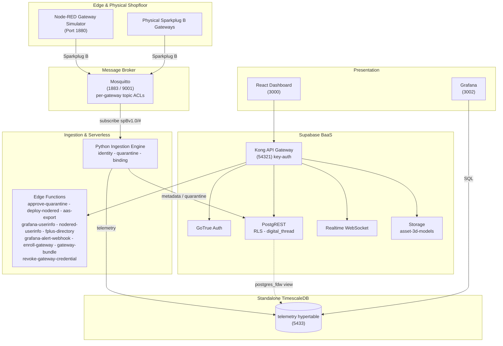

# AMRC Connectivity Stack - Cymru

[](https://github.com/Harri-Llewelyn/acs-cymru/actions/workflows/ci.yml)

An industrial, asset-centric manufacturing management platform aligned with the
**AMRC Connectivity Stack (ACS / Factory+)** framework.

Real-time telemetry streaming, shopfloor cell mapping, zero-touch edge device onboarding,
row-level security, continuous Digital Thread audit logging, AAS V3 export, and edge flow
management.

> **Design ethos —** *use pre-existing components and standards; minimise custom code.*
> Where upstream ACS ships bespoke microservices, this fork uses Supabase, TimescaleDB, Grafana and
> Node-RED. The custom surface is one Python ingestion daemon, ten edge functions, an i3X server and
> a React dashboard.

---

## Architecture

**Supabase** is authoritative for asset metadata (`cells`, `gateways`, `devices`), auth, RLS, audit
triggers and edge functions. **Standalone TimescaleDB** holds the `telemetry` hypertable, reached
from Supabase through a `postgres_fdw` view. A **Python daemon** consumes Sparkplug B MQTT, gates
unregistered devices into quarantine, and routes metadata and telemetry to their respective stores.
A **React 18 SPA** queries PostgREST directly and subscribes to a Realtime change feed.

Derived state is computed at read time rather than stored: gateway staleness is a **view**, not a
cron writer, and AAS is an **adapter on the way out**, not an adopted metamodel.



**Data flow.** Devices publish `DBIRTH`/`DDATA` to Mosquitto, confined by ACL to their own edge-node
subtree → ingestion resolves topic to `sparkplug_id`, verifies the device is **bound to the
publishing gateway**, and quarantines anything unknown or contradictory → valid telemetry lands in
the hypertable → Postgres triggers log every metadata change to the append-only `digital_thread` →
the dashboard reads PostgREST and subscribes to Realtime.

---

## Deployment targets

**Kubernetes (k3s) is the primary target; Docker Compose is the local development path.** Both are
maintained, both are exercised in CI, neither is deprecated.

| | Docker Compose | Kubernetes (Helm) |
| :--- | :--- | :--- |
| Purpose | Local development, debugging | Deployment |
| Entry point | `docker compose up -d` | `helm install` — [`deploy/k8s/README.md`](deploy/k8s/README.md) |
| Reachability | Published ports on `localhost` | `*.<publicBaseDomain>` via one Ingress |
| TLS | none | cert-manager, internal CA ([`deploy/k8s/internal-ca.yaml`](deploy/k8s/internal-ca.yaml)) |
| MQTT | 1883 plaintext + 9001 WebSockets | the same, plus optional MQTTS on 8883 |
| Conformance | `ingestion/validate.py` from the host | the same suite, as an in-cluster Job |

Container images, SQL migrations and init scripts are **shared substrate** — only the *wiring* is
expressed twice. Intentional differences are enumerated in the divergence table in the Kubernetes
runbook; anything not in that table is drift. Design rationale is in
[`docs/kubernetes-architecture.md`](docs/kubernetes-architecture.md).

---

## Quick start — Docker Compose

```bash
npm run setup                   # writes .env with 24 freshly generated credentials
docker compose up --build -d    # launches the whole stack
```

Every file in `supabase/migrations/` is applied by `supabase-db-init` on startup and re-applied
harmlessly on every later start: the schema baseline (`0001`), seed data (`0002`), then `0003` audit
immutability, `0004`, `0005`, `0006` Node-RED SSO, `0007` metric-name format, `0008` Sparkplug
group, `0009` withdraws residual `anon` function grants, `0010` telemetry rollups and latest-value
view, `0011` IDTA Digital Nameplate and per-device nameplate data, `0012` permitted values of a
discrete metric, `0013` ASHRAE 223P vocabulary, `0014` repoints locally-minted semantic
identifiers onto the `acs-cymru.local` namespace, `0015` moves the default Sparkplug group to
`ACS-Cymru`, `0016` drops the dashboard's own service-directory entry and renames the Node-RED
one to say it is the simulator, `0018` pre-registers the demonstrator's metric set with each
row's standard and published semantic id, `0019` adds the 223P supply-air-flow metric the
shopfloor simulator needed, `0020` retires the introductory single-device simulator and moves its
schema and IDTA nameplate onto `Sim_CNC_Mill_01`, `0021` gives each shopfloor cell an icon from a
closed set, `0022` adds one schema per machine class and attaches it to every simulated device,
`0023` adds the `platform_alerts` occurrence log Grafana alerting writes into and publishes it for
Realtime, `0024` adds an optional free-text `description` to devices and gateways, `0025` adds
physical-gateway enrolment — a `gateway_enrollment_tokens` table reachable only by `service_role`,
the RPCs that issue and atomically redeem a single-use token, and the `PENDING_ENROLLMENT` /
`AWAITING_BIRTH` lifecycle states — `0026` stamps every audit row with the transaction that wrote
it (`digital_thread.causation_id`, from `txid_current()`) so the several rows one operator action
produces can be read back as one act, and adds `record_ingestion_rejection()` — the narrow
SECURITY DEFINER gate through which the ingestion daemon records a payload it judged
non-conforming, replacing `service_role`'s direct INSERT on the audit table — and `0027` maps the
historian's storage footprint over `postgres_fdw` and unions it with Supabase's own table sizes as
`public.storage_footprint`, read by Grafana's `supabase` datasource — `0028` generalises the alert
table from `device_alerts` to `platform_alerts`, whose subject is `(entity_type, entity_id)` rather
than a device, because the platform alert rules cover a gateway and the fleet and neither
fits a row that must name a machine — `0029` adds `public.platform_health`, the narrow view
those rules evaluate so the Grafana reader never needs the asset inventory — and `0030` gives that
alert table a **7-day retention window**, pruned nightly by `pg_cron`, whose predicate ages out
closed and superseded occurrences but never the newest firing row of a fingerprint — and `0031`
adds `public.system_settings`, the runtime configuration plane an `Administrator` edits from the
dashboard instead of a host `.env`, whose **key set is closed**: RLS grants UPDATE and nothing
else, so a new setting arrives by migration beside the code that reads it — and `0032` gives that
table **numeric bounds** and moves the alert retention window into it as `alerts.retention_days`,
replacing `prune_platform_alerts()` with a version that reads the setting, so the answer to "how
long do we keep alerts" is on a page rather than in a migration — and `0033` adds
`relocate_devices()`, which applies a whole shopfloor rearrangement in **one transaction** so the
six machines an operator files in one gesture carry one `causation_id` instead of six, and so a
batch that fails partway leaves nothing behind — and `0034` seeds the **read-only principal the MCP
client authenticates as**, holding `Operator` so it reads the i3X address space, writes nothing and
cannot see the audit trail (`scripts/mint-mcp-token.mjs` signs its long-lived token) — and `0035`
gives `gateways` the columns an appliance **reports about itself** on the heartbeat it already
publishes, chiefly `cert_expires_at`: the internal CA is hand-distributed into every appliance's
trust store, so re-minting it takes the whole fleet offline at once with no other signal — and
`0036` adds `public.gateway_health`, the **third** narrow view the Grafana reader may select,
after `0027`'s and `0029`'s: it backs the gateway dashboard and the certificate alert while
leaving the asset inventory `0029` deliberately withheld exactly where it is — and `0038` makes
**archiving or deleting a gateway revoke its broker credential**, by rotating the account to a
password nobody records: the credential service is add-only by design, so a delete verb there
would turn "can mint one confined account" into "can stop the whole fleet publishing" — and `0037`
makes **archiving a gateway withdraw its outstanding enrolment bundle**, and enrolment refuse
an archived gateway at all: a bundle downloaded and never instantiated was still redeemable
after the gateway was archived, which issued a real broker credential and resurrected the row
to `ONLINE` — and `0039` adds `digital_thread_page()`, which applies the **deleted-asset
filter as a predicate rather than in the browser**, so the page's row budget is spent on rows
it will actually show: hiding them afterwards had the page list four assets on a stack of
twenty-six, and render an empty Gateways section on a fleet of four healthy gateways — plus
demo accounts (`supabase/seed.sql`).

> **There is no `0017`.** It was drafted as an audit-trigger change guard and then not written,
> because `0005` already implements one; a second declaration of `log_digital_thread_event()`
> would win by filename order on every boot and would have regressed the `actor_source`
> attribution `0005` adds. The gap in the numbering is deliberate and the reasoning is in
> [`supabase/README.md`](supabase/README.md#audit-signal-and-attribution-0005).
>
> `0026` is that later declaration, written deliberately and on those terms: it reproduces `0005`'s
> body **in full** and adds two lines, rather than patching it. Its self-check asserts that both the
> heartbeat suppression guard and the causation stamp are present in the live definition, because
> `check-docs-drift.mjs` can verify a redeclaration was *intended* and cannot verify it was
> *complete*.

| Interface | URL |
| :--- | :--- |
| React Dashboard | http://localhost:3000 |
| Supabase Studio | http://127.0.0.1:54323 |
| Swagger UI | http://localhost:8088 |
| Node-RED | http://localhost:1880 |
| Grafana | http://localhost:3002 |
| Prometheus | http://localhost:9090 (loopback only — SSH-tunnel from another host) |

**Sign in to the React dashboard first.** Node-RED and Grafana both federate to Supabase Auth, and
the consent step needs your dashboard session — going straight to either shows a "sign in required"
prompt rather than a login form. In Node-RED, click **Sign in with ACS-Cymru**; Administrator and
Shopfloor_Manager can deploy, Operator and Auditor get a read-only editor.

**Demo accounts** — seeded by [`supabase/seed.sql`](supabase/seed.sql), password `acscymru123`:

| Email | Role | Access |
| :--- | :--- | :--- |
| `admin@acs-cymru.local` | `Administrator` | Full CRUD |
| `manager@acs-cymru.local` | `Shopfloor_Manager` | Full CRUD |
| `operator@acs-cymru.local` | `Operator` | Read-only + telemetry |
| `auditor@acs-cymru.local` | `Auditor` | Digital Thread read-only |

Self-registered accounts get read-only `Operator` via the `handle_new_user` trigger; an
`Administrator` must promote them.

> **`.env.example` contains working development secrets** — the standard Supabase demo values, also
> registered as Kong API keys. **Generate fresh secrets for any shared or hosted environment.**

Teardown: `docker compose down -v` (also drops volumes, invalidating every logged-in browser).

### Windows: `bind: An attempt was made to access a socket in a way forbidden by its access permissions`

```
Error response from daemon: ports are not available: exposing port TCP 0.0.0.0:54322 -> 127.0.0.1:0:
listen tcp 0.0.0.0:54322: bind: An attempt was made to access a socket in a way forbidden by its
access permissions.
```

**Nothing is wrong with the stack.** Hyper-V/WSL2 reserves blocks of high ports for NAT on boot,
and those blocks routinely swallow the `543xx` range this stack publishes Supabase on. The port is
not in use by another process — Windows has withdrawn it.

**Docker names only the first port it fails on, and that is the misleading part.** Three ports are
in that range, and the one that matters is not the one in the message:

| Port | Service | Consequence if lost |
| :--- | :--- | :--- |
| `54321` | Kong | **the browser has no API** — the dashboard loads and every request fails |
| `54322` | supabase-db | no `psql` from the host; the stack itself is unaffected |
| `54323` | Supabase Studio | Studio unreachable |

So fixing the port in the error changes nothing: `supabase-db` fails, every service that depends on
it never starts, and what you see is a dashboard that loads and then reports **`Failed to fetch`**.
`docker compose ps` shows the shape of it — `frontend`, `swagger-ui` and `timescaledb` up, because
they are the only three that do not depend on `supabase-db`.

Confirm it is this and not a real conflict:

```powershell
netsh interface ipv4 show excludedportrange protocol=tcp
```

A range covering `54321`–`54323` and **no `*`** beside it is a dynamic Hyper-V reservation. (`*`
marks an administered exclusion — one somebody added deliberately.)

**The fix**, in an **Administrator** PowerShell:

```powershell
net stop winnat
netsh int ipv4 add excludedportrange protocol=tcp startport=54320 numberofports=8 store=persistent
net start winnat
```

Then `docker compose up -d`.

The middle line is the part that lasts. It claims `54320`–`54327` as an *administered* exclusion,
so WinNAT cannot take the range again — `store=persistent` carries that across reboots. Restarting
`winnat` on its own releases the current reservation but simply re-rolls it, so the same failure
returns on the next boot or Docker Desktop restart.

**If you cannot get an Administrator prompt**, the ports are configurable — `KONG_HTTP_PORT`,
`SUPABASE_DB_PORT` and `STUDIO_PORT` in `.env`. Moving Kong is not a one-line change, though:
`SUPABASE_URL`, `AAS_MODEL_PUBLIC_BASE` and `AAS_HISTORIAN_ENDPOINT` all carry the port, the
Node-RED and Grafana OAuth URLs are derived from `SUPABASE_URL`, and `VITE_SUPABASE_URL` is a
**build arg** — so the frontend needs `--build`, not just a restart. Change `.env` only and leave
`.env.example` alone, or the divergence follows you into every other environment.

### Resetting to a clean slate

```bash
npm run stack:reset -- --yes
```

Tears the stack down **with its volumes**, brings it back, waits for the schema to exist rather
than for ports to answer, and re-provisions the four cell gateways — printing their credentials
and writing them to `.env.gateways`, because `mosquitto_passwd` stores only a hash and they cannot
be read back afterwards.

**`--yes` is required and there is no interactive prompt.** A prompt is something people learn to
dismiss without reading, and this is most dangerous once it is familiar. It also refuses outright
when `NODE_ENV=production`, and when `COMPOSE_PROJECT_NAME` names a stack this repository does not
own — so a shell in the wrong directory cannot take down someone else's.

The one thing it exists for that nothing else can do: **`digital_thread` is append-only to every
application role**, so dropping the volume is the only way back to an empty audit trail.

---

## Quick start — Kubernetes

Full runbook in [`deploy/k8s/README.md`](deploy/k8s/README.md). The short version:

```bash
# Five images are built from this repository and are on no registry.
docker build -f supabase/functions/Dockerfile -t acs-cymru/edge-runtime:0.1.0 .   # context: repo root
docker build -f Dockerfile                    -t acs-cymru/ingestion:0.1.0 .      # context: repo root
docker build -f node-red/Dockerfile           -t acs-cymru/node-red:0.1.0 node-red
docker build -f frontend/Dockerfile --build-arg VITE_RUNTIME_CONFIG=true \
                                              -t acs-cymru/frontend:0.1.0 frontend
docker build -f tests/Dockerfile              -t acs-cymru/test-runner:0.1.0 .    # conformance suites

node scripts/sync-helm-chart-files.mjs        # mirror repo config into the chart

kubectl create namespace acs-cymru
helm install acs-cymru deploy/helm/acs-cymru -n acs-cymru \
  -f deploy/helm/acs-cymru/values-dev.yaml --timeout 15m

# NOT `--wait` — it deadlocks the first install. See deploy/k8s/README.md.
for w in $(kubectl -n acs-cymru get statefulset,deploy -o name); do
  kubectl -n acs-cymru rollout status "$w" --timeout=10m
done

helm test acs-cymru -n acs-cymru          # the postgres_fdw gate
```

Serves seven subdomains on one Ingress (`app.`, `api.`, `nodered.`, `grafana.`, `studio.`, `docs.`,
`mqtt.`) plus a LoadBalancer for **raw MQTT on 1883**, which is TCP and cannot ride an HTTP Ingress.

- **`values-dev.yaml` carries the published demo credentials from `.env.example`, and they are in
  git.** For anything another person can reach, start from `values-prod.yaml.example` and point
  `secrets.existingSecret` at an externally managed Secret.
- **The chart validates its own values and fails the render, not the pod** — a partial credential
  set, a wrong-length Realtime key, a renamed Realtime Service, TLS with `scheme: http`, or an HPA
  on a single-writer workload each otherwise produce a stack that reports healthy and refuses every
  request.

---

## Repository map

| Directory | Covers |
| :--- | :--- |
| **[`frontend/`](frontend/README.md)** | React 18 architecture, Vite, Realtime integration, derived state, theming |
| **[`supabase/`](supabase/README.md)** | Migrations, RLS privilege matrix, triggers, audit immutability, edge functions, Kong |
| **[`ingestion/`](ingestion/README.md)** | Sparkplug B parsing, identity resolution, gateway binding, TimescaleDB mapping, `validate.py` |
| **[`simulators/`](simulators/README.md)** | Node-RED setup, flow provisioning, broker topics, onboarding walkthrough |
| **[`i3x/`](i3x/README.md)** | i3X 1.0 server: address-space mapping, subscriptions, connecting a client — including [an MCP host](i3x/README.md#mcp) |
| **[`deploy/k8s/README.md`](deploy/k8s/README.md)** | Kubernetes runbook: install, upgrade, teardown, hardening, divergence table, releases |
| [`deploy/helm/acs-cymru/`](deploy/helm/acs-cymru) | The Helm chart; `values.yaml` documents every setting |
| [`docs/kubernetes-architecture.md`](docs/kubernetes-architecture.md) | Why the Kubernetes target is built the way it is. Source comments cite it by section |
| [`docs/incidents.md`](docs/incidents.md) | Faults whose FIX LOOKS ARBITRARY without the story. Read before "tidying" a guard that seems redundant |
| [`docs/upgrades.md`](docs/upgrades.md) | What survives an upgrade and why nothing needs reconfiguring — plus the three places that is not the whole truth |
| [`docs/openapi.yaml`](docs/openapi.yaml) · [`docs/i3x-openapi.yaml`](docs/i3x-openapi.yaml) | REST and i3X specifications, rendered by Swagger UI |
| [`supabase/migrations/archive/`](supabase/migrations/archive) | The 38 pre-beta migrations, preserved for their reasoning. Never executed |
| [`grafana/`](grafana) · [`timescaledb/`](timescaledb) | Provisioning; hypertable schema, retention and rollup reconciliation, the read-only BI role |
| [`scripts/`](scripts) | Setup, seeding, vocabulary generation, chart-file sync, drift guards, database backup/restore, gateway provisioning, stack reset, AAS push |
| [`tests/`](tests) | Vendored IDTA AAS schema, conformance test-runner image |

---

## Service port directory

| Service | Container | Image | Port |
| :--- | :--- | :--- | :--- |
| `supabase-db` | `acs-cymru_supabase_db` | `supabase/postgres:17.6.1.160` | `54322:5432` |
| `supabase-db-roles-init` | `acs-cymru_supabase_db_roles_init` | `supabase/postgres:17.6.1.160` | — |
| `supabase-db-init` | `acs-cymru_supabase_db_init` | `supabase/postgres:17.6.1.160` | — |
| `supabase-auth` | `acs-cymru_supabase_auth` | `supabase/gotrue:v2.189.0` | — |
| `supabase-rest` | `acs-cymru_supabase_rest` | `postgrest/postgrest:v14.12` | — |
| `supabase-kong-init` | `acs-cymru_supabase_kong_init` | `alpine:3.24` | — |
| `supabase-kong` | `acs-cymru_supabase_kong` | `kong:3.9.3` | `54321:8000` |
| `supabase-functions` | `acs-cymru_supabase_functions` | `supabase/edge-runtime:v1.74.2` | — |
| `supabase-realtime` | `acs-cymru_supabase_realtime` | `supabase/realtime:v2.34.47` | — |
| `supabase-storage` | `acs-cymru_supabase_storage` | `supabase/storage-api:v1.11.13` | — |
| `supabase-storage-init` | `acs-cymru_supabase_storage_init` | `node:24-alpine` | — |
| `supabase-meta` | `acs-cymru_supabase_meta` | `supabase/postgres-meta:v0.96.6` | — |
| `supabase-studio` | `acs-cymru_supabase_studio` | `supabase/studio:2026.07.07-sha-a6a04f2` | `127.0.0.1:54323:3000` (loopback only — see below) |
| `timescaledb` | `acs-cymru_timescaledb` | `timescale/timescaledb:2.29.2-pg17` | `5433:5432` |
| `mosquitto-init` | `acs-cymru_mosquitto_init` | `eclipse-mosquitto:2.0.22` | — |
| `mosquitto` | `acs-cymru_mosquitto` | `eclipse-mosquitto:2.0.22` | `1883`, `9001` |
| `frontend` | `acs-cymru_frontend` | `./frontend/Dockerfile` | `3000:3000` |
| `ingestion` | `acs-cymru_ingestion` | `./Dockerfile` | `9108:9108` |
| `node-red-init` | `acs-cymru_node_red_init` | `./node-red/Dockerfile` | — |
| `node-red` | `acs-cymru_node_red` | `./node-red/Dockerfile` | `1880:1880` |
| `grafana` | `acs-cymru_grafana` | `grafana/grafana:13.2.0` | `3002:3000` |
| `swagger-ui` | `acs-cymru_swagger_ui` | `swaggerapi/swagger-ui:v5.32.14` | `8088:8080` |
| `prometheus` | `acs-cymru_prometheus` | `prom/prometheus:v3.14.0` | `127.0.0.1:9090:9090` |
| `node-exporter` | `acs-cymru_node_exporter` | `prom/node-exporter:v1.12.1` | — |

---

## Security model

Fail-closed throughout: edge functions and RLS policies deny by default, and a missing or
unrecognised role produces `403`.

| Layer | Control |
| :--- | :--- |
| **Broker** | `allow_anonymous false`; [`mosquitto.acl`](mosquitto.acl) confines each gateway to `spBv1.0/+/+/<own-id>/#` |
| **Ingestion** | Gateway↔device binding; quarantine gating; append-only historian writes |
| **Gateway** | Kong `key-auth` on `/rest`, `/realtime`, `/storage`, `/functions` — with **four** documented exemptions ([`supabase/README.md`](supabase/README.md)) |
| **API** | PostgREST JWT verification plus RLS on every table |
| **Database** | `has_role()` reads `user_roles` directly, so revocation is immediate; `digital_thread` is append-only against `service_role` too |
| **Edge functions** | Explicit router allow-list; per-function secret scoping; role resolved from the database, never a stale JWT claim |
| **Edge automation** | Node-RED's editor, admin API and webhook receiver each authenticate separately |
| **Supabase Studio** | **No authentication of its own — reachable only from the host.** Bound to `127.0.0.1` on Compose and off the Ingress by default on Kubernetes |

**Supabase Studio is a database console, not a dashboard with admin features**, and it is the one
component here with no login, no roles and no session. The official Supabase stack fronts it with a
basic-auth pair on Kong; this stack does not run that, so whatever can reach it holds the SQL
editor, the table editor and the Vault UI **as the database owner** — for whom RLS is not enforced.
Every control in the table above is downstream of that.

So it is reachable from the host and nowhere else. `127.0.0.1:54323` on Compose; on Kubernetes
`ingress.routes.studio` defaults to `false`, and reaching it is a port-forward:

```bash
kubectl -n <ns> port-forward svc/<release>-acs-cymru-supabase-studio 54323:3000
```

Turning that route on publishes an unauthenticated database console at `studio.<publicBaseDomain>`
and should be paired with an authenticating proxy in front of it.

Two consequences worth stating on the front page; both are detailed in
[`supabase/README.md`](supabase/README.md):

- **Node-RED is not an open port.** A `function` node runs arbitrary JavaScript in a container
  holding the MQTT credential, so anyone who could replace a flow had remote code execution on the
  edge host. The editor and `/flows` use OAuth2 + PKCE; `POST /hooks/quarantine` takes a 60-second
  per-event signed token, deliberately not the admin credential, because any flow author can read it
  from `msg.req.headers`.
- **The `asset-3d-models` bucket is public-read**, because an exported AAS `File` URL must resolve
  for a viewer holding no session and a signed URL would turn every shell already handed out into a
  time bomb. Anything in it must carry nothing beyond machine geometry. Writes are gated on
  `device:manage`, not merely `authenticated`.

Known issues and accepted risks are tracked as
[GitHub issues](https://github.com/Harri-Llewelyn/ACS-Cymru/issues).

---

## Standards

| Standard | Role |
| :--- | :--- |
| **Sparkplug B** | The wire protocol. Identity is `sparkplug_id`, carried in the topic |
| **MTConnect** (2.x) | Machine-tool vocabulary — 249 data item types, 123 subtypes, 100 units, 126 component types |
| **OPC UA** (40001, 40001-4, 40010, 30050, 40501, 40540) | Companion-specification data points: machinery, energy, robotics, PackML, machine tools, additive. Generated from OPC Foundation NodeSets by [`scripts/generate-opcua-vocabulary.mjs`](scripts/generate-opcua-vocabulary.mjs) |
| **ISO 22400** | Computed KPIs, which MTConnect and OPC UA deliberately exclude |
| **ASHRAE 223P** | Building-system semantics — 640 concepts from the open223 ontology. ⚠ Still in public review |
| **AAS / IEC 63278** | V3 export as JSON or AASX, validated against the official IDTA schema |

These are **four vocabularies, not four alternatives** — a mixed fleet needs all of them, which is
why the schema builder offers a choice rather than a migration path. All are built, as is the IDTA
Digital Nameplate; what each one covers and how its identity was verified is in
[`docs/vocabularies.md`](docs/vocabularies.md), and the checklist for adding another is in
[`supabase/README.md`](supabase/README.md#adding-a-vocabulary).

> Adopting the MTConnect vocabulary is not a compliance claim; that requires the Implementer
> License. Locally-minted semantic ids live under `https://acs-cymru.local/semantics/…` — the
> namespace is the honesty mechanism, and an id under `mtconnect.org` would assert an
> interoperability that does not exist.

---

## Testing

```bash
# Frontend — 1417 tests
cd frontend && npm test

# Python unit suites — no stack required
python ingestion/test_gateway_binding.py
python ingestion/test_gateway_health_metrics.py
python ingestion/test_archived_gateway.py
python ingestion/test_declared_metrics.py
python ingestion/test_modelled_metrics_contract.py
python ingestion/test_device_location.py
python ingestion/test_health_heartbeat.py
python ingestion/test_rbe_telemetry.py
python ingestion/test_mqtt_tls.py
python ingestion/test_audit_write_dedup.py
python ingestion/test_payload_conformance.py
# The Prometheus endpoint and the Sparkplug seq gap counters -- no stack, no broker
python ingestion/test_metrics_endpoint.py
python ingestion/test_entity_cache.py
python ingestion/test_telemetry_batching.py
python i3x/test_i3x_service.py
python supabase/functions/approve-quarantine/test_approve_quarantine.py
python supabase/functions/deploy-nodered/test_deploy_nodered.py
python supabase/functions/nodered-userinfo/test_nodered_userinfo.py
python supabase/functions/aas-export/test_aas_export.py
python supabase/functions/grafana-alert-webhook/test_grafana_alert_webhook.py

# Physical gateway enrolment — signs in as Administrator to mint tokens (issuing is a USER's act,
# gated on has_role, so the service key cannot do it), then redeems them the way an appliance does:
# the anon key and no user JWT. Stops the credential service to exercise the 503 rollback path.
SUPABASE_ANON_KEY=... SUPABASE_SERVICE_ROLE_KEY=... \
  python supabase/functions/enroll-gateway/test_enroll_gateway.py

# The downloadable bundle — role gating (Operator and Auditor get 403 and no token is minted), ZIP
# integrity, and that the embedded token is the one the database will accept.
SUPABASE_ANON_KEY=... SUPABASE_SERVICE_ROLE_KEY=... \
  python supabase/functions/gateway-bundle/test_gateway_bundle.py

# Broker credential issuance — needs the stack up and the service's own bearer token
MQTT_CREDENTIAL_SERVICE_TOKEN=... python gateway-credential/test_gateway_credential.py

# The credential merge, in isolation — the one piece of it whose failure is silent
npm run test:lib

# Configuration drift — no services needed, and the ONE check here that reads your own .env.
# Compares docker-compose.yml against .env.example (enforced in CI) and, when a .env exists,
# your working file against the template in BOTH directions: keys the template gained and you
# never copied, keys retired from the template still sitting in your file, and keys Compose
# reads that the template forgot. All three fail silently otherwise -- Compose substitutes its
# own default and the stack comes up looking correct on a value nobody chose.
node scripts/check-env-drift.mjs

# Database suites — need Postgres
python supabase/migrations/test_user_roles_rls.py
python supabase/migrations/test_schema_versioning.py
python supabase/migrations/test_digital_thread_guard.py
python supabase/migrations/test_ingestion_rejection_rpc.py
python supabase/migrations/test_platform_alerts_retention.py
python supabase/migrations/test_system_settings_rls.py
python supabase/migrations/test_relocate_devices.py
python supabase/migrations/test_metric_catalog_seed.py
python supabase/migrations/test_gateway_enrollment.py
# Needs the TimescaleDB historian (port 5433), not Supabase — the rollups live there
python timescaledb/test_bi_reader_grants.py

# End-to-end — needs the running stack
set -a && . ./.env && set +a && unset MQTT_HOST DB_HOST DB_PORT
export MQTT_USER="$MQTT_VALIDATOR_USER" MQTT_PASSWORD="$MQTT_VALIDATOR_PASSWORD"
python ingestion/validate.py
```

Three suites have a second half elsewhere, and both halves must move together:
`test_modelled_metrics_contract.py` and `test_rbe_telemetry.py` each pair with a JavaScript suite in
the frontend run, and `test_i3x_service.py` covers the sync-acknowledgement and queue-overflow MUSTs
the CESMII conformance suite skips. See [`ingestion/README.md`](ingestion/README.md#testing) and
[`i3x/README.md`](i3x/README.md).

CI ([`.github/workflows/ci.yml`](.github/workflows/ci.yml)) runs five jobs:

| Job | Covers |
| :--- | :--- |
| **frontend-build** | Vitest, the mirrored-logic drift guards, production bundle |
| **helm-chart** | `helm lint`, render, API-schema validation, chart guard rails |
| **edge-function-auth-test** | Auth ladders and RLS against a real Postgres |
| **e2e-validation** | Full Docker Compose stack, `validate.py`, live AAS export |
| **k8s-validation** | k3d cluster, `helm test`, the same suites in-cluster, ingress assertions |

**The last two are the real drift control between deployment targets.** `validate.py` is
topology-agnostic and runs against both; if both pass, the wiring agrees where it matters.

### Keeping the pinned versions current

Two scheduled workflows, and they answer different questions. Neither runs on a pull request:
version drift and published advisories move on the world's schedule, not on this repository's.

| Workflow | Job | Asks |
| :--- | :--- | :--- |
| [`renovate.yml`](.github/workflows/renovate.yml) | **renovate** | *Is there a newer version?* — routine PRs monthly, security PRs immediately |
| [`image-scan.yml`](.github/workflows/image-scan.yml) | **scan** | *Does what we run have a known, **fixed** vulnerability?* — monthly |

**The dependency dashboard is the deliverable**, more than the pull requests are: one issue listing
every available update, including the ones deliberately held back.

**Routine updates open on the first of the month**, because a weekly batch of pull requests is a
standing tax on whoever reads them and the drift being defended against moves over months. **The
`renovate.yml` cron is daily anyway, and that is not a contradiction**: Renovate can only act while
it is running, so a monthly cron would silently make the security carve-out monthly too. Daily
invocation against a monthly window is what keeps `vulnerabilityAlerts` meaning what it says —
routine noise once a month, an advisory picked up within a day.

The CVE scan is monthly with no such carve-out, which is a weaker guarantee and deliberately so: a
CVE published inside a third-party image on the 2nd is not noticed until the 1st. `workflow_dispatch`
is the answer when something specific needs checking sooner.

**[`renovate.json`](renovate.json) exists mostly to stop good automation doing the wrong thing
here.** The Supabase components are a coordinated set that upstream tests together — measured
against Docker Hub, `gotrue` and `postgres-meta` look outdated when they are in fact the exact
versions upstream pins, so an "upgrade" would move this stack *off* the tested combination. They
are grouped into one pull request held for approval, as are all major bumps. Kong 3.0 is why:
it silently switched off every per-service Prometheus metric while leaving the scrape target green.

**Renovate is self-hosted because this repository is private**, and needs a `RENOVATE_TOKEN` secret
(a PAT with `repo`, or fine-grained with Contents, Pull requests and Issues read/write). Without it
the workflow fails on its first step by design — a scheduled job that silently does nothing leaves
the repository looking as though drift is watched when it is not. `GITHUB_TOKEN` cannot be used:
pull requests it opens trigger no workflow runs, so every bump would arrive with no CI result.

**The scan reports only *fixable* HIGH and CRITICAL findings.** An unfixed CVE in a base image is
not something this repository can act on, and failing on it would train everyone to ignore the job.
Its image list is parsed out of `docker-compose.yml` rather than written in the workflow, and it
refuses to run if it finds fewer than ten — "found nothing to scan" must not look like "found
nothing wrong".

### Releases

[`.github/workflows/release.yml`](.github/workflows/release.yml) runs on a **`v*` tag only** — never
on a branch:

| Job | Covers |
| :--- | :--- |
| **prepare-release** | Derives the version from the tag, refuses a non-SemVer one, re-runs the static checks a published artefact must not violate |
| **build-images** | The three independent images, in parallel, pushed to GHCR |
| **build-ingestion-chain** | `ingestion`, then `test-runner` **on the same runner** — the latter is built `FROM` the former, so the base must be in the local image store |
| **publish-chart** | Lint, render, package at the tag's version, push over OCI, pull it back |

The tag is the single place the version is written — it stamps the five image tags, the chart
`version` and `appVersion` in one run. **Images publish before the chart**, because a chart naming
images that do not exist yet does not fail: `helm install` succeeds and six workloads sit in
`ImagePullBackOff` while everything else comes up healthy. Installation, the one-time GHCR
visibility step, and what a release deliberately does *not* do (no `latest`, no arm64, no signing)
are in [`deploy/k8s/README.md`](deploy/k8s/README.md#publishing-a-release).

---

## Expected behaviour (not defects)

- **`docker compose down -v` invalidates every logged-in browser.** It drops `supabase_db_data`, and
  with it `auth.sessions`. The dashboard clears the stale tokens and returns to the login screen.
- **Swagger UI's "Example Value" is documentation, not data.** Press **Execute** and read the
  **Response body** panel.
- **An unrecognised device appears in the quarantine queue, not on the shopfloor map.** That is the
  zero-touch onboarding path working: a device that announces itself under an id nobody registered
  is held and its telemetry dropped until an `Administrator` approves it. The demonstrator's own
  `Sim_` devices are pre-registered and so bypass it — publish under any other well-formed
  `dev`-prefixed id to see it.

---

## Roadmap & Future Extensions

Six extensions, ordered by how much of each already exists. None is speculative: every one names
the code it would build on, because the value of writing them down is that a reader can tell how far
away each is.

**These are not open defects.** Known issues and accepted risks are
[GitHub issues](https://github.com/Harri-Llewelyn/ACS-Cymru/issues).

### 1 · Horizontal ingestion scaling

**Builds on:** the single-writer note in `get_timescaledb_connection()` ·
`acs_ingestion_write_seconds` · `_alias_map` / `_last_seq`

#### The ceiling has now been measured, and it is not close

This item used to open by quoting the ceiling out of a docstring — *"one connection, not a pool.
Every write happens on the paho callback thread, so there is exactly one writer"* — which is an
assertion, not a measurement. `acs_ingestion_write_seconds` now ships, so there is a number:

| | |
|---|---|
| mean write | **≈ 4.1 ms** (0.0744 s over 18 writes) |
| p90 | **12.6 ms**, via `histogram_quantile` |
| implied single-thread ceiling | **≈ 240 msg/s**, and this is an *upper* bound |
| current fleet rate | **≈ 0.95 msg/s** |

An upper bound because the histogram starts when the write path is entered: device resolution and
protobuf decode occupy the same thread beforehand and are outside it. Even so, the headroom is
**two orders of magnitude**. This item is real but it is not urgent, and that is now a
measurement rather than an opinion — which is the whole reason the instrument was fitted before
anything moved rather than after.

#### `$share` does not do what this entry used to claim

The previous text called an MQTT 5 shared subscription "the honest path" and said the daemon was
"already shaped for it", needing only per-worker connection ownership and a rebirth path. **Tested
against the live broker, that is wrong.** Two subscribers in one share group, 20 seconds of fleet
traffic:

```
worker A: 11 msgs    worker B: 11 msgs
seen by BOTH: DDATA/gwy12…/dev22…  DDATA/gwy12…/dev23…
              DDATA/gwy12…/dev27…  DDATA/gwy13…/dev24…
only A: NDATA/gwy13…, NDATA/gwy15…
only B: NDATA/gwy12…, NDATA/gwy14…, DDATA/gwy15…/dev26…
```

Round-robin **per message, with no edge-node affinity** — and Sparkplug state is per edge node.
Two in-memory tables are keyed `(group_id, edge_node_id)`:

- **`_alias_map`.** A birth certificate is *one message*, so it reaches *one worker*. Above,
  `gwy12…`'s NDATA went only to B while its devices' DDATA went to both — so worker A would resolve
  alias-only metrics against an empty table. The failure mode is already documented at the
  declaration: *"ingests nothing at all from an alias-optimised gateway, and reports no error while
  doing it."*
- **`_last_seq`.** Each worker sees a fraction of the sequence numbers, so gap detection fires
  permanently. `request_node_rebirth()` does not rescue it: the rebirth is also one message, and
  lands on one worker.

So the blocker is **the data path, not the rebirth path**. What would actually be required is
either shared state for those two tables — a round trip on the hottest path, which is what this item
exists to make faster — or partitioning the topic space by edge node, which is not what `$share`
does and fights dynamic enrolment, since gateways arrive with single-use tokens and a static
partition cannot know them.

**One prerequisite that turned out not to exist:** the daemon speaks MQTT 3.1.1 (`mqtt.Client()`
with paho 1.6.1's v1 callbacks), and `$share` is an MQTT 5 feature — but Mosquitto 2.0.22 honours
shared subscriptions for 3.1.1 clients regardless, verified above. **No protocol upgrade and no
callback migration is needed.** That was expected to be the hard part and it is not the problem.

---

### 2 · Ingress → Gateway API

**Builds on:** [`templates/ingress.yaml`](deploy/helm/acs-cymru/templates/ingress.yaml) ·
`acs-cymru.corsOrigins`

**This item used to open by blaming Kong 2.8, and that reason is gone**: the gateway is on
`kong:3.9.3`, which interpolates `${{env.VAR}}` in declarative config. The two substituters stayed
anyway, and deliberately — interpolation would move the service-role key into Kong's environment,
whereas Compose writes it to an internal volume and Helm renders it into a Secret that never
appears in a rendered manifest. So `kong.yml` is still a placeholder template substituted twice,
but now because that is the narrower exposure rather than because Kong cannot do otherwise.

**What remains is the CORS half, and it is the half that was always the real argument.** Gateway
API's `HTTPRoute` filters express **route-level CORS declaratively**, which would retire the
`__CORS_ORIGINS__` placeholder specifically. That matters because the origin list is the stack's
*only* statement of origin policy — the edge functions deliberately declare none — so it is load
bearing on its own, with no second layer to fall back on. It has already failed once in exactly the
way a single unenforced statement fails: four literal localhost origins that were correct on
Compose and silently wrong on Kubernetes, presenting as a dashboard that logged in and then showed
empty tables while the gateway reported 200 for every request.

**Kubernetes-only, and worth saying so.** `HTTPRoute` does nothing for the Compose target, which
keeps `kong.yml` and its `sed` either way — so this retires one placeholder on one target rather
than the templating approach as a whole.

---

### 3 · Cold Telemetry Archival & Query-in-Place

**Builds on:** TimescaleDB retention policies · `telemetry` hypertable · Edge Functions · Apache
Parquet · `public.system_settings` (`0031`, `0032`)

**Its configuration has somewhere to live, and the split is already decided.** The settings plane
shipped, so the S3 **endpoint**, bucket and tiering threshold are declared here by this item's own
migration, beside the code that reads them — that is what the closed key set means. The S3
**credential** is not: every authenticated user can read `system_settings`, so it goes in Supabase
Vault and is managed through **Supabase Studio**, which already ships that UI on both deployment
targets. No secrets interface is to be built for it. See
[`supabase/README.md`](supabase/README.md#runtime-configuration-system_settings), including the note
that Studio sits on a different trust boundary from an `Administrator` in the dashboard.

Tiering high-volume time-series telemetry out of the operational database into vendor-neutral
Apache Parquet files on S3-compatible or Azure Blob storage once the hot hypertable retention
window expires (e.g., >90 days).

**Preserves long-horizon traceability without re-bloating the operational database.** A scheduled
maintenance task exports date-partitioned chunks to compressed `.parquet` files, verifies storage,
records a manifest row in `telemetry_archive_manifest`, and safely drops the raw chunk. The React
Archives view renders the catalog and allows operators to query historical months in place via
short-lived presigned URLs and DuckDB—rendering historical charts on demand without rehydrating
gigabytes of raw points back into TimescaleDB.

---

### 4 · Kong → Envoy, following upstream Supabase

**Builds on:** [`supabase/kong.yml`](supabase/kong.yml) · `supabase-kong-init` ·
[`templates/supabase/kong.yaml`](deploy/helm/acs-cymru/templates/supabase/kong.yaml)

**Upstream Supabase has dropped Kong.** Their self-hosted `docker-compose.yml` now fronts the stack
with `envoyproxy/envoy`, so this fork's gateway is on a path upstream no longer maintains
configuration for. Nothing is broken by that today — the gateway is on `kong:3.9.3` and does exactly
four things — but every future Supabase change to routing, key handling or CORS will be expressed in
Envoy config that has to be translated rather than copied.

**What actually has to move** is small, and worth writing down because it is smaller than "replace
the API gateway" sounds. `kong.yml` declares nine services, the `key-auth` plugin on four of them,
four deliberate exemptions, one global CORS policy and one Prometheus plugin. That is the whole
surface. Envoy expresses all of it, but none of it the same way: `key-auth` has no direct
equivalent, and the closest arrangement is a Lua or ext_authz filter — which turns a declarative
plugin into code the stack would then own.

**The exemptions are the part to be careful with**, and they are the reason this is not a mechanical
translation. Four routes are open by design — `/auth/v1/`, the two userinfo endpoints,
`/storage/v1/object/public/`, and the Factory+ Directory's `/ping` and `/v1/`. Each is open for a
stated reason and each is load bearing; a translation that quietly widened one would not fail any
test that exists today, because `validate.py` asserts the 401s that SHOULD happen and cannot assert
the absence of a route nobody wrote. Any migration needs the negative assertions first.

**It interacts with §2 and should be sequenced against it.** Gateway API's `HTTPRoute` would retire
the `__CORS_ORIGINS__` placeholder on Kubernetes; Envoy would restate CORS in its own filter on both
targets. Doing both independently means expressing origin policy a third way before deleting the
first — so whichever lands first should decide where that policy lives.

**Not urgent, and deliberately not bundled with the 2.8 → 3.9.3 bump** that closed the unmaintained-
image question. This is a divergence-from-upstream question, not a security one.

---

### 5 · Supabase's legacy API keys

**Builds on:** [`scripts/setup.mjs`](scripts/setup.mjs) · `kong.yml`'s `key-auth` consumers ·
`custom_access_token_hook` (`0001`) · the edge-function registry

The `anon` and `service_role` JWTs this stack mints in `setup.mjs` are the key format Supabase has
since superseded with **publishable and secret keys**. This is a real upstream deprecation with a
real end date, and it is the only item on this list whose timing is set by somebody else.

**It was split out of the configuration audit deliberately.** It arrived there as a bullet under a
cleanup entry, and it is not a cleanup — it is a migration through the authentication path, which is
the wrong thing to leave filed under "tidying" where its deadline is invisible. Nothing about it is
started.

**The surface is wider than "rotate two keys".** `SUPABASE_ANON_KEY` alone is consumed by twelve
files — Kong's `key-auth`, the Grafana alert contact point, the frontend bundle, the i3X service and
both e2e Jobs — and the two keys are structurally different things rather than two of the same
thing:

- **`anon` is public by construction.** It is the `anon` role, readable in any built bundle, which
  is why the chart renders it outside a Secret deliberately. Replacing it is a change to what Kong
  accepts as a registered key, not a secret rotation.
- **`service_role` is not.** It is held by the ingestion daemon and every edge function, and
  `0026`'s whole premise is that a holder of it must not be able to forge an audit row. Anything
  that changes how it is minted has to leave that property intact.
- **`custom_access_token_hook` shapes the claims** the rest of the stack reads. PostgREST resolves
  RLS from them, and `grafana-userinfo` maps a role out of `public.user_roles` beside them.

**Scope it against the pinned versions before planning it, not against the current documentation.**
This stack runs specific `supabase/gotrue` and `kong` tags; whether the new format is supported, and
what it changes about `key-auth` consumer registration, is a question about those tags. The upstream
guidance describes a hosted platform whose components move independently of a self-hosted compose
file — the same reasoning that makes "latest on Docker Hub" the wrong upgrade yardstick for this
repository.

**The migration has no rehearsal path today**, which is the first thing to build: there is no way to
run the stack with both key formats accepted and confirm every consumer still works before the old
ones are withdrawn. Without it this is a flag day across twelve files, an ingestion daemon and nine
edge functions.

### 6 · `documents` → `links`, in the schema

**Builds on:** `public.documents` (`0001`) · its four RLS policies and `idx_documents_entity` ·
`/api/v1/documents` in [`frontend/src/api.js`](frontend/src/api.js) · the `document:manage`
permission row (`0002`)

**The UI has already made this move; the storage has not.** Issue #62 generalised the feature from
document links to links of any kind — an asset register in EZOfficeInventory, a file repository
where measurement data belongs, anything with a URL — and the user-facing vocabulary was renamed to
match. The table underneath is still called `documents`, its tag column is still `document_tag`, the
endpoint is still `/api/v1/documents`, and the permission is still `document:manage`.

**Nothing about the model was ever document-specific**, which is why the rename is a rename and not
a redesign: the table is `(entity_type, entity_id, display_name, url, document_tag)` — an arbitrary
labelled URL against an arbitrary entity. That is what makes the divergence safe to hold for now,
and also what makes it worth closing: a table called `documents` holding a link to a SharePoint
folder nobody will ever open a document in is a name that misleads the next reader about what the
feature is for.

**Deliberately not done in the same change as the UI rename.** A table rename is a migration —
table, index, four policies, the grants PostgREST resolves through, `api.js`, and the permission
row's name string — and it is justified entirely by clarity rather than by behaviour. Landing it
inside a UI commit would have buried a schema change where nobody reviews schema changes.

**The permission's UUID must not move.** `role_permissions` references it by id (`0002` grants it to
roles 1 and 2), and `PERMISSION_UUIDS.DOCUMENT_MANAGE` in the frontend is that same literal. Only the
`name` string changes; renaming the constant is a frontend edit, not an authorisation change.

**One thing that makes it cheaper than it looks:** `document_tag` carries no CHECK constraint. The
tag vocabulary lives only in the frontend, so no enum has to migrate with the column — the stored
values (`health_and_safety`, `asset_register`, …) are already the values the renamed column would
hold.

---

## Contributing

**The reasoning lives next to the thing it constrains**, not in one design document. A migration's
header says why its schema is shaped that way, `values.yaml` says why each setting is not simply a
default, and the component READMEs carry the rest. Read the file before you change it.

Some logic is **mirrored across languages** and must be kept in step: `frontend/src/utils/` mirrors
generated columns and views in `supabase/migrations/0001_baseline_schema.sql`, and the edge
functions duplicate two mappers the browser bundle cannot share. CI enforces the pairs it can
compare — `scripts/check-mirror-drift.mjs`, `scripts/check-docs-drift.mjs`, `tests/test_aas_export.py`.

Two rules worth stating up front:

- **`metric_catalog.name` is immutable.** Changing a metric is deprecate-and-supersede, never a
  rename — a device is configured against that exact string.
- **Add schema changes as a new numbered migration.** Every migration is replayed on every boot —
  there is no applied-migrations ledger — so a new one must be idempotent. The baseline pair is
  additionally guarded to be a no-op once applied; editing it reaches a fresh database only.

### Packaging a hand-off

```bash
docker compose down -v && git status    # drop the volumes, confirm the tree is clean
```

**`git status` clean is not the same as safe to hand over**, and the gap is the point of this
section. Everything below is deliberately untracked — it is generated, per-machine, or secret —
so a clean tree says nothing about it, and a hand-off packaged as an archive or a copied
directory carries all of it.

| Purge | Holds |
| :--- | :--- |
| `backups/` | Full logical dumps from `scripts/backup-databases.sh` — `auth.users` bcrypt hashes, OAuth client secret hashes, every audit row |
| `.env` | All 24 generated credentials, including `SUPABASE_SERVICE_ROLE_KEY` and `SUPABASE_JWT_SECRET` |
| `.env.gateways` | Per-gateway broker passwords written by `npm run provision:gateways` |
| `mosquitto_certs` volume | The internal CA **private key**. Distributed to every physical gateway's trust store — re-minting it takes the fleet offline silently |
| `frontend/dist/` | A built bundle carrying whichever `VITE_*` values were baked at build time |

```bash
rm -rf backups/ .env .env.gateways frontend/dist/
npm run setup                           # regenerate .env for the recipient
```

The recipient runs `npm run setup` themselves — that is what makes the credentials theirs rather
than a copy of yours. `.env.example` carries working development secrets so the stack still starts
without it, which is a convenience and **not** a supported state for anything another person can
reach.