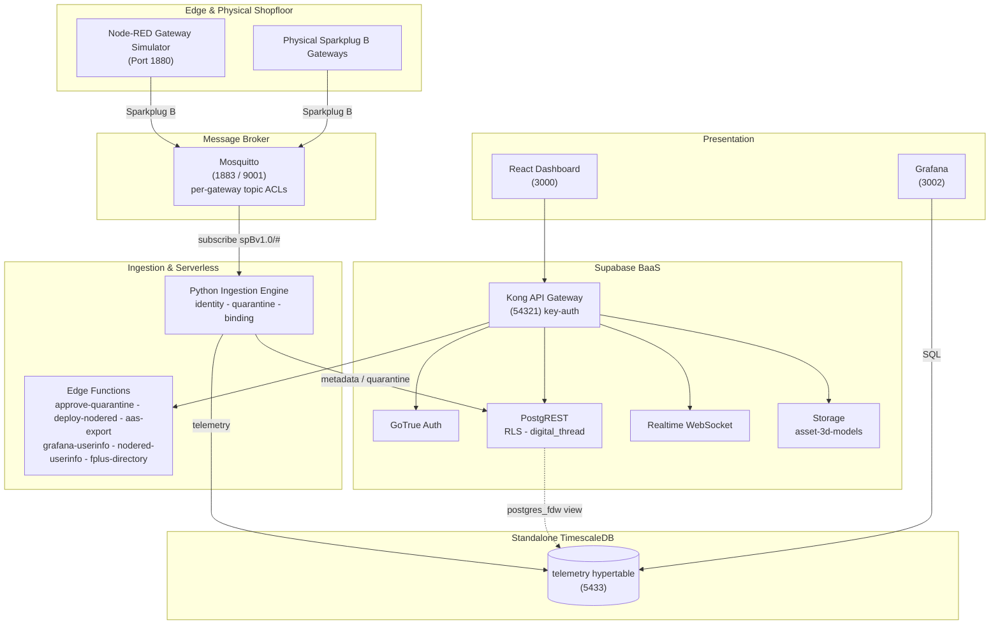

# Factory+ Asset Tracking Platform

[](https://github.com/Harri-Llewelyn/acs-cymru/actions/workflows/ci.yml)

An industrial, asset-centric manufacturing management platform built in alignment with the
**AMRC Connectivity Stack (ACS / Factory+)** framework.

Real-time telemetry streaming, shopfloor cell mapping, zero-touch edge device onboarding,
fine-grained row-level security, continuous Digital Thread audit logging, AAS V3 export, and edge
flow management.

---

## Design Ethos

> **Utilise pre-existing components and standards to deliver the experience. Reduce the number of
> custom components — they are difficult to maintain.**

Where the upstream ACS ships bespoke microservices, this fork uses **Supabase** (Postgres, GoTrue,
PostgREST, Realtime, Storage, Edge Functions), **TimescaleDB**, **Grafana** and **Node-RED**. The
custom surface is deliberately small: one Python ingestion daemon, six edge functions, and a React
dashboard.

The same instinct shows up throughout the design: derived state is computed at read time rather
than stored, gateway staleness is a **view** rather than a cron writer, and AAS is an **adapter**
on the way out rather than an adopted metamodel.

---

## Architecture

**Supabase BaaS** is authoritative for asset metadata (`cells`, `gateways`, `devices`), auth, RLS,
audit triggers and edge functions. **Standalone TimescaleDB** stores the `telemetry` hypertable and
is reached from Supabase through a `postgres_fdw` view. A **Python daemon** consumes Sparkplug B
MQTT, gates unregistered devices into quarantine, and routes metadata and telemetry to their
respective stores. A **React 18 Single Page Application** queries PostgREST directly and subscribes to a Realtime
change feed.

### Topology



### Data flow

1. Devices publish `DBIRTH` / `DDATA` to Mosquitto, confined by ACL to their own edge-node subtree.
2. The ingestion daemon resolves the topic's edge node and device to `sparkplug_id`, verifies the
   device is **bound to the publishing gateway**, and auto-quarantines anything unknown or
   contradictory.
3. Valid telemetry is written to the TimescaleDB hypertable, keyed by `sparkplug_id`.
4. Postgres triggers log every metadata change to the append-only `digital_thread`.
5. The dashboard queries PostgREST and subscribes to Realtime for change notifications.

---

## Deployment targets

**Kubernetes (k3s) is the primary target. Docker Compose stays the local development and debugging
path.** Both are maintained, both are exercised in CI, and neither is deprecated.

| | Docker Compose | Kubernetes (Helm) |
| :--- | :--- | :--- |
| Purpose | Local development, debugging, one-command stack | Deployment |
| Entry point | `docker compose up -d` | `helm install` — see [`deploy/k8s/README.md`](deploy/k8s/README.md) |
| Reachability | Published ports on `localhost` | `*.<publicBaseDomain>` via one Ingress |
| TLS | none | cert-manager, internal CA by default ([`deploy/k8s/internal-ca.yaml`](deploy/k8s/internal-ca.yaml)) |
| MQTT | 1883 plaintext + 9001 WebSockets | the same, plus optional MQTTS on 8883 |
| Conformance check | `ingestion/validate.py` from the host | the same suite, as an in-cluster Job |

The container images, the SQL migrations and the init scripts are **shared substrate** — only the
*wiring* is expressed twice, and the intentional differences are enumerated in a divergence table in
the Kubernetes runbook. Anything not in that table is drift, and CI checks the parts that can be
checked (image tag parity, mirrored config files, and the conformance suite against both).

The design and its reasoning — including why several things are done differently on Kubernetes than
the obvious way — are in [`docs/kubernetes-migration-plan.md`](docs/kubernetes-migration-plan.md).

---

## Quick Start (Docker Compose)

```bash
npm run setup                   # writes .env with 14 FRESHLY GENERATED credentials
                                # (cross-platform, no POSIX shell, no openssl needed)
docker compose up --build -d    # launches the whole stack
```

Every file in `supabase/migrations/` — the schema baseline (`0001`), seed data (`0002`), and the
later additive migrations (`0003` audit immutability, `0004`, `0005`, `0006` Node-RED SSO, `0007`
metric-name format, `0008` Sparkplug group, `0009` withdraws the residual `anon` function grants,
`0010` maps the telemetry rollups and the latest-value view) —
plus demo accounts (`supabase/seed.sql`) are applied by `supabase-db-init` on startup, and
re-applied harmlessly on every later start.

| Interface | URL |
| :--- | :--- |
| React Dashboard | http://localhost:3000 |
| Supabase Studio | http://127.0.0.1:54323 |
| Swagger UI | http://localhost:8088 |
| Node-RED | http://localhost:1880 |
| Grafana | http://localhost:3002 |

Node-RED and Grafana both sign in through Supabase Auth. **Sign in to the React dashboard first** —
the consent step needs your dashboard session, so going straight to either one shows a "sign in
required" prompt rather than a login form. In Node-RED, click **Sign in with Factory+**;
Administrator and Shopfloor_Manager can deploy, Operator and Auditor get a read-only editor.

### Demo accounts

Seeded by [`supabase/seed.sql`](supabase/seed.sql), password `factoryplus123`:

| Email | Role | Access |
| :--- | :--- | :--- |
| `admin@factoryplus.local` | `Administrator` | Full CRUD |
| `manager@factoryplus.local` | `Shopfloor_Manager` | Full CRUD |
| `operator@factoryplus.local` | `Operator` | Read-only + telemetry |
| `auditor@factoryplus.local` | `Auditor` | Digital Thread read-only |

Self-registered accounts get the read-only `Operator` role via the `handle_new_user` trigger; an
`Administrator` must promote them.

> **`.env.example` contains working development secrets** — the standard Supabase demo values.
> They are now also registered as Kong API keys, so **generate fresh secrets for any shared or
> hosted environment** ([issue #8](https://github.com/Harri-Llewelyn/ACS-Cymru/issues/8)).

### Teardown

```bash
docker compose down -v          # also drops volumes, invalidating every logged-in browser
```

---

## Quick Start (Kubernetes)

Full runbook, including the hardening features and every failure mode worth knowing about, in
[`deploy/k8s/README.md`](deploy/k8s/README.md). The short version:

```bash
# Five images are built from this repository and are on no registry.
docker build -f supabase/functions/Dockerfile -t factoryplus/edge-runtime:0.1.0 .   # context: repo root
docker build -f Dockerfile                    -t factoryplus/ingestion:0.1.0 .      # context: repo root
docker build -f node-red/Dockerfile           -t factoryplus/node-red:0.1.0 node-red
docker build -f frontend/Dockerfile --build-arg VITE_RUNTIME_CONFIG=true \
                                              -t factoryplus/frontend:0.1.0 frontend
docker build -f tests/Dockerfile              -t factoryplus/test-runner:0.1.0 .    # conformance suites

node scripts/sync-helm-chart-files.mjs        # mirror repo config into the chart (Helm cannot read outside it)

kubectl create namespace factoryplus
helm install factoryplus deploy/helm/factoryplus -n factoryplus \
  -f deploy/helm/factoryplus/values-dev.yaml --timeout 15m

# NOT `--wait`, which deadlocks the first install: Helm blocks on workload readiness BEFORE
# running post-install hooks, and those hooks are what give PostgREST, GoTrue, Realtime and
# storage-api their database passwords. See deploy/k8s/README.md.
for w in $(kubectl -n factoryplus get statefulset,deploy -o name); do
  kubectl -n factoryplus rollout status "$w" --timeout=10m
done

helm test factoryplus -n factoryplus          # the postgres_fdw gate — seconds, mutates nothing
```

Then seven subdomains on one Ingress: `app.`, `api.`, `nodered.`, `grafana.`, `studio.`, `docs.`,
`mqtt.` — plus a LoadBalancer for **raw MQTT on 1883**, which is TCP and cannot ride an HTTP Ingress.

Two things worth knowing before the first install:

- **`values-dev.yaml` carries the published demo credentials from `.env.example`.** They are in git.
  For anything another person can reach, start from `values-prod.yaml.example` and point
  `secrets.existingSecret` at a Secret managed outside the chart.
- **The chart validates its own values and fails the render, not the pod.** A partial Supabase
  credential set, a Realtime key of the wrong length, a renamed Realtime Service, TLS with
  `scheme: http`, an HPA on a single-writer workload — each of those otherwise produces a stack that
  reports healthy and refuses every request, or a crash loop naming something other than the cause.

---

## Documentation Map

| Directory | Covers |
| :--- | :--- |
| **[`frontend/`](frontend/README.md)** | React 18 architecture, Vite, Realtime integration, derived state, theming, tab conventions |
| **[`supabase/`](supabase/README.md)** | Migration baseline, RLS privilege matrix, triggers, audit immutability, edge functions, Kong |
| **[`ingestion/`](ingestion/README.md)** | Sparkplug B parsing, identity resolution, gateway binding, TimescaleDB mapping, `validate.py` |
| **[`simulators/`](simulators/README.md)** | Node-RED setup, flow provisioning, broker topics, device onboarding walkthrough |
| [`supabase/migrations/archive/`](supabase/migrations/archive) | The 38 pre-beta migrations, preserved for their reasoning. Never executed |
| [`docs/openapi.yaml`](docs/openapi.yaml) | REST API specification rendered by Swagger UI |
| [`grafana/`](grafana) | Datasource, dashboard and alerting provisioning |
| [`timescaledb/`](timescaledb) | Hypertable schema (`init/`, first boot only); `retention.sql` and `aggregates.sql` reconcile compression, retention and the 1m/5m/1h rollups on every boot |
| [`scripts/`](scripts) | Setup, Node-RED seeding, storage bucket, MQTT credentials, vocabulary generation, chart-file sync, image tag parity |
| **[`deploy/k8s/README.md`](deploy/k8s/README.md)** | Kubernetes runbook: install, upgrade, teardown, hardening, the divergence table, and what will bite you |
| [`deploy/helm/factoryplus/`](deploy/helm/factoryplus) | The Helm chart. `values.yaml` documents every setting and why it is not simply a default |
| [`docs/kubernetes-migration-plan.md`](docs/kubernetes-migration-plan.md) | Why the Kubernetes target is built the way it is — the decisions, and the failure each one prevents. Source comments cite it by section |
| [`tests/`](tests) | Vendored IDTA AAS schema, and the conformance test-runner image |

---

## Service Port Directory

| Service | Container | Image | Port |
| :--- | :--- | :--- | :--- |
| `supabase-db` | `factoryplus_supabase_db` | `supabase/postgres:17.6.1.160` | `54322:5432` |
| `supabase-db-roles-init` | `factoryplus_supabase_db_roles_init` | `supabase/postgres:17.6.1.160` | — |
| `supabase-db-init` | `factoryplus_supabase_db_init` | `supabase/postgres:17.6.1.160` | — |
| `supabase-auth` | `factoryplus_supabase_auth` | `supabase/gotrue:v2.189.0` | — |
| `supabase-rest` | `factoryplus_supabase_rest` | `postgrest/postgrest:v12.2.0` | — |
| `supabase-kong-init` | `factoryplus_supabase_kong_init` | `alpine:3.20` | — |
| `supabase-kong` | `factoryplus_supabase_kong` | `kong:2.8.1-alpine` | `54321:8000` |
| `supabase-functions` | `factoryplus_supabase_functions` | `supabase/edge-runtime:v1.74.2` | — |
| `supabase-realtime` | `factoryplus_supabase_realtime` | `supabase/realtime:v2.34.47` | — |
| `supabase-storage` | `factoryplus_supabase_storage` | `supabase/storage-api:v1.11.13` | — |
| `supabase-storage-init` | `factoryplus_supabase_storage_init` | `node:20-alpine` | — |
| `supabase-meta` | `factoryplus_supabase_meta` | `supabase/postgres-meta:v0.96.6` | — |
| `supabase-studio` | `factoryplus_supabase_studio` | `supabase/studio:2026.07.07-sha-a6a04f2` | `54323:3000` |
| `timescaledb` | `factoryplus_timescaledb` | `timescale/timescaledb:2.29.1-pg17` | `5433:5432` |
| `mosquitto-init` | `factoryplus_mosquitto_init` | `eclipse-mosquitto:2.0.20` | — |
| `mosquitto` | `factoryplus_mosquitto` | `eclipse-mosquitto:2.0.20` | `1883`, `9001` |
| `frontend` | `factoryplus_frontend` | `./frontend/Dockerfile` | `3000:3000` |
| `ingestion` | `factoryplus_ingestion` | `./Dockerfile` | — |
| `node-red-init` | `factoryplus_node_red_init` | `./node-red/Dockerfile` | — |
| `node-red` | `factoryplus_node_red` | `./node-red/Dockerfile` | `1880:1880` |
| `grafana` | `factoryplus_grafana` | `grafana/grafana:11.6.1` | `3002:3000` |
| `swagger-ui` | `factoryplus_swagger_ui` | `swaggerapi/swagger-ui:v5.17.14` | `8088:8080` |

---

## Security Model

Fail-closed throughout: edge functions and RLS policies deny by default, and a missing or
unrecognised role produces `403`.

| Layer | Control |
| :--- | :--- |
| **Broker** | `allow_anonymous false`; [`mosquitto.acl`](mosquitto.acl) confines each gateway to `spBv1.0/+/+/<own-id>/#` |
| **Ingestion** | Gateway↔device binding; quarantine gating; append-only historian writes; no default credentials |
| **Gateway** | Kong `key-auth` on `/rest`, `/realtime`, `/storage`, `/functions` — with two documented exemptions |
| **API** | PostgREST JWT verification plus RLS on every table |
| **Database** | `has_role()` reads `user_roles` directly, so revocation is immediate; `digital_thread` is append-only against `service_role` too |
| **Edge functions** | Explicit router allow-list; per-function secret scoping; role resolved from the database, never from a stale JWT claim |
| **Edge automation** | Node-RED's editor, admin API and webhook receiver all authenticate — see below |

### Node-RED is not an open port

The editor and the `/flows` admin API sign in through **Supabase Auth** (OAuth2 + PKCE), and
`POST /hooks/quarantine` requires a signed token. Three separate things, because Node-RED serves
them on separate mounts and securing only the admin API leaves the webhook receiver open.

> **This matters more than it looks.** A Node-RED `function` node runs arbitrary JavaScript inside
> a container that holds the MQTT credential and can reach Mosquitto, Supabase and TimescaleDB.
> Anyone who could replace a flow had remote code execution on the edge host.

Machine callers never share a password. `deploy-nodered` forwards **the operator's own access
token**, which Node-RED re-checks against `user_roles` — so revoking a role takes effect on both
sides at once, without waiting for a token to expire. The quarantine webhook carries a **60-second
token signed per event** by the database, scoped to that one endpoint: a flow can read it out of
`msg.req.headers`, which is exactly why it is not the admin credential and expires in a minute.

`NODERED_ADMIN_TOKEN` remains as opt-in break-glass, empty by default — SSO being down is when you
most need the thing SSO protects.

### Storage is scoped to 3D asset models

`supabase-storage` serves exactly one bucket, `asset-3d-models`, holding the 3D model a device may
carry. That model becomes an AAS `File` element in a `VisualRepresentation` submodel on export,
which is the whole reason binary storage exists here — a shell naming a model it could not serve
would be a broken reference.

> **The bucket is public-read, and that follows from what it is for.** An exported AAS `File` URL
> must be dereferenceable by an arbitrary viewer holding no Factory+ session; a signed URL would
> expire and turn every shell already handed out into a time bomb. So anything in this bucket is
> readable by whoever learns its path, and must carry nothing beyond machine geometry.
>
> **Writes are gated on `device:manage`, not merely on `authenticated`** — an upload changes what a
> shell publishes *and* puts bytes at a public URL. `Operator` and `Auditor` are refused by RLS,
> not merely by a hidden button.

**Document management remains a link registry, not a file store.** The `documents` table holds a
`url TEXT` pointing at an external system. Widening storage to general document upload would be a
separate decision with a different threat model.

Known issues and accepted risks are tracked as
[GitHub issues](https://github.com/Harri-Llewelyn/ACS-Cymru/issues).

---

## Standards

| Standard | Role |
| :--- | :--- |
| **Sparkplug B** | The wire protocol. Identity is `sparkplug_id`, carried in the topic |
| **MTConnect** (2.x) | Machine-tool vocabulary — 249 data item types, 123 subtypes, 100 units, 126 component types |
| **OPC UA** (40001, 40010) | Machinery and robotics companion-specification data points |
| **ISO 22400** | Computed KPIs, which MTConnect and OPC UA deliberately exclude |
| **AAS / IEC 63278** | V3 export as JSON or AASX, validated against the official IDTA schema |

These are **three vocabularies, not three alternatives** — a mixed fleet needs all of them, which
is why the schema builder offers a choice rather than a migration path.

> Adopting the MTConnect vocabulary is not a compliance claim; that requires the Implementer
> License. Locally-minted semantic ids live under `https://factoryplus.local/semantics/…` — the
> namespace is the honesty mechanism, and an id under `mtconnect.org` would assert an
> interoperability that does not exist.

Further vocabularies (OPC 40501, OPC 40450, OPC UA energy, PackML, ASHRAE 223P) and IDTA Submodel
templates are planned but **not built** — the phasing, and the decisions still open, are in
[`docs/vocabulary-expansion-plan.md`](docs/vocabulary-expansion-plan.md).

---

## Testing

```bash
# Frontend — 735 tests
cd frontend && npm test

# Python unit suites — no stack required
python ingestion/test_gateway_binding.py
python ingestion/test_declared_metrics.py
# The Python half of the modelled-metrics mirror contract. Its JavaScript half runs in the
# frontend suite above; both assert tests/fixtures/modelled-metrics.json, which is how two
# implementations of one rule in two languages are held together — see scripts/check-mirror-drift.mjs
# for the mirrors that can be compared as values instead.
python ingestion/test_modelled_metrics_contract.py
python ingestion/test_device_location.py
python ingestion/test_health_heartbeat.py
# Report-by-exception: sparse DDATA must write only the metrics that arrived, and a gap in the
# Sparkplug sequence number must request a rebirth. Both matter far more under RBE than under a
# timer -- a dropped message IS the lost change, and nothing ever restates it. The edge half runs
# in the frontend suite (nodeRedRbe.test.js), which executes the flow's function nodes directly.
python ingestion/test_rbe_telemetry.py
python ingestion/test_mqtt_tls.py
# i3X subscription engine and address-space projection. Covers the sync-acknowledgement and
# queue-overflow MUSTs that the CESMII conformance suite SKIPS when a live run happens to observe
# no value changes -- see i3x/README.md.
python i3x/test_i3x_service.py
python supabase/functions/approve-quarantine/test_approve_quarantine.py
python supabase/functions/deploy-nodered/test_deploy_nodered.py
python supabase/functions/nodered-userinfo/test_nodered_userinfo.py
python supabase/functions/aas-export/test_aas_export.py

# Database suites — need Postgres
python supabase/migrations/test_user_roles_rls.py
python supabase/migrations/test_schema_versioning.py

# End-to-end — needs the running stack
set -a && . ./.env && set +a && unset MQTT_HOST DB_HOST DB_PORT
export MQTT_USER="$MQTT_VALIDATOR_USER" MQTT_PASSWORD="$MQTT_VALIDATOR_PASSWORD"
python ingestion/validate.py
```

CI ([`.github/workflows/ci.yml`](.github/workflows/ci.yml)) runs five jobs:

| Job | Covers |
| :--- | :--- |
| **frontend-build** | Vitest, the mirrored-logic drift guards, production bundle |
| **helm-chart** | `helm lint`, render, API-schema validation, and the chart's guard rails |
| **edge-function-auth-test** | Auth ladders and RLS against a real Postgres |
| **e2e-validation** | Full Docker Compose stack, `validate.py`, live AAS export |
| **k8s-validation** | k3d cluster, `helm test`, the same suites in-cluster, ingress assertions |

**The last two are the real drift control between the two deployment targets.** `validate.py` is
topology-agnostic and runs against both; if both pass, the wiring agrees where it matters. There is
no way to automate "these two topologies describe the same system", and a check claiming to would
pass while they diverged.

See [`ingestion/README.md`](ingestion/README.md#testing) for why `validate.py` needs
`SUPABASE_SERVICE_ROLE_KEY` but must **not** inherit the rest of `.env` — and why running it
**in-cluster needs no overrides at all**.

### Releases

[`.github/workflows/release.yml`](.github/workflows/release.yml) is separate and runs on a **`v*`
tag only** — never on a branch, so nothing about ordinary development reveals it exists.

| Job | Covers |
| :--- | :--- |
| **prepare-release** | Derives the version from the tag, refuses a non-SemVer one, re-runs the static checks a published artefact must not violate |
| **build-images** | The three independent images, in parallel, pushed to GHCR |
| **build-ingestion-chain** | `ingestion`, then `test-runner` **on the same runner** — it is built `FROM` ingestion, so the base must be in the local image store |
| **publish-chart** | Lint, render, package at the tag's version, push over OCI, pull it back |

`build-ingestion-chain` sets up **no Buildx builder**, deliberately. `docker/setup-buildx-action`
selects a `docker-container` builder with its own image store, so a locally-built base becomes
invisible to the build that consumes it and BuildKit falls back to a registry pull — which fails
`403 Forbidden` on a dry run (nothing was pushed) or on a first release (the package is still
private). The error names the registry, not the build order.

The tag is the only place the version is written: it stamps the five image tags, the chart `version`
and the chart `appVersion` in one run. **Images publish before the chart**, because a chart that
names images which do not exist yet does not fail — `helm install` succeeds and six workloads sit
in `ImagePullBackOff` while everything else comes up healthy.

Run it from the Actions tab with `dry_run` ticked to rehearse the whole thing without publishing.
Installation, the one-time GHCR visibility step, and what the release deliberately does *not* do
(no `latest`, no arm64, no signing) are in
[`deploy/k8s/README.md`](deploy/k8s/README.md#publishing-a-release).

---

## Expected Behaviour (not defects)

- **`docker compose down -v` invalidates every logged-in browser.** The `-v` flag drops
  `supabase_db_data`, and with it `auth.sessions`. The dashboard detects this on load, clears the
  stale tokens and returns to the login screen. Just sign in again.
- **Swagger UI's "Example Value" is documentation, not data.** Press **Execute** and read the
  **Response body** panel for real data.
- **Simulated devices appear quarantined on first start.** `Simulated_CNC_01` is auto-registered
  with `is_quarantined = true` by design; an `Administrator` must approve it before telemetry is
  stored.

---

## Contributing

**The reasoning lives next to the thing it constrains**, not in one design document. A migration's
header says why its schema is shaped that way, `values.yaml` says why each setting is not simply a
default, and the component READMEs above carry the rest. Read the file you are about to change
before you change it — several of them record a failure that is not visible from the code.

Some logic is **mirrored across languages** and must be kept in step: `frontend/src/utils/` mirrors
generated columns and views in `supabase/migrations/0001_baseline_schema.sql`, and the edge
functions duplicate two mappers the browser bundle cannot share. Those pairs have drift checks
(`scripts/check-mirror-drift.mjs`, `scripts/check-docs-drift.mjs`,
`tests/test_aas_export.py`) — if you change one side, CI will tell you about the other.

Two rules worth stating up front:

- **`metric_catalog.name` is immutable.** Changing a metric is deprecate-and-supersede, never a
  rename — a device is configured against that exact string.
- **Add schema changes as a new numbered migration.** EVERY migration is replayed on every boot —
  there is no applied-migrations ledger — so a new one must be idempotent. The baseline pair is
  additionally guarded to be a no-op once applied; editing it reaches a fresh database only.

Before packaging a hand-off, tear down volumes and confirm a clean workspace:

```bash
docker compose down -v && git status
```
