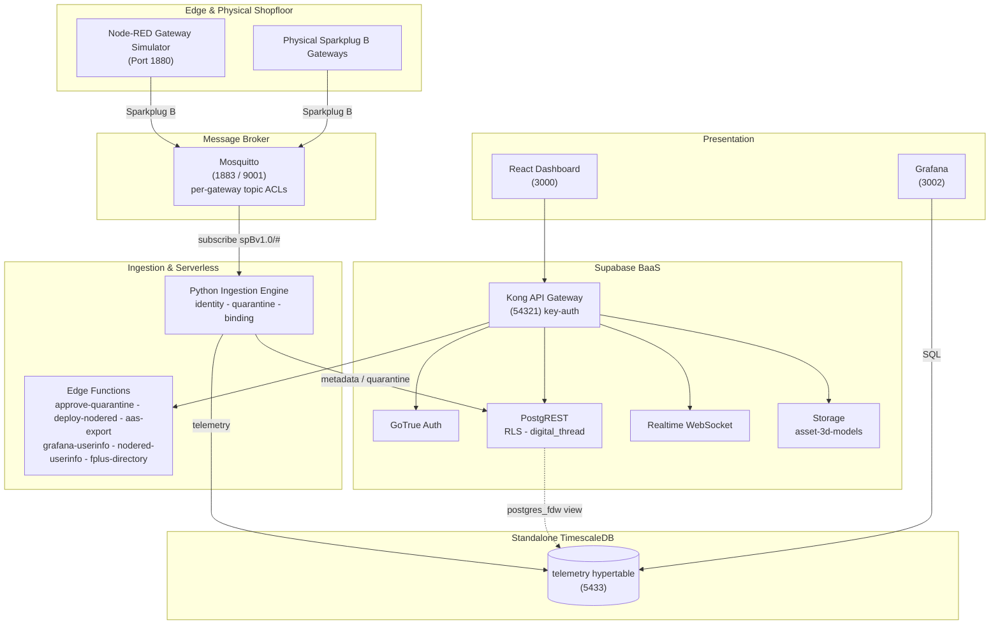

# AMRC Connectivity Stack - Cymru

[](https://github.com/Harri-Llewelyn/acs-cymru/actions/workflows/ci.yml)

An industrial, asset-centric manufacturing management platform aligned with the
**AMRC Connectivity Stack (ACS / Factory+)** framework.

Real-time telemetry streaming, shopfloor cell mapping, zero-touch edge device onboarding,
row-level security, continuous Digital Thread audit logging, AAS V3 export, and edge flow
management.

> **Design ethos —** *use pre-existing components and standards; minimise custom code.*
> Where upstream ACS ships bespoke microservices, this fork uses Supabase, TimescaleDB, Grafana and
> Node-RED. The custom surface is one Python ingestion daemon, six edge functions, an i3X server and
> a React dashboard.

---

## Architecture

**Supabase** is authoritative for asset metadata (`cells`, `gateways`, `devices`), auth, RLS, audit
triggers and edge functions. **Standalone TimescaleDB** holds the `telemetry` hypertable, reached
from Supabase through a `postgres_fdw` view. A **Python daemon** consumes Sparkplug B MQTT, gates
unregistered devices into quarantine, and routes metadata and telemetry to their respective stores.
A **React 18 SPA** queries PostgREST directly and subscribes to a Realtime change feed.

Derived state is computed at read time rather than stored: gateway staleness is a **view**, not a
cron writer, and AAS is an **adapter on the way out**, not an adopted metamodel.



**Data flow.** Devices publish `DBIRTH`/`DDATA` to Mosquitto, confined by ACL to their own edge-node
subtree → ingestion resolves topic to `sparkplug_id`, verifies the device is **bound to the
publishing gateway**, and quarantines anything unknown or contradictory → valid telemetry lands in
the hypertable → Postgres triggers log every metadata change to the append-only `digital_thread` →
the dashboard reads PostgREST and subscribes to Realtime.

---

## Deployment targets

**Kubernetes (k3s) is the primary target; Docker Compose is the local development path.** Both are
maintained, both are exercised in CI, neither is deprecated.

| | Docker Compose | Kubernetes (Helm) |
| :--- | :--- | :--- |
| Purpose | Local development, debugging | Deployment |
| Entry point | `docker compose up -d` | `helm install` — [`deploy/k8s/README.md`](deploy/k8s/README.md) |
| Reachability | Published ports on `localhost` | `*.<publicBaseDomain>` via one Ingress |
| TLS | none | cert-manager, internal CA ([`deploy/k8s/internal-ca.yaml`](deploy/k8s/internal-ca.yaml)) |
| MQTT | 1883 plaintext + 9001 WebSockets | the same, plus optional MQTTS on 8883 |
| Conformance | `ingestion/validate.py` from the host | the same suite, as an in-cluster Job |

Container images, SQL migrations and init scripts are **shared substrate** — only the *wiring* is
expressed twice. Intentional differences are enumerated in the divergence table in the Kubernetes
runbook; anything not in that table is drift. Design rationale is in
[`docs/kubernetes-architecture.md`](docs/kubernetes-architecture.md).

---

## Quick start — Docker Compose

```bash
npm run setup                   # writes .env with 14 freshly generated credentials
docker compose up --build -d    # launches the whole stack
```

Every file in `supabase/migrations/` is applied by `supabase-db-init` on startup and re-applied
harmlessly on every later start: the schema baseline (`0001`), seed data (`0002`), then `0003` audit
immutability, `0004`, `0005`, `0006` Node-RED SSO, `0007` metric-name format, `0008` Sparkplug
group, `0009` withdraws residual `anon` function grants, `0010` telemetry rollups and latest-value
view, `0011` IDTA Digital Nameplate and per-device nameplate data, `0012` permitted values of a
discrete metric, `0013` ASHRAE 223P vocabulary, `0014` repoints locally-minted semantic
identifiers onto the `acs-cymru.local` namespace, `0015` moves the default Sparkplug group to
`ACS-Cymru`, `0016` drops the dashboard's own service-directory entry and renames the Node-RED
one to say it is the simulator, `0018` pre-registers the demonstrator's metric set with each
row's standard and published semantic id, `0019` adds the 223P supply-air-flow metric the
shopfloor simulator needed, `0020` retires the introductory single-device simulator and moves its
schema and IDTA nameplate onto `Sim_CNC_Mill_01`, `0021` gives each shopfloor cell an icon from a
closed set — plus demo accounts (`supabase/seed.sql`).

> **There is no `0017`.** It was drafted as an audit-trigger change guard and then not written,
> because `0005` already implements one; a second declaration of `log_digital_thread_event()`
> would win by filename order on every boot and would have regressed the `actor_source`
> attribution `0005` adds. The gap in the numbering is deliberate and the reasoning is in
> [`supabase/README.md`](supabase/README.md#audit-signal-and-attribution-0005).

| Interface | URL |
| :--- | :--- |
| React Dashboard | http://localhost:3000 |
| Supabase Studio | http://127.0.0.1:54323 |
| Swagger UI | http://localhost:8088 |
| Node-RED | http://localhost:1880 |
| Grafana | http://localhost:3002 |

**Sign in to the React dashboard first.** Node-RED and Grafana both federate to Supabase Auth, and
the consent step needs your dashboard session — going straight to either shows a "sign in required"
prompt rather than a login form. In Node-RED, click **Sign in with ACS-Cymru**; Administrator and
Shopfloor_Manager can deploy, Operator and Auditor get a read-only editor.

**Demo accounts** — seeded by [`supabase/seed.sql`](supabase/seed.sql), password `acscymru123`:

| Email | Role | Access |
| :--- | :--- | :--- |
| `admin@acs-cymru.local` | `Administrator` | Full CRUD |
| `manager@acs-cymru.local` | `Shopfloor_Manager` | Full CRUD |
| `operator@acs-cymru.local` | `Operator` | Read-only + telemetry |
| `auditor@acs-cymru.local` | `Auditor` | Digital Thread read-only |

Self-registered accounts get read-only `Operator` via the `handle_new_user` trigger; an
`Administrator` must promote them.

> **`.env.example` contains working development secrets** — the standard Supabase demo values, also
> registered as Kong API keys. **Generate fresh secrets for any shared or hosted environment.**

Teardown: `docker compose down -v` (also drops volumes, invalidating every logged-in browser).

### Resetting to a clean slate

```bash
npm run stack:reset -- --yes
```

Tears the stack down **with its volumes**, brings it back, waits for the schema to exist rather
than for ports to answer, and re-provisions the four cell gateways — printing their credentials
and writing them to `.env.gateways`, because `mosquitto_passwd` stores only a hash and they cannot
be read back afterwards.

**`--yes` is required and there is no interactive prompt.** A prompt is something people learn to
dismiss without reading, and this is most dangerous once it is familiar. It also refuses outright
when `NODE_ENV=production`, and when `COMPOSE_PROJECT_NAME` names a stack this repository does not
own — so a shell in the wrong directory cannot take down someone else's.

The one thing it exists for that nothing else can do: **`digital_thread` is append-only to every
application role**, so dropping the volume is the only way back to an empty audit trail.

---

## Quick start — Kubernetes

Full runbook in [`deploy/k8s/README.md`](deploy/k8s/README.md). The short version:

```bash
# Five images are built from this repository and are on no registry.
docker build -f supabase/functions/Dockerfile -t acs-cymru/edge-runtime:0.1.0 .   # context: repo root
docker build -f Dockerfile                    -t acs-cymru/ingestion:0.1.0 .      # context: repo root
docker build -f node-red/Dockerfile           -t acs-cymru/node-red:0.1.0 node-red
docker build -f frontend/Dockerfile --build-arg VITE_RUNTIME_CONFIG=true \
                                              -t acs-cymru/frontend:0.1.0 frontend
docker build -f tests/Dockerfile              -t acs-cymru/test-runner:0.1.0 .    # conformance suites

node scripts/sync-helm-chart-files.mjs        # mirror repo config into the chart

kubectl create namespace acs-cymru
helm install acs-cymru deploy/helm/acs-cymru -n acs-cymru \
  -f deploy/helm/acs-cymru/values-dev.yaml --timeout 15m

# NOT `--wait` — it deadlocks the first install. See deploy/k8s/README.md.
for w in $(kubectl -n acs-cymru get statefulset,deploy -o name); do
  kubectl -n acs-cymru rollout status "$w" --timeout=10m
done

helm test acs-cymru -n acs-cymru          # the postgres_fdw gate
```

Serves seven subdomains on one Ingress (`app.`, `api.`, `nodered.`, `grafana.`, `studio.`, `docs.`,
`mqtt.`) plus a LoadBalancer for **raw MQTT on 1883**, which is TCP and cannot ride an HTTP Ingress.

- **`values-dev.yaml` carries the published demo credentials from `.env.example`, and they are in
  git.** For anything another person can reach, start from `values-prod.yaml.example` and point
  `secrets.existingSecret` at an externally managed Secret.
- **The chart validates its own values and fails the render, not the pod** — a partial credential
  set, a wrong-length Realtime key, a renamed Realtime Service, TLS with `scheme: http`, or an HPA
  on a single-writer workload each otherwise produce a stack that reports healthy and refuses every
  request.

---

## Repository map

| Directory | Covers |
| :--- | :--- |
| **[`frontend/`](frontend/README.md)** | React 18 architecture, Vite, Realtime integration, derived state, theming |
| **[`supabase/`](supabase/README.md)** | Migrations, RLS privilege matrix, triggers, audit immutability, edge functions, Kong |
| **[`ingestion/`](ingestion/README.md)** | Sparkplug B parsing, identity resolution, gateway binding, TimescaleDB mapping, `validate.py` |
| **[`simulators/`](simulators/README.md)** | Node-RED setup, flow provisioning, broker topics, onboarding walkthrough |
| **[`i3x/`](i3x/README.md)** | i3X 1.0 server: address-space mapping, subscriptions, connecting a client |
| **[`deploy/k8s/README.md`](deploy/k8s/README.md)** | Kubernetes runbook: install, upgrade, teardown, hardening, divergence table, releases |
| [`deploy/helm/acs-cymru/`](deploy/helm/acs-cymru) | The Helm chart; `values.yaml` documents every setting |
| [`docs/kubernetes-architecture.md`](docs/kubernetes-architecture.md) | Why the Kubernetes target is built the way it is. Source comments cite it by section |
| [`docs/openapi.yaml`](docs/openapi.yaml) · [`docs/i3x-openapi.yaml`](docs/i3x-openapi.yaml) | REST and i3X specifications, rendered by Swagger UI |
| [`supabase/migrations/archive/`](supabase/migrations/archive) | The 38 pre-beta migrations, preserved for their reasoning. Never executed |
| [`grafana/`](grafana) · [`timescaledb/`](timescaledb) | Provisioning; hypertable schema, retention and rollup reconciliation, the read-only BI role |
| [`scripts/`](scripts) | Setup, seeding, vocabulary generation, chart-file sync, drift guards, database backup/restore, gateway provisioning, stack reset, AAS push |
| [`tests/`](tests) | Vendored IDTA AAS schema, conformance test-runner image |

---

## Service port directory

| Service | Container | Image | Port |
| :--- | :--- | :--- | :--- |
| `supabase-db` | `acs-cymru_supabase_db` | `supabase/postgres:17.6.1.160` | `54322:5432` |
| `supabase-db-roles-init` | `acs-cymru_supabase_db_roles_init` | `supabase/postgres:17.6.1.160` | — |
| `supabase-db-init` | `acs-cymru_supabase_db_init` | `supabase/postgres:17.6.1.160` | — |
| `supabase-auth` | `acs-cymru_supabase_auth` | `supabase/gotrue:v2.189.0` | — |
| `supabase-rest` | `acs-cymru_supabase_rest` | `postgrest/postgrest:v12.2.0` | — |
| `supabase-kong-init` | `acs-cymru_supabase_kong_init` | `alpine:3.20` | — |
| `supabase-kong` | `acs-cymru_supabase_kong` | `kong:2.8.1-alpine` | `54321:8000` |
| `supabase-functions` | `acs-cymru_supabase_functions` | `supabase/edge-runtime:v1.74.2` | — |
| `supabase-realtime` | `acs-cymru_supabase_realtime` | `supabase/realtime:v2.34.47` | — |
| `supabase-storage` | `acs-cymru_supabase_storage` | `supabase/storage-api:v1.11.13` | — |
| `supabase-storage-init` | `acs-cymru_supabase_storage_init` | `node:20-alpine` | — |
| `supabase-meta` | `acs-cymru_supabase_meta` | `supabase/postgres-meta:v0.96.6` | — |
| `supabase-studio` | `acs-cymru_supabase_studio` | `supabase/studio:2026.07.07-sha-a6a04f2` | `54323:3000` |
| `timescaledb` | `acs-cymru_timescaledb` | `timescale/timescaledb:2.29.1-pg17` | `5433:5432` |
| `mosquitto-init` | `acs-cymru_mosquitto_init` | `eclipse-mosquitto:2.0.20` | — |
| `mosquitto` | `acs-cymru_mosquitto` | `eclipse-mosquitto:2.0.20` | `1883`, `9001` |
| `frontend` | `acs-cymru_frontend` | `./frontend/Dockerfile` | `3000:3000` |
| `ingestion` | `acs-cymru_ingestion` | `./Dockerfile` | — |
| `node-red-init` | `acs-cymru_node_red_init` | `./node-red/Dockerfile` | — |
| `node-red` | `acs-cymru_node_red` | `./node-red/Dockerfile` | `1880:1880` |
| `grafana` | `acs-cymru_grafana` | `grafana/grafana:13.1.3` | `3002:3000` |
| `swagger-ui` | `acs-cymru_swagger_ui` | `swaggerapi/swagger-ui:v5.17.14` | `8088:8080` |

---

## Security model

Fail-closed throughout: edge functions and RLS policies deny by default, and a missing or
unrecognised role produces `403`.

| Layer | Control |
| :--- | :--- |
| **Broker** | `allow_anonymous false`; [`mosquitto.acl`](mosquitto.acl) confines each gateway to `spBv1.0/+/+/<own-id>/#` |
| **Ingestion** | Gateway↔device binding; quarantine gating; append-only historian writes |
| **Gateway** | Kong `key-auth` on `/rest`, `/realtime`, `/storage`, `/functions` — with **four** documented exemptions ([`supabase/README.md`](supabase/README.md)) |
| **API** | PostgREST JWT verification plus RLS on every table |
| **Database** | `has_role()` reads `user_roles` directly, so revocation is immediate; `digital_thread` is append-only against `service_role` too |
| **Edge functions** | Explicit router allow-list; per-function secret scoping; role resolved from the database, never a stale JWT claim |
| **Edge automation** | Node-RED's editor, admin API and webhook receiver each authenticate separately |

Two consequences worth stating on the front page; both are detailed in
[`supabase/README.md`](supabase/README.md):

- **Node-RED is not an open port.** A `function` node runs arbitrary JavaScript in a container
  holding the MQTT credential, so anyone who could replace a flow had remote code execution on the
  edge host. The editor and `/flows` use OAuth2 + PKCE; `POST /hooks/quarantine` takes a 60-second
  per-event signed token, deliberately not the admin credential, because any flow author can read it
  from `msg.req.headers`.
- **The `asset-3d-models` bucket is public-read**, because an exported AAS `File` URL must resolve
  for a viewer holding no session and a signed URL would turn every shell already handed out into a
  time bomb. Anything in it must carry nothing beyond machine geometry. Writes are gated on
  `device:manage`, not merely `authenticated`.

Known issues and accepted risks are tracked as
[GitHub issues](https://github.com/Harri-Llewelyn/ACS-Cymru/issues).

---

## Standards

| Standard | Role |
| :--- | :--- |
| **Sparkplug B** | The wire protocol. Identity is `sparkplug_id`, carried in the topic |
| **MTConnect** (2.x) | Machine-tool vocabulary — 249 data item types, 123 subtypes, 100 units, 126 component types |
| **OPC UA** (40001, 40001-4, 40010, 30050, 40501, 40540) | Companion-specification data points: machinery, energy, robotics, PackML, machine tools, additive. Generated from OPC Foundation NodeSets by [`scripts/generate-opcua-vocabulary.mjs`](scripts/generate-opcua-vocabulary.mjs) |
| **ISO 22400** | Computed KPIs, which MTConnect and OPC UA deliberately exclude |
| **ASHRAE 223P** | Building-system semantics — 640 concepts from the open223 ontology. ⚠ Still in public review |
| **AAS / IEC 63278** | V3 export as JSON or AASX, validated against the official IDTA schema |

These are **four vocabularies, not four alternatives** — a mixed fleet needs all of them, which is
why the schema builder offers a choice rather than a migration path. All are built, as is the IDTA
Digital Nameplate; what each one covers and how its identity was verified is in
[`docs/vocabularies.md`](docs/vocabularies.md), and the checklist for adding another is in
[`supabase/README.md`](supabase/README.md#adding-a-vocabulary).

> Adopting the MTConnect vocabulary is not a compliance claim; that requires the Implementer
> License. Locally-minted semantic ids live under `https://acs-cymru.local/semantics/…` — the
> namespace is the honesty mechanism, and an id under `mtconnect.org` would assert an
> interoperability that does not exist.

---

## Testing

```bash
# Frontend — 1016 tests
cd frontend && npm test

# Python unit suites — no stack required
python ingestion/test_gateway_binding.py
python ingestion/test_declared_metrics.py
python ingestion/test_modelled_metrics_contract.py
python ingestion/test_device_location.py
python ingestion/test_health_heartbeat.py
python ingestion/test_rbe_telemetry.py
python ingestion/test_mqtt_tls.py
python ingestion/test_audit_write_dedup.py
python ingestion/test_telemetry_batching.py
python i3x/test_i3x_service.py
python supabase/functions/approve-quarantine/test_approve_quarantine.py
python supabase/functions/deploy-nodered/test_deploy_nodered.py
python supabase/functions/nodered-userinfo/test_nodered_userinfo.py
python supabase/functions/aas-export/test_aas_export.py

# Database suites — need Postgres
python supabase/migrations/test_user_roles_rls.py
python supabase/migrations/test_schema_versioning.py
python supabase/migrations/test_digital_thread_guard.py
python supabase/migrations/test_metric_catalog_seed.py
# Needs the TimescaleDB historian (port 5433), not Supabase — the rollups live there
python timescaledb/test_bi_reader_grants.py

# End-to-end — needs the running stack
set -a && . ./.env && set +a && unset MQTT_HOST DB_HOST DB_PORT
export MQTT_USER="$MQTT_VALIDATOR_USER" MQTT_PASSWORD="$MQTT_VALIDATOR_PASSWORD"
python ingestion/validate.py
```

Three suites have a second half elsewhere, and both halves must move together:
`test_modelled_metrics_contract.py` and `test_rbe_telemetry.py` each pair with a JavaScript suite in
the frontend run, and `test_i3x_service.py` covers the sync-acknowledgement and queue-overflow MUSTs
the CESMII conformance suite skips. See [`ingestion/README.md`](ingestion/README.md#testing) and
[`i3x/README.md`](i3x/README.md).

CI ([`.github/workflows/ci.yml`](.github/workflows/ci.yml)) runs five jobs:

| Job | Covers |
| :--- | :--- |
| **frontend-build** | Vitest, the mirrored-logic drift guards, production bundle |
| **helm-chart** | `helm lint`, render, API-schema validation, chart guard rails |
| **edge-function-auth-test** | Auth ladders and RLS against a real Postgres |
| **e2e-validation** | Full Docker Compose stack, `validate.py`, live AAS export |
| **k8s-validation** | k3d cluster, `helm test`, the same suites in-cluster, ingress assertions |

**The last two are the real drift control between deployment targets.** `validate.py` is
topology-agnostic and runs against both; if both pass, the wiring agrees where it matters.

### Releases

[`.github/workflows/release.yml`](.github/workflows/release.yml) runs on a **`v*` tag only** — never
on a branch:

| Job | Covers |
| :--- | :--- |
| **prepare-release** | Derives the version from the tag, refuses a non-SemVer one, re-runs the static checks a published artefact must not violate |
| **build-images** | The three independent images, in parallel, pushed to GHCR |
| **build-ingestion-chain** | `ingestion`, then `test-runner` **on the same runner** — the latter is built `FROM` the former, so the base must be in the local image store |
| **publish-chart** | Lint, render, package at the tag's version, push over OCI, pull it back |

The tag is the single place the version is written — it stamps the five image tags, the chart
`version` and `appVersion` in one run. **Images publish before the chart**, because a chart naming
images that do not exist yet does not fail: `helm install` succeeds and six workloads sit in
`ImagePullBackOff` while everything else comes up healthy. Installation, the one-time GHCR
visibility step, and what a release deliberately does *not* do (no `latest`, no arm64, no signing)
are in [`deploy/k8s/README.md`](deploy/k8s/README.md#publishing-a-release).

---

## Expected behaviour (not defects)

- **`docker compose down -v` invalidates every logged-in browser.** It drops `supabase_db_data`, and
  with it `auth.sessions`. The dashboard clears the stale tokens and returns to the login screen.
- **Swagger UI's "Example Value" is documentation, not data.** Press **Execute** and read the
  **Response body** panel.
- **An unrecognised device appears in the quarantine queue, not on the shopfloor map.** That is the
  zero-touch onboarding path working: a device that announces itself under an id nobody registered
  is held and its telemetry dropped until an `Administrator` approves it. The demonstrator's own
  `Sim_` devices are pre-registered and so bypass it — publish under any other well-formed
  `dev`-prefixed id to see it.

---

## Contributing

**The reasoning lives next to the thing it constrains**, not in one design document. A migration's
header says why its schema is shaped that way, `values.yaml` says why each setting is not simply a
default, and the component READMEs carry the rest. Read the file before you change it.

Some logic is **mirrored across languages** and must be kept in step: `frontend/src/utils/` mirrors
generated columns and views in `supabase/migrations/0001_baseline_schema.sql`, and the edge
functions duplicate two mappers the browser bundle cannot share. CI enforces the pairs it can
compare — `scripts/check-mirror-drift.mjs`, `scripts/check-docs-drift.mjs`, `tests/test_aas_export.py`.

Two rules worth stating up front:

- **`metric_catalog.name` is immutable.** Changing a metric is deprecate-and-supersede, never a
  rename — a device is configured against that exact string.
- **Add schema changes as a new numbered migration.** Every migration is replayed on every boot —
  there is no applied-migrations ledger — so a new one must be idempotent. The baseline pair is
  additionally guarded to be a no-op once applied; editing it reaches a fresh database only.

```bash
docker compose down -v && git status    # before packaging a hand-off
```
