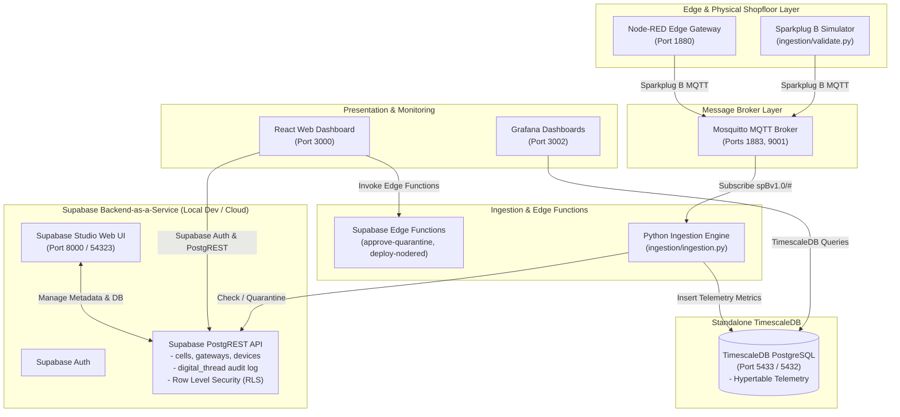

# Factory+ Asset Tracking Platform (Supabase BaaS + Standalone TimescaleDB)

[](https://github.com/Harri-Llewelyn/acs-cymru/actions/workflows/ci.yml)

An industrial, asset-centric manufacturing management platform built in alignment with the **AMRC Connectivity Stack (ACS / Factory+)** framework.

This application provides real-time telemetry streaming, shopfloor spatial mapping, automated Zero-Touch Edge device onboarding, fine-grained Row-Level Security (RLS), continuous Digital Thread audit logging, and Edge flow management.

---

## System Architecture & Design Principles

The platform uses a decoupled architecture combining **Supabase Backend-as-a-Service (BaaS)** with **Standalone TimescaleDB**:

* **Supabase BaaS**: Manages asset metadata (`cells`, `gateways`, `devices`), Supabase Auth, Row-Level Security (RLS) policies, PostgreSQL triggers for automated `digital_thread` audit logging, and TypeScript Supabase Edge Functions.
* **Standalone TimescaleDB**: High-performance time-series database running `timescale/timescaledb:latest-pg15` exposed on port `5433` for `telemetry` hypertable metric storage (schema auto-provisioned via `timescaledb/init/`).
* **Python Ingestion Engine**: Consumes Sparkplug B industrial MQTT messages (`DBIRTH`, `DDATA`), verifying asset registration in Supabase (auto-quarantining unregistered devices) and streaming telemetry metrics directly to TimescaleDB.
* **React Web Dashboard**: React 18 SPA powered by Supabase JS SDK, utilizing direct PostgREST queries, real-time database change channels (`supabase.channel`), and Supabase Auth session management.

### Design Decision: Supabase Storage is Scoped to 3D Asset Models

`supabase-storage` (storage-api) **is** deployed, serving exactly one bucket: `asset-3d-models`,
which holds the 3D visual model a device may carry. That model becomes an AAS `File` element in a
`VisualRepresentation` submodel on export, which is the whole reason binary storage exists here —
a shell that named a model it could not serve would be a broken reference.

> [!IMPORTANT]
> **The bucket is public-read, and that follows from what it is for.** An exported AAS `File`
> element carries a URL that an arbitrary AAS viewer — one holding no Factory+ session — has to be
> able to dereference; a signed URL would expire and turn every shell already handed out into a
> time bomb. So anything placed in this bucket is readable by whoever learns its path, and must
> carry nothing more sensitive than the geometry of the machine.
>
> **Writes are not merely "authenticated."** Uploading a model changes what an exported shell
> publishes *and* puts bytes at a public URL — exactly the authority `device:manage` grants, so
> migration 0035's policies restrict writes to `Administrator` and `Shopfloor_Manager`. A
> read-only `Operator` or `Auditor` is refused by RLS, not merely by a hidden button.

**Document management remains a link registry, not a file store.** The `documents` table still
holds a `url TEXT` column pointing at an external system (SharePoint, Google Drive, any HTTP(S)
URL). Storage was added for 3D models specifically, and widening it to general document upload
would be a separate decision with a different threat model — a public bucket is the wrong home for
arbitrary operational documents.

Three implementation details are load-bearing and each one breaks the feature silently if changed:

* **`supabase_storage_admin` needs a password.** The supabase/postgres image creates the role
  without one; `supabase-db-roles-init` sets it alongside `authenticator` and
  `supabase_auth_admin`. Without it storage-api crash-loops on `28P01 password authentication
  failed` and nothing else reports a problem.
* **The bucket is created by `supabase-storage-init`, not by a SQL migration.** storage-api owns
  the `storage` schema and runs its *own* migrations on boot; the image ships only a stub of it
  with no `public` column at all. `supabase-db-init` replays our migrations long before that, so a
  migration creating the bucket would run against the stub and could not mark it public. The
  policies on `storage.objects` *are* in migration 0035 — that table exists from the stub onward,
  and access control belongs beside the rest of the RLS.
* **The health probe uses `127.0.0.1`, not `localhost`.** The image's resolver answers `localhost`
  with `::1` and storage-api binds IPv4 only, so the probe gets `ECONNREFUSED` against a perfectly
  healthy server and the container never leaves `starting`.

The `storage` entry in `PGRST_DB_SCHEMAS` is no longer vestigial, and Supabase Studio's Storage
page now works.

### System Topology Diagram



---

### Service Port Directory

Running `docker compose up -d` launches the entire unified application stack:

| Service | Container Name | Image / Build Target | Port | Description |
| :--- | :--- | :--- | :--- | :--- |
| **`supabase-db`** | `factoryplus_supabase_db` | `supabase/postgres:15.6.1.143` | `54322:5432` | Authoritative Supabase PostgreSQL BaaS engine |
| **`supabase-db-init`** | `factoryplus_supabase_db_init` | `supabase/postgres:15.6.1.143` | — | One-shot init container applying migrations and seeding `seed.sql` |
| **`supabase-auth`** | `factoryplus_supabase_auth` | `supabase/gotrue:v2.189.0` | — | GoTrue Auth server (connects via least-privilege `supabase_auth_admin` role) |
| **`supabase-rest`** | `factoryplus_supabase_rest` | `postgrest/postgrest:v12.2.0` | — | PostgREST API engine (connects via least-privilege `authenticator` role) |
| **`supabase-kong`** | `factoryplus_supabase_kong` | `kong:2.8.1-alpine` | `54321:8000` | Kong API Gateway (`http://127.0.0.1:54321`) |
| **`supabase-functions`** | `factoryplus_supabase_functions` | `supabase/edge-runtime:v1.74.2` | — | Supabase Deno Edge Runtime executing serverless functions |
| **`supabase-realtime`** | `factoryplus_supabase_realtime` | `supabase/realtime:v2.34.47` | — | WebSocket change feed (Postgres logical replication → `/realtime/v1/`) |
| **`supabase-storage`** | `factoryplus_supabase_storage` | `supabase/storage-api:v1.11.13` | — | Object storage for 3D asset models (`/storage/v1/`); owns and migrates the `storage` schema |
| **`supabase-storage-init`** | `factoryplus_supabase_storage_init` | `node:20-alpine` | — | One-shot init container creating the public `asset-3d-models` bucket via the Storage REST API |
| **`supabase-meta`** | `factoryplus_supabase_meta` | `supabase/postgres-meta:v0.96.6` | — | Schema introspection API backing Supabase Studio's Database pages |
| **`supabase-studio`** | `factoryplus_supabase_studio` | `supabase/studio:2026.07.07-sha-a6a04f2` | `54323:3000` | Supabase Studio administrative Web UI (`http://127.0.0.1:54323`) |
| **`timescaledb`** | `factoryplus_timescaledb` | `timescale/timescaledb:latest-pg15` | `5433:5432` | Standalone TimescaleDB instance for `telemetry` hypertable (schema auto-provisioned via `timescaledb/init/`) |
| **`mosquitto-init`** | `factoryplus_mosquitto_init` | `eclipse-mosquitto:latest` | — | One-shot init container generating Mosquitto password file from environment variables |
| **`mosquitto`** | `factoryplus_mosquitto` | `eclipse-mosquitto:latest` | `1883:1883`, `9001:9001` | Eclipse Mosquitto MQTT broker for Sparkplug B traffic (credentials auto-generated via `mosquitto-init` from `.env`) |
| **`frontend`** | `factoryplus_frontend` | `./frontend/Dockerfile` | `3000:3000` | React Web Dashboard UI (served via NGINX static file server) |
| **`ingestion`** | `factoryplus_ingestion` | `./Dockerfile` | — | Python daemon routing metadata to Supabase & telemetry to TimescaleDB |
| **`node-red-init`** | `factoryplus_node_red_init` | `nodered/node-red:latest` | — | One-shot init container configuring Node-RED flows & credentials |
| **`node-red`** | `factoryplus_node_red` | `nodered/node-red:latest` | `1880:1880` | Edge flow automation runtime |
| **`grafana`** | `factoryplus_grafana` | `grafana/grafana:latest` | `3002:3000` | Analytics dashboards connected to TimescaleDB |
| **`swagger-ui`** | `factoryplus_swagger_ui` | `swaggerapi/swagger-ui:v5.17.14` | `8088:8080` | Interactive API reference (`http://localhost:8088`) |

---

## Sparkplug B Protocol Coverage

The ingestion engine (`ingestion/ingestion.py`) subscribes to `spBv1.0/#` and speaks real Sparkplug B —
`sparkplug_b.proto` is the full, unmodified Eclipse Tahu schema, and `parse_sparkplug_payload()` tries
binary protobuf decoding first. This platform is a **fleet-monitoring dashboard with one-way ingestion**
(device → MQTT → Supabase/TimescaleDB), not a SCADA/MES control system, so it deliberately uses only the
subset of the spec that serves that job. This section documents exactly where that line is drawn, so a
reader integrating a real device — or extending the platform — knows what to expect.

### Asset identity on the wire

Every gateway and device carries an immutable **Sparkplug ID** — a 3-character type prefix (`gwy` /
`dev`) plus 21 lowercase hex characters, 24 in total, e.g. `dev200000000000400080000`. It is a
`GENERATED ALWAYS ... STORED` column derived from the row's UUID primary key
(`supabase/migrations/20260101000014_sparkplug_identity.sql`), so it cannot drift from the record it
identifies and needs no immutability trigger. Each asset's page shows it; click to copy.

```text
spBv1.0/{GroupID}/{MessageType}/{gwy…}[/{dev…}]
```

This is what identity means throughout the platform:

- **Names are labels.** `gateways.name` and `devices.name` are freely editable and no longer `UNIQUE`
  — two cells can both hold a `Pump_01`. Renaming an asset does not detach its telemetry, orphan its
  birth parameters, or cause it to be re-quarantined on the next `DBIRTH`. Before this, identity *was*
  the name, and all three of those happened silently.
- **The topic is authoritative.** The `Asset_ID` payload metric is retained as a cross-check only; if
  it contradicts the topic the device is quarantined rather than one of them quietly winning. `Asset_ID`
  is also absent from alias-encoded `DDATA`, where the topic is the only identity available.
- **`Asset_Name` is a hint, not a write.** It labels a newly discovered device. It is never applied to
  an existing record — otherwise a rename in the dashboard would be stomped on the device's next birth.
- **Malformed IDs are diagnosed, not dropped.** An id with the right prefix but the wrong shape is
  quarantined with an actionable `quarantine_reason`, e.g. *"device id 'devfff…' is 23 characters;
  expected 24 … most likely truncated or padded in the gateway configuration"*. An unrecognised but
  well-formed id is simply a new discovery. That distinction is what the fixed width buys.
- **Third-party devices keep their own id.** Hardware with a factory-preset Sparkplug id cannot be made
  to publish a platform-issued one, so ingestion records what it saw in `devices.reported_identity` and
  resolves against it thereafter.
- **Migration window.** Ingestion still falls back to matching by name, flagging the row
  `identity_source = 'legacy_name'` and logging a throttled deprecation warning, so gateways can be
  reconfigured one at a time. Remove that fallback once the fleet is migrated.

### Messages the platform acts on

`on_message()` (`ingestion/ingestion.py:723-760`) routes six message types to real behaviour:

| Message | Level | Handled by | Effect |
| :--- | :--- | :--- | :--- |
| `NBIRTH` | Node (gateway) | `process_node_message()` | Sets `gateways.status = ONLINE`, stamps `last_heartbeat` |
| `NDATA` | Node (gateway) | `process_node_message()` | Same as `NBIRTH` — refreshes `last_heartbeat` so the gateway isn't marked `STALE` (`frontend/src/utils/gatewayStatus.js`, 90s threshold) |
| `NDEATH` | Node (gateway) | `process_node_message()` | Sets `gateways.status = OFFLINE` |
| `DBIRTH` | Device | `process_dbirth()` | Auto-registers an unrecognized device as quarantined (`is_quarantined = true`); stores birth parameters into `asset_config`; records the declared metric names to `devices.last_birth_metrics` (only when the set changes); stamps `devices.first_dbirth_at` once, on the real first birth |
| `DDATA` | Device | `process_ddata()` | Writes telemetry to the TimescaleDB `telemetry` hypertable — gated: dropped silently for quarantined/unregistered devices |
| `DDEATH` | Device | `process_ddeath()` | Sets `devices.status = OFFLINE` |

`NBIRTH` and `NDATA` are treated identically at the gateway level — there's no separate "define metrics"
step for the node birth. Both are recurring liveness pings as far as this platform is concerned; `NDEATH`
is the only node-level message that changes behaviour.

### Spec features defined in the schema but not used

`sparkplug_b.proto` carries the complete Tahu message definition, but ingestion only ever reads a
metric's `.name`, `.datatype`, and its scalar value field (`double_value` / `string_value` /
`boolean_value`). The following fields arrive on the wire (with a real protobuf-speaking device) and are
simply never read:

| Feature | Proto reference | Purpose in the spec | Status here |
| :--- | :--- | :--- | :--- |
| `seq` (payload sequence number) | `sparkplug_b.proto:223` | Detect dropped/out-of-order messages and trigger a rebirth | Set by every publisher (including `node_red_flow.json`), never checked for gaps |
| `metric.alias` | `sparkplug_b.proto:194` | Numeric shorthand for a metric name, established at birth, to shrink `DATA` payloads | Never used — every message always carries full metric names |
| `metric.is_historical` | `sparkplug_b.proto:197` | Flags backfilled/buffered data so it isn't mistaken for a live reading | Not read. Per-metric timestamps *are* honoured (`process_ddata` uses `metric.timestamp` when present), so backfilled data still lands at the correct time in TimescaleDB — it's just not distinguished from live data anywhere (e.g. no "backfilled" marker in the UI) |
| `metric.properties` / `metadata` | `sparkplug_b.proto:200-201` | Structured per-metric metadata (units, ranges, docs) | Not used — values like `max_temp_threshold` are plain sibling metrics, not properties attached to `temperature` |
| `DataSet` / `Template` | `sparkplug_b.proto:79,108` | Tabular / nested structured metric types (UDTs) | Not used anywhere — only flat scalar metrics appear |
| `bdSeq` | MQTT Last Will and Testament payload | Ties a node's `NDEATH` to its MQTT session so an ungraceful disconnect is caught immediately | Not used. The JSON fallback parser (see below) doesn't even support `long_value`, so it couldn't carry `bdSeq` without a code change |

> [!NOTE]
> The simulator (`node_red_flow.json`) publishes JSON, not binary protobuf. `parse_sparkplug_payload()`
> (`ingestion/ingestion.py:628-662`) falls back to decoding that JSON into the same `Payload`/`Metric`
> objects when protobuf parsing fails, so the simulator's messages are handled identically to a real
> device's once parsed — see `node_red_guide.md` for the full simulator walkthrough.

### Message types the platform never listens for

- **`NCMD` / `DCMD`** (Node/Device Command) — the spec's Host→Edge control channel for pushing commands
  or a "Rebirth" request down to a device. This platform is strictly one-directional; nothing ever
  publishes to a device. A node-level `NCMD` is silently dropped (no `Asset_ID` to resolve, hits the
  early return at `ingestion/ingestion.py:744-745`); a device-level `DCMD` is logged and discarded (the
  `else` branch at `ingestion/ingestion.py:759-760`).
- **`STATE`** (`spBv1.0/STATE/{host_id}`) — the retained topic a Sparkplug "Primary Host Application"
  publishes to announce itself online/offline. The topic is only 3 segments, so it's dropped before
  message-type dispatch even runs (`len(parts) < 4` at `ingestion/ingestion.py:725-726`). This platform
  never announces itself as a primary host.

### Why this is scoped this way

Aliasing, Templates/DataSets, and the command channel all solve problems (bandwidth at scale, structured
complex payloads, two-way control) that a fleet-monitoring dashboard doesn't need. The one gap worth
calling out as a genuine improvement rather than an intentional scope boundary is **`seq` gap detection**:
it's cheap to add and directly improves data integrity (which this platform already cares about — see
fail-closed quarantine gating and the `digital_thread` audit trail) by letting the ingestion engine notice
a dropped message and log/alert on it, rather than silently continuing.

---

## Authentication & Role-Based Access Control (RBAC)

Supabase Auth is the authoritative identity provider for the application. User privileges are determined strictly by server-side role claims stored in `app_metadata.role`:

| Persona / Email | Role Claim | Access Scope |
| :--- | :--- | :--- |
| `admin@factoryplus.local` | `Administrator` | Full read/write access to cells, gateways, devices, and quarantine approvals. |
| `manager@factoryplus.local` | `Shopfloor_Manager` | Operations management, device quarantine approvals, and Node-RED deployments. |
| `operator@factoryplus.local` | `Operator` | Read-only view of shopfloor assets and telemetry. |
| `auditor@factoryplus.local` | `Auditor` | Digital Thread audit trace view. |

> [!IMPORTANT]
> Edge Functions and RLS policies enforce **fail-closed** authorization. Any token missing a valid role claim or containing an unprivileged role (e.g. `Operator`) will receive `403 Forbidden` on administrative mutations such as device quarantine approval.

### Single Sign-On for Grafana

Grafana authenticates against Supabase Auth's OAuth 2.1 server rather than keeping its own
accounts. Roles map from the same `public.user_roles` tables the dashboard and RLS use:

| Supabase role | Grafana org role |
| :--- | :--- |
| `Administrator` | `Admin` |
| `Shopfloor_Manager` | `Editor` |
| `Operator`, `Auditor` | `Viewer` |

`Operator` and `Auditor` both map to `Viewer` because Grafana has no read-only-plus-audit tier;
the Auditor's real privilege is over `digital_thread`, enforced by RLS in Supabase.

Four things about this integration are non-obvious and are load-bearing:

- **`GOTRUE_OAUTH_SERVER_ENABLED` must be `true`.** GoTrue serves
  `/.well-known/openid-configuration` whether or not the OAuth server is on, so a `200` there
  proves nothing — with it off, every endpoint the document advertises returns
  `404 "OAuth server is disabled"`.
- **GoTrue ships no consent UI.** It redirects to `GOTRUE_SITE_URL +
  GOTRUE_OAUTH_SERVER_AUTHORIZATION_PATH?authorization_id=…` and expects the *application* to
  render consent. That page is [`frontend/src/pages/OAuthConsent.jsx`](frontend/src/pages/OAuthConsent.jsx),
  served at `/oauth/consent`. **A user must already be signed in to the Factory+ dashboard for
  Grafana SSO to work**, because approving requires their Supabase access token.
- **The `openid` scope is deliberately not requested.** Asking for it makes GoTrue mint an ID
  token, which it refuses to do: `HS256 is not supported for ID token signing`. This stack is
  HS256 on a shared secret throughout — Kong, PostgREST, Realtime and the pre-minted
  anon/service-role keys all depend on it. Grafana takes identity from `api_url` instead, so
  this is a plain OAuth2 authorization-code flow with PKCE, not strict OIDC.
- **`auth_style = InHeader` is required.** Left to auto-detect, Grafana sends the client secret
  in the POST body and GoTrue rejects it — the client is registered `client_secret_basic`. The
  browser only reports `could not get a token from the provider`.

Role mapping does not come from the token. GoTrue's OIDC claims omit `app_metadata`, so the
`grafana-userinfo` Edge Function reads `public.user_roles` directly. It omits the `role` key
entirely for an unmapped role, which — with `role_attribute_strict = true` — makes Grafana
**refuse** the login rather than silently granting `Viewer`.

---

## Realtime Change Feed

`supabase-realtime` tails the Postgres write-ahead log and pushes changes to subscribed
browsers over `/realtime/v1/`. This replaced a 3-second polling loop on four tabs.

| | Before | After |
| :--- | :--- | :--- |
| Update visible in UI | 0–3000 ms | 42–139 ms (median 110) |
| Quarantine alert | 0–10 000 ms | ~100 ms |
| PostgREST requests per idle dashboard | ~100/min | ~5/min |

Scope is deliberately narrow — the publication carries `cells`, `gateways`, `devices` and
`digital_thread` only:

- **`telemetry` can never be published.** It is a `postgres_fdw` foreign table; its rows enter
  TimescaleDB's WAL, never Supabase's. Adding it would not error, it would silently emit
  nothing. The Telemetry tab keeps paged reads and its explicit refresh control.
- **Realtime evaluates RLS per change, per subscriber.** Metadata churn is fine; anything at
  device message rate is not.
- **`usePolling` is retained at 60 s, not deleted.** Realtime has no replay, so a dropped socket
  loses every change in the gap, and the poll also carries the 401 stop and exponential backoff
  a channel subscription has no equivalent for.
- **The replication slot is created lazily, *after* the client reports `SUBSCRIBED`.** There is
  a brief window in which a client is subscribed and receiving nothing, so `useRealtimeTable`
  reloads once on `SUBSCRIBED` to close it.
- **Wall-clock state still needs a tick.** A gateway going quiet writes nothing, so it emits no
  event; `useClockTick` re-renders every 15 s so staleness is noticed without a refetch.

Set `VITE_ENABLE_REALTIME=false` and rebuild the frontend image to fall back to 3 s polling.
The flag is inlined by Vite at build time — restarting the container is not enough.

---

## Scheduled Maintenance & Event Dispatch

**`pg_cron`** ([`20260101000025_pg_cron_maintenance.sql`](supabase/migrations/20260101000025_pg_cron_maintenance.sql))
runs three janitorial jobs: pruning `net._http_response`, pruning `cron.job_run_details`, and
honouring the archive retention timer. Nothing in it derives application state.

> The archive purge is not a new policy. `auto_delete_at` is set per row by the Archive dialog
> and the UI already promises it (*"Purges: `<date>`"*); nothing had ever implemented it.
> `auto_delete_at IS NULL` means **permanent retention** and is respected.

Gateway staleness is deliberately a **view**, not a cron writer —
[`public.gateway_status`](supabase/migrations/20260101000024_gateway_status_view.sql). A sweep
that wrote `STALE` would append to the immutable `digital_thread` audit table on every tick and
would be correct only between ticks.

> A failing `pg_cron` job is silent. Check it:
> ```sql
> SELECT j.jobname, d.status, d.return_message, d.start_time
> FROM cron.job_run_details d JOIN cron.job j USING (jobid)
> WHERE d.status <> 'succeeded' ORDER BY d.start_time DESC;
> ```

**`pg_net`** fires a webhook when a device *enters* quarantine, delivered to Node-RED at
`POST /hooks/quarantine`. The trigger is split across INSERT and UPDATE and fires only on the
transition — verified not to fire on gateway heartbeats, device renames, approvals, or
re-saving an already-quarantined device.

**Supabase Vault** holds the one secret that must be readable from SQL (the Node-RED admin
token, attached by the webhook dispatcher). Infrastructure credentials — `MQTT_PASSWORD`,
`POSTGRES_PASSWORD` — stay in `.env`: they are needed before the database is accepting
connections, and duplicating them into Vault would create two sources of truth. Vault encrypts
at rest with a key derived from the database; it defeats casual `.env` leakage, not an attacker
holding the data directory.

---

## Database Migrations & Row Level Security (RLS)

All database migrations are stored in `supabase/migrations/`:
- **`20260101000000_init_assets_and_digital_thread.sql`**:
  - **Tables**: `cells`, `gateways`, `devices`, `digital_thread`.
  - **Triggers**: PL/pgSQL function `log_digital_thread_event()` automatically logs audit events on `cells`, `gateways`, and `devices` mutations.
  - **RLS Policies**: Enforces `SELECT` permissions for `authenticated` users, and `INSERT`/`UPDATE`/`DELETE` for `Administrator` and `Shopfloor_Manager` roles.
- **`20260101000001_add_archival_columns.sql`**:
  - **Soft deletion**: Adds `is_archived`, `archived_at` and `auto_delete_at` to `cells`, `gateways` and `devices`. Decommissioning an asset hides it rather than deleting it, so its `digital_thread` history stays attached to a row that still exists. The Archives tab restores them.
- **`20260101000002_add_documents_and_config.sql`**:
  - **Tables**: `documents`, `asset_config`, `schemas`, `directory_services`.
  - **RLS Policies**: Enforces RLS permissions for entity document links, asset parameter configurations, schema registry definitions, and directory services.
- **`20260101000003_add_rbac_permissions.sql`**:
  - **Tables**: `roles`, `permissions`, `role_permissions`, `user_roles`.
  - **Permissions System**: Defines role definitions and fine-grained permission UUIDs (including `digital_thread:read`). Drives frontend UI permission gating (`usePermissions.js`), with distinct permission assignments for `Operator` (`telemetry:read`, `quarantine:view`) and `Auditor` (`digital_thread:read`).
- **`20260101000004_fix_user_roles_rls.sql`**:
  - **RLS Policy Fix**: Replaces overly-broad `user_roles` SELECT policy with `user_roles_select_own_or_privileged`, restricting visibility of `user_roles` records strictly to the record owner (`auth.uid()`) or administrative roles (`Administrator` / `Shopfloor_Manager`).
- **`20260101000005_restrict_digital_thread_access.sql`**:
  - **RLS Policy Restriction**: Replaces permissive `digital_thread_select_authenticated` policy with `digital_thread_select_privileged_or_auditor`, restricting `digital_thread` SELECT access strictly to `Administrator`, `Shopfloor_Manager`, and `Auditor` roles.
- **`20260101000006_immutable_digital_thread.sql`**:
  - **Append-Only Audit Log**: Revokes `INSERT`/`UPDATE`/`DELETE` on `digital_thread` from `authenticated`, so audit rows can only ever be written by the `SECURITY DEFINER` trigger.
- **`20260101000007_rls_has_role_function.sql`**:
  - **Centralised Role Checks**: Introduces `public.has_role(text[])`, backed by `user_roles` rather than raw JWT claims, and rewrites every privileged RLS policy to use it.
  - **JWT Claim Sync**: Adds `public.custom_access_token_hook()` so `app_metadata.role` is refreshed from the database on every token issue/refresh.
- **`20260101000008_handle_new_user.sql`**:
  - **Default Role for Self-Registration**: `AFTER INSERT` trigger on `auth.users` granting new sign-ups the read-only `Operator` role (both a `user_roles` row and `raw_app_meta_data.role`). Seeded personas are left untouched.
- **`20260101000009_gateway_heartbeat_and_service_directory.sql`**:
  - **Gateway Heartbeats**: Adds `gateways.last_heartbeat` (plus `ip_address` and `is_virtual`), written by the ingestion daemon on every Sparkplug B node-level message.
  - **DBIRTH Parameters**: `asset_config` is populated by the ingestion daemon on every `DBIRTH`, upserted per `(asset_id, metric_name)` and keyed by the device's immutable `sparkplug_id`. This is what the Devices page's **Config** button displays — firmware version, serial number, thresholds and interlocks announced in the birth certificate. Recorded for quarantined devices too, so an administrator can inspect what a newly discovered device claims before approving it (DDATA telemetry stays gated).
  - **Device Classification**: Adds `devices.asset_type` and `devices.connection_method`, which the device form has always collected but had nowhere to store.
  - **Edge Node Registration**: Registers the `Virtual_Gateway_NodeRED` edge node published by `node_red_flow.json`, so heartbeats have a matching gateway row on a fresh stack. Its UUID is pinned so the generated `sparkplug_id` (`gwy100000000000400080000`) is stable and the flow can hardcode its topics.
  - **Service Directory**: Completes `directory_services` with every stack service — Supabase Studio, Kong, Auth, PostgREST, Edge Functions, Supabase PostgreSQL, TimescaleDB, and the ingestion engine.
- **`20260101000010_telemetry_foreign_table.sql`**:
  - **Telemetry over PostgREST**: Creates a `postgres_fdw` link to the standalone TimescaleDB and exposes the hypertable as the read-only `public.telemetry` view, granted to `authenticated` only (`anon` gets `401`). This is how the dashboard reads real time-series data — TimescaleDB itself is not reachable from the browser.
  - **`security_invoker = true`**: the view runs with the querying role's own privileges rather than the view owner's (`postgres`), avoiding Supabase Advisor's Security Definer View finding. A `FOR PUBLIC` user mapping plus `GRANT`s on the underlying foreign table give `authenticated`/`service_role` their own path through the FDW — every authenticated user still sees the same unfiltered telemetry as before, only whose privileges enforce the read has changed.
  - Connection settings arrive as `psql -v` variables from `supabase-db-init`; the defaults match `docker-compose.yml`, so the file is still runnable standalone.
- **`20260101000011_advisor_hardening.sql`**:
  - **Closes remaining Supabase Advisor findings**: revokes `anon`'s residual `SELECT` on every RBAC table — an unused grant surviving Supabase's cluster-init defaults, not something any migration had explicitly requested. RLS already returned zero rows to `anon` on all of them, so this only closes `pg_graphql` schema-introspection exposure, not an actual data leak.
  - **Locks down `SECURITY DEFINER` functions**: revokes `EXECUTE` from roles that never legitimately call them directly — `custom_access_token_hook`, `handle_new_user`, and `log_digital_thread_event` from `anon`/`authenticated` entirely (trigger/auth-hook-only functions), and `has_role` from `anon` only (`authenticated` keeps it, since RLS policies invoke it from their own `USING`/`WITH CHECK` clauses).
- **`20260101000012_device_provisioning_tracking.sql`**:
  - **Provisioning tracking**: Adds `devices.first_dbirth_at`, written exactly once by the ingestion daemon on a device's real first `DBIRTH`. Distinguishes "provisioned but never seen" from "was online, then went offline" — both previously looked identical (`status = 'OFFLINE'`). The Devices tab flags a device **AWAITING FIRST BIRTH** once more than 24h have passed since provisioning with no birth received (computed client-side, same pattern as gateway heartbeat staleness — see `frontend/src/utils/deviceProvisioning.js`).
  - **Schema linkage**: Adds `devices.schema_id`, optionally linking a device to a `schemas` row.
  - **Quarantine suggested-match**: when an unrecognized device lands in quarantine, it's compared against every provisioned-but-never-seen device by similarity of its reported name, and — if a candidate has a schema assigned — by overlap between the schema's required metrics and what the quarantined device actually reported. A match surfaces as a "did you mean...?" suggestion in the approval modal; accepting it re-keys the quarantined device's `asset_config` history onto the provisioned device, absorbs its status, and discards the quarantined row, rather than treating a device that announced an unexpected id as a brand new device (see `approve-quarantine` below).
- **`20260101000013_metric_catalog.sql`**:
  - **Metric catalog**: A registry of individually-defined Sparkplug B metrics (name, Sparkplug datatype, description) that schemas are built from via the Schemas tab's **Build Schema from Catalog** flow — pick metrics, then either download a JSON spec sheet (the metric list plus the exact topic string an integrator's device should publish to) or provision a device with the resulting schema already attached.
  - **Append-only by design**: a metric's `name`/`datatype` are immutable once created, enforced by a `BEFORE UPDATE` trigger (not just the UI) — a physical device is already configured to publish under that exact name, so "editing" a metric means deprecating it and adding a new catalog entry, never rewriting one in place. Mirrors `digital_thread`'s append-only philosophy.
- **`20260101000015_birth_metric_observation.sql`**:
  - **Birth-declared metrics**: Adds `devices.last_birth_metrics` (plus `last_birth_metrics_at`), the metric names a device declared in its most recent `DBIRTH`, written by the ingestion daemon. Whether any of them fall outside the device's assigned schema is **derived at read time** (`frontend/src/utils/deviceTags.js`), never stored — so adding the metric to the schema clears the finding on the next poll rather than at the device's next birth, which for a stable device could be weeks away.
  - **Written only on change**: `log_digital_thread_event()` fires on every UPDATE to `devices`, so rewriting an unchanged array on every rebirth would append an audit row each time to a deliberately append-only table. Each entry in the thread therefore marks a real change in what the device publishes.
  - **Distinct from `asset_config`**, which is a per-metric upsert of birth parameter *values* and is never pruned — it accumulates every metric ever seen and omits metrics declared without a value. This column is a faithful snapshot of the names declared at the most recent birth. `NULL` means no birth observed; `[]` means a birth that declared nothing.
  - A device with **no schema**, or one whose `schema_definition` declares neither `properties` nor `required`, is never flagged: "publishes beyond its model" and "has no model" are different findings, and conflating them would flag every unschematised device until the tag meant nothing.
  - The Devices tab shows an **N unmodelled** marker on such a device, counts it under **Needs attention**, and offers a *Publishing unmodelled metrics* status filter; the Config modal lists the offending metrics as **Unmodelled** alongside the schema's `Present`/`Missing` rows.
- **`20260101000016_metric_group.sql`**:
  - **Metric grouping**: Adds `metric_catalog.metric_group`, a `GENERATED ALWAYS ... STORED` column holding the first path segment of the metric name — `Axes/C/ANGLE` and `Axes/X/POSITION` both group under `Axes`. The Schemas page's catalog table and the **Build Schema from Catalog** picker both render by group, so the registry stays navigable as it grows.
  - **The separator is `/`, not `.`**, because that is what everything this platform interoperates with already uses for hierarchy: Sparkplug B's own reserved names (`Node Control/Rebirth`, `Properties/Hardware Make`), Factory+ folders (which forbid `.` in a metric name segment outright), and MTConnect component paths (`Axes/C/ANGULAR_VELOCITY`). Metric names are immutable once issued, so this had to be settled before any were created. The migration detects a column generated by an earlier `.`-based revision of itself and rebuilds it, since `ADD COLUMN IF NOT EXISTS` would otherwise silently leave a stale definition in place on a stack that had already been started.
  - **The group lives in the name, not a column of its own.** The name is the wire contract, so a name-carried group is visible everywhere the metric is — raw MQTT, `telemetry.metric_name` in TimescaleDB, and **Grafana, which queries TimescaleDB directly and can never see a Supabase-side category column**. Generated rather than written, matching `sparkplug_id` (migration 0014): it cannot drift from the name, and needs no trigger to keep it honest.
  - **Recategorising costs what renaming costs.** `enforce_metric_catalog_immutability()` already makes `name` immutable, so a metric's group is immutable too — moving one means deprecating the entry and adding a new one. That is the correct price for a change that alters what a physical device must publish.
  - **Not constrained**: no `CHECK` requires a separator. Metric names are immutable, and a device may legitimately publish an ungrouped one — the two local extensions seeded by migration 0013 (`safety_interlock`, `max_temp_threshold`) are exactly that. A name with no separator yields `NULL` and is listed under **Ungrouped**; only the *first* segment is load-bearing, or the vocabulary would be unbounded — the thing grouping exists to fix.

- **`20260101000017_metric_group_vocabulary.sql`**:
  - **Group vocabulary**: Adds `metric_groups`, a curated registry of approved group *spellings* seeded with `Robot`, `Environmental`, `Process`, `OEE`, `Safety`, `Diagnostics`, `Energy`. It does **not** store any metric's group — that is still derived from the metric's name by migration 0016's generated column. The registry exists so the Add Metric form has a vocabulary to offer before any metric uses a group, and so there is an authority on how each group is spelled.
  - **Composed, not typed**: the Add Metric form now builds the name from a group picker plus the rest of the name, previewing the composed result (`Axes` + `C/ANGLE` → `Axes/C/ANGLE`) because that string is what devices publish and can never be edited afterwards.
  - **Spelling guard, enforced in the database**: `enforce_metric_group_spelling()` rejects a metric whose group differs only in case from one already known — checking both the registry *and* groups already in use, so a group that arrived via the API still governs what follows it. The error names the corrected name to use. Because metric names are immutable, letting `Robot` and `robot` both land would fork the taxonomy permanently, fixable only by deprecating every metric on one side and reconfiguring the physical devices behind them — too costly a mistake to leave to a UI-only check. Ungrouped names remain permitted.
  - `metric_groups.name` is `UNIQUE` on `lower(name)` and `CHECK`-constrained to a single segment (no separator, not blank).

- **`20260101000018_mtconnect_vocabulary.sql`** *(generated — `node scripts/generate-mtconnect-vocabulary.mjs`)*:
  - **MTConnect vocabularies**: Seeds `mtconnect_vocabulary` from the Apache-2.0 [mtconnect/schema](https://github.com/mtconnect/schema) repository — **249 data item types** (96 `SAMPLE`, 147 `EVENT`, 6 `CONDITION`), 123 subtypes, 100 units, and 126 component types. Adds `category`, `units`, `sub_type` and `standard` to `metric_catalog`.
  - **A vocabulary, not a catalog.** An MTConnect data item type is not a metric name: `ANGLE` is a *type*, and the metric a device publishes is a component path plus that type — `Axes/C/ANGLE`. Which axes exist is per-device, so the standard can enumerate the words, never the metrics. `metric_catalog` keeps its meaning (what this deployment's devices actually publish, immutable and append-only) and the Add Metric form composes names from this table.
  - **Generated, not transcribed**: the migration is emitted by a committed script, so adopting a newer MTConnect release is a re-run rather than a re-typing, and the provenance of all 598 rows is auditable.
  - **Group vocabulary repointed** at MTConnect's component types, replacing the seven hand-picked placeholders from 0017. `Environmental` and `Process` are genuine MTConnect components and survive; `OEE` is retained under **ISO 22400**. The others are removed only if nothing uses them — a group with metrics behind it has immutable names that must not be pulled out from under it.
  - **Local extensions stay possible.** MTConnect permits extension, so `standard` is nullable and the form offers a *Not in MTConnect…* escape. Only `category` is `CHECK`-constrained, to its three legal values.

> [!IMPORTANT]
> **MTConnect's `AVAILABILITY` is not ISO 22400 availability.** MTConnect defines it as an `EVENT`
> meaning *the device is connected and reporting*; the catalog's `availability` is the OEE
> availability **ratio**. Mapping one onto the other would silently corrupt the Grafana OEE
> dashboards and alert rules. MTConnect deliberately reports raw machine state and leaves KPI
> computation out, so `availability` / `performance` / `quality` stay on ISO 22400.

> [!NOTE]
> Adopting the vocabulary is **not a claim of MTConnect compliance**, which requires the MTConnect
> Implementer License. The Apache-2.0 schema repository is the source of these values; the
> specification documents carry separate terms.

- **`20260101000019_mtconnect_catalog_migration.sql`**:
  - **Moves the starter catalog onto MTConnect**, and the OEE metrics onto ISO 22400.
  - **Not a rename — a deprecation.** `metric_catalog.name` is immutable, because a physical device is already configured to publish that exact string. Each old entry is marked `deprecated` with `superseded_by` pointing at its replacement, so the Schemas tab shows it struck through with the successor named. That is the migration instruction for anyone with a device still publishing the old name.

| Was | Now | Category | Confidence |
| :--- | :--- | :--- | :--- |
| `temperature` | `Systems/TEMPERATURE` | `SAMPLE` | exact |
| `firmware_version` | `Controller/FIRMWARE` | `EVENT` | exact |
| `serial_number` | `SERIAL_NUMBER` | `EVENT` | exact (device-level identity, so no component) |
| `vibration` | `Axes/DISPLACEMENT` | `SAMPLE` | **judgement** — MTConnect has no `VIBRATION`; the catalog described this as amplitude, which is a displacement. If the reading is really rate-of-change, `ACCELERATION` is correct instead. |
| `status` | `Controller/EXECUTION` | `EVENT` | **judgement** — values change too |
| `safety_ok` | `Controller/EMERGENCY_STOP` | `EVENT` | **judgement** — values change and the sense inverts |
| `availability` | `OEE/AVAILABILITY` | — | ISO 22400, **not** MTConnect |
| `performance` | `OEE/PERFORMANCE` | — | ISO 22400 — itself superseded by `OEE/EFFECTIVENESS` in migration 0032 |
| `quality` | `OEE/QUALITY` | — | ISO 22400 |
| `safety_interlock` | *(unchanged)* | `EVENT` | local extension — MTConnect has only `AXIS_`/`CHUCK_`/`SPINDLE_INTERLOCK` |
| `max_temp_threshold` | *(unchanged)* | `SAMPLE` | local extension — MTConnect models limits as constraints on a data item, not as data items |

> [!WARNING]
> **Two of these change the value vocabulary, not just the name.** MTConnect constrains
> `EXECUTION` to `READY`/`ACTIVE`/`INTERRUPTED`/`FEED_HOLD`/`STOPPED`/… and `EMERGENCY_STOP` to
> `ARMED`/`TRIGGERED` — and `EMERGENCY_STOP` **inverts the sense** of `safety_ok` (`true` becomes
> `ARMED`) while changing Sparkplug datatype 11 (Boolean) to 12 (String). Renaming without moving
> the values would produce metrics that *look* standard and are not, which is worse than the
> ad-hoc names they replace. `node_red_flow.json`, the Grafana alert rule, and the Overview tab's
> device-health logic all read these values and were updated together — the boolean tests against
> them would otherwise have compared `NULL`, evaluated false, and silently stopped alerting.

- **`20260101000020_drop_superseded_metrics.sql`**:
  - **Deletes the nine superseded entries outright**, rather than leaving them deprecated-but-present. Deprecation with `superseded_by` is the right treatment for a platform with devices in the field — an integrator whose hardware still publishes `temperature` needs to find that name and be told what it became. This is a development deployment with no production data, so they are noise instead. Migration 0013's seed is trimmed to match, so a fresh stack never creates them and the delete is not re-fighting an insert on every restart.
  - Safe by construction: the only foreign key into `metric_catalog` is its own `superseded_by`, and `schemas`, `asset_config` and `telemetry` all key on the metric *name* as free text.
- **`20260101000021_register_simulated_device.sql`**:
  - **Pins the demo device's identity.** `Simulated_CNC_01` is registered with UUID `20000000-0000-4000-8000-000000000002`, the one behind the documented wire id `dev200000000000400080000`. Previously it was auto-discovered, and since `sparkplug_id` is generated from the primary key, every rediscovery minted a *new* wire identity and therefore a new `telemetry.asset_id` — silently detaching all previously recorded samples from the device that produced them. Same pinning rationale as the `Virtual_Gateway_NodeRED` edge node in migration 0009.
  - **Assigns it a schema.** Device type tags, the unmodelled-metric finding, and the tag filters on the Devices, Telemetry and Digital Thread pages are all derived from the assigned schema. With none assigned they were all correctly empty — which left every one of those features invisible on a fresh stack, looking broken rather than unused.
  - **Still quarantined.** `is_quarantined = TRUE` preserves the Zero-Touch onboarding demo: an Administrator still approves the device before its telemetry is stored. The difference is the row now exists up front *with its schema attached*, so approving it lights up tags, unmodelled detection, telemetry and the Grafana dashboards together.

- **`20260101000029_semantic_identifiers.sql`** *(AAS Phase 1)*:
  - **Adds `semantic_id` and `semantic_id_type` to `metric_catalog` and `schemas`** — nullable, additive, no behaviour change. This is the one part of the Asset Administration Shell metamodel (IEC 63278) that carries information this database did not already hold: a metric's name is a Sparkplug wire contract, its group is a display taxonomy, and its MTConnect facets describe how it behaves, but none of them say which *concept* it is an instance of. Two deployments both publishing `Axes/C/ANGLE` agree only by convention until something resolvable says so.
  - **Why two columns rather than an AAS metamodel.** A native `Submodel`/`SubmodelElement` hierarchy is an adjacency list with a type discriminator — EAV — which would make RLS recursive, introduce a third identifier namespace beside `name` and `sparkplug_id`, and add a fourth type system beside Sparkplug codes, JSON Schema types and MTConnect units. These columns are what an AAS *export* layer reads to emit `semanticId` on each element, at ~2% of the cost.
  - **Deliberately mutable**, unlike `name`/`datatype`. A semantic id is not on the wire — it is an assertion *about* the metric, and crosswalk mappings get corrected. Freezing it would mean deprecating a metric, and reconfiguring a physical device, to fix a mistyped IRI. A `DO` block at the foot of the migration inserts a probe row and asserts the update succeeds, so a later edit widening `enforce_metric_catalog_immutability()` fails the migration instead of silently making semantic ids unfixable.
  - `semantic_id_type` is `CHECK`-constrained to `IRI` / `IRDI` / `ModelReference`. Unlike `units` or `standard` this is a closed set in the standard, and an out-of-set value would produce an invalid AAS Reference at export time — the expensive place to find out.
  - **MTConnect metrics are deliberately left unmapped.** MTConnect publishes no per-data-item-type IRI or IRDI and no maintained crosswalk to ECLASS or IEC CDD is known, so a minted value would be a local identifier wearing a standard's name — worse than `NULL`, which honestly reads as "not mapped".

- **`20260101000030_iso22400_vocabulary.sql`**:
  - **Seeds `iso22400_vocabulary`** with eight KPI definitions — availability, performance, quality, OEE, scrap ratio, utilization, MTBF, MTTR — each with its ISO symbol, formula, unit, family and semantic id. Registers `Quality`, `Utilization` and `Maintenance` as metric groups (`OEE` already existed), and backfills the semantic ids of the three `OEE/*` metrics migration 0019 created.
  - **A vocabulary, not a catalog**, same as `mtconnect_vocabulary`: `AVAILABILITY` here is a KPI definition; `OEE/AVAILABILITY` in `metric_catalog` is a metric a device publishes.
  - **The vocabulary uses ISO's own terminology**, including `EFFECTIVENESS` for the second OEE factor that industry almost always calls Performance. The description records the industry term so the entry is still findable by the word most people search for. Migration 0032 brings the catalog into line.

- **`20260101000031_opcua_vocabulary.sql`**:
  - **Seeds `opcua_vocabulary`** with 25 data points from the OPC UA companion specifications — 10 from **OPC 40001 (Machinery)** and 15 from **OPC 40010 (Robotics)** — each with its browse path, OPC UA datatype, unit and semantic id. Registers `Machine` and `MotionDevice` as metric groups; `Controller` is reused from MTConnect rather than forked.
  - **This is the vocabulary for the assets MTConnect does not cover.** MTConnect is a machine-tool standard; articulated arms, AGVs and general machinery identification are modelled in OPC UA companion specs. A mixed research fleet of CNCs, robots, AGVs and sensors needs all three standards, which is why the builder offers a choice rather than a migration path between them.
  - **The group is derived from the browse path**, not from a hardcoded spec→group map: an OPC UA browse path is already `/`-delimited, which is one of the reasons `/` was chosen as the metric group separator. `MotionDevice/Axes/Axis/ActualPosition` yields the group `MotionDevice`.

> [!WARNING]
> **`opcua_vocabulary.node_id` holds a browse path, not a resolvable numeric NodeId.** A real OPC UA
> NodeId is namespace-index plus identifier, and the numeric identifiers are assigned by each
> companion spec's published **NodeSet2 XML**, which is not vendored here. The migration therefore
> records the browse path in valid `ExpandedNodeId` string form (`nsu=<namespace>;s=<BrowsePath>`)
> rather than asserting numeric ids it cannot check. Resolve the numeric ids from the official
> NodeSet2 files before wiring an actual OPC UA client. The browse names themselves are transcribed
> from the specifications and should be confirmed against the same files — both OPC 40001 and
> OPC 40010 have revised structure across releases.

> [!NOTE]
> **ISO 22400 and OPC UA semantic ids are derived, not issued.** ISO publishes no resolvable IRIs
> for the 22400 KPIs and no maintained ECLASS/IEC CDD crosswalk for them is known, so those ids are
> minted in a stable local namespace (`https://factoryplus.local/semantics/iso22400/…`) — honest
> local identifiers, replaceable wholesale by an `UPDATE` if a published crosswalk appears, but not
> ISO-issued and not to be presented as such. The OPC UA ids are the companion spec's **namespace
> URI plus browse name**, which is a well-formed IRI derived from an identifier the OPC Foundation
> does publish, but is not a concept URI it registers or resolves. The ISO 22400 formulas are
> recorded in the standard's symbol language and `kpi_id` holds the KPI **symbol**, not a clause
> number — no clause numbers are asserted, because the standard is paywalled and they could not be
> checked. Confirm all of this against the published texts before quoting them in a deliverable.

- **`20260101000032_effectiveness_and_mtconnect_semantics.sql`**:
  - **`OEE/PERFORMANCE` → `OEE/EFFECTIVENESS`**, matching ISO 22400-2's own term. **This is not a rename and cannot be one** — `metric_catalog.name` is immutable (`enforce_metric_catalog_immutability()`, migration 0013), because a physical device is configured to publish that exact string, so an `UPDATE ... SET name` raises. The old entry is marked `deprecated` with `superseded_by` pointing at the new one, which is what the Schemas tab renders struck through with its successor named — that row *is* the migration instruction for anyone with a device still on the old name.
  - **Both metrics carry the same `semantic_id`.** They are two names for one ISO 22400 concept, which is precisely what a `semanticId` exists to express, and why the index on it is deliberately not unique. An AAS export of historical data can still say what the retired metric meant.
  - **The schema keeps both names.** `ISO-22400-OEE-Schema` gains `OEE/EFFECTIVENESS` in `properties` while retaining `OEE/PERFORMANCE`; `required` is untouched. Dropping the old name would make every device still publishing it report as **Unmodelled** the instant the migration ran — flagging a device for doing exactly what it was provisioned to do. Re-applied here rather than edited into 0019, whose `UPDATE` is unconditional and replays on every boot.
  - **MTConnect metrics are now mapped**, in this deployment's own namespace rather than left `NULL`: `https://factoryplus.local/semantics/mtconnect/v2.0/<metric name>`. The earlier objection was to minting ids in *MTConnect's* namespace, which would assert an interoperability that does not exist; `factoryplus.local` says plainly whose identifier it is, exactly as the ISO 22400 ids already do. A local id is stable, deterministic and emittable by an AAS export today — it just does not make two organisations agree, and a published crosswalk would replace all of them with one `UPDATE`.
  - **Two levels, deliberately.** `mtconnect_vocabulary.semantic_id` is the *concept*, scoped by kind (`…/v2.0/DataItemType/ANGLE`) because a component and a data item type could share a name and `(kind, name)` is the table's key. `metric_catalog.semantic_id` is the *observation*, built from the whole metric name (`…/v2.0/Axes/C/ANGLE`) because a catalog entry is a specific data item on a specific component path — which is what an AAS `SubmodelElement` corresponds to.
  - The vocabulary column is **derived by expression, not listed**, so a regenerated 0018 — a `GENERATED` file that must never be hand-edited, and which CI diff-guards — is re-covered automatically on the next replay. Backfills are scoped `WHERE semantic_id IS NULL` so a hand-corrected id is never stamped over; `semantic_id` is mutable precisely so it can be corrected. Local extensions stay unmapped, since `standard` is NULL for them because no standard describes them.

> [!NOTE]
> **The MTConnect namespace pins `v2.0` — the major line, not `SCHEMA_VERSION` (currently `2.8`).**
> A semantic id whose value changed every time the vocabulary was regenerated would defeat the
> purpose of having a stable identifier; the major version is the granularity at which the concepts
> themselves actually change.

- **`20260101000033_cnc_tri_standard_schema.sql`**:
  - **Replaces the two seeded demo schemas with one tri-standard schema**, `Simulated_CNC_01_Schema`, assigned to the demo device. `devices.schema_id` is 1:1, so splitting MTConnect observations and ISO 22400 KPIs across two schemas meant a device could be modelled by one or the other, never both — and every derived feature reads the assigned schema: device tags, the unmodelled finding, and the tag filters on three pages. A real asset publishes across standards, so the default has to as well.
  - Adds the catalog metrics the schema needs — `Axes/C/ANGLE`, `Machine/OperatingMode`, `MotionDevice/OverridePercent` — and gives the two local extensions semantic ids under `…/semantics/local/`, since the brief requires every metric in the schema to carry one. A local concept getting a local identifier is the honest case, not an exception to 0032's rule.
  - **Ends with an assertion, not a claim**: a `DO` block raises if any metric named in the schema is missing from `metric_catalog`, deprecated, or has a NULL `semantic_id`. Editing the schema definition without adding the catalog entry fails the migration rather than shipping a schema no device could be provisioned against.
  - Also fixes a **pre-existing audit leak in 0021**: its `ON CONFLICT (id) DO UPDATE` fired `log_digital_thread_event()` whether or not any value differed, appending one row to an append-only table on every boot. Now guarded with `IS DISTINCT FROM`, and 0021 resolves the schema by name so it and 0033 agree instead of moving the device back and forth each boot.

> [!NOTE]
> **Two deliberate deviations from the requested metric list.** `Execution/EXECUTION` is recorded as
> **`Controller/EXECUTION`** — `Execution` is not an MTConnect component, `Controller` is, and
> `Controller/EXECUTION` already exists, is what the simulator publishes, and is read by name in the
> Grafana overview dashboard and `OverviewTab`'s `getDeviceStatusColor`. And the two OPC UA metrics
> keep the requested *names* while carrying the companion specification's own concept as their
> **semantic id** (`Machine/OperatingMode` → `…/Machinery/MachineryOperationMode`,
> `MotionDevice/OverridePercent` → `…/Robotics/SpeedOverride`). That is precisely what a
> `semanticId` is for: a locally-chosen name bound to a standard concept, which is why the
> vocabulary panel still shows both browse names as adopted.

> [!IMPORTANT]
> The schema is a **superset** of the eight requested metrics. Unmodelled is derived as *(declared
> by the device)* − *(modelled by the schema)*, so "no unmodelled metrics" is only satisfiable if the
> schema also covers what `node_red_flow.json` actually publishes. The converse gap is real and
> deliberate: the ISO 22400 and OPC UA metrics are **modelled but never published**, because the
> Node-RED simulator does not emit them. They appear in the schema and in device tags with no
> telemetry behind them until the flow is extended.

- **`20260101000034_device_submodels.sql`** *(AAS Phase 5)*:
  - **`device_submodels` attaches many schemas to one device**, one AAS Submodel each. `devices.schema_id` was 1:1, which forced migration 0033 to fold MTConnect observations, ISO 22400 KPIs and OPC UA data points into a single schema so the demo device would not report half its metrics as Unmodelled. That works, but conflates three *aspects* of an asset into one document — and an AAS Submodel is precisely the unit of "one aspect".
  - **`devices.schema_id` is retained as a fallback, not dropped.** Migrations 0021 and 0033 write it, so every reader resolves the union through the new **`device_schemas` view**: join rows, falling back to the 1:1 column for a device that has none. A device provisioned by either path still resolves, and a stack that has not replayed this migration keeps working. New code reads the join.
  - **The modelled set is the union across attachments** (`modelledMetricsAcross()` in `deviceTags.js`, mirrored by `modelled_metrics_across()` in `validate.py`). Judging against a single schema would flag a device for publishing what another of its own submodels accounts for.
  - **No immutability trigger, and that is a decision.** `metric_catalog.name` is immutable because a physical device is configured against that exact string; attaching or detaching a submodel is the opposite — ordinary reconfiguration that must stay reversible and changes no wire contract.
  - The migration **asserts its own backfill**: a `DO` block raises if any device carrying `schema_id` failed to carry over, because a silently missed one would report every metric it publishes as Unmodelled.

- **`20260101000035_asset_3d_models.sql`** *(3D visual models)*:
  - Adds **`devices.model_3d_path`** and the RLS policies governing the `asset-3d-models` bucket.
  - **It stores an object KEY, never a URL**, and that is the design decision the rest follows from. A stored URL bakes in the origin of whichever stack performed the upload, so the row is wrong the moment the deployment moves behind a real hostname — and every consumer serves dead links with no way to tell which part went stale. The public URL is composed at read time from `AAS_MODEL_PUBLIC_BASE`, exactly as `AAS_BASE_IRI` and `AAS_HISTORIAN_ENDPOINT` already are for the shell's other outbound references.
  - **The CHECK constrains the extension, and it is the real control on what can be referenced.** The bucket's `allowed_mime_types` cannot be: browsers report `.obj` and `.stl` inconsistently — usually as `application/octet-stream`, sometimes as nothing at all, because no mainstream OS maps them — so the bucket has to accept octet-stream and the extension is what remains to discriminate on. It is also what the exporter derives the AAS `contentType` from, so an unrecognised extension would become an unresolvable media type in a published shell.
  - **The path must lead with the device UUID**, because the storage policies authorise writes on that segment. A path that did not would let a writer place an object under another device's prefix.
  - **Writes are gated on `device:manage` roles, not on "authenticated"** — see the Storage design note above.
  - The migration **asserts its own constraint**: a `DO` block inserts a probe device, confirms the CHECK *rejects* a malformed path and *accepts* a well-formed one, then removes both the row and the `digital_thread` entries its own trigger wrote — an append-only table must not grow by a row per boot.

- **`20260101000036_device_location.sql`** *(asset location)*:
  - Adds **`devices.cell_id`** (nullable), **`location_scope`** on devices *and* gateways, and the **`device_locations`** view that resolves a device's effective cell in SQL.
  - **It separates where an asset IS from how its data gets here.** `device → gateway` is a data path: it is in the Sparkplug topic and it is what telemetry is keyed through. `device → cell` is a location overlay that appears in no topic and no payload. Inheriting the second through the first could not express either case that motivated this — a virtual gateway is a host-level proxy with no honest cell, and a site-scoped asset (BMS, AGV, ambient sensor) has no single cell at all. Saying such an asset is in Bay 4 because its connector happens to live there was a lie the schema had no way to avoid telling.
  - **NULL means inherit, and the column has NO default.** This is the load-bearing decision. Resolution is `COALESCE(device.cell_id, gateway.cell_id)`, so an explicit value always *wins* — and a default makes every value explicit. Concretely: ingestion inserts every auto-discovered device without a cell and `approve-quarantine` sets `gateway_id`, not `cell_id`, so a default would pin every approved device in Unassigned forever while appearing to have filed it correctly. Inheritance has to be the **absence** of a decision, not a precedence rule competing with one.
  - **`ON DELETE SET NULL`, not `CASCADE`.** `gateways.cell_id` cascades because a gateway serving a demolished cell is genuinely orphaned. A device is not a child of its location: deleting a cell must return its devices to the queue, not destroy the asset records, their birth history and their attached 3D models.
  - **Unassigned and Site-Wide are derived lanes, not rows in `cells`.** Pinned system cells were considered and rejected: `cells` is a full CRUD surface with archive, restore, retention purge, Grafana URLs and attached documents, a renameable `UNIQUE` name carrying semantics is the trap `devices.asset_type` was retired for, and the `pg_cron` purge job (0025) runs as superuser and would sail past any RLS guard protecting such a row.
  - **The two lanes are different states and must not merge.** Unassigned is an absence — a work queue that should drain. Site-Wide is an operator's assertion that an asset has no single cell — a permanent home. That is what `location_scope` records, and why it is a marker rather than another cell.
  - **Scope does not inherit; only `cell_id` does.** A device behind a Site-Wide gateway resolves to *Unassigned*, not Site-Wide. Site-Wide is a claim about a specific asset, and a physically-located machine reached through a host-run connector is exactly the case this migration exists to make expressible — inheriting the connector's scope would answer the question on the operator's behalf and hide the device from the queue that would have prompted them.
  - A **CHECK forbids `site_wide` with a populated `cell_id`** on both tables, so the view's `CASE` can never silently discard a stored value. `api.js` and `approve-quarantine` both clear the cell when the scope is set, so the UI never has to surface a constraint violation.
  - **No immutability trigger, deliberately.** Where an asset sits is ordinary reconfiguration: reversible, and changing no wire contract — the opposite of `metric_catalog.name`.
  - The migration **asserts its own resolution**: a `DO` block builds two cells, a gateway and four devices, exercises all four branches of the view (inherited / explicit-with-mismatch / unassigned / site-wide), confirms the contradiction CHECK rejects, then removes the fixtures and their `digital_thread` rows. A wrong `CASE` here would not surface as an error anywhere — it would surface as assets quietly filed in the wrong cell.
  - Migration **0024 was rewritten** as part of this. `gateway_status` selects `g.*`, which is expanded at creation time, and `CREATE OR REPLACE VIEW` only tolerates new columns *appended* to the end — so adding any column to `gateways` made replaying 0024 fail the boot with `cannot change name of view column "live_status"`. It now drop-and-recreates through `public.ensure_gateway_status_view()`, which 0036 calls after adding its column so the view is correct on the *first* boot rather than one behind.

### The Schemas Page

Three stacked cards, in order of how specific they are to this deployment:

| Card | What it is |
| :--- | :--- |
| **Metric Catalog** | The metrics **your devices actually publish** — deployment state, immutable and append-only, grouped by component. Shows each metric's standard and its AAS semantic id, which is copyable. |
| **Standard Vocabulary Reference** | One card, three tabs — **MTConnect** (598 entries), **ISO 22400** (8), **OPC UA** (25). Searchable, collapsible, entries already adopted by a catalog metric ticked, and clicking one starts a new catalog metric prefilled from it. |
| **Registered Schemas** | The JSON Schema documents devices are provisioned against. |

The vocabularies were previously three stacked cards. They ask the same two questions — *does the
standard define a word for this?* and *have we adopted it yet?* — and answered them identically, so
three cards meant three search boxes, three scroll targets, and a page whose length grew with every
standard adopted. A **segmented control rather than a dropdown** because the point is that all three
counts are visible at once: that is what shows the vocabularies are different sizes and different
kinds of thing. The search text deliberately survives a tab switch, so *"which standard has a word
for this?"* is one query rather than three.

What differs per standard arrives as a **tab descriptor** rather than three near-identical
components (`common/MTConnectVocabularyPanel.jsx` and siblings export
`mtconnectVocabularyTab({...})` and so on): how sections are derived, what an entry's tooltip says,
and what counts as "already in use". The ISO and OPC UA tabs match on **semantic id** first, which is
AAS Phase 1 earning its keep — a metric named anything at all is recognised once it carries the
concept's `semanticId`.

**Creating a schema has one path: Build Schema from Catalog.** *Register New Schema* took a raw JSON
Schema document as free text, which meant a schema could name metrics that were not in the catalog,
had no standard, and carried no semantic id. Every derived feature reads schemas, so building from
the catalog is what guarantees those inputs exist.

The distinction between the catalog and the vocabularies is the one that trips people up: an
MTConnect data item type is **not** a metric name. `ANGLE` is a type; the metric a device publishes
is a component path plus that type — `Axes/C/ANGLE`. Which axes exist is per-device, so the
standard can enumerate the words but never the metrics. That is why the catalog holds a handful of
entries while the vocabularies hold hundreds.

#### Building a metric from any of the three standards

The Add Metric form leads with a **Standard** selector (`MTConnect` / `ISO 22400` / `OPC UA` /
`Custom`), which decides what every control to its right offers:

| Standard | Picker | What the vocabulary decides |
| :--- | :--- | :--- |
| **MTConnect** | Data Item Type, by category, plus a Sub Type | Category is derived from the type; units apply only to `SAMPLE`; the semantic id is derived from the composed name |
| **ISO 22400** | KPI | Group (the KPI family), unit, semantic id, datatype — all properties of the standard, not choices |
| **OPC UA** | Data Point, by companion spec | Group (from the browse path), unit, semantic id, datatype mapped from the OPC UA type |
| **Custom** | Free text | Nothing — a local extension, recorded with no provenance |

Switching standard clears the previous vocabulary's selection. `standard` is what an AAS export
reads to pick a namespace, so a type left over from another vocabulary would be a wrong
interoperability claim rather than a cosmetic bug. A subType segment exists only for MTConnect — an
ISO KPI and an OPC UA browse name are whole concepts with nothing to qualify.

One composer builds the name for all three (`composeMetricName`), so every name the group
derivation has to read is built the same way. A unit the MTConnect enum does not list — ISO 22400
measures MTBF in `HOUR` — is added to the picker rather than silently dropped.

The **Semantic ID** field is labelled `· auto` while it is tracking the MTConnect derivation, and
stops the moment you type your own — a derivation that overwrote a hand-entered crosswalk on the
next keystroke would be worse than no prefill at all. It derives nothing until a data item type is
chosen: with only a group picked, the composed name names a *group*, not a metric. Clearing the
field entirely is allowed, because unmapped must remain a legitimate state.

### Filtering Conventions

Every asset page (**Cells**, **Gateways**, **Devices**) puts all of its filters in one bar below
the page description — including the **All / Active / Archived** lifecycle selector, which used to
be a separate segmented control up in the header. One filter surface, not two, and the header row
is left for the page's primary action. The **Clear filters (N)** button counts every active filter,
lifecycle included.

### Device Tags & Filtering

A device's classification is **derived from its schema**, not typed in. The distinct metric groups
that schema models become its tags — a schema covering `Axes/C/ANGLE` and
`Environmental/HUMIDITY_RELATIVE` tags its devices both `Axes` and `Environmental`, so multiple tags never
required multiple schemas. A device publishing metrics its schema does not model additionally
carries `Unmodelled`.

Tags are drawn from the schema rather than from observed telemetry, which has two consequences,
both intended: a provisioned device is taggable **before its first birth**, so it can be found by
type while you are still waiting for it to appear; and a metric published outside the schema
confers no tag — it reports as `Unmodelled`, the signal to fix the schema, rather than quietly
earning its group and hiding the drift.

Tags drive filters on three pages:

| Page | Filter | Notes |
| :--- | :--- | :--- |
| **Devices** | *Any type* | Also feeds the **Needs attention** count and the CSV export's `device_tags` column. |
| **Telemetry** | *All Types* | Streams every device of a type. Requires a time window — see below. |
| **Digital Thread** | *Any device type* | Matches devices that carry the tag **now**. |

> [!NOTE]
> Selecting a device type on the Telemetry page **requires a time window** and removes the *All
> History* option. A tag expands to an `IN` list over every matching device, and `postgres_fdw`
> pushes the `WHERE` down to TimescaleDB but not the `LIMIT` (Known Issue #4) — so an unbounded
> tag query would materialise the whole matching range before trimming.

> [!NOTE]
> Filtering the Digital Thread by tag shows the **full audit history of devices that currently
> carry that tag**, including events recorded before they did. It is not "events that happened
> while the device was a Robot" — the log records what was true then, and tags are derived from
> the schema as it stands now. The UI states this whenever the filter is active.

### Asset Relationship Model

**A device has two relationships to a cell, and they answer different questions.**

`devices.gateway_id → gateways.cell_id` is the **data path** — it is what the Sparkplug topic
carries and what telemetry is keyed through. `devices.cell_id` (migration 0036) is an explicit
**location** override. `NULL` there means *inherit from the gateway*; it is not a stored
"unassigned". A device's **effective cell** is therefore its own cell if it has one, otherwise its
gateway's, otherwise nothing — and a **Site-Wide** asset has none by assertion.

That resolution lives in one place, `public.device_locations`, mirrored locally by
`frontend/src/utils/cellResolution.js` (the same keep-in-step obligation as `sparkplugId.js` and
`gatewayStatus.js`). Every consumer reads `effective_cell_id` to display and `cell_id` to edit, so
a form that round-trips a device cannot turn an inherited cell into an explicit one just by saving.

> [!IMPORTANT]
> **Cell membership is not a PostgREST embed, and cannot be.**
> `cells?select=*,gateways(...,devices(...))` returns devices by *inheritance* only, so a device
> explicitly placed in cell B whose gateway serves cell A comes back under A — and no combination
> of embeds expresses "unless the child overrides". `/api/v1/cells` therefore returns **gateways
> only**; callers group the device list they already hold with `groupDevicesByCell()`. Having the
> endpoint fetch every device to bucket them server-side worked, but made each consumer read the
> device table twice per refresh, and the Overview page polls at 3s.

Two **derived lanes** hold the assets that resolve to no cell. They are computed at read time and
are not rows in `cells`:

| Lane | Meaning | What it is |
|------|---------|------------|
| **Site-Wide** | `location_scope = 'site_wide'` | An operator's assertion that an asset belongs to no single cell — a BMS, an AGV, an ambient sensor. A permanent home. |
| **Unassigned** | resolves to no cell, scope still `'cell'` | Nobody has decided yet. A work queue that should drain. |

The distinction is load-bearing: collapsing the two would make the queue undrainable. Gateways
carry `location_scope` too — a host-run or central connector is Site-Wide, and a **cell-scoped
gateway with no cell** is itself Unassigned, which is usually *why* the devices behind it are
stranded, since they had nothing to inherit.

On the **Overview** page both lanes render full-width above the cell grid, each listing its
gateways *and* its devices, with drag-and-drop in and out. Dropping onto Site-Wide sets the scope
and clears the cell. Dropping onto **Unassigned clears the explicit cell and then reports where the
device actually landed** — a device whose gateway serves a cell inherits it again and visibly
springs back, because Unassigned is derived and cannot be *set*. Forcing it by detaching the
gateway would express a location intent by changing the data path, which is the coupling this model
removed. The lane collapses to a single line when nothing is stranded, while staying a drop target.

Devices needing a location decision — unassigned, filed in a cell their gateway does not serve, or
pointing at an archived cell — are surfaced by the Devices page's **Needs attention** filter.

> [!NOTE]
> All migrations are idempotent and are re-applied by `supabase-db-init` on every stack start. `supabase-db-init` runs with `set -e` and `psql -v ON_ERROR_STOP=1`, so a failing migration aborts startup loudly instead of being silently skipped.

---

## Supabase Edge Functions

Edge functions are located in `supabase/functions/`. Requests arrive at Kong on `/functions/v1/<name>`
and are dispatched by the **main service router** (`supabase/functions/main/index.ts`), which spawns
each function as an isolated user worker via `EdgeRuntime.userWorkers.create()`.

> [!IMPORTANT]
> Because every function runs in its own isolate, each one **must** keep its own `serve(handler)`
> entry point — that is required by the runtime, not redundant. Functions are *not* loaded by
> in-process `import()`; attempting to do so fails and yields an opaque
> `Edge Function returned a non-2xx status code` in the browser.

- **`approve-quarantine`** (`supabase/functions/approve-quarantine/index.ts`):
  - Validates session JWT & role claims (`Administrator` / `Shopfloor_Manager`).
  - Fails closed (`403 Forbidden`) if role claim is missing or unprivileged.
  - Sets `is_quarantined = false` and assigns `gateway_id` for approved devices via Supabase Service Role client.
  - **Suggested-match merge**: an optional `merge_into_device_id` in the request body switches to a different path — instead of un-quarantining the submitted device, it re-keys the quarantined device's `asset_config` rows onto the target provisioned device, absorbs its status/`first_dbirth_at`, and deletes the quarantined row. Driven by the Devices tab's quarantine "did you mean...?" suggestion (see `20260101000012_device_provisioning_tracking.sql` above).
- **`deploy-nodered`** (`supabase/functions/deploy-nodered/index.ts`):
  - Validates session JWT & role claims (`Administrator` / `Shopfloor_Manager`).
  - Fails closed (`401 Unauthorized` / `403 Forbidden`) if Authorization header or role claim is missing or unprivileged.
  - Deploys flows to Node-RED (`http://node-red:1880/flows`) and returns `{ status: "DEPLOYED", nodes_deployed, source }`.
  - **GitOps contract**: the repository is the source of truth. A request body of `{ "commit_message": "..." }` (what the Directory tab sends) deploys the canonical `node_red_flow.json` committed to this repo. Passing a Node-RED flow **array** instead deploys that payload verbatim.
  - The flow reaches the function via the `NODERED_FLOW_JSON` environment variable, populated from `node_red_flow.json` by the `supabase-functions` entrypoint. An edge-runtime **user worker has no filesystem access to the mounted volumes**, and module-relative paths resolve into an ephemeral compile directory rather than the mount — so the flow is passed through the environment, which `main/index.ts` forwards to every worker it spawns.
  - `NODERED_ADMIN_TOKEN` is optional: an `Authorization` header is sent only when it is set, so deployment works against a Node-RED instance without `adminAuth`.
  - **The deployment is destructive** — it is a `full` Node-RED deployment, so it replaces every flow in the running instance and any uncommitted editor changes are lost. The Directory tab therefore gates the button on `gitops:manage` (seeded to `Administrator` and `Shopfloor_Manager` only, matching what the function enforces server-side) and requires confirmation through `ConfirmModal` before firing.
- **`aas-export`** (`supabase/functions/aas-export/index.ts`) — **Phase 3 of the AAS roadmap**:
  - Composes an **AAS V3 `Environment`** for one device — an `AssetAdministrationShell` plus `DigitalNameplate`, `OperationalTelemetry` and `KeyPerformanceIndicators` submodels — and returns it alongside a `stats` block. The Devices tab's **Export AAS** action downloads it as `<device_name>_aas_v3.json`.
  - **An adapter, not a migration.** The database keeps its own shape (migration 0029's header records why the AAS metamodel was rejected: recursive RLS, a third identifier namespace, a fourth type system) and this function projects it on the way out. Nothing upstream knows AAS exists.
  - `globalAssetId` is `AAS_BASE_IRI` + the device's immutable `sparkplug_id`, so the shell's identity is the same one that keys telemetry in the historian.
  - Allowed to `Administrator` / `Shopfloor_Manager` / **`Operator` / `Auditor`** — wider than `approve-quarantine` because an export is a read, and those are the roles that would hand a shell to a partner. Still an allow-list; still fails closed on `401`/`403`.
  - Composed **server-side on purpose**: the shell needs the service role to read `asset_config` and the whole `metric_catalog`, and building it in the browser would push that read surface to every signed-in client.

> [!IMPORTANT]
> **Telemetry values are never inlined.** `OperationalTelemetry` carries an IDTA 02008
> **`LinkedSegment`** naming the historian endpoint and an `asset_id` query — which is exactly what
> that element exists for. A shell that embedded samples would grow without bound. Configure the
> target with `AAS_HISTORIAN_ENDPOINT`.

> [!NOTE]
> **A missing `semanticId` is omitted, never emitted empty.** `semantic_id` is nullable by design —
> "unmapped" is legitimate for a local extension — and an empty `Reference` is *invalid* AAS that
> asserts a mapping it then fails to name. The count is returned in `stats.unmapped_semantic_ids`
> and surfaced by the UI as a warning, so the gap is visible without being fabricated.
> Relatedly: **there is no `xs:int32`.** AAS `DataTypeDefXsd` is the XML Schema built-in set, where
> a 32-bit signed integer is `xs:int`. `sparkplugToXsd` is duplicated between the Deno function and
> `utils/sparkplugDatatype.js` (a worker cannot import the frontend bundle), and
> `test_aas_export.py` parses both files and fails on drift.

#### Conformance is checked against the official IDTA schema

[`tests/schemas/AAS_V3_0_JSON_Schema.json`](tests/schemas/) is the IDTA metamodel schema, vendored
verbatim from [`admin-shell-io/aas-specs`](https://github.com/admin-shell-io/aas-specs) and never
hand-edited — see the [provenance README](tests/schemas/README.md) for how to refresh it. CI asserts
**zero validation errors** for `Simulated_CNC_01` in both jobs.

Validating against the real schema caught three violations the hand-written structural tests had
passed, all the same shape — **the metamodel expresses "absent" by omitting the field, never by a
placeholder**:

| Violation | Rule | Fix |
| :--- | :--- | :--- |
| `Property.value: null`, and numeric/boolean values | `value` is `type: "string"` | Stringify; **omit** when there is no value |
| `SubmodelElementCollection.value: []` | `minItems: 1` | Omit the collection entirely |
| `conceptDescriptions: []` | `minItems: 1` | Omit the key |

The first directly reverses an earlier decision: `null` was emitted to mean "modelled but never
published". AAS has no such value — it says that by leaving `value` out.

#### AASX package export (`?format=aasx`)

An AASX is an **Open Packaging Conventions / ISO 29500 container** (a ZIP with a mandated discovery
chain), built with `fflate`. Every part is load-bearing, because a reader walks the chain rather
than guessing filenames:

```
[Content_Types].xml            media type per extension — without it, not an OPC package at all
_rels/.rels                    package relationships → points at the origin part
aasx/aasx-origin               a deliberately EMPTY marker; it exists only to be the anchor
aasx/_rels/aasx-origin.rels    origin relationships → points at the payload
aasx/aasenv-root.json          the Environment, byte-identical to the JSON export¹
```

¹ *Except for one value when a 3D model is bundled — see below.*

Served as `application/asset-administration-shell-package+xml` with a `Content-Disposition`
filename. The `+xml` suffix on a ZIP is not a mistake — OPC's registered media types carry it.

#### 3D visual models (`VisualRepresentation` submodel)

A device carrying a `model_3d_path` exports one more submodel, holding an AAS `File`:

```jsonc
{
  "modelType": "Submodel", "idShort": "VisualRepresentation", "kind": "Instance",
  "submodelElements": [{
    "modelType": "File",
    "idShort": "Model3D",
    "contentType": "model/gltf-binary",
    "value": "http://localhost:54321/storage/v1/object/public/asset-3d-models/<device>/cnc_machine.glb"
  }]
}
```

> [!WARNING]
> **The idShort is `Model3D`, not `3DModel`.** The metamodel's pattern is
> `^[a-zA-Z][a-zA-Z0-9_-]*[a-zA-Z0-9_]+$` — it must **start with a letter**, so `3DModel` is
> invalid and `_3DModel` is invalid too. There is no prefixing fix; the name has to lead with a
> letter. The vendored schema catches it, and a test asserts it directly so a regression names the
> cause. The same rule made `toIdShort()` wrong for any device named e.g. *3-Axis Mill*, which is
> now fixed.

**The submodel is omitted entirely when no model is attached** — an empty one would assert the
aspect exists and then fail to describe it, the same rule that omits an unmapped `semanticId` and
drops an empty collection.

**In an AASX the model is bundled into the package**, because self-containment is the point of the
container format: a package handed over on removable media has to render without reaching back to
a host the recipient may have no route to. That adds one more link to the discovery chain:

```
aasx/files/<device>/<model>          the bytes
aasx/_rels/aasenv-root.json.rels     aas-suppl relationship, FROM THE SPEC PART
[Content_Types].xml                  an Override for the part (.glb is not a default extension)
```

The `aas-suppl` relationship belongs to the **spec** part, not the origin — a supplementary file
belongs to the Environment that references it, and a reader walking from the origin would never
reach it otherwise. `File.value` is rewritten to the package-relative part name, which is the
**only** difference between the packaged Environment and the JSON export; a test asserts that by
whole-document diff rather than by spot-checking that one field.

Bundling is **best-effort**: if the object cannot be fetched, the export still succeeds carrying
the URL form, and `X-AAS-Stats` reports `bundled_3d_model: false`. Failing an entire shell because
one artefact is unavailable would be the wrong trade — everything else in it is still accurate.
Models above `AAS_MAX_BUNDLED_MODEL_BYTES` (32 MB) take the same fallback, since zipping happens in
the edge worker's memory.

> [!NOTE]
> The browser **cannot** fetch AASX through `supabase.functions.invoke()`: supabase-js decodes any
> response that is not JSON or octet-stream as *text*, which silently corrupts a ZIP.
> [`api.js`](frontend/src/api.js) builds that one request itself and asks for a `Blob`. Export
> counts ride back in an `X-AAS-Stats` header, since a binary body has nowhere to carry them.

---

## API Reference (Swagger UI)

The platform's HTTP surface is documented as OpenAPI 3 in [`docs/openapi.yaml`](docs/openapi.yaml)
and served interactively by the `swagger-ui` container at **`http://localhost:8088`**.

Two specs are available from the dropdown:

| Spec | Source | Use it for |
| :--- | :--- | :--- |
| **Factory+ Platform API** | `docs/openapi.yaml` (curated) | Hand-written reference with worked examples, the asset relationship model, RLS behaviour, and the Edge Functions. |
| **PostgREST (live database schema)** | Generated by PostgREST at runtime | The exhaustive, always-current list of every table, column and filter operator. |

Everything routes through Kong on `http://127.0.0.1:54321`:

| Prefix | Upstream | Purpose |
| :--- | :--- | :--- |
| `/auth/v1/` | Supabase Auth (GoTrue) | Sign in, sign up, session refresh |
| `/rest/v1/` | PostgREST | Asset metadata, telemetry, audit log |
| `/functions/v1/` | Supabase Edge Runtime | `approve-quarantine`, `deploy-nodered` |

### Trying a request

Every request needs **both** an `apikey` header (the anon key from `.env`) and an
`Authorization: Bearer <token>` header. Get a token first:

```bash
curl -X POST "http://127.0.0.1:54321/auth/v1/token?grant_type=password" \
  -H "apikey: $SUPABASE_ANON_KEY" -H "Content-Type: application/json" \
  -d '{"email":"admin@factoryplus.local","password":"factoryplus123"}'
```

Paste the `access_token` into Swagger UI's **Authorize** dialog and "Try it out" works against
the running stack — `supabase/kong.yml` allows the Swagger UI origin through CORS.

> [!NOTE]
> Changing `SWAGGER_PORT` in `.env` also requires adding the new origin to the `cors` plugin
> in [`supabase/kong.yml`](supabase/kong.yml), otherwise in-browser requests are blocked.

---

## Continuous Integration (CI Pipeline)

The GitHub Actions CI workflow ([`.github/workflows/ci.yml`](file:///.github/workflows/ci.yml)) executes automated testing and verification across three parallel jobs:

1. **`frontend-build` (Frontend Build & Test)**: Installs Node.js dependencies, runs the Vitest unit test suite (`npm test`), and builds the Vite production bundle (`npm run build`).
2. **`edge-function-auth-test` (Edge Function Authorization Unit Tests)**: Runs unit tests (`test_approve_quarantine.py`, `test_deploy_nodered.py`, `test_user_roles_rls.py`) to verify fail-closed role authorization for missing claims and non-privileged roles, plus `ingestion/test_declared_metrics.py` and `ingestion/test_device_location.py`, which exercise the shipped ingestion functions directly (protobuf/MQTT/psycopg2 are stubbed, so they need neither `protoc` nor the Docker stack).
   - `test_approve_quarantine.py` also covers the **location patch composition** — that an unanswered cell is *omitted* rather than defaulted, which is what keeps `devices.cell_id`'s NULL-means-inherit intact — and carries drift guards that read `index.ts` and assert its branches still exist, the same discipline `test_aas_export.py` applies to its duplicated mapper.
   - `test_device_location.py` pins one invariant: **the ingestion daemon never writes an asset's location.** It sweeps every write path (quarantine insert, verified `DBIRTH`, re-quarantine, `DDEATH`, gateway heartbeat) and asserts no payload names `cell_id` or `location_scope`. A regression here would be silent — devices would simply stop inheriting and the Unassigned queue would stop filling.
3. **`e2e-validation` (End-to-End Ingestion Validation)**: Installs Python dependencies, installs `protobuf-compiler`, compiles `sparkplug_b.proto` via `protoc --python_out=. sparkplug_b.proto`, launches the unified Docker Compose stack (`docker compose up -d`), polls service health, and executes `python ingestion/validate.py`.

---

## End-to-End Validation

`ingestion/validate.py` runs from the **host**, against the published ports of a running stack.
It needs the compiled Sparkplug B protobuf module and the Python client libraries:

```bash
# 1. Start the stack
docker compose up --build -d

# 2. Compile the Sparkplug B protobuf module
npm run proto

# 3. Install the host-side Python dependencies
pip install -r ingestion/requirements.txt

# 4. Run the end-to-end suite (see the note below about environment variables)
python ingestion/validate.py
```

> [!NOTE]
> **`npm run proto` needs no system `protoc`.** It uses `protoc` if it happens to be on `PATH`
> (which is what CI does), and otherwise extracts `sparkplug_b_pb2.py` from the already-built
> `ingestion` image — whose `protoc` is version-matched to the pinned `protobuf==4.25.3` by
> construction. Since the stack requires Docker anyway, that removes the only step that previously
> needed a manual system install, and is why this suite could not realistically be run outside CI
> before. See [`scripts/generate-proto.mjs`](scripts/generate-proto.mjs). The output is gitignored.

> [!IMPORTANT]
> `validate.py` reads its configuration from the environment but does **not** load `.env` itself,
> and `.env` describes the *inside* of the compose network. Source the credentials, then point the
> topology at the published ports:
> ```bash
> set -a && . ./.env && set +a
> export DB_HOST=localhost DB_PORT=5433 MQTT_HOST=localhost MQTT_PORT=1883
> export SUPABASE_URL=http://127.0.0.1:54321
> ```
> Without this the Supabase client fails to initialise and the registered test device is never
> seeded — check 3 fails while check 4 passes vacuously. The script prints its resolved targets
> before doing anything, so a misconfiguration is visible in the first few lines of output.

> [!IMPORTANT]
> **Changing `node_red_flow.json` takes two steps, and neither is `docker compose up -d`.**
> ```bash
> NODE_RED_FORCE_SEED=true docker compose up -d node-red-init --force-recreate  # rewrites /data/flows.json
> docker compose restart node-red                                               # Node-RED only reads flows at boot
> ```
> Compose will not re-run `node-red-init` or restart `node-red` when nothing about *those*
> containers changed — the flow file is a bind-mounted input, not part of their image — so the
> simulator silently keeps publishing the previous flow. Restarting `node-red` alone is **not**
> enough: it reloads the old `flows.json` that the init container has not yet replaced.
>
> `NODE_RED_FORCE_SEED=true` is required because seeding is **first-run only** — without it the
> init container finds its own marker at `/data/.factoryplus-seeded` and deliberately leaves the
> flow alone, so that work done in the Node-RED editor survives a restart. Forcing the seed
> **discards** any such edits (the previous flow is copied to `flows.json.pre-seed` first). The
> same overwrite is available without a restart from the Directory tab's *Sync Edge Flows via
> GitOps* button.

> [!NOTE]
> **Why the seed guard is a marker file and not "does `flows.json` exist".**
> `nodered/node-red:latest` **ships its own `/data/flows.json`** — a two-node `Flow 1` placeholder
> — and Docker pre-populates a fresh named volume from the image's directory contents. So the file
> exists before `node-red-init` has ever run. Guarding on it meant the repo flow was **never seeded
> on a fresh stack**: Node-RED opened on the image's placeholder, the script logged that it was
> "preserving Node-RED editor changes" that did not exist, and the simulator had to be imported by
> hand through the editor's hamburger menu. The marker records what the script *did*, which is the
> question actually being asked, and no image can fabricate it.
>
> The same fix closed a second, unrelated-looking symptom. `scripts/node-red-init.mjs` writes
> `/data/settings.js`, and **`flowFile` must be declared there**: without it Node-RED does not fall
> back to `flows.json` but to **`flows_<hostname>.json`**
> (`@node-red/runtime/lib/storage/localfilesystem/projects/index.js`), and a container's hostname is
> a random id. The credentials file is derived from the same basename, so a seeded `flows_cred.json`
> is missed in the same breath and the MQTT node comes up with **no username** — which Mosquitto,
> running `allow_anonymous false`, refuses with CONNACK 5.
>
> The script's three writes now have three lifetimes: the **flow** is seeded once (user content),
> while **`settings.js`** and the **credentials** are reconciled on every boot (stack configuration,
> and a volume outlives a fix to them). Clearing Node-RED's self-generated `_credentialSecret` is
> gated on *whether there are credentials to lose*, not on the seed path — credentials entered
> through the editor really are encrypted under that key, but tying the clear to the seed made an
> already-broken volume unrepairable.

> [!TIP]
> **Diagnose broker auth from the client side, not from Mosquitto's log.** Node-RED logs only a
> generic `Connection failed to broker: <clientId>@<url>` — note that is the *client id*, not the
> username — and Mosquitto's stdout is not a reliable witness: a CONNACK 5 rejection was observed
> with **no** corresponding `not authorised` line, so its absence proves nothing. Settle it from
> inside the container:
> ```bash
> docker exec factoryplus_node_red node -e "
>   const mqtt=require('/usr/src/node-red/node_modules/mqtt');
>   const c=mqtt.connect('mqtt://mosquitto:1883',{reconnectPeriod:0});
>   c.on('connect',()=>{console.log('CONNECTED');c.end()});
>   c.on('error',e=>{console.log('ERROR code='+e.code,e.message);c.end()});"
> ```
> `code=5 Not authorized` means the credentials never reached the node — check `settings.js`,
> `_credentialSecret` and `flows_cred.json`, in that order. A failure with no code at all is a
> network or DNS problem instead.

The validation script verifies:
1. **MQTT Payload Publishing**: Sends Sparkplug B `DBIRTH` and `DDATA` messages to Mosquitto.
2. **Supabase Device Quarantine**: Confirms unknown device `DBIRTH` announcements auto-insert into Supabase `devices` with `is_quarantined = true`.
3. **Digital Thread Audit Triggers**: Confirms PostgreSQL triggers automatically populate `digital_thread`.
4. **TimescaleDB Telemetry**: Confirms metric ingestion for registered devices into the TimescaleDB `telemetry` hypertable.
5. **Quarantine Telemetry Gating**: Confirms telemetry (`DDATA`) published by quarantined or unregistered devices is gated and dropped, ensuring zero records reach TimescaleDB until approved.
6. **DBIRTH Parameters**: Confirms birth certificate metrics reach `asset_config` — the regression guard for the Config view silently emptying if `store_birth_parameters()` throws.
7. **Birth-Metric Observation**: Confirms `devices.last_birth_metrics` records the declared metric set (excluding `Asset_ID`/`Asset_Name`), that an *identical* rebirth writes nothing at all, that a metric outside the device's schema is reported as unmodelled, and that widening the schema clears that finding **with no rebirth and no write to the device row** — the acceptance test for deriving the verdict rather than storing it.

---

## Known Issues

Open issues identified during development but **not** yet fixed. Recorded here so they are not
lost. Each entry names the offending code so it can be picked up directly.

### Functional gaps

| # | Issue | Location | Impact |
| :-- | :--- | :--- | :--- |
| 1 | ~~**Real-time subscriptions are disabled.**~~ **RESOLVED.** `supabase-realtime` is deployed, `kong.yml` routes `/realtime/v1/`, and the tabs subscribe through `useRealtimeTable`. See [Realtime Change Feed](#realtime-change-feed). | — | Median update latency measured at 110 ms (was 0–3000 ms). `usePolling` is retained at 60 s as a reconciliation loop — Realtime has no replay, so a dropped socket loses every change in the gap. |
| 2 | ~~**GitOps status is hardcoded stub data.**~~ **RESOLVED by removal.** The status badge, commit SHA and repository URL were literals; they and the `/api/v1/gitops/status` endpoint behind them are deleted. | — | The Directory card no longer claims a deployment state. Nothing in the stack observes what Node-RED is actually running, so a badge asserting one was fabricated — and a `SYNCED` that cannot detect drift is worse than no badge, because it stops you looking. The card is now a labelled, confirmed, `gitops:manage`-gated push of the repo flow, with no status claim attached. |
| 3 | ~~**Node-RED editor changes are discarded on restart.**~~ **RESOLVED.** Seeding is first-run only, guarded by the marker `/data/.factoryplus-seeded` written by [`scripts/node-red-init.mjs`](scripts/node-red-init.mjs); `/data` is the durable `nodered_data` named volume. (The guard was originally "does `/data/flows.json` exist", which issue 16 shows was never a correct test of that.) | — | Editor changes survive `docker compose up`. Resetting to the repo flow is now explicit — `NODE_RED_FORCE_SEED=true`, or the Directory tab's GitOps sync button. `docker compose down -v` still destroys the volume. |
| 14 | ~~**Node-RED could not authenticate to Mosquitto**, so the demo device published nothing.~~ **RESOLVED.** When `settings.js` carries no `credentialSecret`, Node-RED mints a random one and stores it as `_credentialSecret` in `/data/.config.runtime.json`. That stored key then wins on every later start: Node-RED tried it against the `flows_cred.json` the seed script had written under `NODERED_CREDENTIAL_SECRET`, failed to decrypt, **silently discarded the credentials**, and rewrote the file empty under its own key. The `mqtt-broker` node was left with no username, and Mosquitto — running `allow_anonymous false` — answered `not authorised`. [`scripts/node-red-init.mjs`](scripts/node-red-init.mjs) clears `_credentialSecret` — gated on *whether there are credentials to lose*, not on the seed path, which is the correction issue 16 forced. | [`scripts/node-red-init.mjs`](scripts/node-red-init.mjs) | Silent from both ends: Node-RED logged only a generic `Connection failed to broker`, and re-running the seed did not help because the stale key lived in a file the script never touched. **Mosquitto's log is not a reliable witness** — a CONNACK 5 rejection was later observed with no `not authorised` line at all, so diagnose from the client side (see the probe under End-to-End Validation). Credentials entered through the editor genuinely are encrypted under `_credentialSecret` and are never invalidated, because a non-empty `flows_cred.json` suppresses the clear. |
| 15 | ~~**The end-to-end validator's Digital Thread check was vacuous, and its audit cleanup was dead code.**~~ **RESOLVED.** Check 2 selected the *whole* `digital_thread` table and passed on `len(logs) > 0`, so it could never fail once the table was non-empty for any reason — a migration, the demo device booting, an edit in the UI — and never verified that *this run's* trigger fired. Separately, the cleanup filtered `entity_type LIKE '%VALIDATE%'`, but `log_digital_thread_event()` only ever writes `devices` / `gateways` / `cells` into that column, so it matched nothing and every run's audit rows were left behind in an append-only table. | [`ingestion/validate.py`](ingestion/validate.py) | Check 2 is now scoped to the run's own entity ids and asserts both `INSERT` and `UPDATE` were logged. Cleanup collects those ids *before* deleting the entities — the audit rows are keyed by `entity_id`, so deleting the named rows first destroys the only link back — and the delete is guarded against an empty `in_` list, which would otherwise wipe the entire audit history. Orphans from before the fix cannot be attributed and were cleared by hand. |
| 16 | ~~**Node-RED booted with a blank canvas on every fresh stack**, so the simulator flow had to be imported by hand.~~ **RESOLVED.** Two independent causes, both silent. First, `nodered/node-red:latest` **ships its own `/data/flows.json`** (a two-node `Flow 1` placeholder) and Docker pre-populates a fresh named volume from the image's contents — so the seed guard's "does `flows.json` exist" test was true before the init script had ever run, and the repo flow was never seeded while the log claimed it was "preserving Node-RED editor changes". Second, the seeded `settings.js` omitted **`flowFile`**, and Node-RED falls back not to `flows.json` but to **`flows_<hostname>.json`** — a random container id — so a correctly seeded flow would still not have been read, and the credentials file (derived from the same basename) was missed with it. | [`scripts/node-red-init.mjs`](scripts/node-red-init.mjs) | The guard is now the marker `/data/.factoryplus-seeded`, which records what the script *did* rather than testing a file an image also creates; `settings.js` declares `flowFile` and is reconciled on every boot rather than only on the seed path, so a volume broken by the old behaviour repairs itself without `down -v`. Verified on a wiped volume: the 26-node Gateway Simulator loads, the broker connects, and telemetry flows. |
| 4 | **`LIMIT` is not pushed down to TimescaleDB.** `postgres_fdw` pushes `WHERE` clauses to the remote but never `LIMIT`, so a telemetry query without a time filter materialises the whole matching range in Supabase before trimming. | [`supabase/migrations/20260101000010_telemetry_foreign_table.sql`](supabase/migrations/20260101000010_telemetry_foreign_table.sql) | Fine at demo volumes. At scale, narrow the time window or replace the view with a `dblink`-based RPC that builds the remote `LIMIT`. |
| 5 | **Device `connection_method` is free text.** Stored but not validated. (`asset_type` was too — it is now superseded by schema-derived device tags and is no longer written; existing values still display.) | [`supabase/migrations/20260101000009_gateway_heartbeat_and_service_directory.sql`](supabase/migrations/20260101000009_gateway_heartbeat_and_service_directory.sql) | Cosmetic; no feature depends on its value. |
| 9 | **`public.roles` cannot accept a new row.** `seed.sql` inserts roles with explicit integer ids but never advances `roles_id_seq`, so the sequence still returns `1` while `max(id)` is `4`. Any `INSERT INTO public.roles (name, ...)` without an explicit id fails with `duplicate key value violates unique constraint "roles_pkey"`. Found incidentally while testing Grafana role mapping. | [`supabase/seed.sql`](supabase/seed.sql) | Creating a **new RBAC role** is impossible via SQL or PostgREST until fixed. The four seeded roles are unaffected, so nothing in the running product breaks. One-line fix: `SELECT setval('public.roles_id_seq', (SELECT max(id) FROM public.roles));`. `public.permissions` uses UUID ids and is not affected. |
| 10 | **`pg_net` webhooks are fire-and-forget.** No retries, no backoff, no dead-letter queue, no ordering guarantee. A failed POST leaves an error row in `net._http_response` and nothing else happens. | [`supabase/migrations/20260101000027_quarantine_webhook.sql`](supabase/migrations/20260101000027_quarantine_webhook.sql) | Acceptable for an advisory notification. Anything needing guaranteed delivery should publish from the ingestion daemon to MQTT instead — the broker is already running. |
| 11 | **Telemetry retention is a placeholder, not a policy.** Chunks older than 90 days are dropped and chunks older than 7 days are compressed (and therefore effectively read-only, so badly clock-skewed late data is rejected). | [`timescaledb/init/002_retention.sql`](timescaledb/init/002_retention.sql) | Review both intervals before this stack carries production or regulated data. Dropping a chunk is not reversible. |

### Security / hardening

| # | Issue | Location | Impact |
| :-- | :--- | :--- | :--- |
| 6 | **Kong does not validate the `apikey` header.** There is no `key-auth` plugin and no consumers, unlike the stock Supabase gateway config. | [`supabase/kong.yml`](supabase/kong.yml) | Authorisation is enforced only downstream by PostgREST JWT verification and RLS. Acceptable for local dev; **must be addressed before any non-local deployment.** |
| 7 | **`.env.example` contains working development secrets** (`SUPABASE_JWT_SECRET`, the demo anon/service-role JWTs, `MQTT_PASSWORD`) and is committed to the repository. | [`.env.example`](.env.example) | These are the standard Supabase demo values and are safe for local use only. **Generate fresh secrets for any shared or hosted environment.** |
| 8 | **Node-RED admin API is unauthenticated.** The generated `settings.js` sets only `credentialSecret`; no `adminAuth` is configured, so `http://localhost:1880` and its `/flows` API are open. | `scripts/node-red-init.mjs` | Anyone with network access to port 1880 can read or replace edge flows. `deploy-nodered` sends an `Authorization` header only when `NODERED_ADMIN_TOKEN` is set, so enabling `adminAuth` is a config-only change. The quarantine webhook receiver (`POST /hooks/quarantine`) is therefore also open. |
| 12 | **An unauthenticated Realtime subscriber still receives the event envelope.** Row data is protected — Realtime redacts the payload to `{}` and attaches `errors: ["Error 401: Unauthorized"]` — but the fact that a table changed, and when, is observable. | [`frontend/src/hooks/useRealtimeTable.js`](frontend/src/hooks/useRealtimeTable.js) | Mitigated in the client: the hook checks `supabase.auth.getSession()` and opens no channel without one. The side channel remains available to anything that connects directly with the anon key. |
| 13 | **Grafana SSO is inert on a stack built from `.env.example`.** `GRAFANA_OAUTH_CLIENT_SECRET` ships as a `change-me-…` placeholder, so migration `0028` logs a warning and registers no OAuth client. | [`.env.example`](.env.example) | Deliberate — the alternative is a working shared credential in git. CI therefore does not exercise the SSO path. Set a real value and restart `supabase-db-init` and `grafana` to enable it. |

### Expected behaviour (not defects)

- **`docker compose down -v` invalidates every logged-in browser.** The `-v` flag drops
  `supabase_db_data`, and with it `auth.sessions`. A browser still holding a token keeps
  reading data — PostgREST verifies only the JWT signature — but Edge Functions validate
  the session with GoTrue and answer `401 Invalid user token: Session from session_id
  claim in JWT does not exist`. The dashboard now detects this on load (it validates the
  restored session with `auth.getUser()`), clears the stale tokens and returns to the
  login screen with an explanatory notice. Just sign in again.
- **Swagger UI's "Example Value" is documentation, not data.** The samples rendered from
  `docs/openapi.yaml` (`Assembly Line 1`, `Simulated_CNC_01`, ...) appear whether or not
  those records exist. Press **Execute** and read the **Response body** panel for real data.

- **The `asset-3d-models` bucket is world-readable.** Not a defect — an exported AAS `File` URL has
  to be dereferenceable by a viewer holding no session. Upload nothing to it beyond machine
  geometry. See
  [Design Decision: Supabase Storage is Scoped to 3D Asset Models](#design-decision-supabase-storage-is-scoped-to-3d-asset-models).
- **Simulated devices appear quarantined on first start.** `Simulated_CNC_01` (Sparkplug ID
  `dev200000000000400080000`) is auto-registered with `is_quarantined = true` by design; an
  `Administrator` must approve it before telemetry is stored.

---

## Quick Start & Installation Guide

1. **Environment Setup (Cross-Platform)**:
   ```bash
   npm run setup
   ```
   > [!NOTE]
   > `npm run setup` initializes `.env` from `.env.example` using plain Node.js (`scripts/setup.mjs`). This operates identically across Windows (PowerShell/CMD), macOS, and Linux without requiring POSIX shell commands (`eval` / `sed`).

2. **Start Full Unified Application Stack (Docker Compose)**:
   ```bash
   docker compose up --build -d
   ```
   > [!NOTE]
   > All services — including the Supabase BaaS stack, TimescaleDB, MQTT broker, and web UI — launch automatically. Database migrations (`supabase/migrations/`) and seeds (`supabase/seed.sql`) are applied on initial container startup by `supabase-db-init`.

3. **Access Web Interfaces**:
   - **React Dashboard & Management Console**: `http://localhost:3000`
   - **Supabase Studio**: `http://127.0.0.1:54323`
   - **API Reference (Swagger UI)**: `http://localhost:8088`
   - **Node-RED Console**: `http://localhost:1880`
   - **Grafana Dashboards**: `http://localhost:3002`

4. **Authentication Credentials**:
   - **Default Sign In**: The login screen (`http://localhost:3000`) is pre-filled with the local admin seed persona:
     - **Email**: `admin@factoryplus.local`
     - **Password**: `factoryplus123`
   - **Local Dev Seed Accounts**: Demo accounts (`admin@factoryplus.local`, `manager@factoryplus.local`, `operator@factoryplus.local`, `auditor@factoryplus.local` with password `factoryplus123`) are populated automatically during database initialization via `supabase/seed.sql` for local development.
   - **Self-Registration**: Click **"Need an account? Sign Up"** on the Portal to create a new user account instantly. Self-registered accounts are assigned the read-only **`Operator`** role by default (via the `handle_new_user` trigger in `supabase/migrations/20260101000008_handle_new_user.sql`); an `Administrator` must promote them to a privileged role.

7. **Repository Hand-off & Packaging Best Practices**:
   Before packaging or committing clean hand-offs, tear down volumes and ensure no untracked build artifacts remain:
   ```bash
   docker compose down -v
   git status
   ```
   Confirm `git status` displays a clean workspace with no untracked `node_modules`, `.env`, `dist`, or `coverage` folders.
