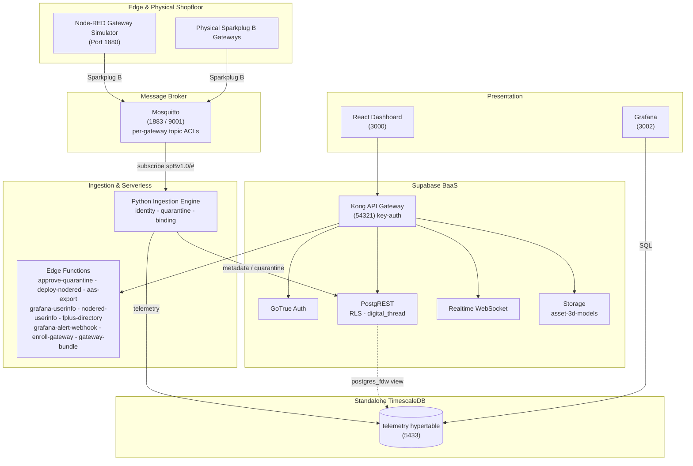

# AMRC Connectivity Stack - Cymru

[](https://github.com/Harri-Llewelyn/acs-cymru/actions/workflows/ci.yml)

An industrial, asset-centric manufacturing management platform aligned with the
**AMRC Connectivity Stack (ACS / Factory+)** framework.

Real-time telemetry streaming, shopfloor cell mapping, zero-touch edge device onboarding,
row-level security, continuous Digital Thread audit logging, AAS V3 export, and edge flow
management.

> **Design ethos —** *use pre-existing components and standards; minimise custom code.*
> Where upstream ACS ships bespoke microservices, this fork uses Supabase, TimescaleDB, Grafana and
> Node-RED. The custom surface is one Python ingestion daemon, nine edge functions, an i3X server and
> a React dashboard.

---

## Architecture

**Supabase** is authoritative for asset metadata (`cells`, `gateways`, `devices`), auth, RLS, audit
triggers and edge functions. **Standalone TimescaleDB** holds the `telemetry` hypertable, reached
from Supabase through a `postgres_fdw` view. A **Python daemon** consumes Sparkplug B MQTT, gates
unregistered devices into quarantine, and routes metadata and telemetry to their respective stores.
A **React 18 SPA** queries PostgREST directly and subscribes to a Realtime change feed.

Derived state is computed at read time rather than stored: gateway staleness is a **view**, not a
cron writer, and AAS is an **adapter on the way out**, not an adopted metamodel.



**Data flow.** Devices publish `DBIRTH`/`DDATA` to Mosquitto, confined by ACL to their own edge-node
subtree → ingestion resolves topic to `sparkplug_id`, verifies the device is **bound to the
publishing gateway**, and quarantines anything unknown or contradictory → valid telemetry lands in
the hypertable → Postgres triggers log every metadata change to the append-only `digital_thread` →
the dashboard reads PostgREST and subscribes to Realtime.

---

## Deployment targets

**Kubernetes (k3s) is the primary target; Docker Compose is the local development path.** Both are
maintained, both are exercised in CI, neither is deprecated.

| | Docker Compose | Kubernetes (Helm) |
| :--- | :--- | :--- |
| Purpose | Local development, debugging | Deployment |
| Entry point | `docker compose up -d` | `helm install` — [`deploy/k8s/README.md`](deploy/k8s/README.md) |
| Reachability | Published ports on `localhost` | `*.<publicBaseDomain>` via one Ingress |
| TLS | none | cert-manager, internal CA ([`deploy/k8s/internal-ca.yaml`](deploy/k8s/internal-ca.yaml)) |
| MQTT | 1883 plaintext + 9001 WebSockets | the same, plus optional MQTTS on 8883 |
| Conformance | `ingestion/validate.py` from the host | the same suite, as an in-cluster Job |

Container images, SQL migrations and init scripts are **shared substrate** — only the *wiring* is
expressed twice. Intentional differences are enumerated in the divergence table in the Kubernetes
runbook; anything not in that table is drift. Design rationale is in
[`docs/kubernetes-architecture.md`](docs/kubernetes-architecture.md).

---

## Quick start — Docker Compose

```bash
npm run setup                   # writes .env with 24 freshly generated credentials
docker compose up --build -d    # launches the whole stack
```

Every file in `supabase/migrations/` is applied by `supabase-db-init` on startup and re-applied
harmlessly on every later start: the schema baseline (`0001`), seed data (`0002`), then `0003` audit
immutability, `0004`, `0005`, `0006` Node-RED SSO, `0007` metric-name format, `0008` Sparkplug
group, `0009` withdraws residual `anon` function grants, `0010` telemetry rollups and latest-value
view, `0011` IDTA Digital Nameplate and per-device nameplate data, `0012` permitted values of a
discrete metric, `0013` ASHRAE 223P vocabulary, `0014` repoints locally-minted semantic
identifiers onto the `acs-cymru.local` namespace, `0015` moves the default Sparkplug group to
`ACS-Cymru`, `0016` drops the dashboard's own service-directory entry and renames the Node-RED
one to say it is the simulator, `0018` pre-registers the demonstrator's metric set with each
row's standard and published semantic id, `0019` adds the 223P supply-air-flow metric the
shopfloor simulator needed, `0020` retires the introductory single-device simulator and moves its
schema and IDTA nameplate onto `Sim_CNC_Mill_01`, `0021` gives each shopfloor cell an icon from a
closed set, `0022` adds one schema per machine class and attaches it to every simulated device,
`0023` adds the `platform_alerts` occurrence log Grafana alerting writes into and publishes it for
Realtime, `0024` adds an optional free-text `description` to devices and gateways, `0025` adds
physical-gateway enrolment — a `gateway_enrollment_tokens` table reachable only by `service_role`,
the RPCs that issue and atomically redeem a single-use token, and the `PENDING_ENROLLMENT` /
`AWAITING_BIRTH` lifecycle states — `0026` stamps every audit row with the transaction that wrote
it (`digital_thread.causation_id`, from `txid_current()`) so the several rows one operator action
produces can be read back as one act, and adds `record_ingestion_rejection()` — the narrow
SECURITY DEFINER gate through which the ingestion daemon records a payload it judged
non-conforming, replacing `service_role`'s direct INSERT on the audit table — and `0027` maps the
historian's storage footprint over `postgres_fdw` and unions it with Supabase's own table sizes as
`public.storage_footprint`, read by Grafana's `supabase` datasource — `0028` generalises the alert
table from `device_alerts` to `platform_alerts`, whose subject is `(entity_type, entity_id)` rather
than a device, because the platform alert rules cover a gateway and the fleet and neither
fits a row that must name a machine — `0029` adds `public.platform_health`, the narrow view
those rules evaluate so the Grafana reader never needs the asset inventory — and `0030` gives that
alert table a **7-day retention window**, pruned nightly by `pg_cron`, whose predicate ages out
closed and superseded occurrences but never the newest firing row of a fingerprint — plus demo
accounts (`supabase/seed.sql`).

> **There is no `0017`.** It was drafted as an audit-trigger change guard and then not written,
> because `0005` already implements one; a second declaration of `log_digital_thread_event()`
> would win by filename order on every boot and would have regressed the `actor_source`
> attribution `0005` adds. The gap in the numbering is deliberate and the reasoning is in
> [`supabase/README.md`](supabase/README.md#audit-signal-and-attribution-0005).
>
> `0026` is that later declaration, written deliberately and on those terms: it reproduces `0005`'s
> body **in full** and adds two lines, rather than patching it. Its self-check asserts that both the
> heartbeat suppression guard and the causation stamp are present in the live definition, because
> `check-docs-drift.mjs` can verify a redeclaration was *intended* and cannot verify it was
> *complete*.

| Interface | URL |
| :--- | :--- |
| React Dashboard | http://localhost:3000 |
| Supabase Studio | http://127.0.0.1:54323 |
| Swagger UI | http://localhost:8088 |
| Node-RED | http://localhost:1880 |
| Grafana | http://localhost:3002 |
| Prometheus | http://localhost:9090 (loopback only — SSH-tunnel from another host) |

**Sign in to the React dashboard first.** Node-RED and Grafana both federate to Supabase Auth, and
the consent step needs your dashboard session — going straight to either shows a "sign in required"
prompt rather than a login form. In Node-RED, click **Sign in with ACS-Cymru**; Administrator and
Shopfloor_Manager can deploy, Operator and Auditor get a read-only editor.

**Demo accounts** — seeded by [`supabase/seed.sql`](supabase/seed.sql), password `acscymru123`:

| Email | Role | Access |
| :--- | :--- | :--- |
| `admin@acs-cymru.local` | `Administrator` | Full CRUD |
| `manager@acs-cymru.local` | `Shopfloor_Manager` | Full CRUD |
| `operator@acs-cymru.local` | `Operator` | Read-only + telemetry |
| `auditor@acs-cymru.local` | `Auditor` | Digital Thread read-only |

Self-registered accounts get read-only `Operator` via the `handle_new_user` trigger; an
`Administrator` must promote them.

> **`.env.example` contains working development secrets** — the standard Supabase demo values, also
> registered as Kong API keys. **Generate fresh secrets for any shared or hosted environment.**

Teardown: `docker compose down -v` (also drops volumes, invalidating every logged-in browser).

### Windows: `bind: An attempt was made to access a socket in a way forbidden by its access permissions`

```
Error response from daemon: ports are not available: exposing port TCP 0.0.0.0:54322 -> 127.0.0.1:0:
listen tcp 0.0.0.0:54322: bind: An attempt was made to access a socket in a way forbidden by its
access permissions.
```

**Nothing is wrong with the stack.** Hyper-V/WSL2 reserves blocks of high ports for NAT on boot,
and those blocks routinely swallow the `543xx` range this stack publishes Supabase on. The port is
not in use by another process — Windows has withdrawn it.

**Docker names only the first port it fails on, and that is the misleading part.** Three ports are
in that range, and the one that matters is not the one in the message:

| Port | Service | Consequence if lost |
| :--- | :--- | :--- |
| `54321` | Kong | **the browser has no API** — the dashboard loads and every request fails |
| `54322` | supabase-db | no `psql` from the host; the stack itself is unaffected |
| `54323` | Supabase Studio | Studio unreachable |

So fixing the port in the error changes nothing: `supabase-db` fails, every service that depends on
it never starts, and what you see is a dashboard that loads and then reports **`Failed to fetch`**.
`docker compose ps` shows the shape of it — `frontend`, `swagger-ui` and `timescaledb` up, because
they are the only three that do not depend on `supabase-db`.

Confirm it is this and not a real conflict:

```powershell
netsh interface ipv4 show excludedportrange protocol=tcp
```

A range covering `54321`–`54323` and **no `*`** beside it is a dynamic Hyper-V reservation. (`*`
marks an administered exclusion — one somebody added deliberately.)

**The fix**, in an **Administrator** PowerShell:

```powershell
net stop winnat
netsh int ipv4 add excludedportrange protocol=tcp startport=54320 numberofports=8 store=persistent
net start winnat
```

Then `docker compose up -d`.

The middle line is the part that lasts. It claims `54320`–`54327` as an *administered* exclusion,
so WinNAT cannot take the range again — `store=persistent` carries that across reboots. Restarting
`winnat` on its own releases the current reservation but simply re-rolls it, so the same failure
returns on the next boot or Docker Desktop restart.

**If you cannot get an Administrator prompt**, the ports are configurable — `KONG_HTTP_PORT`,
`SUPABASE_DB_PORT` and `STUDIO_PORT` in `.env`. Moving Kong is not a one-line change, though:
`SUPABASE_URL`, `AAS_MODEL_PUBLIC_BASE` and `AAS_HISTORIAN_ENDPOINT` all carry the port, the
Node-RED and Grafana OAuth URLs are derived from `SUPABASE_URL`, and `VITE_SUPABASE_URL` is a
**build arg** — so the frontend needs `--build`, not just a restart. Change `.env` only and leave
`.env.example` alone, or the divergence follows you into every other environment.

### Resetting to a clean slate

```bash
npm run stack:reset -- --yes
```

Tears the stack down **with its volumes**, brings it back, waits for the schema to exist rather
than for ports to answer, and re-provisions the four cell gateways — printing their credentials
and writing them to `.env.gateways`, because `mosquitto_passwd` stores only a hash and they cannot
be read back afterwards.

**`--yes` is required and there is no interactive prompt.** A prompt is something people learn to
dismiss without reading, and this is most dangerous once it is familiar. It also refuses outright
when `NODE_ENV=production`, and when `COMPOSE_PROJECT_NAME` names a stack this repository does not
own — so a shell in the wrong directory cannot take down someone else's.

The one thing it exists for that nothing else can do: **`digital_thread` is append-only to every
application role**, so dropping the volume is the only way back to an empty audit trail.

---

## Quick start — Kubernetes

Full runbook in [`deploy/k8s/README.md`](deploy/k8s/README.md). The short version:

```bash
# Five images are built from this repository and are on no registry.
docker build -f supabase/functions/Dockerfile -t acs-cymru/edge-runtime:0.1.0 .   # context: repo root
docker build -f Dockerfile                    -t acs-cymru/ingestion:0.1.0 .      # context: repo root
docker build -f node-red/Dockerfile           -t acs-cymru/node-red:0.1.0 node-red
docker build -f frontend/Dockerfile --build-arg VITE_RUNTIME_CONFIG=true \
                                              -t acs-cymru/frontend:0.1.0 frontend
docker build -f tests/Dockerfile              -t acs-cymru/test-runner:0.1.0 .    # conformance suites

node scripts/sync-helm-chart-files.mjs        # mirror repo config into the chart

kubectl create namespace acs-cymru
helm install acs-cymru deploy/helm/acs-cymru -n acs-cymru \
  -f deploy/helm/acs-cymru/values-dev.yaml --timeout 15m

# NOT `--wait` — it deadlocks the first install. See deploy/k8s/README.md.
for w in $(kubectl -n acs-cymru get statefulset,deploy -o name); do
  kubectl -n acs-cymru rollout status "$w" --timeout=10m
done

helm test acs-cymru -n acs-cymru          # the postgres_fdw gate
```

Serves seven subdomains on one Ingress (`app.`, `api.`, `nodered.`, `grafana.`, `studio.`, `docs.`,
`mqtt.`) plus a LoadBalancer for **raw MQTT on 1883**, which is TCP and cannot ride an HTTP Ingress.

- **`values-dev.yaml` carries the published demo credentials from `.env.example`, and they are in
  git.** For anything another person can reach, start from `values-prod.yaml.example` and point
  `secrets.existingSecret` at an externally managed Secret.
- **The chart validates its own values and fails the render, not the pod** — a partial credential
  set, a wrong-length Realtime key, a renamed Realtime Service, TLS with `scheme: http`, or an HPA
  on a single-writer workload each otherwise produce a stack that reports healthy and refuses every
  request.

---

## Repository map

| Directory | Covers |
| :--- | :--- |
| **[`frontend/`](frontend/README.md)** | React 18 architecture, Vite, Realtime integration, derived state, theming |
| **[`supabase/`](supabase/README.md)** | Migrations, RLS privilege matrix, triggers, audit immutability, edge functions, Kong |
| **[`ingestion/`](ingestion/README.md)** | Sparkplug B parsing, identity resolution, gateway binding, TimescaleDB mapping, `validate.py` |
| **[`simulators/`](simulators/README.md)** | Node-RED setup, flow provisioning, broker topics, onboarding walkthrough |
| **[`i3x/`](i3x/README.md)** | i3X 1.0 server: address-space mapping, subscriptions, connecting a client — including [an MCP host](i3x/README.md#mcp) |
| **[`deploy/k8s/README.md`](deploy/k8s/README.md)** | Kubernetes runbook: install, upgrade, teardown, hardening, divergence table, releases |
| [`deploy/helm/acs-cymru/`](deploy/helm/acs-cymru) | The Helm chart; `values.yaml` documents every setting |
| [`docs/kubernetes-architecture.md`](docs/kubernetes-architecture.md) | Why the Kubernetes target is built the way it is. Source comments cite it by section |
| [`docs/incidents.md`](docs/incidents.md) | Faults whose FIX LOOKS ARBITRARY without the story. Read before "tidying" a guard that seems redundant |
| [`docs/openapi.yaml`](docs/openapi.yaml) · [`docs/i3x-openapi.yaml`](docs/i3x-openapi.yaml) | REST and i3X specifications, rendered by Swagger UI |
| [`supabase/migrations/archive/`](supabase/migrations/archive) | The 38 pre-beta migrations, preserved for their reasoning. Never executed |
| [`grafana/`](grafana) · [`timescaledb/`](timescaledb) | Provisioning; hypertable schema, retention and rollup reconciliation, the read-only BI role |
| [`scripts/`](scripts) | Setup, seeding, vocabulary generation, chart-file sync, drift guards, database backup/restore, gateway provisioning, stack reset, AAS push |
| [`tests/`](tests) | Vendored IDTA AAS schema, conformance test-runner image |

---

## Service port directory

| Service | Container | Image | Port |
| :--- | :--- | :--- | :--- |
| `supabase-db` | `acs-cymru_supabase_db` | `supabase/postgres:17.6.1.160` | `54322:5432` |
| `supabase-db-roles-init` | `acs-cymru_supabase_db_roles_init` | `supabase/postgres:17.6.1.160` | — |
| `supabase-db-init` | `acs-cymru_supabase_db_init` | `supabase/postgres:17.6.1.160` | — |
| `supabase-auth` | `acs-cymru_supabase_auth` | `supabase/gotrue:v2.189.0` | — |
| `supabase-rest` | `acs-cymru_supabase_rest` | `postgrest/postgrest:v12.2.0` | — |
| `supabase-kong-init` | `acs-cymru_supabase_kong_init` | `alpine:3.20` | — |
| `supabase-kong` | `acs-cymru_supabase_kong` | `kong:2.8.1-alpine` | `54321:8000` |
| `supabase-functions` | `acs-cymru_supabase_functions` | `supabase/edge-runtime:v1.74.2` | — |
| `supabase-realtime` | `acs-cymru_supabase_realtime` | `supabase/realtime:v2.34.47` | — |
| `supabase-storage` | `acs-cymru_supabase_storage` | `supabase/storage-api:v1.11.13` | — |
| `supabase-storage-init` | `acs-cymru_supabase_storage_init` | `node:20-alpine` | — |
| `supabase-meta` | `acs-cymru_supabase_meta` | `supabase/postgres-meta:v0.96.6` | — |
| `supabase-studio` | `acs-cymru_supabase_studio` | `supabase/studio:2026.07.07-sha-a6a04f2` | `54323:3000` |
| `timescaledb` | `acs-cymru_timescaledb` | `timescale/timescaledb:2.29.1-pg17` | `5433:5432` |
| `mosquitto-init` | `acs-cymru_mosquitto_init` | `eclipse-mosquitto:2.0.20` | — |
| `mosquitto` | `acs-cymru_mosquitto` | `eclipse-mosquitto:2.0.20` | `1883`, `9001` |
| `frontend` | `acs-cymru_frontend` | `./frontend/Dockerfile` | `3000:3000` |
| `ingestion` | `acs-cymru_ingestion` | `./Dockerfile` | `9108:9108` |
| `node-red-init` | `acs-cymru_node_red_init` | `./node-red/Dockerfile` | — |
| `node-red` | `acs-cymru_node_red` | `./node-red/Dockerfile` | `1880:1880` |
| `grafana` | `acs-cymru_grafana` | `grafana/grafana:13.1.3` | `3002:3000` |
| `swagger-ui` | `acs-cymru_swagger_ui` | `swaggerapi/swagger-ui:v5.17.14` | `8088:8080` |
| `prometheus` | `acs-cymru_prometheus` | `prom/prometheus:v3.1.0` | `127.0.0.1:9090:9090` |
| `node-exporter` | `acs-cymru_node_exporter` | `prom/node-exporter:v1.8.2` | — |

---

## Security model

Fail-closed throughout: edge functions and RLS policies deny by default, and a missing or
unrecognised role produces `403`.

| Layer | Control |
| :--- | :--- |
| **Broker** | `allow_anonymous false`; [`mosquitto.acl`](mosquitto.acl) confines each gateway to `spBv1.0/+/+/<own-id>/#` |
| **Ingestion** | Gateway↔device binding; quarantine gating; append-only historian writes |
| **Gateway** | Kong `key-auth` on `/rest`, `/realtime`, `/storage`, `/functions` — with **four** documented exemptions ([`supabase/README.md`](supabase/README.md)) |
| **API** | PostgREST JWT verification plus RLS on every table |
| **Database** | `has_role()` reads `user_roles` directly, so revocation is immediate; `digital_thread` is append-only against `service_role` too |
| **Edge functions** | Explicit router allow-list; per-function secret scoping; role resolved from the database, never a stale JWT claim |
| **Edge automation** | Node-RED's editor, admin API and webhook receiver each authenticate separately |

Two consequences worth stating on the front page; both are detailed in
[`supabase/README.md`](supabase/README.md):

- **Node-RED is not an open port.** A `function` node runs arbitrary JavaScript in a container
  holding the MQTT credential, so anyone who could replace a flow had remote code execution on the
  edge host. The editor and `/flows` use OAuth2 + PKCE; `POST /hooks/quarantine` takes a 60-second
  per-event signed token, deliberately not the admin credential, because any flow author can read it
  from `msg.req.headers`.
- **The `asset-3d-models` bucket is public-read**, because an exported AAS `File` URL must resolve
  for a viewer holding no session and a signed URL would turn every shell already handed out into a
  time bomb. Anything in it must carry nothing beyond machine geometry. Writes are gated on
  `device:manage`, not merely `authenticated`.

Known issues and accepted risks are tracked as
[GitHub issues](https://github.com/Harri-Llewelyn/ACS-Cymru/issues).

---

## Standards

| Standard | Role |
| :--- | :--- |
| **Sparkplug B** | The wire protocol. Identity is `sparkplug_id`, carried in the topic |
| **MTConnect** (2.x) | Machine-tool vocabulary — 249 data item types, 123 subtypes, 100 units, 126 component types |
| **OPC UA** (40001, 40001-4, 40010, 30050, 40501, 40540) | Companion-specification data points: machinery, energy, robotics, PackML, machine tools, additive. Generated from OPC Foundation NodeSets by [`scripts/generate-opcua-vocabulary.mjs`](scripts/generate-opcua-vocabulary.mjs) |
| **ISO 22400** | Computed KPIs, which MTConnect and OPC UA deliberately exclude |
| **ASHRAE 223P** | Building-system semantics — 640 concepts from the open223 ontology. ⚠ Still in public review |
| **AAS / IEC 63278** | V3 export as JSON or AASX, validated against the official IDTA schema |

These are **four vocabularies, not four alternatives** — a mixed fleet needs all of them, which is
why the schema builder offers a choice rather than a migration path. All are built, as is the IDTA
Digital Nameplate; what each one covers and how its identity was verified is in
[`docs/vocabularies.md`](docs/vocabularies.md), and the checklist for adding another is in
[`supabase/README.md`](supabase/README.md#adding-a-vocabulary).

> Adopting the MTConnect vocabulary is not a compliance claim; that requires the Implementer
> License. Locally-minted semantic ids live under `https://acs-cymru.local/semantics/…` — the
> namespace is the honesty mechanism, and an id under `mtconnect.org` would assert an
> interoperability that does not exist.

---

## Testing

```bash
# Frontend — 1357 tests
cd frontend && npm test

# Python unit suites — no stack required
python ingestion/test_gateway_binding.py
python ingestion/test_declared_metrics.py
python ingestion/test_modelled_metrics_contract.py
python ingestion/test_device_location.py
python ingestion/test_health_heartbeat.py
python ingestion/test_rbe_telemetry.py
python ingestion/test_mqtt_tls.py
python ingestion/test_audit_write_dedup.py
python ingestion/test_payload_conformance.py
# The Prometheus endpoint and the Sparkplug seq gap counters -- no stack, no broker
python ingestion/test_metrics_endpoint.py
python ingestion/test_entity_cache.py
python ingestion/test_telemetry_batching.py
python i3x/test_i3x_service.py
python supabase/functions/approve-quarantine/test_approve_quarantine.py
python supabase/functions/deploy-nodered/test_deploy_nodered.py
python supabase/functions/nodered-userinfo/test_nodered_userinfo.py
python supabase/functions/aas-export/test_aas_export.py
python supabase/functions/grafana-alert-webhook/test_grafana_alert_webhook.py

# Physical gateway enrolment — signs in as Administrator to mint tokens (issuing is a USER's act,
# gated on has_role, so the service key cannot do it), then redeems them the way an appliance does:
# the anon key and no user JWT. Stops the credential service to exercise the 503 rollback path.
SUPABASE_ANON_KEY=... SUPABASE_SERVICE_ROLE_KEY=... \
  python supabase/functions/enroll-gateway/test_enroll_gateway.py

# The downloadable bundle — role gating (Operator and Auditor get 403 and no token is minted), ZIP
# integrity, and that the embedded token is the one the database will accept.
SUPABASE_ANON_KEY=... SUPABASE_SERVICE_ROLE_KEY=... \
  python supabase/functions/gateway-bundle/test_gateway_bundle.py

# Broker credential issuance — needs the stack up and the service's own bearer token
MQTT_CREDENTIAL_SERVICE_TOKEN=... python gateway-credential/test_gateway_credential.py

# The credential merge, in isolation — the one piece of it whose failure is silent
npm run test:lib

# Database suites — need Postgres
python supabase/migrations/test_user_roles_rls.py
python supabase/migrations/test_schema_versioning.py
python supabase/migrations/test_digital_thread_guard.py
python supabase/migrations/test_ingestion_rejection_rpc.py
python supabase/migrations/test_platform_alerts_retention.py
python supabase/migrations/test_metric_catalog_seed.py
python supabase/migrations/test_gateway_enrollment.py
# Needs the TimescaleDB historian (port 5433), not Supabase — the rollups live there
python timescaledb/test_bi_reader_grants.py

# End-to-end — needs the running stack
set -a && . ./.env && set +a && unset MQTT_HOST DB_HOST DB_PORT
export MQTT_USER="$MQTT_VALIDATOR_USER" MQTT_PASSWORD="$MQTT_VALIDATOR_PASSWORD"
python ingestion/validate.py
```

Three suites have a second half elsewhere, and both halves must move together:
`test_modelled_metrics_contract.py` and `test_rbe_telemetry.py` each pair with a JavaScript suite in
the frontend run, and `test_i3x_service.py` covers the sync-acknowledgement and queue-overflow MUSTs
the CESMII conformance suite skips. See [`ingestion/README.md`](ingestion/README.md#testing) and
[`i3x/README.md`](i3x/README.md).

CI ([`.github/workflows/ci.yml`](.github/workflows/ci.yml)) runs five jobs:

| Job | Covers |
| :--- | :--- |
| **frontend-build** | Vitest, the mirrored-logic drift guards, production bundle |
| **helm-chart** | `helm lint`, render, API-schema validation, chart guard rails |
| **edge-function-auth-test** | Auth ladders and RLS against a real Postgres |
| **e2e-validation** | Full Docker Compose stack, `validate.py`, live AAS export |
| **k8s-validation** | k3d cluster, `helm test`, the same suites in-cluster, ingress assertions |

**The last two are the real drift control between deployment targets.** `validate.py` is
topology-agnostic and runs against both; if both pass, the wiring agrees where it matters.

### Releases

[`.github/workflows/release.yml`](.github/workflows/release.yml) runs on a **`v*` tag only** — never
on a branch:

| Job | Covers |
| :--- | :--- |
| **prepare-release** | Derives the version from the tag, refuses a non-SemVer one, re-runs the static checks a published artefact must not violate |
| **build-images** | The three independent images, in parallel, pushed to GHCR |
| **build-ingestion-chain** | `ingestion`, then `test-runner` **on the same runner** — the latter is built `FROM` the former, so the base must be in the local image store |
| **publish-chart** | Lint, render, package at the tag's version, push over OCI, pull it back |

The tag is the single place the version is written — it stamps the five image tags, the chart
`version` and `appVersion` in one run. **Images publish before the chart**, because a chart naming
images that do not exist yet does not fail: `helm install` succeeds and six workloads sit in
`ImagePullBackOff` while everything else comes up healthy. Installation, the one-time GHCR
visibility step, and what a release deliberately does *not* do (no `latest`, no arm64, no signing)
are in [`deploy/k8s/README.md`](deploy/k8s/README.md#publishing-a-release).

---

## Expected behaviour (not defects)

- **`docker compose down -v` invalidates every logged-in browser.** It drops `supabase_db_data`, and
  with it `auth.sessions`. The dashboard clears the stale tokens and returns to the login screen.
- **Swagger UI's "Example Value" is documentation, not data.** Press **Execute** and read the
  **Response body** panel.
- **An unrecognised device appears in the quarantine queue, not on the shopfloor map.** That is the
  zero-touch onboarding path working: a device that announces itself under an id nobody registered
  is held and its telemetry dropped until an `Administrator` approves it. The demonstrator's own
  `Sim_` devices are pre-registered and so bypass it — publish under any other well-formed
  `dev`-prefixed id to see it.

---

## Roadmap & Future Extensions

Ten extensions, ordered by how much of each already exists. None is speculative: every one names
the code it would build on, because the value of writing them down is that a reader can tell how far
away each is.

**These are not open defects.** Known issues and accepted risks are
[GitHub issues](https://github.com/Harri-Llewelyn/ACS-Cymru/issues).

### 1 · Automated edge gateway telemetry

**Builds on:** `process_node_message()` · `gateways.agent_version` / `enrolled_at` (`0025`) ·
the appliance's Node-RED runtime ([`templates/physical-gateway/`](templates/physical-gateway)) ·
`node_exporter`

Enrolment stamps `agent_version` and `enrolled_at` once and never refreshes them, so "what is this
appliance actually doing" is answerable only by getting a shell on it. The appliance already holds
an authenticated MQTT connection and already publishes `NDATA`, so a periodic health payload —
uptime, container and disk metrics, the deployed flow's hash — needs no new transport, no new
credential and no new table: `process_node_message()` resolves the gateway and writes to its row
today.

**The case that justifies it on its own is CA expiry.** The internal CA is distributed by hand into
every appliance's trust store, and
[re-minting it does not fail loudly — it succeeds and takes the whole fleet offline](docs/incidents.md).
A `Cert_Expires_At` metric plus one alert rule turns the single worst fleet-wide failure mode into a
30-day warning.

#### Use `node_exporter` as the collector, but do not scrape it from here

The appliances are Ubuntu Server and the stack now runs a Prometheus, so the obvious move is to run
`node_exporter` on each gateway and add it as a scrape target. **The collector half is right and the
scrape half is wrong**, and the reason is the network shape this platform deliberately has:

- **The appliance's connection is outbound only.** It dials `<broker>:8883`; nothing anywhere
  assumes traffic in the other direction, and
  [`templates/physical-gateway/README.md`](templates/physical-gateway/README.md) troubleshoots
  exactly that way round.
- **Scraping means an inbound path per gateway** through the plant firewall — the thing an
  outbound-only design exists to avoid, and a separate conversation with someone's IT department
  per site.
- **Gateways are enrolled dynamically** with single-use tokens (`0025`), so a static scrape config
  cannot know them. Pull would additionally need `http_sd` backed by the `gateways` table: a
  discovery endpoint to build, secure and keep correct.

So run `node_exporter` on the appliance and **scrape it locally**. A Node-RED flow polls
`localhost:9100/metrics`, selects a handful of series — filesystem free, load, memory, uptime — and
publishes them as Sparkplug metrics on the connection that is already open and already
authenticated. `process_node_message()` writes them to the gateway's row exactly as this section
already describes.

That keeps `node_exporter`'s correctness — it collects host metrics properly, which hand-rolled
disk and CPU reads in a Node-RED function node will not — while changing nothing about the network,
the credential model, or discovery. It also makes this item substantially cheaper, because the
collector was the part that had to be written.

**And it removes the Windows question.** `windows_exporter` (prometheus-community, formerly
`wmi_exporter`) serves the same exposition format, so a Windows gateway differs only in which
collector is installed; the transport, the flow and the database write are identical. Under a pull
model it would have been a second scrape story.

**Where it would go:** `templates/physical-gateway/docker-compose.yml`, which the bundle ships and
the appliance runs — one service alongside `node-red`, with the same `/proc`, `/sys` and `/` mounts
the central stack's exporter uses. The bundle is assembled by `gateway-bundle` from
`GW_BUNDLE_COMPOSE`, so the template is the only file that changes.

### 2 · Horizontal ingestion scaling

**Builds on:** the single-writer note in `get_timescaledb_connection()`

The current ceiling is stated in the code rather than discovered: *"one connection, not a pool.
Every write happens on the paho callback thread, so there is exactly one writer — and that is the
thing to revisit first if a worker thread is ever introduced."* Three properties bound throughput on
that thread: the 5-second directory cache, the per-message PostgREST resolution round trips, and the
bounded DB retry that deliberately stalls the whole fleet rather than one device.

The honest path is an **MQTT 5 shared subscription** (`$share/<group>/spBv1.0/#`) across clustered
workers, each holding its own connection. The daemon is already shaped for it — resolution is
cacheable and per-message, and the historian write is idempotent (`ON CONFLICT DO NOTHING`), so two
workers seeing a redelivery cannot corrupt a series. What it needs is per-worker connection
ownership and a rebirth-request path that does not depend on a single node's alias table.

**It also carries the last piece of the ingestion metrics work.** Every counter that endpoint
proposed now ships except one: `acs_ingestion_write_seconds`, the per-write latency histogram. It
needs a timing wrapper on the historian write — which runs per sample on the broker callback
thread, the one path in this daemon where casual overhead is least welcome. **That is the same
thread this item exists to unblock**, and a latency number is worth far more once there is a
before-and-after to compare it against, so it belongs here rather than as a measurement taken
against a ceiling nobody has moved yet.

### 3 · Computed ISO 22400 KPIs

**Builds on:** [`timescaledb/aggregates.sql`](timescaledb/aggregates.sql) · the existing rollups ·
`iso22400_vocabulary`

ISO 22400 is registered as a vocabulary, but its KPIs are by definition **computed** — that is
exactly what MTConnect and OPC UA exclude and why the standard exists. Availability, Performance and
Quality can be continuous aggregates over the rollups already in the historian, with **no external
MES dependency**: `aggregates.sql` is reconciled on every boot on both targets, which is what makes
a KPI definition a setting rather than a constant fixed before the first row was written.

This is the intermediate step that was previously deferred pending an MES. It does not replace one —
it makes the vocabulary answer questions instead of only naming them.

### 4 · i3X server optimisations

**Builds on:** `_load_address_space()` · `_build_objects()` · `MAX_BULK_ELEMENT_IDS`

Bulk breadth is now capped and the value-path indexes are built once per request rather than per
element. What remains is the **six PostgREST queries per request**: the address space is reassembled
from scratch every time, which is fine for a demonstrator and is the wrong shape for a conformance
client polling in a loop.

A short TTL cache would fix it, and the constraint on that work is already known and must not be
lost: the cache **must be keyed by the caller's token**. The address space is deliberately assembled
from reads made as the caller so RLS decides what it contains, and a cache shared across identities
would hand one user another's view — re-creating exactly the hole the MQTT value cache is guarded
against.

Writes stay unimplemented. `PUT /objects/value` answers 405 and `/info` declares
`update.current: false`; a server that does not implement the verb cannot be talked into it.

### 5 · Ingress → Gateway API

**Builds on:** [`templates/ingress.yaml`](deploy/helm/acs-cymru/templates/ingress.yaml) ·
`acs-cymru.corsOrigins`

Kong 2.8 is frozen: declarative config gained environment interpolation in 3.x, which is why
`kong.yml` is a placeholder template substituted twice — once by `sed` on Compose, once by Helm.

Gateway API's `HTTPRoute` filters express **route-level CORS declaratively**, which would retire the
`__CORS_ORIGINS__` placeholder and the two substituters along with it. That is worth pairing with
this migration specifically, because the origin list is the stack's *only* statement of origin
policy — the edge functions deliberately declare none — and the fewer places it is expressed, the
fewer places it can be wrong.

### 6 · A durable MCP credential, and the Digital Thread over MCP

**Builds on:** `i3x-mcp` against the i3X address space ([`i3x/README.md`](i3x/README.md#mcp)) ·
`GOTRUE_JWT_EXP` · `digital_thread`

**This used to say "build an MCP server", and that turned out to be the wrong item.**
[`cesmii/i3X-MCP-Server`](https://github.com/cesmii/i3X-MCP-Server) (`i3x-mcp` on npm, MIT) is a
generic MCP client of *any* conformant i3X server. It runs against this one unmodified — verified
2026-08-22 by driving the published package over stdio: object search, current values with
`quality`, relationship traversal and history out of TimescaleDB all answer. Nothing needs writing.

**The security posture the old item asserted is now demonstrated rather than argued.** Writes are
not even listed as tools by default; forced on with `--enable-writes`, `update_value` returns our
`405` and the reason with it. That is the difference between read-only by *construction* and by
configuration: a user who deliberately defeats the client-side guard still gets nothing.

What is left is the two things pointing it at a real deployment exposes.

#### A durable, low-privilege credential

The client takes a **static** `I3X_TOKEN` from its host's config file, and `GOTRUE_JWT_EXP` is
`3600`. A token pasted into `claude_desktop_config.json` stops working within the hour, and it fails
the way [`i3x/README.md`](i3x/README.md#connecting-a-client) already describes for i3X Explorer —
*as a broken server rather than a stale token*.

The answer is a long-lived JWT for a dedicated read-only principal, signed with the same secret and
carrying a role RLS already constrains. **What it must not be is `service_role`.** This server
passes the caller's bearer straight through to PostgREST precisely so that it queries *as them*; a
key that bypasses RLS would discard the single property that makes handing this to a model
defensible — that an operator asking a question sees exactly what an operator can see.

#### The Digital Thread has no surface here

i3X models objects, values and history. It has **no audit concept**, and this server's address space
contains no `digital_thread` — so *"what changed, when, and who changed it"* is the one question an
i3X-shaped client cannot ask, and it is the clause the old item named that no external package will
ever satisfy.

Two honest options, and the choice is about audience rather than difficulty. A **second, small MCP
server over PostgREST** would expose the audit trail with the caller's own token and the same RLS
scope — which is the only reason it would be safe. Or **leave it**: the Digital Thread is a page
built for reading a change with its diff and its causation siblings beside it, and a model
summarising that trail is a different and weaker artefact than the page.

### 7 · Administrative Settings & Runtime Configuration

**Builds on:** `has_role('Administrator')` · PostgREST RLS · Supabase Vault

In-app configuration management allowing `Administrator` users to tune runtime parameters
(cold storage endpoints, retention policies, OIDC provider metadata, alert thresholds) directly
from the React dashboard without host-level `.env` edits or container restarts.

**Settings override defaults dynamically at runtime rather than mutating disk.** Sensitive secrets
(S3 keys, OIDC client secrets) land encrypted in Supabase Vault, while non-sensitive runtime
flags live in a `system_settings` table gated strictly on `Administrator` via RLS. Host `.env`
values remain the initial fallback, preserving deterministic, zero-configuration local boot while
giving deployed shopfloor instances an operational management plane.

---

### 8 · Cold Telemetry Archival & Query-in-Place

**Builds on:** TimescaleDB retention policies · `telemetry` hypertable · Edge Functions · Apache Parquet

Tiering high-volume time-series telemetry out of the operational database into vendor-neutral
Apache Parquet files on S3-compatible or Azure Blob storage once the hot hypertable retention
window expires (e.g., >90 days).

**Preserves long-horizon traceability without re-bloating the operational database.** A scheduled
maintenance task exports date-partitioned chunks to compressed `.parquet` files, verifies storage,
records a manifest row in `telemetry_archive_manifest`, and safely drops the raw chunk. The React
Archives view renders the catalog and allows operators to query historical months in place via
short-lived presigned URLs and DuckDB—rendering historical charts on demand without rehydrating
gigabytes of raw points back into TimescaleDB.

---

### 9 · Deferred commit for Rearrange mode

**Builds on:** `handleDrop()` / `handleLaneDrop()` / `pendingZone` in
[`OverviewTab.jsx`](frontend/src/components/tabs/OverviewTab.jsx) ·
`digital_thread.causation_id` (`0026`)

Rearrange mode is a mode already — off by default, turned on deliberately, turned off by clicking
**Rearranging — click to finish**. What it is not yet is a *transaction*: each drop issues its own
`PUT /api/v1/devices/{id}` the moment the mouse is released, and the button's own tooltip says so
("Every move is written immediately"). The work is to stage the moves and apply them when the
operator finishes, so the mode has a beginning, an end, and one outcome.

**The reason this is worth doing is not tidiness, it is the audit trail.** Reassigning six machines
is one decision, and it currently lands as six independent `UPDATE`s — six transactions, six
`causation_id`s, six unrelated-looking rows in the Digital Thread. Deferring the commit makes it one
transaction, which is exactly what the "Same transaction" control in the event drawer exists to
show. Today the only multi-entity act on a fresh stack is the one `supabase/seed.sql` commits
deliberately so that control has something to demonstrate; this would make a real operator action
produce one.

**The crux is that atomicity has to come from the server.** Device writes go through PostgREST
per-row (`supabase.from('devices').update(...).eq('id', ...)`), so staging in the browser and then
firing six requests on finish would still be six transactions and would change nothing about the
thread — it would only move when they happen. One `causation_id` needs a single SECURITY DEFINER RPC
taking the whole batch, in the shape `fork_schema` and `publish_schema_version` already use. A
half-applied batch also becomes possible without it, which is worse than the present behaviour.

Three things the present design gets right and a staged version must not lose:

- **`pendingZone` exists because a drop has no optimistic feedback**: the device keeps rendering in
  its old tile until the reload lands, and on a slow link a silent drop is indistinguishable from a
  refused one — which is how one move became two writes. Staging inverts this. The tile must move
  immediately, and *staged* must then be visually distinct from *saved*, or the operator cannot tell
  what is already durable.
- **A discard path becomes necessary.** With immediate writes the only undo is dragging back, which
  writes again. With staging, leaving the mode without committing has to mean something explicit —
  and navigating away mid-rearrange must not lose the work silently.
- **Unassigned is not settable**, and staging must keep that true: dropping there clears the
  explicit cell and lets resolution run, so a device may visibly spring back. That is correct
  behaviour, not a failed write, and a staged view that pretended the drop stuck would be telling
  the one lie this location model exists to avoid.

---

### 10 · Vestigial column and configuration audit

**Builds on:** [`scripts/check-docs-drift.mjs`](scripts/check-docs-drift.mjs) ·
[`.env.example`](.env.example) · `0001_baseline_schema.sql`

Columns and settings accumulate faster than they are retired. `devices.connection_method` is the
clearest example: it is written by the device form and by the quarantine approval modal, exported
into the AAS as `ConnectionMethod`, and classified as a governance field in the Digital Thread — and
on a seeded stack **all six devices hold the same value**, `Sparkplug B`, because that is the only
transport this platform ingests. It is not dead code. It is a field that carries no information,
which is a harder thing to notice and a harder thing to justify keeping.

**THE AUDIT'S WHOLE DIFFICULTY IS TELLING "UNUSED" FROM "EMPTY HERE", and a scan that cannot will do
damage.** On a freshly reset stack these are all NULL for every row:

| Column | Why it is empty | Verdict |
| :--- | :--- | :--- |
| `devices.quarantine_reason` | Only set when a device is quarantined | **Load-bearing** — ingestion writes it |
| `devices.reported_identity` | Only set on an identity mismatch | **Load-bearing** — the spoofing diagnosis |
| `devices.model_3d_path` | Only set once a model is uploaded | **Load-bearing** |
| `gateways.agent_version` | Stamped at enrolment; every seeded gateway is simulated | **Load-bearing** — §1 builds on it |
| `devices.asset_type` | Never written by any code path | Candidate |
| `cells.grafana_url` | Never written by any code path | Candidate |

Four of those six would be deleted by a "drop the columns that are always NULL" pass, and two of
them are exactly the evidence the platform keeps for its own security decisions. The audit therefore
has to be **reachability of the write path**, not occupancy of the column — which is a static
question, and so a checkable one: a guard in `check-docs-drift.mjs` that fails when a `public`
column is named by no migration other than its own `CREATE TABLE`, no frontend module, no edge
function and no ingestion path, with the same stated-exception list `NOT_PUBLISHED` already uses for
relations.

**On the configuration half, the finding is the opposite of the suspicion.** All 66 variables in
`.env.example` are referenced somewhere in the repository, and `SUPABASE_ANON_KEY` in particular is
consumed by twelve files — Kong's key-auth, the Grafana alert contact point, the frontend bundle,
the i3X service and both e2e Jobs. It is also **public by construction**: it is the `anon` role and
is readable in any built bundle, which is why the chart renders it outside a Secret deliberately.
Retiring it is not a cleanup, it is a migration.

The real work on that side is narrower and has two parts:

- **Drift between a working `.env` and the template**, which nothing checks in either direction. A
  developer's file accumulates keys that were retired from the template (`VITE_ALLOW_SIGNUP` is one
  today) and misses keys that were added to it, silently falling through to a Compose default. The
  same one-pass comparison this entry was written from is the guard.
- **Supabase's legacy API keys.** The `anon` / `service_role` JWTs this stack mints in
  `scripts/setup.mjs` are the key format Supabase has since superseded with publishable and secret
  keys. That is a real upstream deprecation with a real end date, and it touches Kong's key-auth
  consumers, the edge-function registry and `custom_access_token_hook`. It should be scoped against
  the pinned `supabase/gotrue` and `kong` versions before it is planned, not assumed to apply.

---

## Contributing

**The reasoning lives next to the thing it constrains**, not in one design document. A migration's
header says why its schema is shaped that way, `values.yaml` says why each setting is not simply a
default, and the component READMEs carry the rest. Read the file before you change it.

Some logic is **mirrored across languages** and must be kept in step: `frontend/src/utils/` mirrors
generated columns and views in `supabase/migrations/0001_baseline_schema.sql`, and the edge
functions duplicate two mappers the browser bundle cannot share. CI enforces the pairs it can
compare — `scripts/check-mirror-drift.mjs`, `scripts/check-docs-drift.mjs`, `tests/test_aas_export.py`.

Two rules worth stating up front:

- **`metric_catalog.name` is immutable.** Changing a metric is deprecate-and-supersede, never a
  rename — a device is configured against that exact string.
- **Add schema changes as a new numbered migration.** Every migration is replayed on every boot —
  there is no applied-migrations ledger — so a new one must be idempotent. The baseline pair is
  additionally guarded to be a no-op once applied; editing it reaches a fresh database only.

### Packaging a hand-off

```bash
docker compose down -v && git status    # drop the volumes, confirm the tree is clean
```

**`git status` clean is not the same as safe to hand over**, and the gap is the point of this
section. Everything below is deliberately untracked — it is generated, per-machine, or secret —
so a clean tree says nothing about it, and a hand-off packaged as an archive or a copied
directory carries all of it.

| Purge | Holds |
| :--- | :--- |
| `backups/` | Full logical dumps from `scripts/backup-databases.sh` — `auth.users` bcrypt hashes, OAuth client secret hashes, every audit row |
| `.env` | All 24 generated credentials, including `SUPABASE_SERVICE_ROLE_KEY` and `SUPABASE_JWT_SECRET` |
| `.env.gateways` | Per-gateway broker passwords written by `npm run provision:gateways` |
| `mosquitto_certs` volume | The internal CA **private key**. Distributed to every physical gateway's trust store — re-minting it takes the fleet offline silently |
| `frontend/dist/` | A built bundle carrying whichever `VITE_*` values were baked at build time |

```bash
rm -rf backups/ .env .env.gateways frontend/dist/
npm run setup                           # regenerate .env for the recipient
```

The recipient runs `npm run setup` themselves — that is what makes the credentials theirs rather
than a copy of yours. `.env.example` carries working development secrets so the stack still starts
without it, which is a convenience and **not** a supported state for anything another person can
reach.
