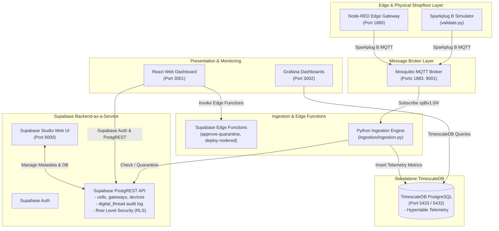

# Factory+ Asset Tracking Platform (Supabase BaaS + Standalone TimescaleDB)

[](https://github.com/Harri-Llewelyn/factoryplus-asset-tracking/actions/workflows/ci.yml)

An industrial, asset-centric manufacturing management platform built in alignment with the **AMRC Connectivity Stack (ACS / Factory+)** framework.

This application provides real-time telemetry streaming, shopfloor spatial mapping, automated Zero-Touch Edge device onboarding, fine-grained Row-Level Security (RLS), continuous Digital Thread audit logging, and Edge flow management.

---

## System Architecture

The platform uses a decoupled architecture combining **Supabase Backend-as-a-Service (BaaS)** with **Standalone TimescaleDB**:

* **Supabase BaaS**: Manages asset metadata (`cells`, `gateways`, `devices`), Supabase Auth, Row-Level Security (RLS) policies, PostgreSQL triggers for automated `digital_thread` audit logging, and TypeScript Supabase Edge Functions.
* **Standalone TimescaleDB**: High-performance time-series database running `timescale/timescaledb:latest-pg15` exposed on port `5433` for `telemetry` hypertable metric storage.
* **Python Ingestion Engine**: Consumes Sparkplug B industrial MQTT messages (`DBIRTH`, `DDATA`), verifying asset registration in Supabase (auto-quarantining unregistered devices) and streaming telemetry metrics directly to TimescaleDB.
* **React Web Dashboard**: React 18 SPA powered by Supabase JS SDK, utilizing direct PostgREST queries, real-time database change channels (`supabase.channel`), and Supabase Auth session management.

### System Topology Diagram



---

## Docker Compose Services

Running `docker compose up -d` starts the containerized environment:

| Service | Container Name | Image / Build | Port | Description |
| :--- | :--- | :--- | :--- | :--- |
| **`timescaledb`** | `tsdb_postgres` | `timescale/timescaledb:latest-pg15` | `5433:5432` | Standalone TimescaleDB instance for `telemetry` hypertable |
| **`mosquitto`** | `mqtt_broker` | `eclipse-mosquitto:latest` | `1883:1883`, `9001:9001` | Eclipse Mosquitto MQTT broker for Sparkplug B traffic |
| **`frontend`** | `iot_frontend` | `./frontend/Dockerfile` | `3001:3000` | React Web Dashboard UI |
| **`studio`** | `supabase_studio` | `supabase/studio:latest` | `8000:3000` | Supabase Studio database management Web UI |
| **`ingestion`** | `iot_ingestion` | `./Dockerfile` | — | Python daemon routing metadata to Supabase & telemetry to TimescaleDB |
| **`node-red`** | `iot_node_red` | `nodered/node-red:latest` | `1880:1880` | Edge flow automation runtime |
| **`grafana`** | `iot_grafana` | `grafana/grafana:latest` | `3002:3000` | Analytics dashboards connected to TimescaleDB |

---

## Database Migrations & Row Level Security (RLS)

All database migrations are stored in `supabase/migrations/`:
- **`20260101000000_init_assets_and_digital_thread.sql`**:
  - **Tables**: `cells`, `gateways`, `devices`, `digital_thread`.
  - **Triggers**: PL/pgSQL function `log_digital_thread_event()` automatically logs audit events on `cells`, `gateways`, and `devices` mutations.
  - **RLS Policies**: Enforces `SELECT` permissions for `authenticated` users, and `INSERT`/`UPDATE`/`DELETE` for `Administrator` and `Shopfloor_Manager` roles.

---

## Supabase Edge Functions

Edge functions are located in `supabase/functions/`:
- **`approve-quarantine`** (`supabase/functions/approve-quarantine/index.ts`):
  - Validates session token & role privileges (`Administrator` / `Shopfloor_Manager`).
  - Sets `is_quarantined = false` and assigns `gateway_id` for approved devices.
- **`deploy-nodered`** (`supabase/functions/deploy-nodered/index.ts`):
  - Proxies flow deployment updates to Node-RED (`http://node-red:1880/flows`).

---

## End-to-End Validation

To execute the end-to-end integration test suite:

```bash
python validate.py
```

The validation script verifies:
1. **MQTT Payload Publishing**: Sends Sparkplug B `DBIRTH` and `DDATA` messages to Mosquitto.
2. **Supabase Device Quarantine**: Confirms unknown device `DBIRTH` announcements auto-insert into Supabase `devices` with `is_quarantined = true`.
3. **Digital Thread Audit Triggers**: Confirms PostgreSQL triggers automatically populate `digital_thread`.
4. **TimescaleDB Telemetry**: Confirms metric ingestion into the TimescaleDB `telemetry` hypertable.

---

## Getting Started

1. **Clone repository and set up environment**:
   ```bash
   cp .env.example .env
   ```

2. **Start Docker Compose stack**:
   ```bash
   docker compose up -d
   ```

3. **Access Web Interfaces**:
   - **React Dashboard**: `http://localhost:3001`
   - **Supabase Studio**: `http://localhost:8000`
   - **Node-RED Console**: `http://localhost:1880`
   - **Grafana Dashboards**: `http://localhost:3002`

4. **Initialize local Supabase**:
   ```bash
   npx supabase db reset
   ```
