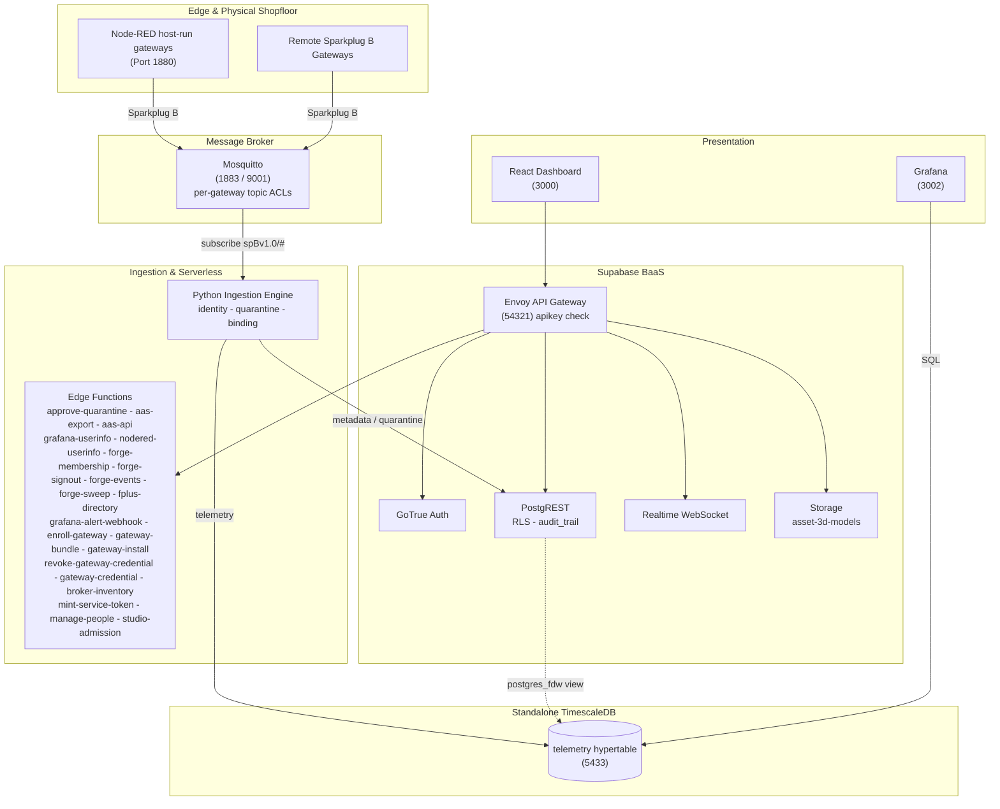

# How Aber fits together

What each part of Aber does, where its code lives, which standards it uses, and how it relates
to the AMRC Connectivity Stack. Why the Kubernetes deployment is built the way it is has its own
document: [`kubernetes-architecture.md`](kubernetes-architecture.md).

> **Design ethos —** *use pre-existing components and standards; minimise custom code.*
> Where ACS ships bespoke microservices, Aber uses Supabase, TimescaleDB, Grafana and
> Node-RED. The custom surface is one Python ingestion service — a daemon and the modules beside it:
> the constraint engine, the metrics registry, capture and playback, the Directory and UNS publishers,
> cold archival — twenty edge functions, an i3X server and a React dashboard.

---

## Architecture

**Supabase** is authoritative for asset metadata (`cells`, `gateways`, `devices`), auth, RLS, audit
triggers and edge functions. **Standalone TimescaleDB** holds the `telemetry` hypertable, reached
from Supabase through a `postgres_fdw` view. A **Python daemon** consumes Sparkplug B MQTT, gates
unregistered devices into quarantine, and routes metadata and telemetry to their respective stores.
A **React 18 SPA** queries PostgREST directly and subscribes to a Realtime change feed.

Derived state is computed at read time rather than stored: gateway staleness is a **view**, not a
cron writer, and AAS is an **adapter on the way out**, not an adopted metamodel.

**Data flow.** Devices publish `DBIRTH`/`DDATA` to Mosquitto, confined by ACL to their own edge-node
subtree → ingestion resolves topic to `sparkplug_id`, verifies the device is **bound to the
publishing gateway**, and quarantines anything unknown or contradictory → valid telemetry lands in
the hypertable → Postgres triggers log every metadata change to the append-only `audit_trail` →
the dashboard reads PostgREST and subscribes to Realtime.

---

## Components

**Every chart component appears here and every row names a real one**, asserted in both directions
by `scripts/check-docs-drift.mjs`, which also holds every image tag here to the chart's pin. The
chart's own images carry no tag: they are pulled at the chart's `appVersion`.

Hosts are `<name>.<domain>` on the one Ingress. On a laptop, `npm run dev:forward` publishes the
in-cluster ports on localhost: `5433` historian, `54322` Supabase Postgres, `54321` the API,
`1880` Node-RED, `3002` Grafana, `9090` Prometheus, `3100` Loki, `8090` i3X, `8088` docs.

| Component | Image | Reached at |
| :--- | :--- | :--- |
| `alloy` | `grafana/alloy:v1.20.1` | the one collector: logs, metrics and host metrics; `alloy:12345` |
| `backup` | `supabase/postgres:17.6.1.175` | the nightly CronJob, when the backup service is off |
| `backup-service` | `ghcr.io/harri-llewelyn/aber/backup-service` | the Backups page's worker (`backupService.enabled`) |
| `claim-templates` | `ghcr.io/harri-llewelyn/aber/ingestion` | pre-upgrade hook Job: replaces a database StatefulSet whose claim templates a release relabelled ([`upgrades.md`](upgrades.md#from-102-or-earlier-the-two-databases-statefulsets-are-replaced-once)) |
| `cold-archive` | `ghcr.io/harri-llewelyn/aber/ingestion` | CronJob: exports, verifies and drops cold chunks |
| `db-init` | `ghcr.io/harri-llewelyn/aber/db-init` | hook Job: the migration chain, on every install and upgrade |
| `db-roles-init` | `supabase/postgres:17.6.1.175` | hook Job: the Supabase roles and their passwords |
| `e2e-aas-export` | `ghcr.io/harri-llewelyn/aber/test-runner` | Job (`e2e.enabled`): the AAS conformance suite |
| `e2e-validate` | `ghcr.io/harri-llewelyn/aber/test-runner` | Job (`e2e.enabled`): `validate.py` in-cluster |
| `frontend` | `ghcr.io/harri-llewelyn/aber/frontend` | `app.<domain>` |
| `gitea` | `gitea/gitea:28.0.0` | `git.<domain>` through the gateway's forge listener; SSH on `gitea-external` (LoadBalancer): 2222 where `npm run setup` wrote the values, else 22 |
| `grafana` | `grafana/grafana:13.2.3` | `grafana.<domain>` |
| `i3x-service` | `ghcr.io/harri-llewelyn/aber/i3x-service` | `i3x.<domain>` |
| `ingestion` | `ghcr.io/harri-llewelyn/aber/ingestion` | no route; `ingestion-metrics:9108` is scraped |
| `load-test` | `ghcr.io/harri-llewelyn/aber/test-runner` | Job (`loadTest.enabled`): synthetic Sparkplug load, applied by `scripts/load-test.mjs` |
| `loki` | `grafana/loki:3.7.8` | `loki:3100`, read by Grafana |
| `mosquitto` | `eclipse-mosquitto:2.0.22`, the `gateway-credential` sidecar, `jryberg/mosquitto-exporter:v0.7.9` when metrics are on | `mosquitto-external:1883` (LoadBalancer), 8883 with TLS; `mqtt.<domain>` for WebSockets |
| `node-red` | `ghcr.io/harri-llewelyn/aber/node-red` | `nodered.<domain>` |
| `playback` | `ghcr.io/harri-llewelyn/aber/ingestion` | the broker playback worker (`playback.enabled`) |
| `prometheus` | `prom/prometheus:v3.15.0` | `prometheus:9090`, read by Grafana |
| `realtime` | `supabase/realtime:v2.134.10` | behind `api.<domain>/realtime/v1`; Service `realtime-dev:4000` |
| `storage-init` | `node:24.21.0-alpine3.24` | hook Job: the storage buckets |
| `storage-policies` | `supabase/postgres:17.6.1.175` | hook Job: the storage RLS policies |
| `supabase-auth` | `supabase/gotrue:v2.197.0` | behind `api.<domain>/auth/v1` |
| `supabase-db` | `supabase/postgres:17.6.1.175`, `quay.io/prometheuscommunity/postgres-exporter:v0.20.1` as a sidecar | `supabase-db:5432`; `:9187` is scraped |
| `supabase-envoy` | `envoyproxy/envoy:v1.39.2` | the gateway: `api.<domain>` (in-cluster `supabase-envoy:8000`), Studio on 8001, the forge on 8002 |
| `supabase-functions` | `ghcr.io/harri-llewelyn/aber/edge-runtime` | behind `api.<domain>/functions/v1` |
| `supabase-meta` | `supabase/postgres-meta:v0.99.0` | in-cluster only, for Studio |
| `supabase-rest` | `postgrest/postgrest:v14.17` | behind `api.<domain>/rest/v1`; admin port 3001 is scraped |
| `supabase-storage` | `supabase/storage-api:v1.74.0` | behind `api.<domain>/storage/v1` |
| `supabase-studio` | `supabase/studio:2026.09.28-sha-5e59b60` | `studio.<domain>`, off by default, behind the gateway's login |
| `swagger-ui` | `ghcr.io/harri-llewelyn/aber/swagger-ui` | `docs.<domain>`; the two specs are baked into the image |
| `test-db-tls` | `supabase/postgres:17.6.1.175` | `helm test` Pod (`postgresTls.enabled`): both databases refuse plaintext and every remote backend is on TLS |
| `test-fdw` | `supabase/postgres:17.6.1.175` | `helm test`: the postgres_fdw gate |
| `timescaledb` | `ghcr.io/harri-llewelyn/aber/timescaledb` (`timescale/timescaledb:2.29.2-pg17` with pgBackRest), `quay.io/prometheuscommunity/postgres-exporter:v0.20.1` as a sidecar, and the `pgbackrest` backup sidecar when `timescaledb.physicalBackup` is on | `timescaledb:5432`; `:9187` is scraped |
| `timescaledb-maintenance` | `ghcr.io/harri-llewelyn/aber/timescaledb` | hook Job: extension, retention, rollups, roles |

---

## Repository map

| Directory | Covers |
| :--- | :--- |
| **[`frontend/`](../frontend/README.md)** | React 18 architecture, Vite, Realtime integration, derived state, theming |
| **[`supabase/`](../supabase/README.md)** | Migrations, RLS privilege matrix, triggers, audit immutability, edge functions, the gateway |
| **[`ingestion/`](../ingestion/README.md)** | Sparkplug B parsing, identity resolution, gateway binding, TimescaleDB mapping, `validate.py` |
| **[`tutorial/`](../tutorial/README.md)** | The walkthrough for a blank install: one cell, one gateway, its broker credential, a device, a schema, and the Node-RED flow that publishes as it |
| **[`i3x/`](../i3x/README.md)** | i3X 1.0 server: address-space mapping, subscriptions, connecting a client — including [an MCP host](../i3x/README.md#mcp) |
| **[`deploy/k8s/README.md`](../deploy/k8s/README.md)** | Kubernetes runbook: install, the development loop, upgrade, teardown, hardening, releases |
| [`deploy/helm/aber/`](../deploy/helm/aber) | The Helm chart; `values.yaml` documents every setting |
| [`docs/kubernetes-architecture.md`](kubernetes-architecture.md) | Why the Kubernetes target is built the way it is. Source comments cite it by section |
| [`docs/incidents.md`](incidents.md) | Faults whose FIX LOOKS ARBITRARY without the story. Read before "tidying" a guard that seems redundant |
| [`docs/upgrades.md`](upgrades.md) | What survives an upgrade and why nothing needs reconfiguring — plus the four places that is not the whole truth, and the floor it holds from |
| [`docs/releases.md`](releases.md) | What a release promises: the supported window, what makes a version major, deprecation, and how a site learns a release matters to it |
| [`docs/openapi.yaml`](openapi.yaml) · [`docs/i3x-openapi.yaml`](i3x-openapi.yaml) | REST and i3X specifications, rendered by Swagger UI |
| [`supabase/migrations/archive/`](../supabase/migrations/archive) | The 197 superseded migrations, preserved for their reasoning. Never executed |
| [`grafana/`](../grafana) · [`timescaledb/`](../timescaledb) | Provisioning; hypertable schema, retention and rollup reconciliation, the read-only BI role |
| [`scripts/`](../scripts) | Setup, the dev loop, vocabulary generation, chart-file sync, drift guards, database backup/restore, gateway provisioning, AAS push |
| **[`test-harness/`](../test-harness/README.md)** | The test-runner image, the synthetic load generator and the scale envelope, the stack-only suites, the vendored IDTA AAS schema |
| [`forge/`](../forge) | Everything the platform publishes into the forge as a repository. `gateway-platform/` is the playbook every appliance converges to with `ansible-pull`, tagged at the platform's version; its `appliance/` is the compose project the appliance runs, which the installer lays down and the ZIP bundle ships |

---

## The schema every install applies

Every file in `supabase/migrations/` is applied by the `db-init` Job on every install and upgrade, and re-applied
harmlessly each time. At 1.0 there are two, the schema baseline (`0001`) and the seed data
(`0002`), which fold the incremental chain kept in
[`supabase/migrations/archive/`](../supabase/migrations/archive/README.md): the 197 files four squashes
retired. An archived number is never issued again, so the next migration is `0163` and a cited
number names one file for good (the archive's two `0074`s predate the rule). The archive's
README says why each squash was shaped as it was, and each archived file states the decision it
made. The demo user accounts are seeded separately, by `supabase/seed.sql`.

> **The archive has no `0017`.** It was drafted as an audit-trigger change guard and then not written,
> because archived `0005` already implements one; a second declaration of
> `log_audit_trail_event()` would win by filename order on every boot and would have regressed
> the `actor_source` attribution it adds. The gap in the numbering is deliberate and the reasoning
> is in [`supabase/README.md`](../supabase/README.md#audit-signal-and-attribution-archived-migration-0005).
>
> Archived `0026` is that later declaration, written deliberately and on those terms: it reproduces
> archived `0005`'s body **in full** and adds two lines, rather than patching it. Its self-check
> asserts that both the heartbeat suppression guard and the causation stamp are present in the
> live definition, because
> `check-docs-drift.mjs` can verify a redeclaration was *intended* and cannot verify it was
> *complete*.

---

## Standards

| Standard | Role |
| :--- | :--- |
| **Sparkplug B** | The wire protocol. Identity is `sparkplug_id`, carried in the topic |
| **MTConnect** (2.x) | Machine-tool vocabulary — 249 data item types, 123 subtypes, 100 units, 126 component types |
| **OPC UA** (40001, 40001-4, 40010, 30050, 40501, 40540) | Companion-specification data points: machinery, energy, robotics, PackML, machine tools, additive. Generated from OPC Foundation NodeSets by [`scripts/generate-opcua-vocabulary.mjs`](../scripts/generate-opcua-vocabulary.mjs) |
| **ISO 22400** | Computed KPIs, which MTConnect and OPC UA deliberately exclude |
| **ASHRAE 223P** | Building-system semantics — 640 concepts from the open223 ontology. ⚠ Still in public review |
| **AAS / IEC 63278** | V3 export as JSON or AASX, validated against the official IDTA schema |

These are **four vocabularies, not four alternatives** — a mixed fleet needs all of them, which is
why the schema builder offers a choice rather than a migration path. All are built, as is the IDTA
Digital Nameplate; what each one covers and how its identity was verified is in
[`docs/vocabularies.md`](vocabularies.md), and the checklist for adding another is in
[`supabase/README.md`](../supabase/README.md#adding-a-vocabulary).

> Adopting the MTConnect vocabulary is not a compliance claim; that requires the Implementer
> License. Locally-minted semantic ids live under `https://aber.local/semantics/…` — the
> namespace is the honesty mechanism, and an id under `mtconnect.org` would assert an
> interoperability that does not exist.

---

## Relationship to ACS

**Aber is an independent project.** It was built from the ground up, taking the AMRC Connectivity
Stack's documentation as its inspiration, and contains no ACS code. It does not follow ACS releases
and is not intended to merge back. It is not affiliated with or endorsed by the AMRC.

What it keeps is interoperability with Factory+:

- **On the wire:** Sparkplug B, with the Factory+ metric naming rule and payload marker.
- **The Directory:** the read half of the Factory+ Directory's REST contract, at the unprefixed
  `/ping` and `/v1/…` paths a Factory+ client expects
  ([`fplus-directory`](../supabase/README.md#the-factory-directory-adapter)), and its documents on MQTT
  ([`directory_publish.py`](../ingestion/README.md#the-directory-on-mqtt)).
- **Identifiers are local.** Schema and service UUIDs are minted by each deployment rather than
  registered with the AMRC, and every response that carries one says so.
